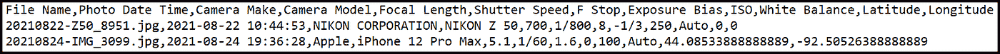
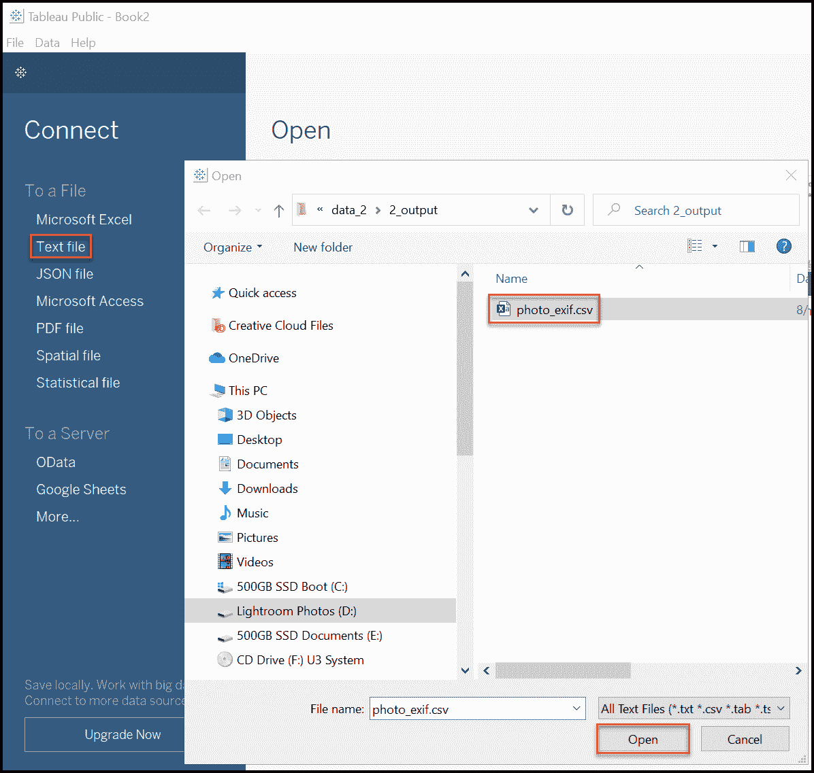
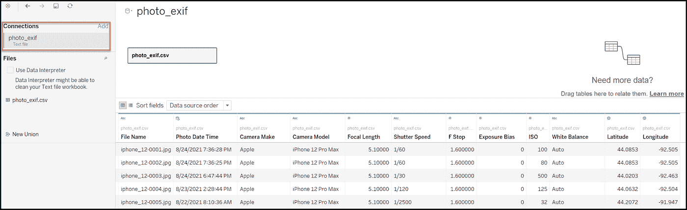
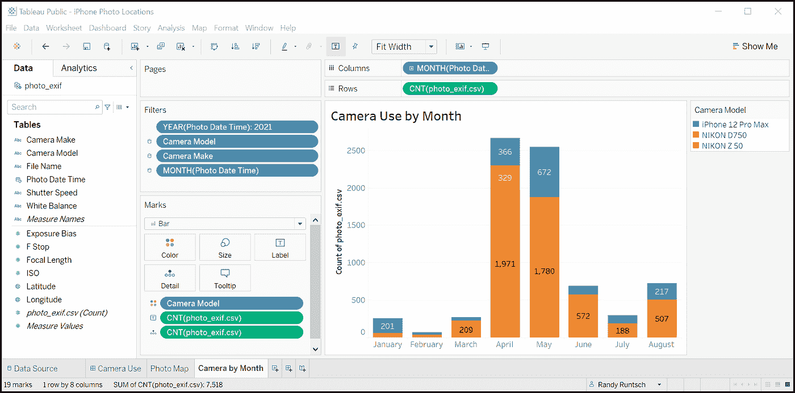
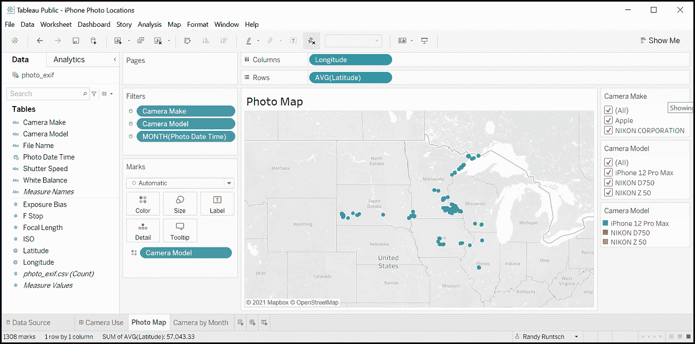
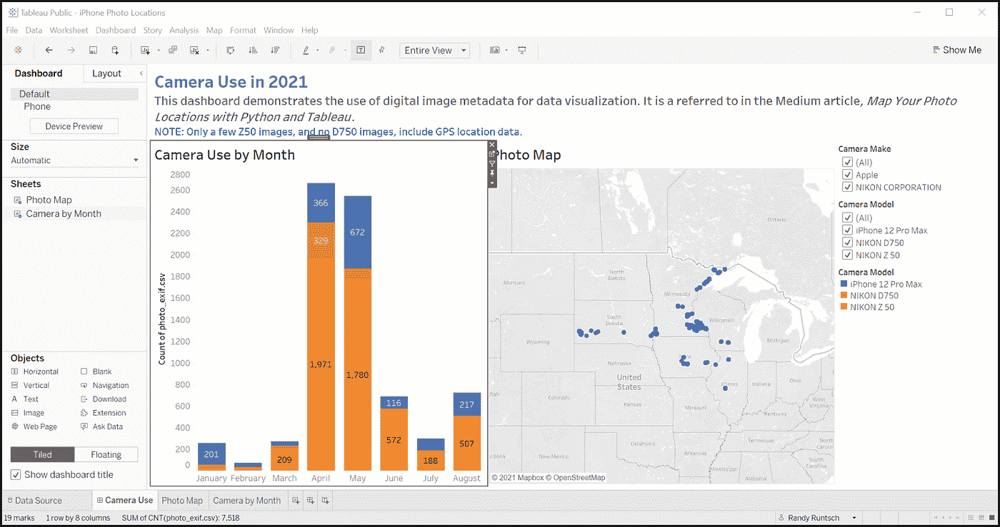
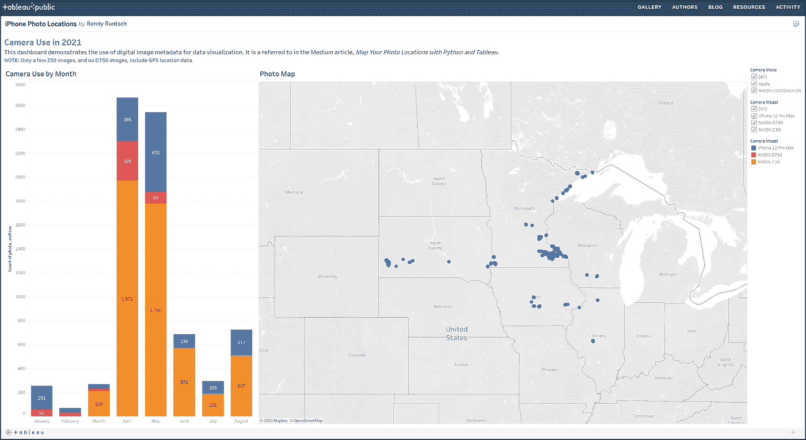

# 使用 Python 和 Tableau 分析和绘制照片位置

> 原文：<https://towardsdatascience.com/analyze-and-map-photo-locations-with-python-and-tableau-7b2a4af971eb?source=collection_archive---------11----------------------->

## Python、数据分析、地理、摄影

## 使用 Python 从数字照片文件和 Tableau 中提取 GPS 坐标和其他元数据来绘制它们

在 [Unsplash](https://unsplash.com/s/photos/photography?utm_source=unsplash&utm_medium=referral&utm_content=creditCopyText) 上由[米琳·特雷莫耶](https://unsplash.com/@mylene1708?utm_source=unsplash&utm_medium=referral&utm_content=creditCopyText)拍摄的照片。

> "元数据解放了我们，解放了**知识**"大卫·温伯格

# 介绍

当胶片摄影卷土重来时，数码摄影提供了许多好处。首先，在相机、镜头、存储和附件的初始投资之后，没有胶片或处理的费用，除非进行打印。此外，摄影师可以在相机和现场预览图像。此外，各种元数据，包括曝光和镜头设置，日期和时间，有时甚至是 GPS 位置，都存储在每张照片的文件中。

本文描述了一个 Python 程序，它从图像文件中获取 GPS 坐标和其他元数据，并将它们写入 CSV 文件。然后，它会在一个 Tableau 公共仪表板中呈现元数据，该仪表板跟踪相机的使用和图像位置。介绍使用 Python 从图像文件中提取元数据，参见 [*如何使用 Python 和 Tableau 分析照片元数据*](/how-to-use-python-and-tableau-to-analyze-digital-photo-metadata-e4d4a744b6a4) 。

# 演示总结

以下是本文中描述的处理和可视化影像 GPS 和其他元数据的任务:

1.  使用 Adobe Lightroom 或您喜欢的照片编辑器将小图像文件导出到文件夹中。确保导出设置包含 EXIF 数据。就我而言，我选择了 2021 年用 Z50、D750 和 iPhone 12 拍摄的所有照片。或者，您可以将从一台或多台相机导入的未经编辑的图像文件存储在电脑上的单个文件夹中。
2.  运行 Python 图像元数据提取程序，将图像文件夹作为其输入。该程序创建一个 CSV 文件，每个图像包含一个元数据行。
3.  将包含图像元数据的 CSV 文件导入 Tableau Public。
4.  建立一个 Tableau 仪表板，按月显示相机使用情况和照片位置地图。

> "摄影从时间中抽出一瞬间，通过静止不动来改变生活."多萝西娅·兰格

# 关于图像元数据

数码相机将有关图像的元数据存储在一个文件中，该文件还包含所捕获图像的表示。他们以一种叫做 EXIF 的标准格式保存数据。以下是 EXIF 定义的一些字段示例:

*   **图像制作** —相机制作
*   **图像模式** l —相机型号
*   **EXIF 日期时间原件** —相机拍摄图像的日期和时间
*   **EXIF 焦距** —镜头的焦距
*   **EXIF 快门速度** —以秒为单位的快门速度
*   **EXIF 光圈数**—F 档
*   **EXIF 曝光偏差值** —曝光偏差(低于或高于基准曝光时停止)
*   **EXIF 白平衡** —相机的白平衡设置
*   **EXIF ISO speedrating**—ISO 传感器灵敏度设置
*   **GPS 纬度** —以度、分、秒为单位的地理纬度
*   **GPS 全球定位系统经度** —以度、分、秒为单位的地理经度

TsuruZoh Tachibanaya 描述了 [EXIF 文件格式标准](https://www.media.mit.edu/pia/Research/deepview/exif.html)。此外，ExifTool 还记录了其相关的 [GPS 标签](https://exiftool.org/TagNames/GPS.html)。

# Python ExifRead 模块

以下部分展示并描述了从影像中提取 EXIF 数据的 Python 程序。该程序利用了 [ExifRead 模块](https://pypi.org/project/ExifRead/)。要使用该模块，请使用 Python pip 实用程序安装它。下面是一个 pip 使用示例:

***$ pip 安装退出读取***

# Python 程序从图像文件中提取元数据

从图像文件中提取元数据并将值存储在 CSV 文件中的程序包括两个模块:一个作为程序入口点的控制器和一个从每个图像文件中读取元数据并将其写入 CSV 文件以供以后分析和可视化的类。下面介绍和描述了这些模块。

**photo _ EXIF _ controller . py**—该文件是程序的控制器模块和入口点。它只是打印一个开始消息，并用一组参数调用 c_photo_exif 类的构造函数。处理完成后，它会打印已处理的图像文件数量和完成消息。

控制器模块 photo_exif_controller.py .作者创建。

**c_photo_exif.py** —该文件中定义的 c_photo_exif 类执行以下步骤:

1.  调用模块使用这些参数调用构造函数(__init__()):输入图像文件夹、输出 CSV 文件命名、程序将获取日出和日落时间的城市以及该城市的日落。
2.  __init__ 函数在调用 init_csv_file()函数时格式化输出 CSV 文件的文件头。然后，它调用 process_photos()函数，逐个读取每个图像 JPEG 文件。
3.  对于每个图像文件，process_photos()函数调用 process_photo()函数，从文件中提取元数据的子集。process_photo()函数又调用 calculate_coordinate()辅助函数将纬度和经度的 GPS 度数、分钟和秒钟值转换为单个数值十进制度数。
4.  接下来，process_photos()函数调用 write_csv_file_row()将一个图像的元数据写入 csv 文件。
5.  最后，控制器模块打印已处理图像文件的数量，并显示一条消息，说明已完成处理。

c_photo_exif.py 文件中的 c_photo_exif 类。由作者创作。

# 示例输出 CSV 文件

下面的截图显示了尼康 Z 50 和 iPhone 12 Pro Max 相机的两个元数据记录。如果图像文件包含 GPS 位置坐标，则程序会将经纬度(整数)、分钟和秒坐标值转换为小数。

CSV 文件中的 EXIF 元数据。图片由作者提供。

# 关于图像文件中相机和 GPS 元数据的注释

即使在今天，许多 DSLR 和无反光镜相机也不能直接捕捉照片位置的 GPS 坐标并存储在其图像文件中。然而，大多数(如果不是全部的话)当代智能手机都捕捉 GPS 坐标。

在这里显示的例子中，尼康 D750 没有捕捉 GPS 坐标。然而，尼康 Z50 只有在现场与 iPhone 上安装的尼康 SnapBridge 应用程序配对，并且 iPhone 获得 GPS 信号时，才会存储 GPS 坐标。另一方面，iPhone 12 只要接收到 GPS 信号，就会捕获 GPS 坐标。

# 可视化相机使用和照片位置与 Tableau 公共

为了分析相机使用和照片位置，我将 Tableau Public 连接到 Python 程序创建的 photo_exif.csv 文件。然后，我构建了一个可视化仪表板，其中包含两个工作表:一个按月记录相机使用情况，另一个在地图上显示我拍摄照片的位置。

Tableau 是领先的数据可视化和商业智能应用程序。其免费版本 Tableau Public 包含商业软件包的许多功能，但至少有两个明显的限制:

1.  Tableau Public 可以连接到有限数量的数据类型。例如，虽然它可以连接到 Excel 和文本文件，但它不能像商业产品那样直接链接到关系数据库。
2.  Tableau Public 仅将项目保存到 Tableau Public 服务器，供全世界查看。因此，如果您的 Tableau 可视化显示机密数据或不想与他人共享数据，Tableau Public 并不是一个很好的选择。相反，您可能希望选择另一种可视化产品，如 Tableau 或 Microsoft Power BI 的商业版本。

## 安装 Tableau Public

要在 Windows 或 Mac 电脑上安装 Tableau 公共桌面应用程序，请导航至[https://public.tableau.com](https://public.tableau.com)。然后，输入您的电子邮件地址，点击[下载应用程序]，并按照安装提示进行操作。

Tableau 公共主页和安装表单。图片由作者提供。

## 创建相机使用和地图面板

下面列出的说明仅提供了构建相机使用和地图仪表板的基本步骤。要了解更多关于在 Tableau 中构建可视化工作表和仪表板的信息，请参见这些[免费学习资源](https://public.tableau.com/en-us/s/resources)。

在您学习了如何使用 Tableau Public 之后，请按照以下步骤构建仪表板:

1 —打开 Tableau 公共应用程序。

2 —在连接窗口中，单击[文本文件]。然后，导航并选择包含 EXIF 数据的 CSV 文件。最后点击【打开】连接数据。

连接到影像 EXIF 元数据 CSV 文件。图片由作者提供。

3-在“数据源”窗口中查看影像 EXIF 记录。

数据源窗口中的示例图像 EXIF 数据。图片由作者提供。

4-构建一个“按月显示相机”工作表，其中包含一个条形图，显示按月显示的相机使用情况。

Tableau 公共桌面应用程序中的相机使用工作表。图片由作者提供。

5 —建立一个“照片地图”工作表。添加要应用于此工作表和相机使用工作表的过滤器。

Tableau 公共桌面应用程序中的照片地图工作表。图片由作者提供。

6-将“按月照相机”和“照片地图”工作表组合成“照相机使用”仪表板。

Tableau 公共桌面应用程序中的相机使用仪表板。图片由作者提供。

7-最后，如果你还没有创建一个免费的 Tableau 公共帐户，现在就创建一个。然后，将仪表板发布到 Tableau 公共网站。

Tableau 公共服务器上的摄像机使用仪表板。图片由作者提供。

你可以在这里查看仪表盘。

# 摘要

本文演示了如何使用 Python 从图像文件中访问关于数码照片的元数据。它还展示了如何转换数据，以便为可视化和分析做准备。最后，它演示了如何构建一个 Tableau Public，该 Tableau 使用图像元数据来可视化相机使用和图像捕获位置。

胶片相机仍然是捕捉我们周围世界图像的绝佳工具。但是现在，你可能会同意数码相机提供了额外的好处，以提高摄影过程和理解照片和模式。

> "对我来说，相机是一本速写本，是直觉和自发性的工具."— **亨利·卡蒂埃·布列松**