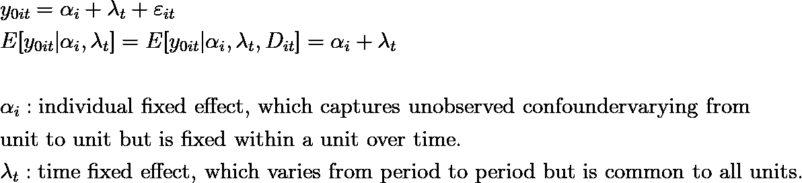
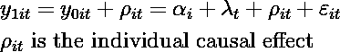
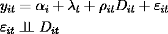
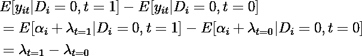
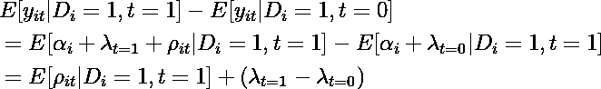
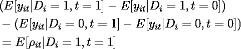
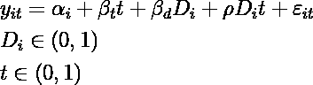
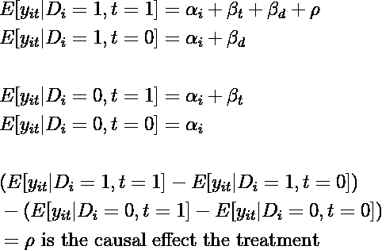
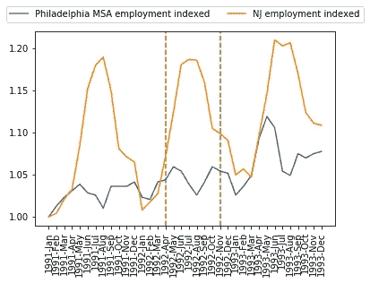

# 使用差异中差异模型分析因果关系

> 原文：<https://towardsdatascience.com/analyze-causal-effect-using-diff-in-diff-model-85e07b17e7b7?source=collection_archive---------17----------------------->

## 对于真实世界的应用程序

作者图片

进行随机 AB 实验并不总是可行的，但如果我们有一个随时间产生观察数据(即面板数据)的近似实验，我们仍然可以恢复治疗的因果效应。我们可以使用的一个模型是差异中的差异(Diff-in-Diff，或 DiD)来估计观察数据的因果关系。

# 差异中的差异模型

当我们有两个现有的组(例如，两个区域 A 和 B)而不是像在随机 AB 试验中那样由我们随机分配，并且治疗发生在其中一个组时(例如，只有区域 A 发起促销)，我们可以在治疗和控制之前对组间的差异建模，用于预先存在的差异，并且当我们假设治疗后的差异不是由于仅打击其中一个组的任何其他外部冲击而是由于治疗本身。

让我们用潜在结果模型的框架来研究一下数学。如果你需要快速回顾一下那是什么，你可以阅读我以前的[文章](https://medium.com/geekculture/an-introduction-of-randomized-experiment-aka-a-b-testing-and-potential-outcome-model-f2c93f73d426)。补充的是，现在我们使用具有时间维度的数据，因此将下标 *t* 添加到等式中。

设 *yᵢₜ* 为个体受试者在时间*t*I*的潜在结果；y₀ᵢₜ* 和 *y₁ᵢₜ* 为观察结果(我们只能观察其中一个，不能同时观察两个)； *Dᵢₜ* 为治疗状态变量。DiD 的一个关键假设是，潜在结果 *y₀ᵢₜ* 可以建模为个体单位和时间固定效应的线性加法方程:

上面的第二个等式表明 *Dᵢₜ* 与协变量上的随机分配一样好。我们还假设因果效应是可加的和恒定的，我们推导出 *y₁ᵢₜ为:*

鉴于 *yᵢₜ = (1-Dᵢₜ)y₀ᵢₜ + y₁ᵢₜ* ，我们有:

这个等式表明，潜在的结果是由时间不变的个体固定效应和时间固定效应的总和决定的，时间固定效应在个体之间是常见的，并且是因果效应。

假设我们有面板数据，允许我们对治疗前后的组间差异进行建模。让我们将 *t* =0 表示为预处理周期，将 *t* =1 表示为后处理周期。只有当 *D* ᵢ=1(治疗组)和 *t* =1 时， *Dᵢₜ* =1。我们推导出**差分中的差分**如下:

**对照组治疗前后的差异**:

**治疗组治疗前后的差异**:

因此，**治疗组和对照组之间的差异中的差异是平均治疗效果:**

**我们用回归的形式来写吧:**

从回归中，我们得到:

# 一份申请

Card 和 Krueger (1994 年)估计了国家最低工资增加对就业的因果影响。1992 年 4 月 1 日，新泽西州将州最低工资从 4.25 美元提高到 5.05 美元，而宾夕法尼亚州的最低工资保持在 4.25 美元。卡德和克鲁格分别于 1992 年 2 月和 1992 年 11 月调查了新泽西州的快餐店。他们还从邻近的东宾夕法尼亚的快餐店收集了数据。

我从麻省理工学院经济学[网站](https://economics.mit.edu/faculty/angrist/data1/mhe/card)下载了 Card 和 Krueger (1994)使用的数据文件 public.dat。我用 Python 计算了新泽西州最低工资增长影响的简单 DiD 估计。本质上，我比较了从 2 月到 11 月期间新泽西州的就业变化和宾夕法尼亚州的就业变化。以下是代码:

以下是回归结果的摘要:

它说就业变化的差异是 2.76 个 FTE 雇员。似乎更高的最低工资并没有减少就业。然而，我的结果显示这种差异在统计学上并不显著。

# 提醒

Diff-in-Diff 估计有效的关键假设是共同趋势，这意味着，在上面的例子中，处理前两个州的就业趋势应该相同。治疗使治疗组的趋势偏离共同趋势。治疗组和对照组可以不同，因为这种差异意味着被未观察到的个体固定效应所捕获，但是它们需要共享一个共同的趋势。

为了检验这一共同趋势，我从 BLS 下载了 1991 年至 1993 年费城、宾夕法尼亚大都会区和新泽西“食品服务和饮料场所”行业的月度就业时间序列数据。我将 1992 年 4 月和 1992 年 11 月作为垂直虚线绘制在下面。就业价值指数是 1991 年 1 月确定的。下载的系列没有季节性调整。我看到很多波动。即使我们放大到 1992 年 1 月至 1992 年 4 月期间(治疗前)，我也不确定 PA 是否与 NJ 相当。因此，在没有最低工资变化的情况下，PA 就业可能不是 NJ 就业的一个好的反事实测量。

