# 使用 RStudio 分析医疗保险数据

> 原文：<https://towardsdatascience.com/analyze-health-insurance-data-using-rstudio-85f1c1e37ec8?source=collection_archive---------7----------------------->

## 了解如何使用 RStudio 分析医疗保险数据


欧文·比尔德在 [Unsplash](https://unsplash.com/s/photos/health-insurance.?utm_source=unsplash&utm_medium=referral&utm_content=creditCopyText) 上的照片

[数据分析](https://en.wikipedia.org/wiki/Data_analysis)在商业中很重要，可以了解任何领域的当前状态，以做出准确的决策，推动业务步入正轨。在这里，我们涵盖了一个实用的领域，可以帮助个人在他们选择的任何领域进行数据分析。让我们从健康保险领域开始。

假设您收到了一个样本数据集( [medExpense.csv](https://sendeyo.com/en/afa8d570b4) )，其中包含了 1340 个当前参加健康保险计划的受益人的示例，这些示例显示了被保险人的特征以及该日历年的医疗费用总额。假设您被赋予了分析、讨论和解释这些数据的任务。我们将指导您如何使用 [RStudio](https://www.rstudio.com/) 处理这种情况。我们将使用 [RStudio](https://www.rstudio.com/) 来执行我们的数据分析。

# 加载数据集

```
**Code Snippet****## Importing the dataset**
dataset <- read.csv(‘medExpense.csv’, stringsAsFactors = TRUE)
```

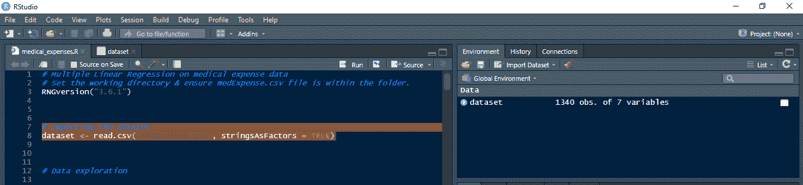

Image_1:在 Rstudio 中加载数据集

让我们从在 RStudio 中加载数据集开始。我们可以使用 **read.csv** 函数(Image_1)从 CSV 文件加载数据集。我们设置 **stringsAsFactors = TRUE** 来自动将字符数据转换成因子，因为我们不能在机器学习算法中直接使用字符数据。加载的数据集如 Image_2 所示。

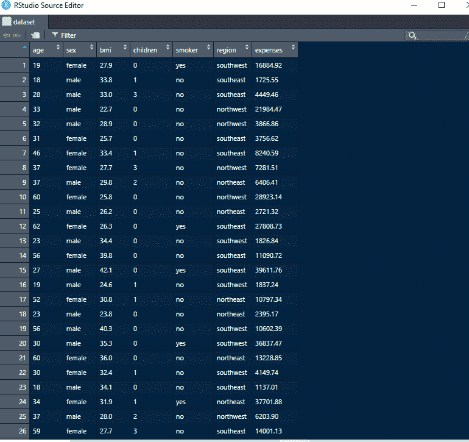

image _ 2:r studio 中加载的数据集

# 数据探索

```
**Code Snippet****## Returns the first parts of the data frame**
head(dataset)**## Returns the latter parts of the data frame**
tail(dataset)**## Compactly display the internal structure of the data frame**
str(dataset)**## Summarize medical expenses**
summary(dataset$expenses)**## Histogram of medical expenses**
hist(dataset$expenses)**## Table of region**
table(dataset$region)
```

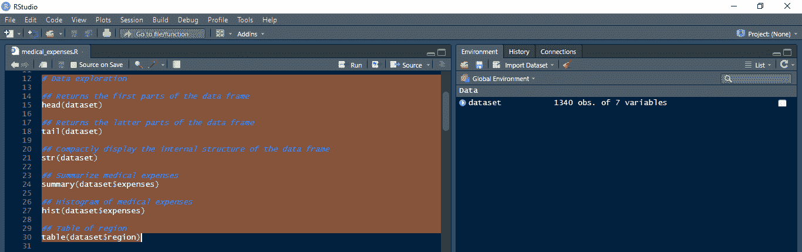

图 Rstudio 中的数据浏览

现在让我们探索一下我们的数据集(Image_1)。使用 **head** & **str** 函数对数据集进行初步探索。**头**函数返回数据帧的第一部分(Image_4)。 **tail** 函数返回数据帧的后面部分(Image_5)。 **str** 函数简洁地显示了数据帧(Image_6)的内部结构。这里我们可以观察数据帧的结构。它包括 1340 行和 7 列。年龄列是 int 类型，性别列是具有两个级别“女性”&“男性”的因子，bmi 列是 num 类型，儿童列是 int 类型，吸烟者列是具有两个级别“否”、“是”的因子，地区列是具有四个级别“东北”、“西北”、“东南”、“西南”的因子，费用是 num 类型(Image_6)。从 CSV 文件中读取数据时，使用 **stringsAsFactors = TRUE** 将分类变量转换为因子。我们会用多元线性回归，机器学习算法不能直接对字符数据起作用。我们必须检测特征矩阵和因变量向量。由于我们对医疗费用感兴趣，所以我们选择费用列作为因变量，并对其进行更多的探索。汇总函数汇总医疗费用列的最小值、最大值、第 1 个&第 3 个四分位数、中值和平均值(Image_7)。医疗费用的频率分布通过直方图使用 hist 函数可视化(Image_8)。它表明大多数病例低于 10000。table 函数用于获取 region 列的每个因子级别组合的计数。它说 325 排落在东北地区，326 排在西北地区，364 排在东南地区，325 排在西南地区。

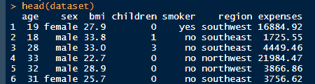

Image_4:数据帧的第一部分

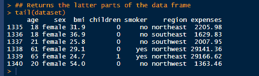

图 5:数据帧的后半部分

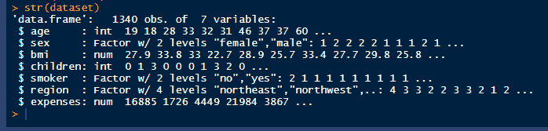

Image_6:显示数据框的内部结构

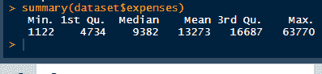

图片 _7:医疗费用汇总

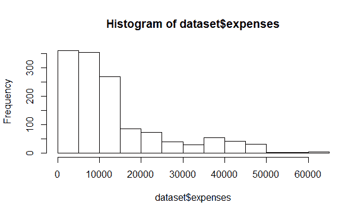

图片 _8:医疗费用柱状图

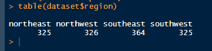

图 9:地区表

# 检查功能之间的关系

```
**Code Snippet****## Correlation**
cor(dataset$age, dataset$expenses)
cor(dataset$bmi, dataset$expenses)
cor(dataset$children, dataset$expenses)**## Correlation matrix**
cor(dataset[c(“age”, “bmi”, “children”, “expenses”)])
```

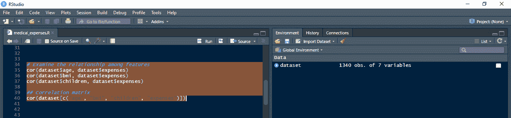

Image_10:检查 Rstudio 中各功能之间的关系

现在我们需要检查特性之间是否存在任何关系。我们可以使用 cor 函数(Image_10)检查特征之间的关系。在这里，我们试图解释有用的特征，这将有助于预测医疗费用。相关值为 1 表示这两个变量完全相关。在这里，我们分别比较了每个变量年龄、bmi、儿童栏与费用的相关性。然后，我们已经在一个函数调用中实现了所有这些。我们可以看到，年龄字段与医疗费用高度相关，相关值为 0.3009237 &儿童字段是最不相关的列，相关值为 0.0684989。Bmi 与 0.1934809 的值合理相关。我们已经在一个函数调用中比较了所有这些变量之间的相关性，如 Image_12 所示。

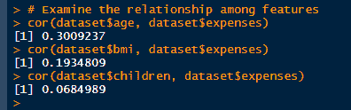

图 11:各变量年龄、bmi、子女栏与费用相关性的个别比较

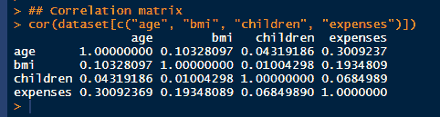

Image_12:年龄、体重指数、子女、费用等所有变量的相关性比较

# 可视化特征之间的关系

```
**Code Snippet****## Scatterplot matrix**
pairs(dataset[c(“age”, “bmi”, “children”, “expenses”)])**## More informative Scatterplot matrix using psych package**
## install.packages(‘psych’)
library(psych)
pairs.panels(dataset[c(“age”, “bmi”, “children”, “expenses”)])
```

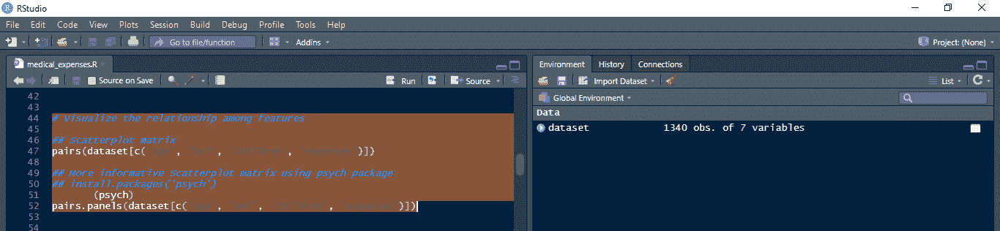

Image_13:在 Rstudio 中可视化功能之间的关系

我们使用 pairs 函数来可视化年龄、bmi、儿童特征的散点图矩阵(Image_14)。使用 psych package "**pairs . panels "**函数提供丰富的图表(Image_15)。在对角线上，我们可以看到每个特征的分布，无论是正态分布、右偏还是左偏等。年龄和 bmi 特征似乎呈正态分布(Image_15)。孩子和费用是右偏的，所以平均值正好落在峰值上。上半部分显示了这些特征之间的相关性(图 15)。年龄与费用高度相关，与其他特征的相关性较低。所以年龄是一个重要的特征。体重指数与其他特征的相关性较小，与费用的相关性也较小。儿童与其他特征的关联度较低，与费用的关联度也较低。下半部分显示了这些特征之间的相关椭圆(Image_15)。它被拉伸得越多，相关性就越强。如果是正圆，那就没有关联。似乎 bmi &儿童的相关性最小，因为它接近于圆形。由于椭圆拉伸，年龄和儿童是相关的。年龄和费用之间的椭圆最长，因此年龄在预测费用时很重要-用红色突出显示的黄土曲线表明年龄与费用呈线性关系(Image_15)。

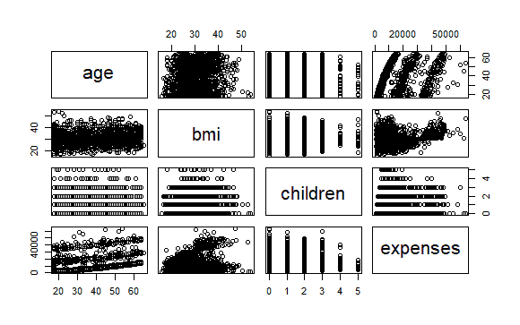

图 14:将年龄、体重指数、儿童等特征的散点图矩阵可视化

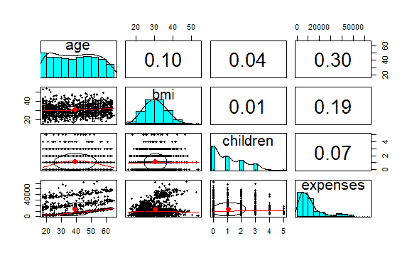

图 15:使用“心理”软件包，用丰富的图表可视化年龄、体重指数、儿童的散点图矩阵

# 将数据集分成训练集和测试集

```
**Code snippet****# Splitting the dataset into training set and test set**
## install.packages(‘caTools’)
library(caTools)
set.seed(123)**## Obtain the training index**
training_index <- sample(seq_len(nrow(dataset)), size = floor(0.75 * nrow(dataset)))**## Partition the data**
training_set <- dataset[training_index, ]
test_set <- dataset[-training_index, ]
```

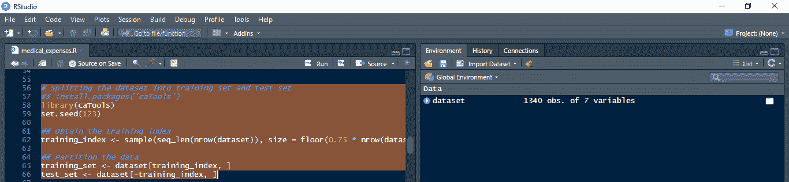

Image_16:在 Rstudio 中将数据集分为训练集和测试集

我们必须在数据集上构建模型，并在一个完全不同的新数据集上进行测试。所以我们需要两套。我们在其中建立机器学习模型的训练集和我们在其中测试机器学习模型的性能的测试集。测试集的性能不应该与训练集相差太多。这意味着机器学习模型已经很好地学习了相关性，因此它可以适应新的情况。我们使用 seed 设置一个随机状态来获得相同的结果。使用 **sample** 函数，我们从数据集中的所有行中随机抽取一个指定大小的样本(Image_16)。这里，我们从数据集中的所有行中获取 75%的训练索引。然后，我们使用整个数据集中的这些索引将数据集划分为 75%的训练集(Image_17)和 25%的测试集(Image_18)。

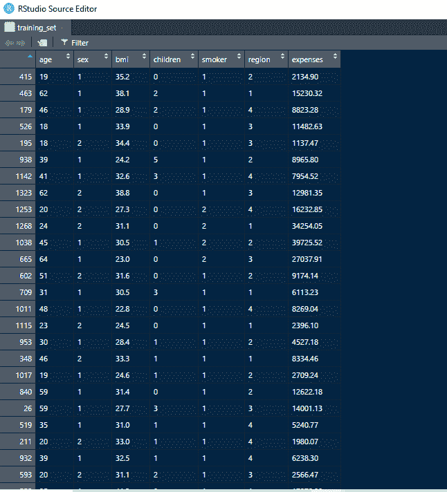

Image_17:分区后 75%的训练集

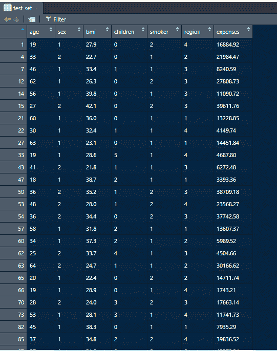

Image_18:分区后 25%的测试集

# 在训练集上训练数据(将多元线性回归拟合到训练集)

```
**Code Snippet****# Training the data on the training set****## Fit Multiple Linear Regression to the training set**
initial_model <- lm(expenses ~ ., data = training_set)
```

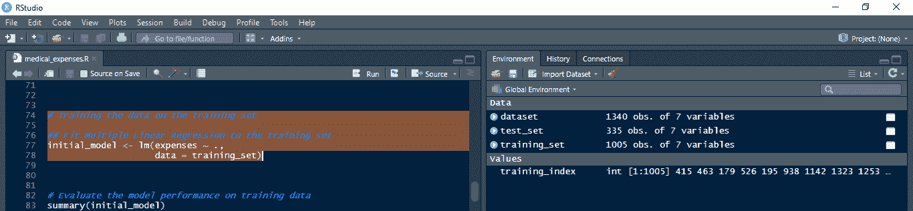

Image_19:在 Rstudio 的训练集上训练数据

这里，我们使用 **lm** 函数(Image_19)对训练集进行多元线性回归拟合。我们把医疗费用表示为所有自变量的线性组合，用“**费用~** 表示。”在函数中。使用这个函数，我们在训练集上训练我们的初始模型。生成的模型如 Image_20 所示。

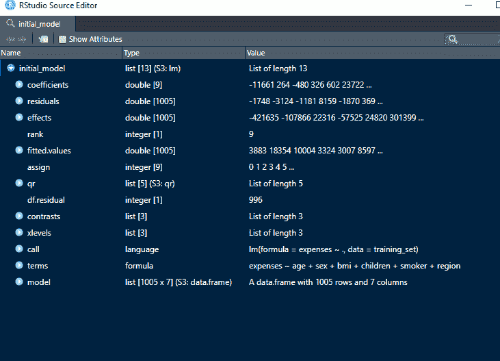

Image_20:训练后的初始模型

# 根据训练数据评估模型性能

```
**Code Snippet****# Evaluate the model performance on training data** summary(initial_model)**# Interpret on residuals, coefficients, statistical significance of predictors
# & overall model performance — Adjusted R-squared**
```

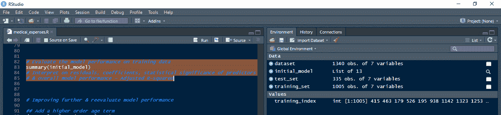

Image_21:评估 Rstudio 中训练数据的模型性能

这里我们已经使用 **summary** 函数获得了初始模型的概要。总结包括四个重要元素残差、系数、预测值的统计显著性&整体模型性能调整的 R 平方(Image_22)。

残差是误差。在低估的情况下，最大误差是 30029。这意味着实际费用高于预测费用。在高估的情况下，最高误差是 11439。这意味着我们收取的费用超过了实际费用。第一个四分位数代表第一个 25%分界点，第三个四分位数代表 75%分界点。第一个四分位数是高估 3060，第三个四分位数是低估 1445，这是可以接受的范围。

当我们查看系数部分时，我们看到 R 确实创建了伪变量&没有落入伪变量陷阱。它自动删除一个虚拟变量，以避免一些冗余的依赖关系。对于每个系数，我们有不同的信息—来自线性回归方程的系数、标准误差、t 值、p 值、显著性水平。对于模型，我们需要看看我们是否有足够的统计上的强变量。这是基于阈值的。一般来说，一个好的阈值是 5%。如果 P 值低于 5%，则自变量在统计上非常显著。它就越会大于 5%。它在统计学上不太重要。带星号的最后一列是解释系数的一种更快速的方法。在所有的独立变量中，年龄、体重指数、孩子和吸烟者是费用的强有力的统计预测因素。一些地区也是强有力的预测者。

调整后的 R 平方告诉我们因变量(医疗费用)的总可变性中有多少可以用模型(选定的自变量)来解释。这里我们得到了 0.7352，这是一个强模型。我们可以通过使用这个值来查看模型是否有所改进。

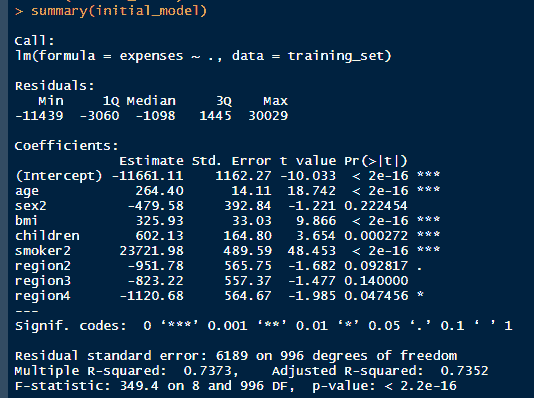

Image_22:训练数据的初始模型性能摘要

# 进一步改进和重新评估模型性能

```
**Code Snippet****## Add a higher order age term**
dataset$age2 <- dataset$age^2**## summary of the BMI column**
summary(dataset$bmi)**## Add an indicator for BMI**
dataset$bmi30 <- ifelse(dataset$bmi >= 30, 1, 0)**## Partition the data again with the additional columns but using the same index**
training_set_new <- dataset[training_index, ]
test_set_new <- dataset[-training_index, ]**## Create the final model**
final_model <- lm(expenses ~ sex + bmi + children + region + age2 + bmi30*smoker,data = training_set_new)**# Evaluate the model performance on the new training data**
summary(final_model)**# Interpret on residuals, coefficients, statistical significance of predictors
# & overall model performance — Adjusted R-squared**
```

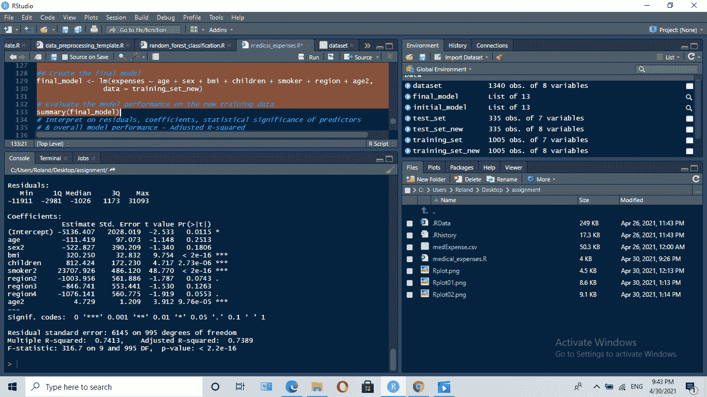

Image_23:使用 Rstudio 中的附加 age^2 列评估训练数据的模型性能

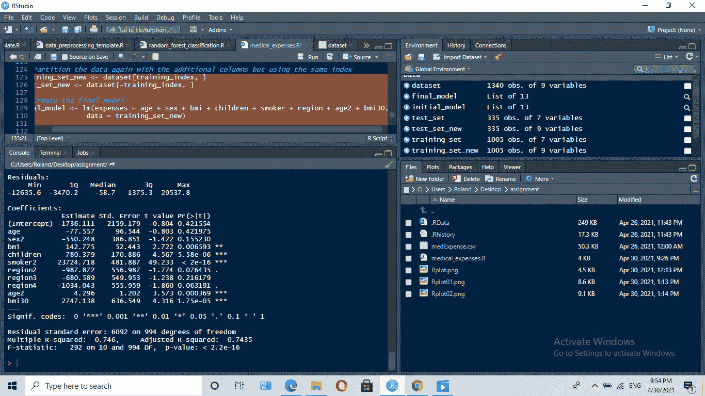

Image_24:使用 Rstudio 中附加的 age^2 列和 bmi 指标列来评估模型在训练数据上的性能

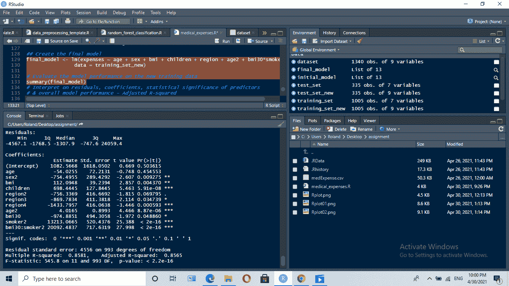

图 25:使用 Rstudio 中的附加 age^2 列以及 bmi 指标列和吸烟者列的组合来评估模型在训练数据上的性能

为了优化我们的初始模型，我们可以做一些操作。引入互动栏目或特色是一种可能。当我们修改我们的初始模型及其性能时，我们用这些额外的列呈现新的训练数据。具有线性关系的年龄通过引入类似 age^新协议的附加列而被视为非线性关系。随着这一新列的添加，调整后的 R 平方值增加到 0.7389，从而提高了模型性能(Image_23 & 26)。此外，对于 Bmi，我们不是将其作为一个连续的值，而是将其作为一个健康与否的因素。我们用一个接近均值的值 30 来区分 bmi 值健康与否。随着这一新列的添加，调整后的 R 平方值增加到 0.7435，从而提高了模型性能(Image_24 & 28)。然后将具有最小 P 值的两列合并，这意味着具有高度的统计显著性。随着这一新列的添加，调整后的 R 平方值增加到 0.8565，从而提高了模型性能&，为我们提供了最佳模型(Image_25 & 29)。

这里我们已经使用 summary 函数获得了最终模型的概要。总结包括三个重要元素残差、系数、预测值的统计显著性和整体模型性能—调整后的 R 平方(Image_29)。

当考虑残差时，在低估的情况下，最高误差为 24059.4。这意味着实际费用高于预测费用。在高估的情况下，最高误差为 4567.1。这意味着我们收取的费用超过了实际费用。第一个四分位数是高估 1768.5，第三个四分位数是高估 747.6，这是可以接受的范围。

对于模型，我们需要看看我们是否有足够的统计上的强变量。这是基于阈值的。一般来说，一个好的阈值是 5%。如果 P 值低于 5%，则自变量在统计上非常显著。它就越会大于 5%。它在统计学上不太重要。带星号的最后一列是解释系数的一种更快速的方法。在所有的自变量中，统计上最强的预测因子是 bmi 指标&吸烟者的乘积，它具有最低的 P 值。高阶年龄&一些区域也是强有力的预测因子。性别和 bmi 列在费用预测中各自具有一定的意义。

调整后的 R 平方告诉我们因变量(医疗费用)的总可变性中有多少可以用模型(选定的自变量)来解释。这里我们得到了 0.8565，这是迄今为止我们得到的最高性能模型。该值比初始模型高得多。

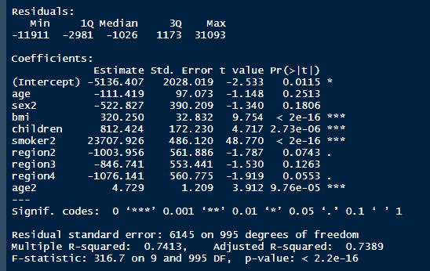

Image_26:带有附加 age^2 列的训练数据的模型性能摘要

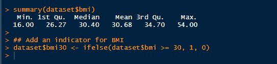

Image_27:身体质量指数专栏摘要

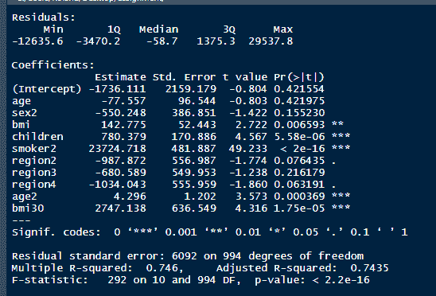

Image_28:具有附加 age^2 列和 bmi 指示列的训练数据的模型性能摘要

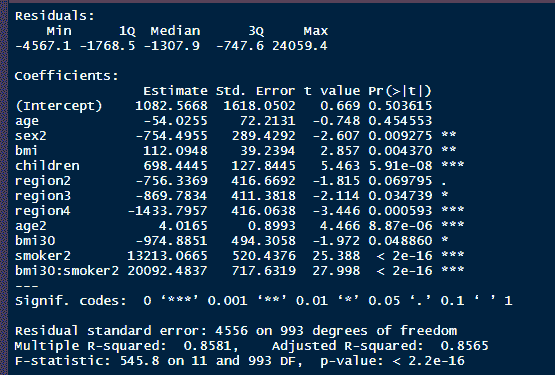

图 29:具有额外的 age^2 列以及 bmi 指标列和吸烟者列的组合的训练数据的最终模型性能摘要

# 用改进的模型预测测试集结果

```
**Code Snippet****# Predicting the test set results with the improved** modelmedicalExpensesPredicted = predict(final_model, newdata = test_set_new)cor(medicalExpensesPredicted, test_set_new$expenses)
plot(medicalExpensesPredicted, test_set_new$expenses)
abline(a = 0, b = 1, col = “red”, lwd = 3, lty = 2)
```

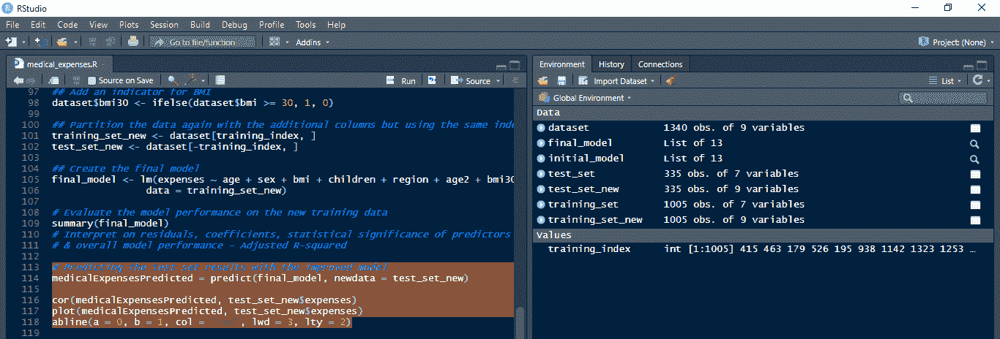

Image_30:使用 Rstudio 中的改进模型预测测试集结果

这里，我们使用预测函数(Image_30)通过改进的模型对新的测试数据(test_set_new)进行预测。我们使用 **cor** 函数比较测试集中预测医疗费用和实际医疗费用的相关性，得到的值为 0.9432327，这意味着它们高度相关，具有良好的准确性(Image_31)。这里我们绘制了预测与实际医疗费用的对比图(图 32)。很少有异常值，但该图表明在大多数情况下，实际结果和预期结果是一致的。你可以在这里下载上面例子[的 R 脚本。](https://sendeyo.com/en/2ad9416897)

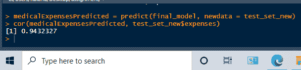

Image_31:改进模型的预测测试集结果

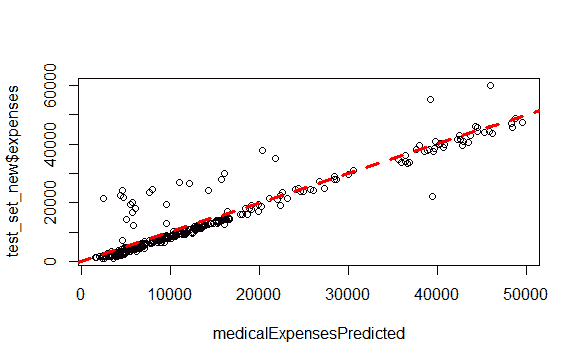

Image_32:绘制预测与实际医疗费用的对比图

现在你可能已经意识到，当你使用 RStudio 这样的工具时，数据分析并不是一个非常困难的过程。您可以将在本指南中获得的知识应用到任何其他感兴趣的领域。