# 使用 Julia 分析您的健康和健身数据

> 原文：<https://towardsdatascience.com/analyze-your-health-and-fitness-data-using-julia-d6f4c3842b17?source=collection_archive---------17----------------------->

## 一个简单的数据科学项目，为您的编码周末增添趣味

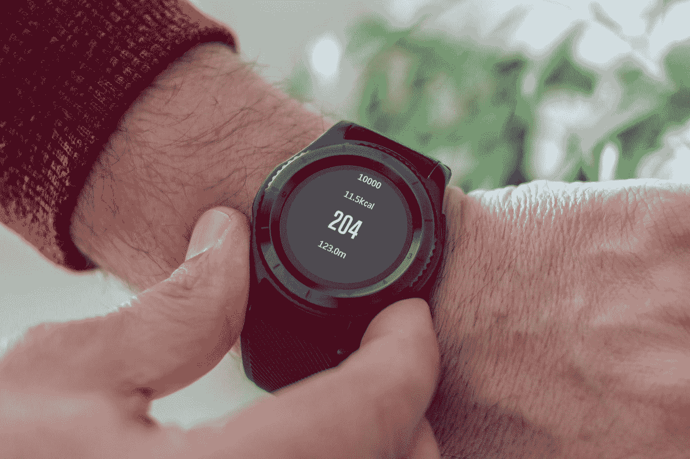

[阿图尔·尤奇卡](https://unsplash.com/@artur_luczka?utm_source=medium&utm_medium=referral)在 [Unsplash](https://unsplash.com?utm_source=medium&utm_medium=referral) 拍摄的照片

我几乎每天都戴手表。我的习惯性合作伙伴是三星 Gear S3 Frontier，这是我在 2018 年生日时买的。除了手表的常见功能外，它还有一系列传感器来记录各种活动，如步数、距离、爬过的楼层和心率(通过[光电容积描记图](https://en.wikipedia.org/wiki/Photoplethysmogram))。较新的银河系列手表还具有记录血氧和 EKG 的传感器。作为一个技术呆子，这自然让我兴奋！

这些传感器记录的数据被传递到三星健康应用程序，该应用程序已经很好地将它们总结成漂亮的视觉效果。然而，作为一名程序员，我一直渴望用它做更多的事情。幸运的是，三星允许我们下载原始数据。csv 文件)直接从应用程序。如果您是三星手表/手机用户，您可以按照本文[文章](/extract-health-data-from-your-samsung-96b8a2e31978)中的说明下载您的健康数据。我想对于 Fitbit 和 Garmin 用户来说也有这样做的方法。如果你发现一些有用的东西，请在评论中告诉我。

在本指南中，我们将利用 Julia 生态系统中的各种软件包。我使用 [**Pluto.jl**](https://github.com/fonsp/Pluto.jl) 做了这个练习，它允许我们创建交互式代码笔记本(此处[可用](https://github.com/vnegi10/Health_data_analysis))。也可以选择自己的编辑器比如 VS Code。

# 设置冥王星

如果你是 Julia 的新手，你首先需要从[这里](https://julialang.org/downloads/)安装适合你的系统的二进制文件。一装好，打开朱丽亚·REPL。按“]”进入 Pkg (Julia 的内置包管理器)提示符。然后输入`add Pluto`。这将下载 Pluto 包并为您编译它。按 backspace 键返回 Julia 提示符。然后键入`using Pluto`，后面跟着`Pluto.run()`。应该会打开一个新的浏览器窗口，显示 Pluto 主页。您可以继续创建新笔记本。

如果你熟悉 Jupyter，你已经知道如何使用冥王星。但是，请记住以下特性:

*   冥王星是一个反应式笔记本，这意味着细胞之间是相互联系的。当您更新一个单元格时，依赖于它的所有其他单元格也会更新。这也意味着你不能在两个地方使用相同的变量名，除非它们的作用域是局部的(比如在函数中)。
*   当在一个代码单元中写多行时，需要在 begin-end 块中换行。当执行(shift + enter)这样一个程序块时，您将得到一个选项来自动完成这个操作。

要在您的工作环境中导入所有相关的包，请执行以下命令:

`using PlutoUI, DataFrames, CSV, Query, VegaLite, Dates, HTTP, Statistics`

# 获取输入数据

我们将使用 **CSV.jl** 直接从我的 [GitHub](https://github.com/vnegi10/Health_data_analysis) 存储库中读取数据，并以数据帧的形式存储它们。为了可视化，我们将使用优秀的 [**VegaLite.jl**](https://www.queryverse.org/VegaLite.jl/stable/gettingstarted/tutorial/) 包。来自三星健康应用程序的数据以各种 csv 文件的形式提供，但是，我们将只使用以下三种文件:

*   com . Samsung . shea lth . tracker . pedometer _ day _ summary。<timestamp>。战斗支援车</timestamp>
*   com . Samsung . shea lth . tracker . heart _ rate。<timestamp>。战斗支援车</timestamp>
*   com . Samsung . health . floors _ clipped。<timestamp>。战斗支援车</timestamp>

文件名是不言自明的。我们可以将数据直接读入数据帧，如下所示。我们设置 header = 2，这样第二行用于命名列。

将 CSV 文件读入各自的数据帧

# 清洁和一些组织

让我们探索一下我们的数据帧实际包含了什么。

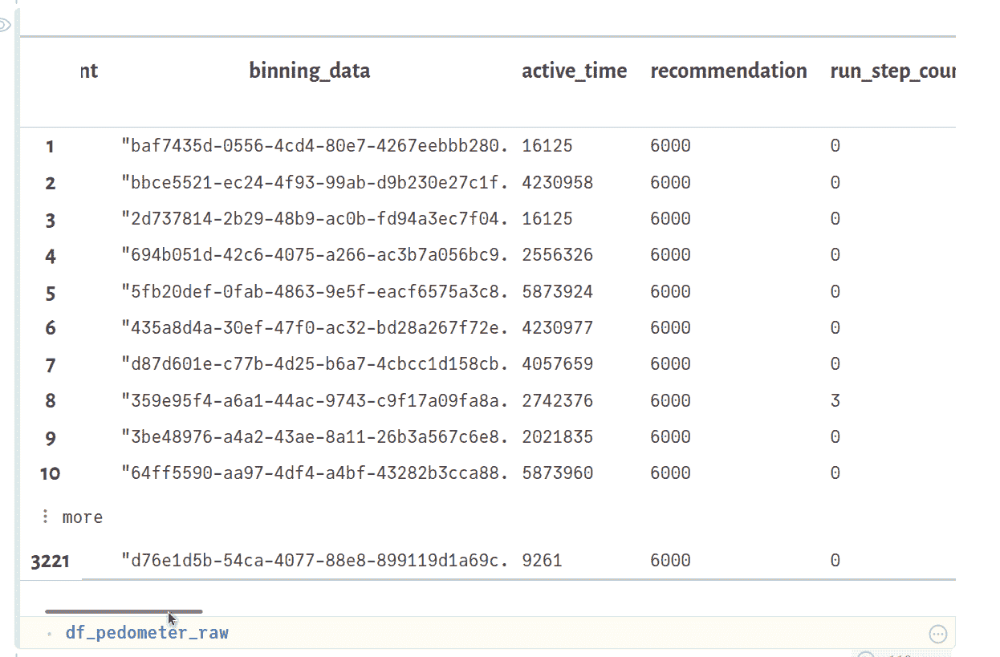

您也可以尝试以下方法:

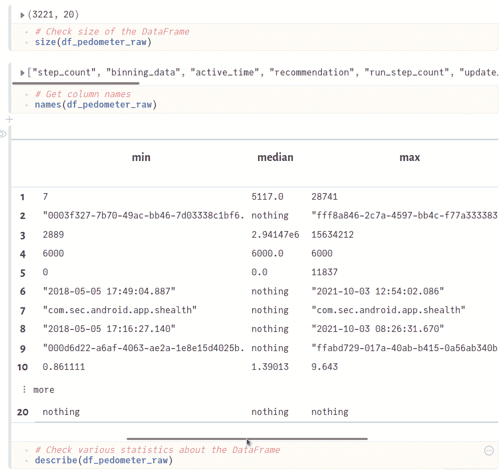

**create_time** 列表示记录数据条目的时间，类型为“字符串”。我们需要将它转换成一个“DateTime”对象，这样以后就可以进行排序和更容易的绘图。此外，我们还可以将**距离**列转换为 km(从 m 开始),将**活动时间**转换为分钟。最后，我们通过删除重复条目来清理数据帧，并对 w.r.t. time 进行排序。

清洁和分类操作

我们计算累积距离，并将其添加到单独的列 **cumul_distance** 。为了以后的使用，将日子分类为“工作日”或“周末”，并将它们添加到单独的 **day_type** 列也很方便。对于新的**日**和**月**列也是如此。

添加新列

# 基于时间的过滤

使用 PlutoUI.jl 包，我们可以通过添加按钮、滑块等来进一步增强交互体验。例如，要将日期时间值绑定到变量 **start_date，**执行以下操作。

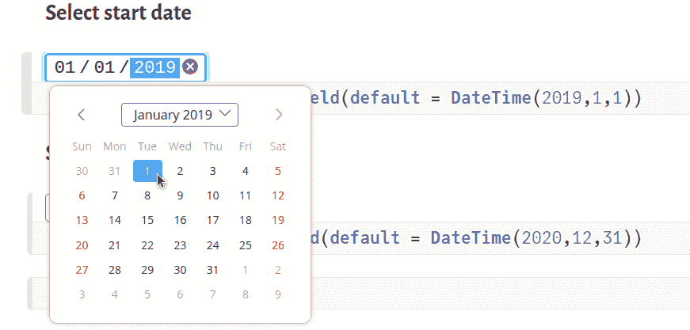

插入交互式日期选择器

根据上面选择的时间范围过滤数据帧。 **@filter** 是 **Query.jl** 包提供的强大宏。我们筛选出**创建时间**位于**开始日期**和**结束日期**之间的行，如下所示:

使用 **Query.jl** 进行过滤

现在我们准备开始可视化数据。

# 每日步骤

我们过滤后的数据帧 **df_pedometer_filter** 可以直接传递给 **VegaLite.jl** 包提供的 **@vlplot** 宏。其余的参数是特定于绘图类型的。查看 [VegaLite.jl](https://www.queryverse.org/VegaLite.jl/stable/gettingstarted/tutorial/) 教程了解更多信息。

用线梯度绘制每日步数

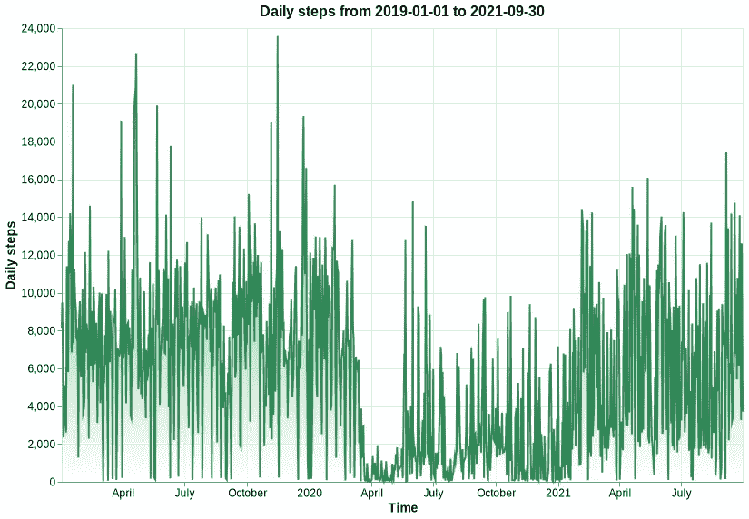

很明显，2020 年我走的步数少了很多。这可能是由于电晕爆发期间实施的封锁。很高兴看到我在 2021 年加快了步伐。相同的数据也可以可视化为堆叠直方图。

绘制每日步数的堆积直方图

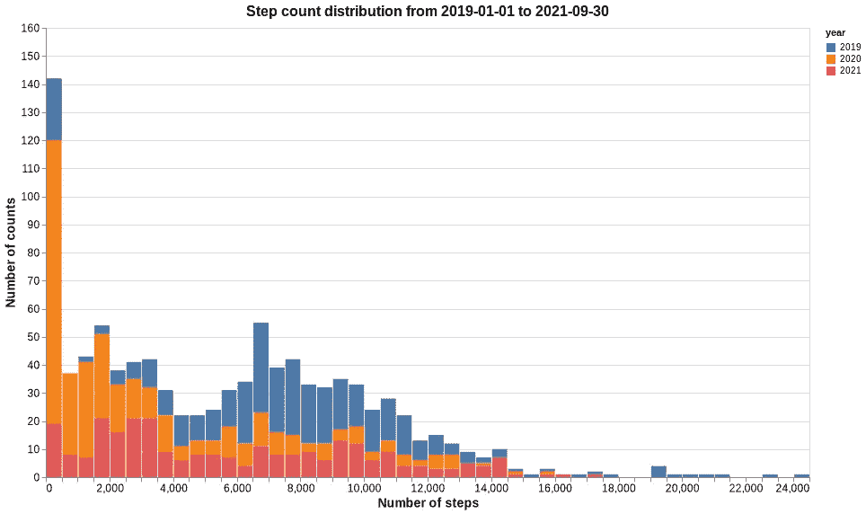

每天的默认目标设置为 6000 步。我总是试图至少达到那里，因此三年的峰值都在那个值附近。对于 2020 年，有很多天我的活动量如预期的那样低。

# 每日距离

我喜欢每天去散步。除了步数，看看我通常走多远也是很有趣的。在我们的 DataFrame 中将色标设置为 **distance** 列，以与每个数据点的大小成比例的渐变来呈现条形。看起来相当酷！

将每日距离绘制成带颜色渐变的条形

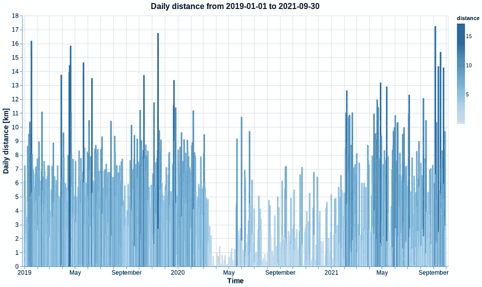

# 累积距离

有趣的是，我还可以检查到目前为止我已经跑了多少公里。我猜达到 10，000 公里会是一个不错的目标。

将累积距离绘制成面积

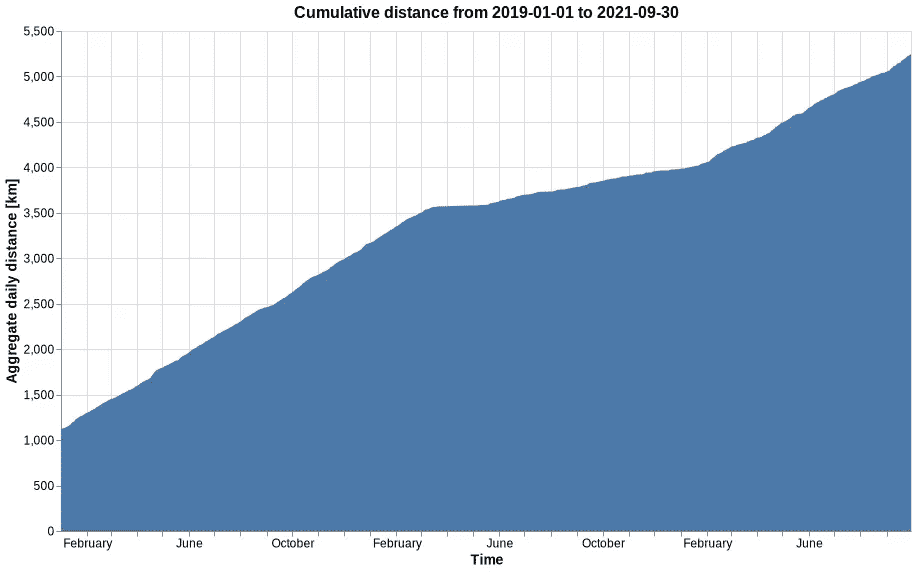

# 有效时间

这是在任何活动(行走、跑步等)中花费的时间。)如手表所检测到的。如果您还记得的话，我们之前已经根据是工作日还是周末添加了一个 **day_type** 列。现在，我们可以利用它来相应地对我们的活动时间进行分组。

使用**日类型**分组的绘图活动时间

我们还可以简单地通过将参数列表中的`color = :day`参数更改为 **@vlplot** 宏来对每天的活动时间进行细分。

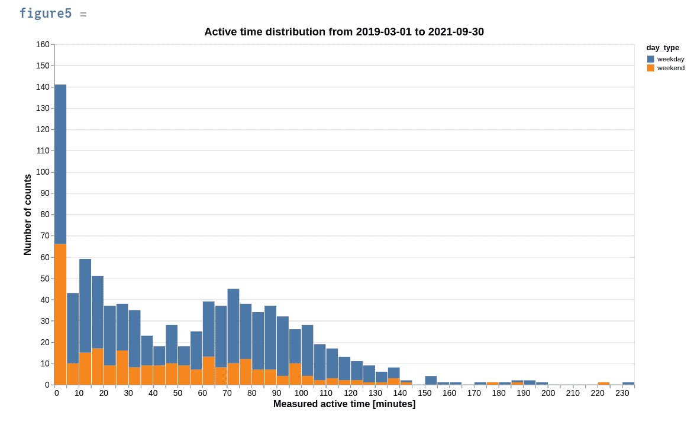

似乎我在周二和周三很活跃，周六最不活跃。这有意义吗？

# 步数和卡路里之间的相关性

绘制 2D 直方图，显示步数与卡路里的关系

您可以在 Pluto 中创建一个滑块(需要 **PlutoUI.jl** 包)，并将其值绑定到 **select_year** 变量，如下所示:

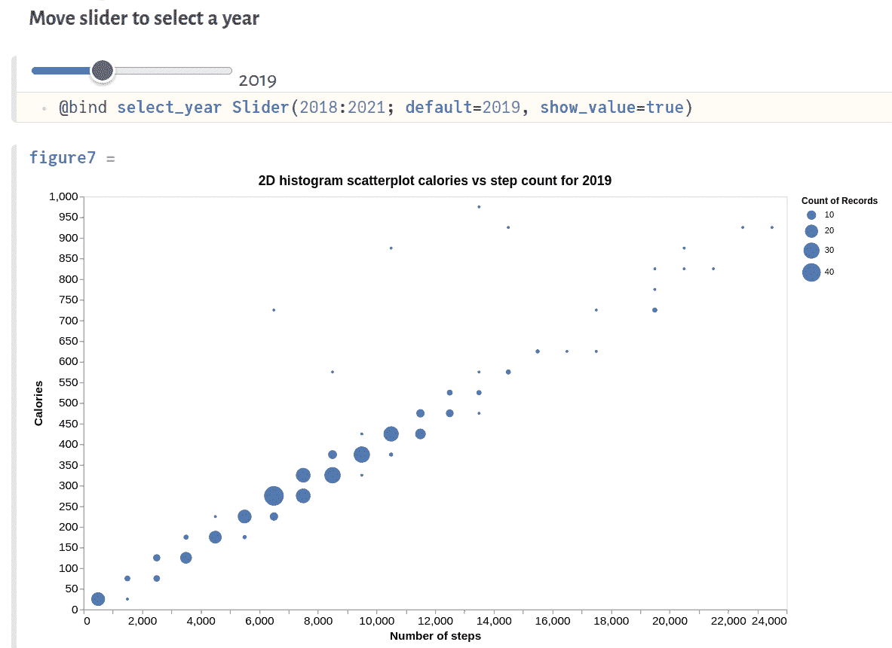

正如所料，步数和消耗的总热量有直接的关系。该 2D 直方图散点图还显示了大小与总计数成比例的标记。步数越多，数据点越少。今年我应该试着更加积极。

# 步数与活动时间的热图

绘制步数与卡路里的热图

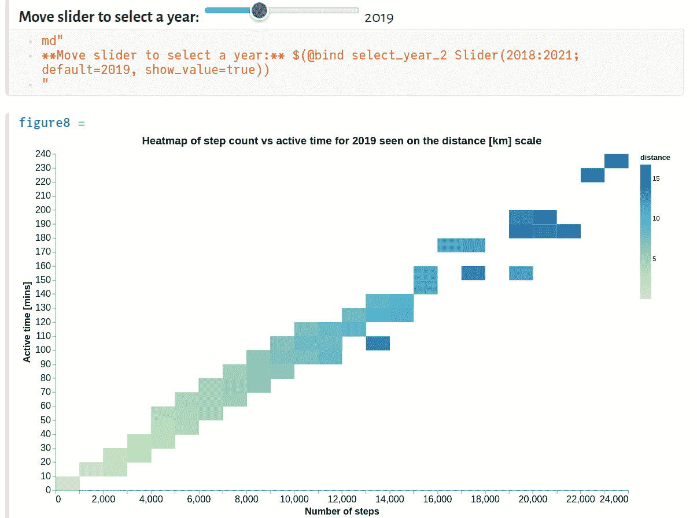

# 可视化心率数据

心率数据也可以使用类似的策略进行清理，如前所示。

使用圆形标记和与数值成比例的尺寸绘制心率数据

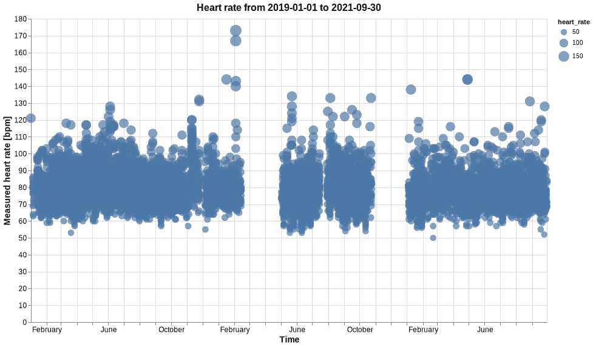

我的手表每隔 10 分钟测量一次心率。我几乎每天都穿。这意味着大多数数据点是在我坐在办公桌前工作时收集的。让我们看看分布是什么样的。

绘制心率分布图，色标设置为数值的大小

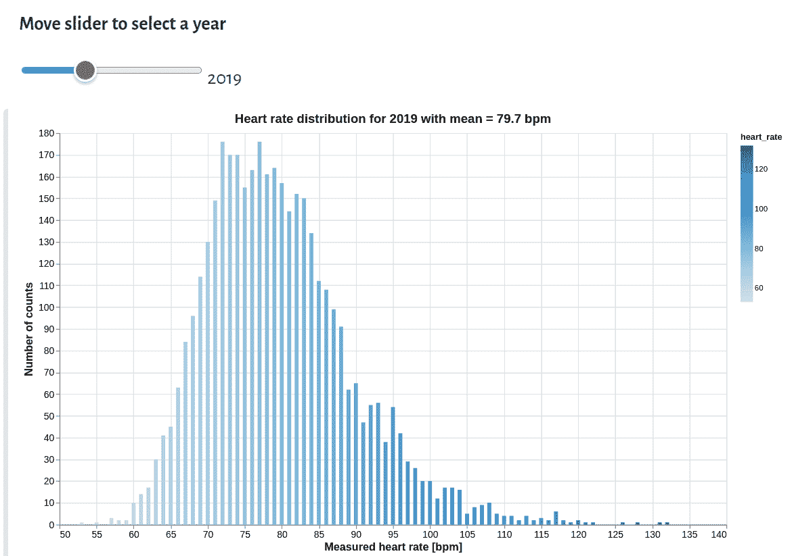

大多数数据似乎集中在每分钟 60-100 次(bpm)的静息心率范围，平均值约为 78-79 BPM。那就放心了！相当高的值可能是在运行会话期间测量的。

# 攀爬的楼层数

爬过的楼层数

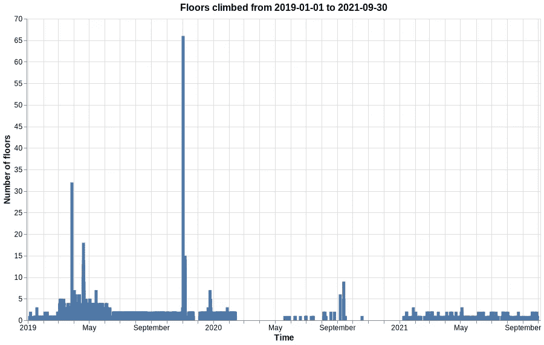

这里没有什么太令人兴奋的，除了 2019 年 11 月的大幅飙升。在印度奈尼塔尔市的一次短途徒步旅行中，我戴着这只手表。9 英尺的高度变化被记录为一次楼层爬升。所以，65 层楼表明我在那段时间里一定爬了 585 英尺~ 178 米。唷！

# 结论

朱莉娅的生态系统正在迅速发展，有许多令人惊叹的绘图包，而 **VegaLite.jl** 恰好是其中之一。图形风格的优雅语法和与 DataFrames 的紧密集成使其成为任何类型的数据科学/分析项目的理想选择。我希望您喜欢阅读本指南。完整代码(冥王星笔记本)可以在[这里](https://github.com/vnegi10/Health_data_analysis)找到。感谢您的宝贵时间！如果你想联系，这是我的 LinkedIn。

***注来自《走向数据科学》的编辑:*** *虽然我们允许独立作者根据我们的* [*规则和指导方针*](/questions-96667b06af5) *发表文章，但我们不认可每个作者的贡献。你不应该在没有寻求专业建议的情况下依赖一个作者的作品。详见我们的* [*读者术语*](/readers-terms-b5d780a700a4) *。*

## 参考

1.  [分析三星健康步骤数据](https://www.kaggle.com/simon0204/analyzing-samsung-health-step-data)
2.  [从你的三星中提取健康数据](/extract-health-data-from-your-samsung-96b8a2e31978)
3.  [VegaLite.jl](https://www.queryverse.org/VegaLite.jl/stable/examples/examples_histograms/)