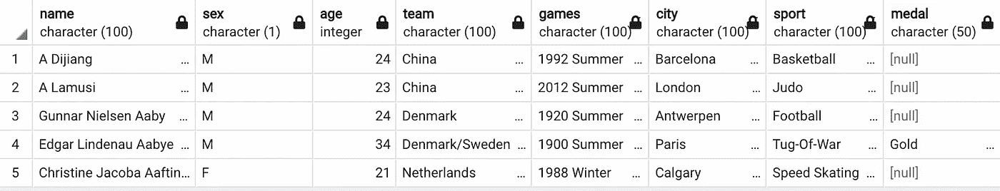
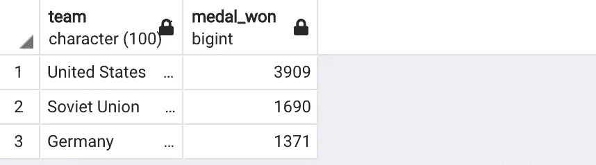
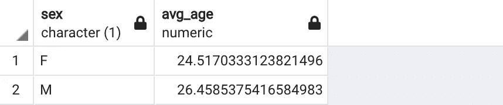
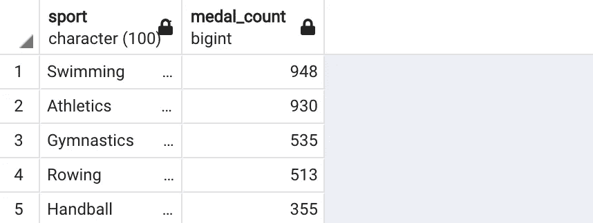
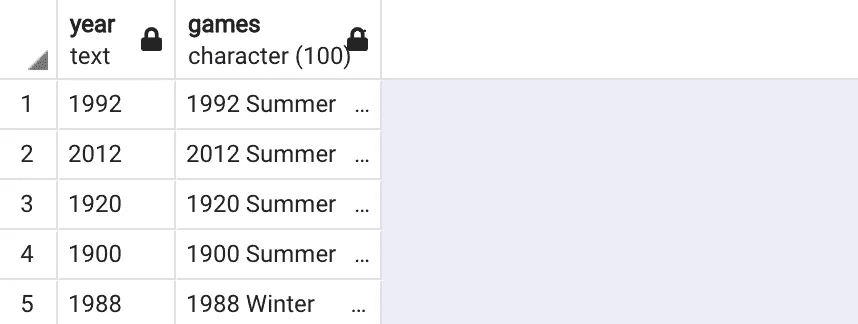

# 用 SQL 分析 120 年奥运历史

> 原文：<https://towardsdatascience.com/analyzing-120-years-of-olympics-history-with-sql-11d4daace4d0?source=collection_archive---------19----------------------->

## SQL 实践教程


马特·李在 [Unsplash](https://unsplash.com/s/photos/olympics?utm_source=unsplash&utm_medium=referral&utm_content=creditCopyText) 上的照片

我在 Kaggle 上发现了一个很棒的[数据集](https://www.kaggle.com/heesoo37/120-years-of-olympic-history-athletes-and-results)。它是在知识共享许可下共享的，所以我们可以公开使用和共享它。我认为了解奥运会的历史将是令人兴奋的。

有许多替代工具可用于对此数据集执行分析。我选择 SQL 没有特别的原因。在本文中，我们将在练习 SQL 的同时了解奥运会。

**注意:** SQL 被很多关系数据库管理系统使用，比如 MySQL、SQL Server、PostgreSQL 等等。尽管它们大多采用相同的 SQL 语法，但可能会有一些细微的差别。在本文中，我们将使用 PostgreSQL。

我选择了一些列，并将数据上传到一个 SQL 表中。让我们先来看看奥运表。

```
SELECT * FROM olympics LIMIT 5
```



(图片由作者提供)

我们有运动员的名字、性别、年龄和他们参加的运动。该表还包含游戏的详细信息。原始数据集包含 271116 行，但是我只上传了 200000 行到 olympics 表。如果对整个数据集进行相同的分析，结果可能会略有不同。

我想看看有多少不同的运动员参加了奥运会。我们可以数出不同的名字。

```
SELECT COUNT(DISTINCT(name)) FROM olympics99875
```

这张桌子上有近 10 万名不同的运动员。我想知道他们中有多少人获得了奖牌。

```
SELECT COUNT(DISTINCT(name)) FROM olympics
WHERE medal IS NOT NULL20560
```

我们刚刚使用 where 语句添加了一个条件。

让我们找出奖牌总数前 3 名的国家。

```
SELECT team, COUNT(medal) AS medal_won
FROM olympics
WHERE medal IS NOT NULL
GROUP BY team
ORDER BY medal_won DESC
LIMIT 3
```



(图片由作者提供)

上面的查询过滤了 medal 列没有空值的行。然后，根据团队列对行进行分组，并对行进行计数，这就给出了获得的奖牌数。最后，结果集按奖牌数降序排序，选择前三个。

了解获得奖牌的男女运动员的平均年龄是很有趣的。

```
SELECT sex, AVG(age) AS avg_age
FROM olympics
WHERE medal IS NOT NULL
GROUP BY sex
```



(图片由作者提供)

女运动员比男运动员小两岁。

我们还可以查看女运动员获得奖牌最多的前 5 项运动。

```
SELECT sport, COUNT(medal) AS medal_count 
FROM olympics
WHERE sex = 'F'
GROUP BY sport
ORDER BY medal_count DESC
LIMIT 5
```



(图片由作者提供)

考虑到我们对比赛年份感兴趣。该表没有单独的年份列，但可以从游戏列中提取。

```
SELECT LEFT(games, 4) AS year, games
FROM olympics
LIMIT 5
```



(图片由作者提供)

左边的函数允许从字符串中选择部分。它接受列名和要选择的字符数。right 函数做同样的事情，但是从右边开始计数。

下一个示例与其说是探索数据集，不如说是 SQL 实践。考虑到我们只需要 1950 年以后的数据。我们可以删除属于 1950 年或之前的游戏的行，或者用我们感兴趣的数据创建一个新表。

以下查询使用 olympics 表中的数据创建一个新表。

```
CREATE TABLE olympics_after_1950 AS
SELECT * FROM olympics
WHERE CAST(LEFT(games, 4) AS INTEGER) > 1950
```

让我们检查一下查询是否工作正常。

```
SELECT MIN(LEFT(games, 4)) FROM olympics_after_19501952
```

令人惊讶的是，create table 语句用于创建表😃。我们可以通过使用 select 语句和 create table 语句从不同的表中选择数据来填充新表。

我们还可以通过删除属于 1950 年或之前的奥运会的行来更新奥林匹克表。我想保持原来的桌子不变。我们可以在新表上练习 update 语句。

让我们删除新表中 1970 年之前的行，然后检查最小日期。

```
DELETE FROM olympics_after_1950
WHERE CAST(LEFT(games, 4) AS INTEGER) < 1970SELECT MIN(LEFT(games, 4)) FROM olympics_after_19501972
```

我们做了几个例子来深入了解奥林匹克的历史。我们还练习了基本的 SQL 语句和函数。

感谢您的阅读。如果您有任何反馈，请告诉我。