# 分析和解释评分表中的数据

> 原文：<https://towardsdatascience.com/analyzing-and-interpreting-data-from-rating-scales-d169d66211db?source=collection_archive---------8----------------------->

## 使用学生/客户满意度调查数据的两部分指导性案例研究

*注:本帖代码可在* [*这里*](https://github.com/kevinclee26/BCS_Dashboard) 找到

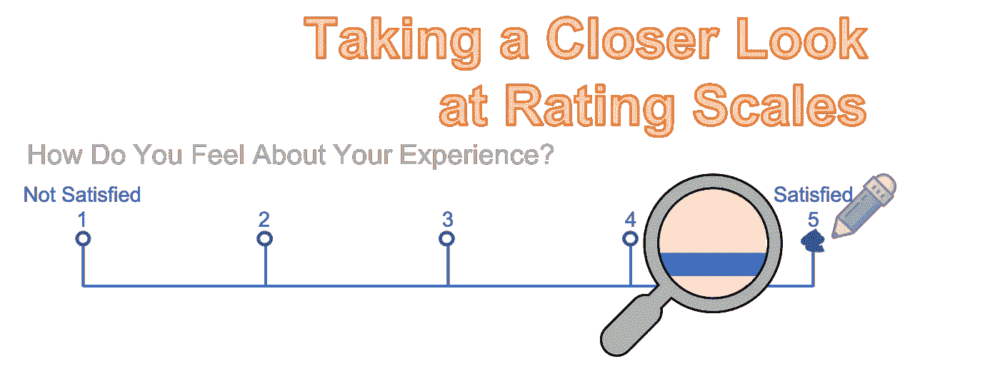

仔细查看评分标准(图片由作者提供)

等级量表是衡量态度和观点的一种有效且受欢迎的方式。它们易于实现，广泛用于调查、反馈表和绩效评估。然而，误用和错误经常发生在这个看似直观的工具的实现和分析中。理解和综合评定等级信息的能力使我们能够在不断变化的环境中做出决策。这个由两部分组成的系列的目标是展示有效利用评定等级数据所需的基本概念**以及关于常见陷阱的警告**。在第一部分中，我们从**定性**考虑开始，这对于第二部分中讨论的**定量**分析的适当性具有重要意义。****

## 数据集介绍

在我们的案例研究中，我们将使用我从数据分析课上收集的每周调查结果。这些**匿名**调查要求**所有学生**每周**在**进行。这些说明要求学生对以下每个因素进行 1(差)到 5(好)的评分，从“总体满意度**”的**总体评分**开始。我们的目标是深入了解学生对整个课程的感受。**

**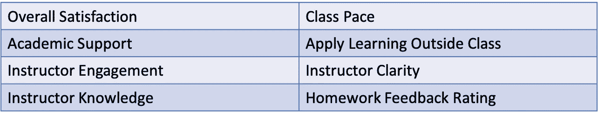**

**反馈形式问题**

## **了解评定等级**

**每个**评定等级**都作为一个**封闭式**问题来实施，以获取信息。它要求回答者根据说明给被评对象赋值。正确使用时，等级量表可作为**非物理**属性的**测量工具。不同于我们用来测量物理属性的科学仪器(例如测量温度的温度计和测量长度的尺子)，等级量表可以用来测量本质上是认知的属性。因为它们是抽象的、无形的和复杂的，所以通常不能用一个问题来概括。相反，我们可以问一系列涉及主题不同方面(或因素)的相关问题，我们称之为“**兴趣结构**”。对这些个别但相关问题的回答更多的是**基础**和**陈述性**。****

## **评级标准的类型**

**有 4 个基本级别的测量尺度用于采集数据。每个秤都是一个**级增量**级测量，即每个秤都实现前一个秤的功能。在分析数据时，首先理解变量代表什么是很重要的。**

**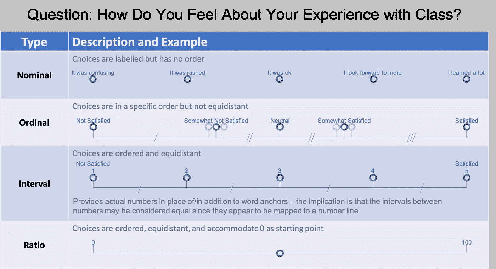**

**4 种测量尺度**

***附注:评级尺度分析的一个常见缺陷是假设选择之间的距离相等。***

**可用于**名义秤**的分析类型非常有限，因为它缺乏数字属性。它们很容易实现，但只对分类数据有用。更常见的评级尺度是序数或区间，其中的选择带有等级顺序属性。两者之间的**差异**可以是**细微的**，但是从分析的角度来看**的含义**是相当**显著的**。在决定实施/应该实施哪一项时，我们会考虑受访者是否认为(所有)选项是**等距的**。这种不足使使用**参数**统计数据进行**序数**标度的能力受到质疑，但有时可能是首选，因为它们相对容易使用。另一方面， **Interval** Scales 将选项设计为均匀间隔(即，不同选项之间的差异幅度相同)，这可以通过将单词锚与序列号相关联来实现。这种方法利用了人们对数字线的直觉，支持使用**均值**、**标准差**以及其他**统计方法**。我们正在分析的数据来自区间尺度；因此，受访者选择的幅度和差异是有意义的，尽管这并不意味着选择#4 的强度是选择#2 的两倍(对于**比率**等级来说是这样的)。**

## **测量仪器具有可靠性和有效性**

**评级尺度衡量**难以定义的**和**缺乏验证标准的**；因此很难知道他们什么时候按计划工作。评定量表的有效性可以通过**可靠性**和**有效性**进行评估，定义如下:**

*   **可靠性(意味着**稳定性**和**一致性** ) —如果重复使用，仪器会产生相同的结果。**
*   **有效性(意味着**准确性** ) —仪器准确测量它应该测量的东西。**

## **Fido 教授可靠性和有效性**

**我们打个比方来强调信度和效度的重要性。假设我们相信一只叫 Fido 的狗已经被训练来警告危险的血糖事件。他们通过检测与这些血糖水平下的生物化学相关的气味来做到这一点。Fido 在许多方面起着测量工具的作用。在它们被认证为官方糖尿病警戒犬之前，我们必须首先评估它们的可靠性和有效性。出于可靠性考虑，我们希望确保它们能够持续向人类同伴发出警告信号。他们应该表现出对周围环境干扰的抵抗力，并且警告信号不是不稳定的。为了有效性，我们希望确保他们的警告信号是异常血糖事件的真实指示。他们的警告信号应该伴随着来自患者佩戴的 BGM(血糖监测器)的过高或过低的读数。**

## **测量可靠性和有效性**

**对信度和效度进行定性评估**和定量评估**。为了获得对可靠性和有效性估计的信心，我们的数据应该有足够的样本量和一定的可变性(如下直方图所示)。重要的是要记住，我们计算的估计值主要用于评估研究方法的**质量，而不一定对结果做出**推断**。********

**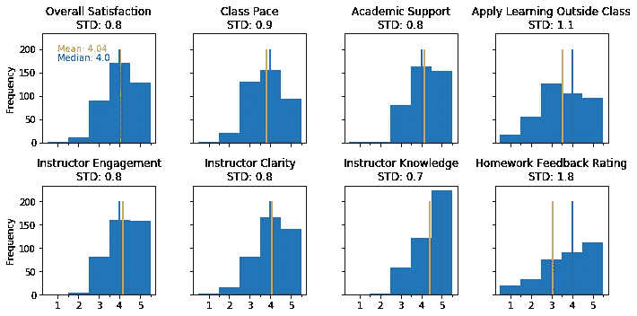**

**调查中各因素的评分分布**

## **可靠性**

****可靠性**是指如果在相同的条件下再次使用评定量表，评定量表会给出相同结果的程度，即其**稳定性** y 或**一致性 c** y。没有可靠性，我们就不能确定来自评定量表的数据是有意义的且不是(部分)随机的。我们可以通过观察两组(或更多组)测量值之间的相似性来量化可靠性，即**一致度** e。实际上，有 4 种类型的可靠性可以比较来自相同等级量表的不同结果组，如下散点图所示:**

**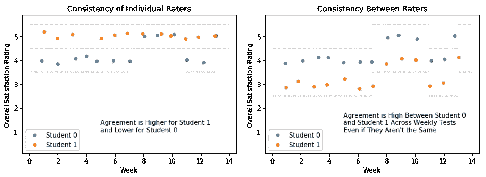**

**不同类型的一致性**

**对于区间数据，使用相关性来估计可靠性是合适的，从广义上讲，它衡量两个变量之间的关系(而不是一致性)。可靠性可以显示一个评级尺度抵抗可能影响人们准确反应能力的**外部因素**的能力，例如**不清楚的指示**或**选择标签**。很难给什么被认为是可靠的划定一个门槛；因此，检查 4 种可靠性类型中的每一种(视情况而定)来寻找和审查不可靠性的证据是合适的:**

*   ****重测信度**考察的是同一受访者在一段时间内所取得结果的一致性。它用于评估评级尺度抵御外部因素(如受访者在调查时的情绪)的能力。它可以表示为在不同时间点进行的调查之间配对结果的**相关性** ( **皮尔森**)，如图表 **A)** 和 **B)** 所示。这也被称为**班内可靠性**，它假设学生每周都会有类似的反应，因为他们对班级的看法不会有实质性的改变。增加测试和重新测试之间的时间(以减少**记忆效应**)会随着时间的推移引入真正变化的前景，使观察可靠性变得更加困难。**

**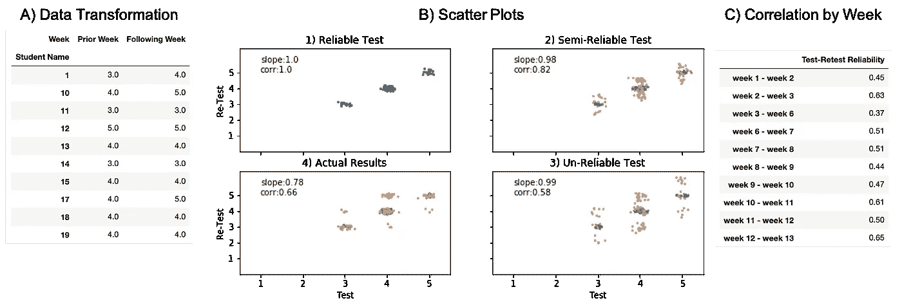**

**重测信度(评分者内部信度)**

**在 **B1)** 中，我们对结果本身进行绘图，以产生完美的相关性。这是为了模拟两个时间点的结果是否相同且高度可靠。在 **B2)** 和 **B3)** 中，数据被认为不太可靠，因为受访者选择了递增的不同评分，例如，第一次回答 4，第二次回答 3 或 5。这可能是由于对指令或选择的不同解释，导致了较低的相关性。我们数据的实际结果显示在 **B4)** 中，相关系数约为 0.65，这并不坏，因为我们确实期望观点会改变。值得注意的是，第 3 周和第 6 周之间的相关性下降(如 **C)** 所示)，可能是由于寒假期间的时间差。**

*   ****内部一致性**顾名思义，寻求旨在测量相同结构的项目结果的一致性。换句话说，调查中相关问题的结果是一致的还是相互矛盾的。首先是每个评级尺度之间的**成对相关性** ( **皮尔森**)，如附件 **A)** 和 **B)** 所示。**

**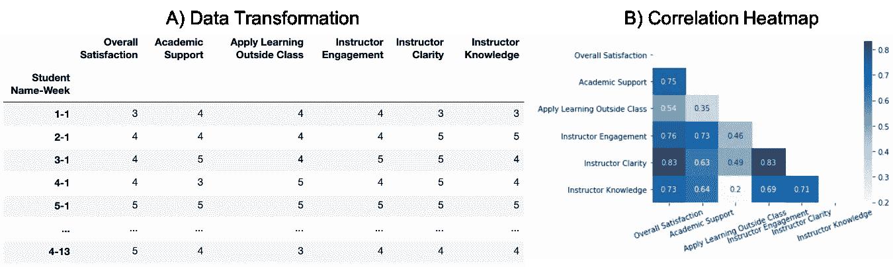**

**内部相容性**

**在 **B)** 中，我们用热图绘制了评级尺度之间的成对相关性。不出所料，所有个人因素都与全球“总体满意度”评级相关。这表明，这些因素中的高评级对应于“总体满意度”中的高评级，反之亦然。此外，与讲师相关的问题的结果(清晰度、知识和参与度)具有很高的相关性。相关性可以通过[克朗巴赫的阿尔法](https://en.wikipedia.org/wiki/Cronbach%27s_alpha)来总结，对我们的数据来说是> 0.8。我们发现“课外应用学习”和“教师知识”之间的相关性较低，以及“课外应用学习”和“学术支持”之间的相关性较低，这是可以接受的，因为它们之间的相关性较小。**

*   ****评分者间可靠性**着眼于不同人的结果的一致性。它用于评估主观性对受访者选择的影响程度。可以使用回答者之间的**成对相关性** ( **Pearson** )进行计算，如附件 **A)** 和 **B)** 所示。虽然单个受访者之间的相关性不太重要，但它们应该作为一个整体反映一些普遍的一致(如克朗巴赫的阿尔法等可靠性系数所总结的)。**

**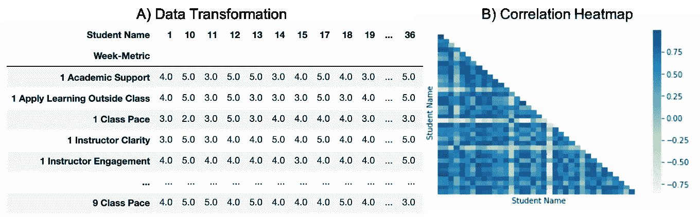**

**评分者间信度**

**在 **B)** 中，我们用热图绘制了学生之间的两两关联。除了少数例外，大多数相关性都是> 0.6。只要大多数学生能够作出类似的回答，那么一小部分与他人相关性较低的受访者是可以接受的。**

**Pearson 相关性的使用仅适用于区间数据，在较小程度上适用于顺序数据，因为它保持了选择之间的顺序关系。对于名义数据，一致性可以用总体一致性百分比或 Fleiss/Cohen 的 Kappa 来衡量。**

*   ****平行(或等效)形式可靠性**要求相同的回答者接受不同版本的调查，这些调查被设计为等效的。或者，这可以通过创建一大组问题并将它们随机分成两组来实现。遗憾的是，我们没有使用可替换的调查问题。**

## **有效期**

****有效性**是指评定量表的结果在多大程度上代表了其预期目的，即**准确性**。当测量具有可靠性时，我们更加**有信心**认为结果代表了它们应该代表的东西；因此，有效性是基于可靠性的**,但是可靠性本身是不够的——等级量表可以非常可靠，但是无效。确定测量有效性的最明显的方法是将其与**基准**进行比较。与基准可比的度量更有可能是有效的，但不幸的是它们并不总是存在。在这里，我们将基准称为 **1)** 一种用于测量感兴趣的构建体的成熟方法，或者 **2)** 一种与感兴趣的构建体相关的群体统计。即使基准不完全匹配，比较也有助于验证评级尺度。有效性有三种类型:****

*   ****表面有效性**着眼于评定等级与被测概念的现有理论和知识的一致性。另一方面，**内容有效性**关注调查在多大程度上覆盖了感兴趣的结构的所有方面。它们都是**定性**评估，最好通过征求**双方** **专家**和**参与者**的反馈来实现。此外，对问题和选择的描述应该清晰、透彻、完整地阐述感兴趣的结构。根据我们的数据，我们咨询了教育领域的专家，以确保调查问题全面且与学生关心的问题密切相关。**
*   ****标准有效性**检验评级量表的结果与旨在衡量类似结构的不同方法的结果有多接近。我们比较的结果是**标准**，它通常来自一个已建立的或广泛使用的方法。这两者之间的高度相关性很好地表明，评级尺度是衡量什么是声称。我们希望在我们的调查中建立等级量表的有效性，因此我们寻找比较的方法。代替真正的“黄金标准”标准，我们可以使用开始时收集的全球“总体满意度”评级来评估其他因素的有效性。合理的假设是，个人因素的评级有所贡献，因此应该与满意度评级相关联。**

**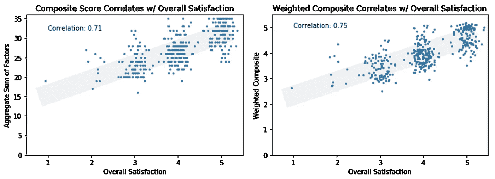**

**并行有效性**

**综合指数(单个因素的总和)和加权综合指数都与总体满意度相关。这被称为**并发有效性**，因为它的总体满意度与其他问题同时进行。**

**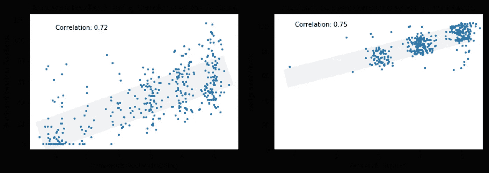**

**预测效度**

**为了寻找更多有效性的证据，我们可以用学生每周作业中的数据来扩充我们的调查结果。我们发现“作业反馈评级”和评分者对学生作业提交的反馈中的字数有很高的相关性。此外，学业支持与作业成绩也有很高的相关性。这被称为**预测有效性**，因为这些变量是在稍后的时间点收集的。**

## **准备信度和效度的方法**

**在调查进行之前，我们不会知道它有多可靠或有效。如果操作不当，即使是精心设计的评级标准也会遇到问题。以下是一些提高可靠性和有效性的技巧:**

*   **彻底设计并采纳他人的意见——从明确定义的目的、目标甚至收集方法开始，需要进行大量规划以确保调查成功。应对促成感兴趣的构建的因素进行映射，以确保包括所有相关方面。**
*   **考虑受访者的偏好/努力—容易回答的问题可确保高参与率。另一方面，难以使用或理解的评级标准会导致回答者变得沮丧和消极，从而降低他们回答的质量。**
*   **避免偏差来源——以下是评定等级中常见的偏差来源:**

**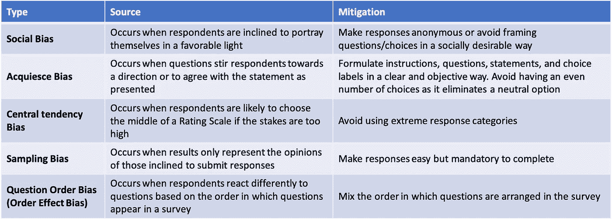**

**偏差的不同来源**

## **摘要**

**在本文中，我们对来自学生/客户满意度调查的评级尺度数据进行了定性评估。我们期望数据的可靠性和有效性，但要做到这两点还需要大量的工作。为了最大限度地利用评分量表，我们应该在可靠性、有效性、辨别能力和受访者偏好之间进行权衡分析。随着计算技术的进步，数据收集方法变得比以往更加灵活、适应性更强、效率更高。我乐观地认为，这类研究中的巨大机会将继续帮助组织满足其成员的需求。**

> **接下来，我们将对相同的数据进行定量分析。如果你喜欢这篇文章，我邀请你跟我来，这样你就可以在第二部分得到通知。**