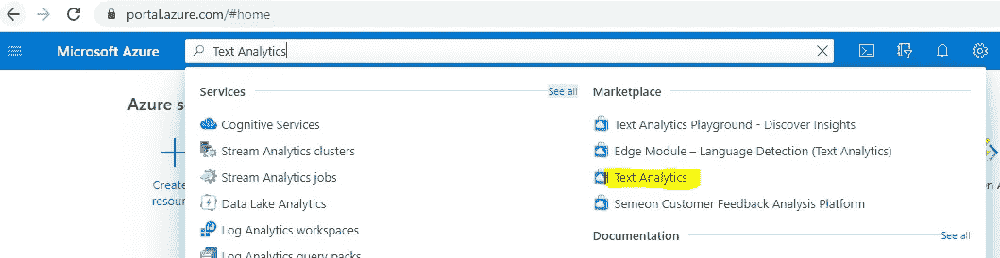
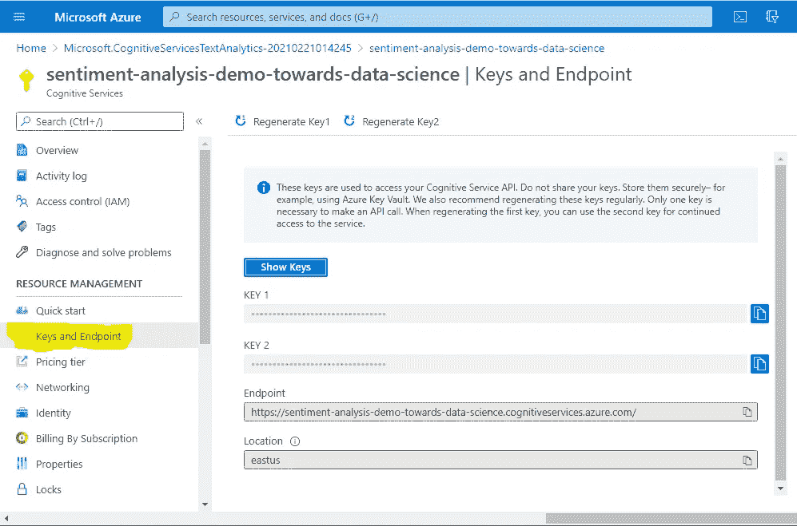
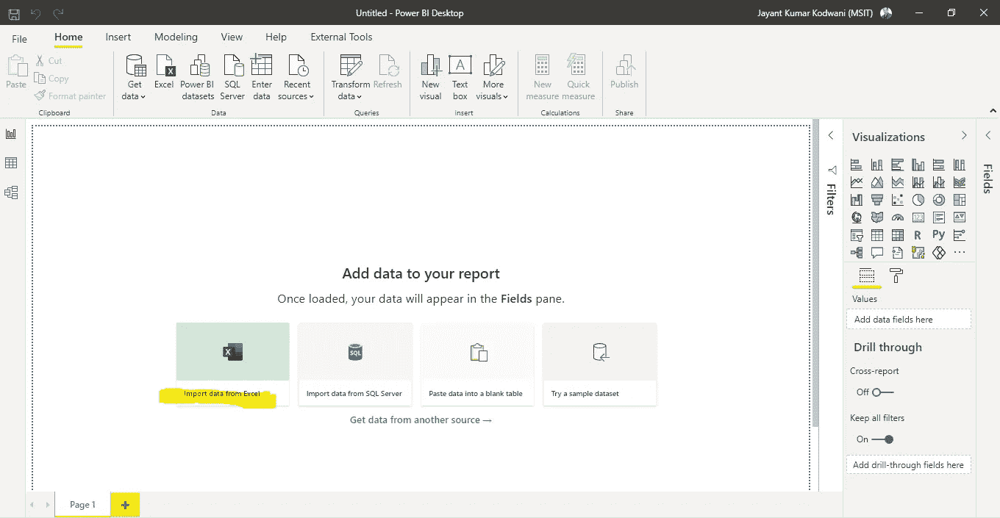
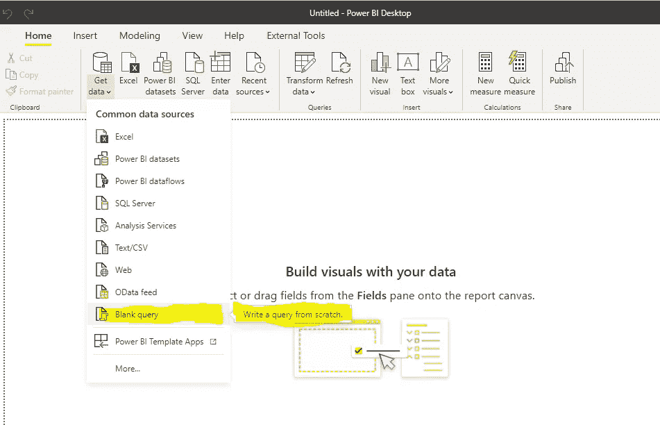
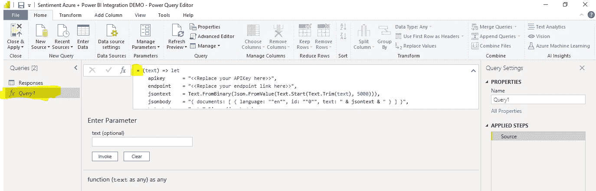
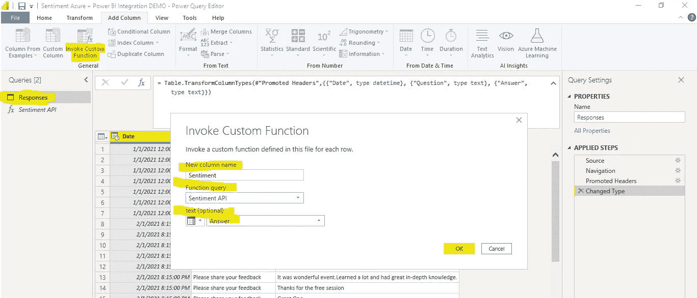
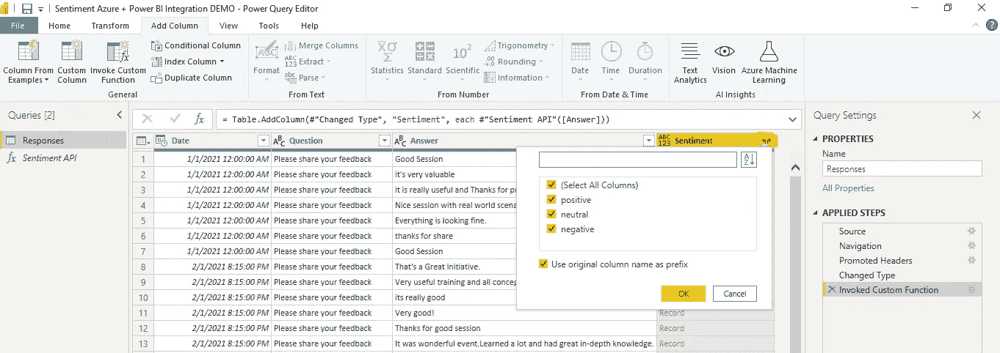
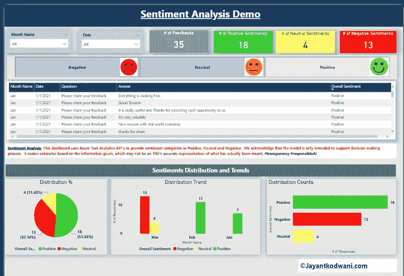
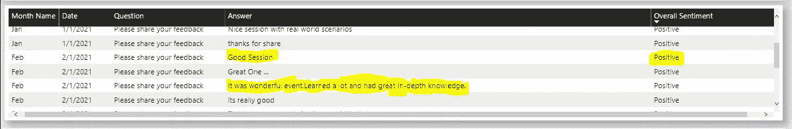
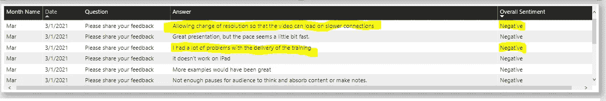

# 分析和可视化来自非结构化数据的情感

> 原文：<https://towardsdatascience.com/analyzing-and-visualizing-sentiments-from-unstructured-raw-data-c263ba96cc2c?source=collection_archive---------37----------------------->

## 使用 Microsoft Azure 文本分析和 Power BI 集成


梅森·琼斯在 [Unsplash](https://unsplash.com?utm_source=medium&utm_medium=referral) 上拍摄的照片

## 情感分析

微软 Azure 认知服务和 Power BI 集成

全球创建、捕获、复制和消费的**数据总量**预计将**快速增长**，在 2021 年达到 **74** 兆字节(来源:Statista)。想象一下，这 74 个 zettabytes 的数据中有多少将是非结构化的和不受控制的，留下一个巨大的空白💣世界各地的数据科学家将如何分析、建模和消费这些庞大的数据。例如，亚马逊等电子商务网站上的产品评论，或者脸书和 Twitter 等社交媒体巨头的言论自由。

非结构化数据面临的主要挑战之一是如何衡量公众意见，进行细致入微的市场研究，监控品牌和产品声誉，以及了解客户体验。通俗地说，如何理解和分类情绪，或者对于数据科学家来说，如何进行情绪分析。**情感分析是确定一篇文章是正面、负面还是中性的过程。**

# 我们将讨论什么？

在本案例中，我们将对一组样本数据进行情感分析，并使用:

1.  Microsoft Azure 文本分析(用于执行情感分析)
2.  Power BI(用于集成和可视化)

以下是我们将使用的示例数据的链接: [**示例数据**](https://github.com/jayantkodwani/AI-Text-Analytics/blob/main/Sentiment%20Analysis%20using%20Azure%20Text%20Analytics%20%26%20Power%20BI/Sample%20Data%20for%20Sentiment%20Analysis.xlsx) 。

# **所需资源**

*   Microsoft Azure 订阅(免费试用或付费)
*   微软商务智能桌面(专业版许可)

## 你准备好了吗？？我们开始吧🏄

# **第一步:Azure 文本分析**

登录 Azure 门户:[https://portal.azure.com/#home](https://portal.azure.com/#home)，搜索“**文本分析**



Azure 门户主屏幕搜索栏

通过选择订阅、创建资源组(只是绑定资源的容器)、位置和[定价层](https://azure.microsoft.com/en-us/pricing/details/cognitive-services/text-analytics/)来创建文本分析服务。一个免费的网络容器每月允许***5000 笔免费交易*** 。点击“**查看+创建”**后，Azure 可能需要几分钟来创建资源。


创建文本分析服务

创建文本分析资源后，导航至**“密钥和端点”**，将密钥和端点详细信息复制到记事本中。

> ⚠️请注意，密钥和端点不应透露给未经授权的人，因为它们可能会影响你的 azure 消费成本。如果您不小心泄露了密钥，请重新生成密钥。

现在，您已经完成了 Azure 门户部分，可以导航到 Power BI。



密钥和端点在 Power BI 集成中发挥着重要作用，确保它们的安全

# 步骤 2:电源 BI 集成

打开 Power BI desktop 的一个新实例>>从 Excel 导入数据>>浏览样本数据文件> >**宾果！** *您在 Power BI 中导入了数据集，离可视化世界又近了一步。*



功率 BI 的新实例

使用步骤 1 中的 APIKey 和 Endpoint 链接，并替换下面 M 查询脚本中的占位符，这基本上有助于执行对 Azure 的 API 调用。这里需要知道的另一个重要参数是**语言:“en”**，它可以调整为包括 20 多种语言(印地语、汉语、德语、法语等等)。

电源 BI 集成的 m 查询代码

现在继续并选择 Get data>>Blank query(这将导航到 Power Query editor)> >粘贴 M 查询代码(包含替换的 API 键和端点链接)



在 Microsoft Power BI 中创建空白查询



在超级查询编辑器中粘贴您的 M 查询

这将是一个🔦将" **Query1"** 重命名为类似于**“情绪 API”**的有意义的东西是个好主意。通过右键单击左侧窗格或直接在右侧窗格的名称字段中进行编辑。

现在，在 power query 编辑器中导航到数据集，在 Add Column section > >下选择**“调用自定义函数”> >** 添加列名=情绪，从下拉列表中选择函数 query，并将文本作为带有反馈的列“答案”> >按 OK。



在超级查询编辑器中配置自定义函数

这将调用 Azure API 并创建一个新列，展开列“情绪”，并将 3 个新创建的列(正、中、负)的数据类型更改为**“整数”**。虽然您可以保持十进制格式，但我建议将它们改为整数，因为这有助于更好地显示它们。现在你可以点击“保存&关闭”,让力量 BI 发挥它的魔力！🎉



积极、中立和消极情绪栏

在您最终进入可视化之前，创建一个新的计算列将是有用的，该列可用于提供切片器以便于过滤。您可以使用下面的 DAX 公式将所有内容整理成一列。

```
**Overall Sentiment = IF(Responses[Sentiment.positive]=1,"Positive",IF(Responses[Sentiment.neutral]=1,"Neutral",IF(Responses[Sentiment.negative]=1,"Negative","NA")))**
```

# 步骤 3: Power BI 可视化

现在你准备好想象了📊信息。我建议使用以下方法:

1.  一个水平切片器，通过***正向、负向和中性*** *来过滤情绪。*
2.  按周、月或年表示情绪趋势的条形图。
3.  一些表情符号代表观众的感觉和情绪。
4.  一个表格，提供所有要关联的原始数据字段和*“导出到 Excel”*。
5.  **明确 AI 模型局限性的免责声明。**

> ****作为一个预测性的人工智能模型，这可能不是 100%准确地表达情感，但它确实有助于提供可操作的见解和更快的决策，从而提供指示性的情感。#责任#透明度。***

最后但同样重要的是，您还可以添加条件格式，以确保颜色模式与情感相匹配。

这里有一个 Power BI 模板示例，您可以将其用作起点。 [**情感分析 Azure + Power BI 集成 DEMO.pbix**](https://github.com/jayantkodwani/AI-Text-Analytics/blob/main/Sentiment%20Analysis%20using%20Azure%20Text%20Analytics%20%26%20Power%20BI/Sentiment%20Analytics%20Azure%20%2B%20Power%20BI%20Integration%20DEMO.pbix)



Microsoft Power BI 中的情感分析可视化演示

# 输出

通过切分过滤器，你可以看到 Azure 文本分析资源在执行情感分析方面是多么有效。例如，类似于**【良好会话】** 和****精彩事件】*** 的反馈被正确分类为正面😃类似的反馈如****【很多问题】*** 被正确归类为负面😞。**

****

**正面情绪的 Azure 文本分析输出**

****

**针对负面情绪的 Azure 文本分析输出**

# **结论**

**我们学到了📘如何使用 Microsoft Azure Text Analytics 进行情感分析，以及如何在 Microsoft Power BI 中集成分析以开发可视化。**

**您可以使用其他数据集并定制代码，看看什么最适合您的用例！**

**发现了一种不同的情感分析方法？请放在评论里！**

# **参考**

**[1][https://www . statista . com/statistics/871513/world wide-data-created/#:~:text = The % 20 total % 20 amount % 20 of % 20 data，ever-growth % 20 global % 20 data % 20 sphere](https://www.statista.com/statistics/871513/worldwide-data-created/#:~:text=The%20total%20amount%20of%20data,ever-growing%20global%20data%20sphere)。**

**[2][https://docs . Microsoft . com/en-us/azure/cognitive-services/text-analytics/tutorials/tutorials-power-bi-key-phrases](https://docs.microsoft.com/en-us/azure/cognitive-services/text-analytics/tutorials/tutorial-power-bi-key-phrases)**

**[3]数据来源:作者手工编制**