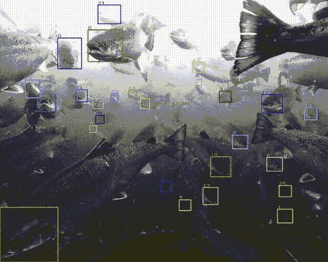
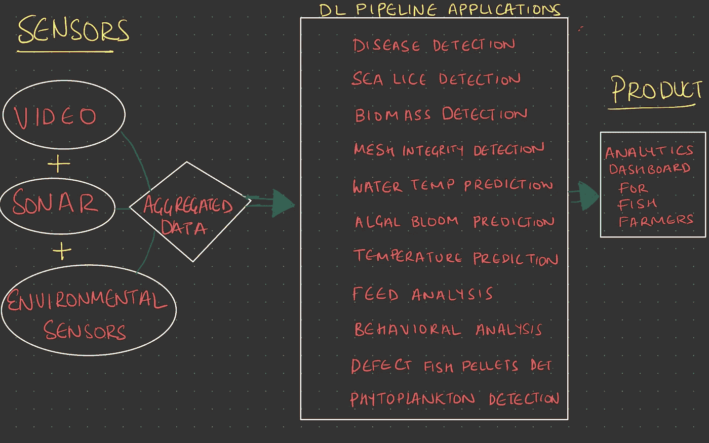
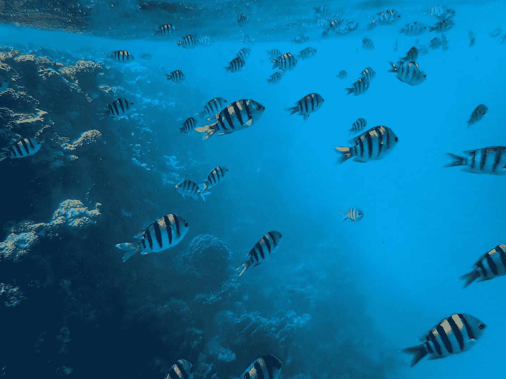
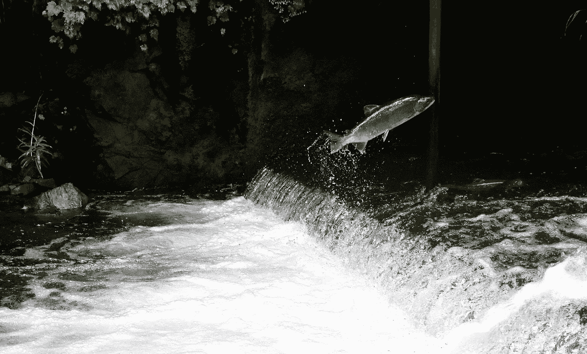
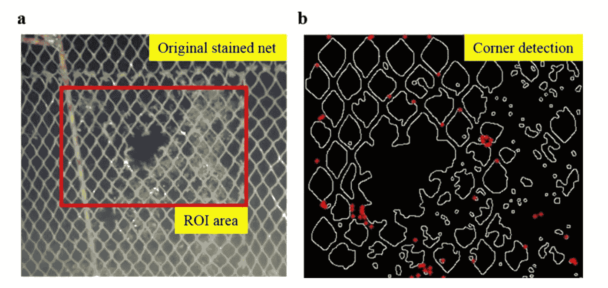
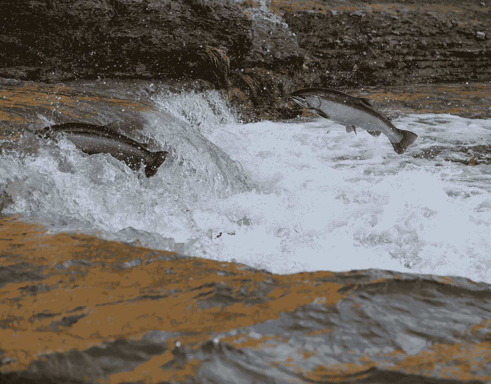

# 深度学习在水产养殖中的应用分析

> 原文：<https://towardsdatascience.com/analyzing-applications-of-deep-learning-in-aquaculture-7a273399553?source=collection_archive---------17----------------------->

## 深度计算机视觉保护海洋，可持续地养活人类

通过追踪水中的物体来解释进食行为— [礼貌潮汐](https://x.company/projects/tidal/)

# 为什么要花时间让水产养殖变得更聪明？🤯

对鱼作为肉类来源的需求平均每年增长 6%，这使得鱼成为肉类行业增长最快的食品。自 21 世纪初以来，这一需求已经翻了一番，如果目前的增长率保持不变，到 2050 年将再翻一番。

养鱼业一直在扩大，通过增加设施内的鱼的数量来满足这种需求。然而，随着鱼群越来越密集，它们的生活质量会下降。

保持高质量的生活需要满足以下需求:

*   低比率的海虱(鲑虱)感染
*   低水平的压力荷尔蒙皮质醇
*   食物的理想水平(以及定时送餐)
*   合适的生物量大小
*   维护良好的网状网将鱼围在里面(将捕食者挡在外面)
*   谨慎的水质平衡
*   低发病率

不幸的是，随着渔场枯竭，生活质量呈指数下降。这是因为这些因素与空间之间的关系(空间越小=越容易传播海虱、疾病等)。)

# 为什么这会使养鱼场受益？💰

*   饲养成本占渔业收入的 60%。不合理的喂养可能是收入的一个重要因素 [de Verdal 等人，2017](https://onlinelibrary.wiley.com/doi/abs/10.1111/raq.12202)
*   手动选择特征是一种费力的启发式方法，其效果高度依赖于运气和经验(Mohanty 等人，2016 年)
*   DL 模型在弱光和高噪声等挑战性条件下表现出很强的稳定性，并且比传统的人工特征提取方法表现更好(Sun 等人，2018)

# 我们如何执行？🤔

大多数养鱼场几乎没有技术支持，预算也很紧张。因此，任何解决方案都必须易于安装且成本低廉。

我们的深度学习解决方案只需要一件设备——一台集成了测量仪器的相机。养鱼场中心的一个井位仪器可以收集和汇总监测上述七个生活质量指标所需的所有数据。当这些指标组合在一起时，还可以产生一个养鱼场的整体健康值，代表一个整体的一览式健康评级。

使用上述聚合数据和计算机视觉，我们可以开发以下深度学习应用:

*   海虱检测
*   鱼类的行为分析
*   动态鱼食欲估计和递送
*   生物量测量
*   网格完整性监控
*   水质监测和控制
*   疾病识别和预防

深度学习流水线架构

# 为什么这种方法在✅行得通

在进入应用程序之前，让我们简要分析一下目前为止的所有情况:

1.  我们可以在**七个不同的应用**中利用单个设备的汇总数据——每个应用都致力于鱼类生活质量的一个关键因素
2.  每个应用程序都使用类似的深度学习技术，但**会产生一个独特的报告值**，养鱼者可以据此采取行动
3.  **七个输出可以组合在一个最终的深度学习应用**中，该应用代表农场的整体健康状况

现在想象一下，这七个指标、相关测量值和整体健康评估通过一个漂亮的仪表板实时显示出来！📈

# 应用程序

# 1.海虱检测🐟

弗朗切斯科·温加罗在 [Unsplash](https://unsplash.com/s/photos/fish?utm_source=unsplash&utm_medium=referral&utm_content=creditCopyText) 上的照片

## 它解决的问题

全世界的渔场都遭受海虱的侵扰。这些寄生虫附着在鱼类宿主身上，以它们的皮肤/血液为食。渔场越密集，海虱就越容易传播。

## 它是如何解决问题的

苛刻的化学处理已经成为去除海虱最常见的方法。虽然化学处理能有效去除海虱，但对鱼有不良影响。它还可以防止鲑鱼在排毒的几周内被出售。

一种深度学习解决方案利用卷积神经网络(CNN)和计算机视觉在海虱传播到其他鱼类之前检测/识别它们，使农民能够采取行动，例如(**什么，移动鱼群或暂时降低密度？**)在海虱的临界种群水平引发一场彻底的化学冲刷之前。

## 摘要

海虱会对商业渔场造成灾难性的破坏。如果不加以控制，鱼会因寄生虫引起的病变而无法出售，在某些极端情况下，虱子也会导致鱼死亡。使用深度学习系统进行早期预防可以防止有害化学物质，并控制虱子数量。

# 2.鱼类的行为分析🦈

照片由[德鲁·法威尔](https://unsplash.com/@outdoor_junkiez?utm_source=unsplash&utm_medium=referral&utm_content=creditCopyText)在 [Unsplash](https://unsplash.com/s/photos/salmon?utm_source=unsplash&utm_medium=referral&utm_content=creditCopyText) 上拍摄

## 它解决的问题

微小的环境变化会迅速增加鱼类的压力水平，从而增加它们体内压力荷尔蒙皮质醇的数量。皮质醇会改变鱼的味道，并对消费者产生负面影响。

## 它是如何解决问题的

IdTracker.ai 模型利用两种不同的 CNN 来提供跟踪小型和大型群体中所有个体鱼类行为的能力——允许农民检测与皮质醇增加相关的行为异常。然而，挑战仍然是巨大的，因为跟踪单个鱼的行为涉及非刚性变形，低图像质量和频繁的遮挡。

赵等人(2018a)展示了另一种解决方案，该方案利用**改进的运动影响图**和**递归神经网络(RNNs)** 系统地检测、定位和识别鱼群中的异常行为。

## 摘要

鱼类对其环境中最小的变化，如溶解氧、藻类、浮游植物等，反应迅速。如果鱼类受到压力，它们会产生皮质醇，影响鱼肉质量。分析行为和鱼类游泳模式有助于农民做出更明智的决定。

相关引用: [Saberioon 等人，2017](https://www.researchgate.net/publication/288516072_Application_of_Machine_Vision_Systems_in_Aquaculture_with_Emphasis_on_Fish_State-of-the-Art_and_Key_Issues) ， [Papadakis 等人，2012](https://www.researchgate.net/publication/235007076_A_computer-vision_system_and_methodology_for_the_analysis_of_fish_behavior) ， [Romero-Ferrero 等人，2019](https://pubmed.ncbi.nlm.nih.gov/30643215/) ，[赵等人，2018a](https://www.researchgate.net/publication/310661111_Robust_tracking_of_fish_schools_using_CNN_for_head_identification)

# 3.鱼类食欲检测🐡

## 它解决的问题

没有任何指标比养鱼更能反映生产效率和养殖成本。喂养占一般养鱼场运营预算的 60%。

喂食不足会大幅降低鱼类繁殖/生物量增长率，而过度喂食会造成成本浪费和周围水环境污染。

## 它是如何解决问题的

确定最佳的喂食时间和喂食量是一项挑战。传统上，农民使用简单的计时器和直观的经验来做出决定——这没有考虑重要的环境和营养因素。

包含视觉信息、水测量和关于鱼对过去喂食的反应的历史数据的汇总数据可以与 3D-CNN 和 RNN 模型相结合，以适应时间/空间数据流，从而大大提高喂食效率。Maloy 等人利用这种双重网络方法来选择最佳喂食时间，以说明喂食和非喂食行为。

## 摘要

很多水产养殖场的投饵时间都是随机的。一些农民凭直觉使用饲料。当这种情况发生时，鱼可能会吃得过多或过少。过度使用饲料会导致成本浪费和环境污染，并且喂养不足会降低生长速度。通过检测食欲，农民可以控制何时喂鱼。

相关引用:[mloy 等(2019)](https://www.sciencedirect.com/science/article/pii/S0168169919313262) ，[陈等，2017](https://www.ncbi.nlm.nih.gov/pmc/articles/PMC5856631/)

# 4.生物量估计🐠

## 它解决的问题

估算生物量是可持续管理养鱼场的基础，因为它能让农民了解当前鱼的数量、大小和重量。这些至关重要的数据点也推动了与喂养和行为管理相关的决策。

在没有人类干预的情况下，测量生物量可能具有挑战性，因为鱼类在光照和能见度条件无法控制的环境中自由移动。根据鱼的深度，需要考虑不同程度的遮挡和光线变化。

## 它是如何解决问题的

两种可能的解决方案可以结合起来精确估计生物量:

1.  训练深度学习算法，理解声纳和光学图像之间的映射
2.  分割单个鱼的图像，随着时间的推移跟踪它们，并使用帧内对象的深度通过鱼的变化连续估计体积和重量。

## 摘要

估计生物量有助于农民对鱼的大小、质量和重量做出更好的决定。目前，这一过程是手动完成的，并且是劳动/成本密集型的。自动化这一过程将节省农民的时间和金钱。

相关引用:[寺山等人，2019](https://www.researchgate.net/publication/334450150_Integration_of_sonar_and_optical_camera_images_using_deep_neural_network_for_fish_monitoring) ，[摩恩等人，2018](https://journals.plos.org/plosone/article?id=10.1371/journal.pone.0204713) ，[张等人，2020](https://www.researchgate.net/publication/343500391_R_34_Zhang_et_al_2020_Rev_Fish_Biol_Fisheries_online-101007_s11160-020-09614-y)

# 5.网格完整性检测🐙

网格检测—由 Petrov 等人提供。

## 它解决的问题

特别设计的网状网将养殖的鱼围在一个封闭的区域内，确保它们的安全/健康。逃离农场的养殖鱼对农场和附近的生态系统将是灾难性的。

## 它是如何解决问题的

目前，潜水员执行“网完整性检查”,他们戴着水肺在农场周围检查网的节点是否有磨损的迹象。雇用专业潜水员或拥有潜水设备可能是一个艰巨/昂贵的过程。

被训练来识别网中的节点的深度学习神经网络可以容易地创建用于网状网的放置和监控的规则。

## 摘要

目前的峡湾和其他水产养殖网可以打破。如果发生这种情况，成千上万的鱼将逃到附近的环境中，破坏生态系统。潜水员目前例行检查网状网，但自动检测网破将节省农场很多钱，并拯救海洋免受进一步的伤害。

相关引文:[奥迪等人](https://www.researchgate.net/publication/247160483_AquaMesh_-_Design_and_Implementation_of_Smart_Wireless_Mesh_Sensor_Networks_for_Aquaculture)，[云鹏等人](https://link.springer.com/article/10.1007/s41095-020-0174-8)

# 6.预测水质🐋

## 它解决的问题

高水平的溶解氧(DO)和其他自然元素会降低压力和疾病水平，并提高繁殖水平。质量监测需要长期精确测量与水中元素相关的参数。

## 它是如何解决问题的

深度学习在短期和长期水质监测方面都取得了很大的成果，使用配备注意力的长短期记忆网络(LSTMs)和 RNNs 来捕获/预测与水元素相关的时间序列信息。

## 摘要

正如上面提到的那一段，鱼对最小的水质变化如溶解氧都会有反应。整个养殖场保持稳定的水质对于鱼类的长期健康至关重要。

【拉赫曼等人，2019 ，[胡等人，2019](https://arxiv.org/pdf/1809.00794.pdf) ，[刘等人](https://arxiv.org/pdf/1601.01530.pdf)

# 7.缺陷鱼丸检测🐳

[布兰登](https://unsplash.com/@greener_30?utm_source=unsplash&utm_medium=referral&utm_content=creditCopyText)在 [Unsplash](https://unsplash.com/s/photos/salmon?utm_source=unsplash&utm_medium=referral&utm_content=creditCopyText) 上的照片

它解决的问题

事实证明，食品缺陷的检测、识别和定位在食品生产中极具挑战性。对于鱼片来说，血斑有损品质，降低市场价值。人工分类方法已经不能满足现代工业的需要。现代工业需要一种稳健、快速、有效、自动化、非侵入性和低成本的方法来分类正常和有缺陷的鱼片。

它是如何解决问题的

米西米等人使用预先训练的 CNN 和 SVM 模型对血斑进行精确分割和定位，并对有缺陷的鳕鱼片进行分类。本研究提出了一种新的数据扩充方法，该方法降低了 CNN 对形状的敏感性，并且只关注颜色特征来区分正常和有缺陷的鱼片。3D 信息用于定位血斑并计算相关的抓取向量，作为机器人处理的输入。

摘要

鱼丸中的缺陷可能对它们的健康有害，并降低它们的市场价值。自动检测有缺陷的鱼颗粒的过程对鱼来说是健康的。

# 其他研究领域

*   自动疾病识别和检测
*   浮游植物和藻类水华检测
*   温度预测
*   用于公海自主探测的水下机器人
*   叶绿素 A 含量预测
*   海洋生态系统中的障碍和闭塞避免

# 月球快照摘要🌒

> 海洋是人类的宝贵资源。它覆盖了 70%的土地，为地球上大部分地区提供食物、氧气和生计。水产养殖只是改善海洋健康的一个方面。如果我们作为研究人员仅仅用一台照相机就可以做这么多来改善海洋，想象一下当我们把我们的大脑和研究用于海洋面临的其他问题时，我们可以取得什么样的成就？
> 
> “人们可以下定决心实现看似不可能的神奇想法，并通过科学和技术将其变为现实，然后激发其他人去做其他看似不可能的事情。”—天文泰勒
> 
> [moon shot 在想什么？](https://www.youtube.com/watch?v=pEr4j8kgwOk)