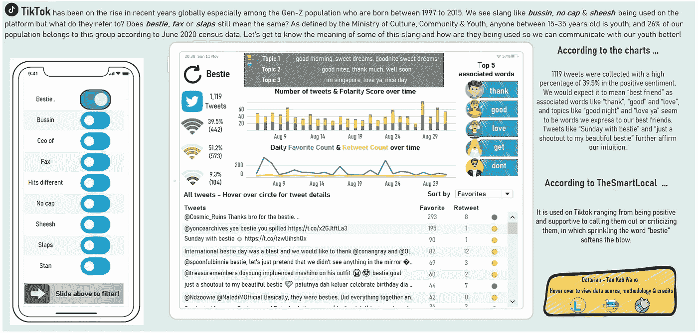
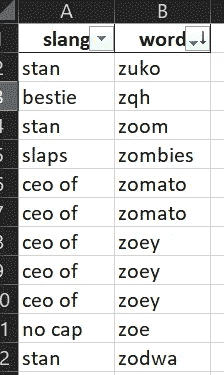
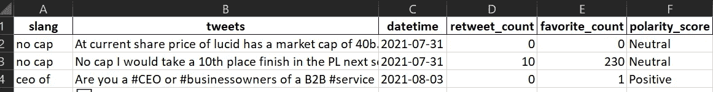
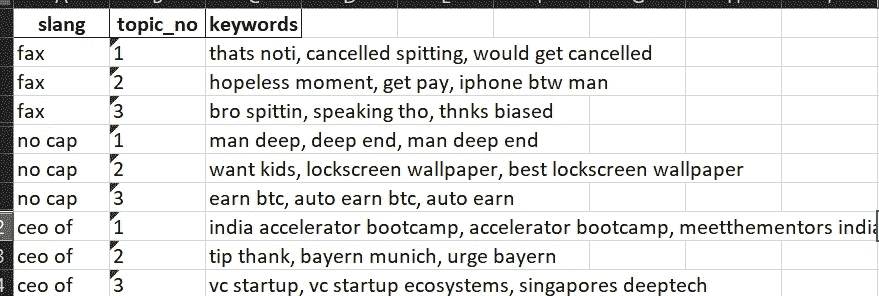
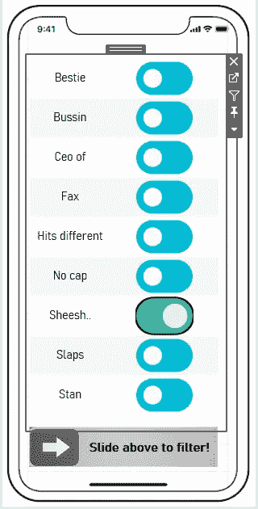
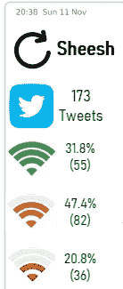
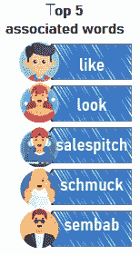
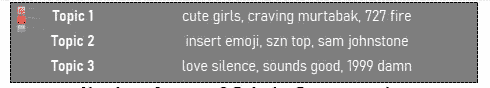

# 使用 Twitter 分析抖音常用俚语

> 原文：<https://towardsdatascience.com/analyzing-commonly-used-slang-words-on-tiktok-using-twitter-3b9043e32f93?source=collection_archive---------6----------------------->

## 我们如何在 Python & Tableau 上使用情感分析和主题建模来发现俚语的含义和用法



图片由作者提供— Tableau 仪表板

近年来，抖音在全球范围内一直呈上升趋势，特别是在 1997 年至 2015 年出生的 Z 世代人口中。像 ***LOL*** (笑出声来) ***ROFL*** (笑得在地上打滚) ***FOMO*** (害怕错过)这些俚语是我们大多数人都知道的，但是抖音的崛起带来了另一套俚语吗？事实上，根据 [TheSmartLocal](https://thesmartlocal.com/read/tiktok-slangs/) (新加坡领先的旅游和生活方式门户网站)，有 9 个抖音俚语被认为是 Z 世代孩子常用的。平台上正在使用的 ***bussin*** ，***no cap***&***sheesh***等词汇是指什么？像 ***bestie*** ， ***fax*** *，*或者 ***slaps*** 这样的常见英文单词，意思还一样吗？

这篇文章解释了 9 个俚语的意思，以及如何在对话中使用它们。在本文中，我们将从数据科学的角度来分析这些俚语，我们将使用 Python 来进行一些自然语言处理(NLP)技术，如情感分析和主题建模。这将使我们更好地了解通常与俚语一起使用的一些关联单词，信息的情感，以及与这些单词一起讨论的话题。

## 资料组

我们将利用另一个社交媒体平台 Twitter，在一个月内，包含 9 个俚语中任何一个的推文将被捕获，这将形成我们的整个数据集。Python `twitter`上的 Twitter 公共 API 库允许我们在获得消费者密钥和访问令牌的身份验证后收集过去 7 天的 tweets。一旦我们初始化了与 Twitter 的连接，我们就设置了纬度、经度的最大区域范围，并将搜索查询设置为俚语词。由于我对提取新加坡用户的推文感兴趣，所以我将地理位置设置为新加坡。最喜爱的计数和转发计数也是从 Twitter 上收集的。

```
# import libraries
from twitter import *
import pandas as pd
from datetime import datetime# store the slang words in a list
slangs = ['fax', 'no cap', 'ceo of', 'stan', 'bussin', 'slaps', 'hits different', 'sheesh', 'bestie']# twitter authentication
consumer_key = '...'
consumer_secret = '...'
access_token = '...'
access_token_secret = '...'
twitter = Twitter(auth = OAuth(access_token, access_token_secret, consumer_key, consumer_secret))# set latitude & longitude to Singapore, maximum radius 20km
latitude = 1.3521    
longitude = 103.8198    
max_range = 20# loop through each of the slang
for each in slangs:
    # extract tweets with query containing the planning area; note max count for standard API is 100
    query = twitter.search.tweets(q = each, geocode = "%f,%f,%dkm" % (latitude, longitude, max_range),\
                                  lang = 'en', count = 100)
    # once done, loop through each tweet
    for i in range (0, len(query['statuses'])):
        # store the planning area, tweet, created time, retweet count & favorite count as a list variable
        temp_list = [each, query['statuses'][i]['text'],\
                     datetime.strptime(query['statuses'][i]['created_at'], '%a %b %d %H:%M:%S %z %Y').strftime('%Y-%m-%d'),\
                    query['statuses'][i]['retweet_count'], query['statuses'][i]['favorite_count']]
        # append list to tweets dataframe
        tweets.loc[len(tweets)] = temp_list
```

## 数据清理/令牌化

由于收集的推文是原始形式，包含用户名、表情符号和标点符号等单词，因此有必要进行数据清理以删除它们。我们将首先把所有的大小写转换成小写，过滤掉单个单词的回答，删除标点符号/网址/链接。

```
# function to clean column, tokenize & consolidate into corpus list
def column_cleaner(column, slang_word):
    # convert all to lower case and store in a list variable
    corpus = column.str.lower().tolist()
    # filter off single word responses, 'nil', 'nan'
    corpus = [x for x in corpus if len(x.split(' ')) > 1]
    corpus = [x for x in corpus if x != 'nan']
    corpus = [x for x in corpus if x != 'nil']
    # remove punctuations, links, urls
    for i in range (len(corpus)):
        x = corpus[i].replace('\n',' ') #cleaning newline “\n” from the tweets
        corpus[i] = html.unescape(x)
        corpus[i] = re.sub(r'(@[A-Za-z0–9_]+)|[^\w\s]|#|http\S+', '', corpus[i])
```

然后我们扩展上面的函数`column_cleaner`,将 tweets(来自`RegexpTokenizer`函数)标记为单个单词，移除停用词(来自`nltk`包)/数字，并使用词性(来自`WordNetLemmatizer`函数)执行词条化。

```
# empty list to store cleaned corpus
    cleaned_corpus = []
    # extend this slang into stopwords
    stopwords = nltk.corpus.stopwords.words("english")
    stopwords.extend([slang_word])
    # tokenise each tweet, remove stopwords & digits & punctuations and filter to len > 2, lemmatize using Part-of-speech
    for i in range (0, len(corpus)):
        words = [w for w in tokenizer.tokenize(corpus[i]) if w.lower() not in stopwords]
        cleaned_words = [x for x in words if len(x) > 2]
        lemmatized_words = [wordnet_lemmatizer.lemmatize(x, pos = 'v') for x in cleaned_words]
        cleaned_corpus.extend(lemmatized_words)
    return cleaned_corpus
```

整个功能将在我们收集的 tweets 数据集上运行，每条 tweets 将被标记化，然后我们将能够在我们的可视化软件(即 Tableau)上绘制出与俚语相关的前 n 个单词。

```
# loop through each slang word
for each in slangs:
    # filter dataframe to responses with regards to this slang word
    temp_pd = tweets.loc[tweets.slang == each, :]
    # save result in temp pandas dataframe for easy output
    temp_result = pd.DataFrame(columns = ['slang', 'word'])
    # run column_cleaner function on the tweets
    temp_result['word'] = column_cleaner(temp_pd['tweets'], each)
    # add slang to slang column
    temp_result['slang'] = each
    # append temp_result to result
    result = result.append(temp_result, ignore_index = True)
```



图片由作者提供—运行 column_cleaner 函数后的 excel 输出

## 情感分析/极性得分

我们可以利用 Python 包`textblob`进行简单的情感分析，其中如果*极性得分> 0* ，我们会将每条推文标记为*正*，如果*极性得分< 0* ，则标记为*负*，否则标记为*中性*。请注意，在我们进行情感分析之前，不需要运行上述函数`column_cleaner`，因为`textblob`包可以直接从原始推文中提取极性得分。

```
from textblob import TextBlob# empty list to store polarity score
polarity_score = []
# loop through all tweets
for i in range (0, len(tweets)):
    # run TextBlob on this tweet
    temp_blob = TextBlob(tweets.tweets[i])
    # obtain polarity score of this tweet and store in polarity_score list
    # if polarity score > 0, positive. else if < 0, negative. else if 0, neutral.
    if temp_blob.sentiment.polarity > 0:
        polarity_score.append('Positive')
    elif temp_blob.sentiment.polarity < 0:
        polarity_score.append('Negative')
    else:
        polarity_score.append('Neutral')

# create polarity_score column in tweets dataframe
tweets['polarity_score'] = polarity_score
```



作者提供的图片—进行情感分析后的 excel 输出

## 主题建模

接下来，我们编写一个函数，可以对我们的推文进行主题建模。主题建模是一种统计建模，用于发现文档集合中出现的抽象“主题”。我们将使用常见的潜在狄利克雷分配(LDA)算法，该算法用于将文档中的文本分类到特定主题，我们可以在`sklearn`库包中找到它。在我们的函数中，我们还将使用单个标记生成二元模型和三元模型，以及每个俚语词的前 3 个主题。

```
from sklearn.decomposition import LatentDirichletAllocation
from sklearn.feature_extraction.text import TfidfVectorizer
from sklearn.pipeline import make_pipeline# function to conduct topic modelling
def topic_modeller(column, no_topic, slang_word):
    # extend this slang into stopwords
    stopwords = nltk.corpus.stopwords.words("english")
    stopwords.extend([slang_word])
    # set up vectorizer that remove stopwords, generate bigrams/trigrams
    tfidf_vectorizer = TfidfVectorizer(stop_words = stopwords, ngram_range = (2, 3))
    # set the number of topics in lda model
    lda = LatentDirichletAllocation(n_components = no_topic)
    # create a pipeline that vectorise and then perform LDA
    pipe = make_pipeline(tfidf_vectorizer, lda)
    # run the pipe on the cleaned column
    pipe.fit(topic_column_cleaner(column, slang_word))
    # inner function to return the topics and associated words
    def print_top_words(model, feature_names, n_top_words):
        result = []
        for topic_idx, topic in enumerate(model.components_):
            message = [feature_names[i] for i in topic.argsort()[:-n_top_words - 1:-1]]
            result.append(message)
        return result
    return print_top_words(lda, tfidf_vectorizer.get_feature_names(), n_top_words = 3)
```



图片由作者提供—进行主题建模后的 excel 输出

## 数据可视化/分析

一旦我们准备好数据集，我们就可以将我们的发现绘制到数据可视化软件上，即 Tableau。由于本文更多地关注收集数据和生成我们的见解所需的步骤，我将不讨论我是如何设法将我的发现绘制到 Tableau 上的。可以参考我的 Tableau 公众号上的 [Tableau 仪表盘](https://public.tableau.com/app/profile/kieran.tan/viz/TiktokSlangAnalysis/Dashboard1)。

让我们以俚语单词 ***sheesh*** 为例，我们可以将 Tableau 仪表板过滤到该俚语，整个仪表板将被刷新。使用 iPhone 线框作为用户过滤器的想法是不是很酷？



图片由作者提供—文字过滤器的表格截图

2021 年 8 月期间，在新加坡共收集了 173 条推文，我们的极性得分显示，31.8%的推文是正面的，47.4%是中性的，20.8%是负面的。这似乎表明俚语 ***sheesh*** 更多地带有中性到积极的意思。



图片由作者提供—情绪分析的 Tableau 截图

在我们的 Python 代码中，我们对 tweet 进行了标记，这样我们就可以根据单词在所有包含俚语单词的 tweet 中的出现频率对它们进行排序。我们的视觉化显示，像 *like、schmuck、*和 *sembab* (在印尼语中是肿胀的意思)这样的词似乎暗示 ***sheesh*** 被用来进一步加剧某事的影响。



作者提供的图片—前 5 个关联单词的表格截图

查看 3 个建模的主题，我们的假设是*被用来加剧某事的影响，这在*渴望 murtabak、*和*可爱女孩等主题中得到了进一步的暗示。**

**

*图片由作者提供—主题建模的 Tableau 截图*

*事实上，根据 TheSmartLocal 的文章，单词 ***sheesh*** 与 ***damn*** 的用法相似，都是表示不相信或恼怒。如果我们看我们的一些推文，****Sheesh****渴求 murtabak****Sheesh****【他是一个幸运的人】*做暗示的意思。**

## **结尾注释**

**我希望这篇文章是有趣的，并给你们一些关于自然语言处理技术如情感分析和主题建模如何帮助我们更好地理解我们的一系列文档(即我们的推文)的想法。玩 Tableau 仪表板玩得开心，整理仪表板真的很有趣， ***没有大写 sheesh*** ！**

**[](https://www.buymeacoffee.com/tankahwang)**