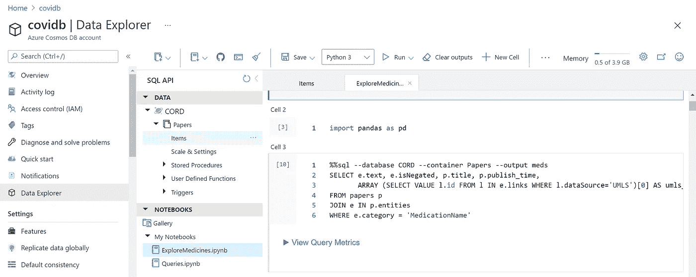

# 使用 Azure 机器学习和健康文本分析分析 COVID 医学论文

> 原文：<https://towardsdatascience.com/analyzing-covid-medical-papers-with-azure-machine-learning-and-text-analytics-for-health-c87ab621a3d0?source=collection_archive---------21----------------------->

## [思想和理论](https://towardsdatascience.com/tagged/thoughts-and-theory)

## 如何最大限度地利用人工智能，以便从海量文本语料库中提取见解


作者图片

自从 COVID 疫情开始以来，已经有超过 70 万篇关于这个主题的科学论文发表了。人类研究人员不可能熟悉如此庞大的文本语料库，因此非常需要人工智能的帮助。在这篇文章中，我们将展示如何从科学论文中提取一些知识，获得洞察力，并构建一个工具来帮助研究人员以有意义的方式浏览论文集。在这个过程中，我们还会遇到一些对数据科学家有用的云工具。

如果您想继续下去，自己做这个实验，您可以在这里找到所有源代码和分步说明:

[](http://github.com/CloudAdvocacy/AzurePaperExplorationWorkshop) [## GitHub-cloud advocate/azurepaexplorationworkshop

### 在本次研讨会中，我们将探索不同的 Microsoft Azure 特性，同时研究一个重要的示例:提取…

github.com](http://github.com/CloudAdvocacy/AzurePaperExplorationWorkshop) 

如果要引用这段文字，请使用[arXiv:2110.15453](https://arxiv.org/abs/2110.15453)**【cs。CL]** 。

# 自动纸张分析

自动科学论文分析是快速发展的研究领域，并且由于 NLP 技术的最近改进，在最近几年中已经有了很大的改进。在本帖中，我们将向您展示如何从 COVID 论文中获得具体的见解，例如医学治疗随时间的变化，或使用几种药物的联合治疗策略。

我将在这篇文章中描述的主要方法是从文本中提取尽可能多的半结构化信息，然后将其存储到某个 NoSQL 数据库中以供进一步处理。将信息存储在数据库中将允许我们进行一些非常具体的查询来回答一些问题，以及为医学专家提供可视化探索工具以进行结构化搜索和洞察生成。提议系统的整体架构如下所示:


作者图片

我们将使用不同的 Azure 技术来深入了解纸质语料库，如 [**健康文本分析**](https://docs.microsoft.com/azure/cognitive-services/text-analytics/how-tos/text-analytics-for-health/?WT.mc_id=aiml-20447-dmitryso) 、 [**CosmosDB**](https://azure.microsoft.com/services/cosmos-db/?WT.mc_id=aiml-20447-dmitryso) 和 [**PowerBI**](https://powerbi.microsoft.com/?WT.mc_id=aiml-20447-dmitryso) 。现在，让我们关注该图的各个部分，并详细讨论它们。

> 如果你想自己尝试文本分析，你需要一个 Azure 账户。如果你没有免费试用版[](https://azure.microsoft.com/free/?OCID=AID3029145&WT.mc_id=aiml-20447-dmitryso)**，你可以随时获得。而且你可能还想为开发者查阅 [**其他 AI 技术**](https://azure.microsoft.com/overview/ai-platform/dev-resources/?OCID=AID3029145&WT.mc_id=aiml-20447-dmitryso) 。**

# **COVID 科学论文和 CORD 数据集**

**将自然语言处理方法应用于科学文献的想法似乎很自然。首先，科学文本已经是结构良好的了，它们包含关键词、摘要以及定义明确的术语。因此，在 COVID 疫情的最开始，一个 [**研究挑战已经在 Kaggle**](https://www.kaggle.com/allen-institute-for-ai/CORD-19-research-challenge) 上启动，以分析关于该主题的科学论文。这场比赛背后的数据集被称为[**CORD**](https://www.semanticscholar.org/cord19)([**publication**](https://arxiv.org/pdf/2004.10706.pdf))，它包含了与 COVID 相关的主题中发布的所有内容的不断更新的语料库。**

**该数据集由以下部分组成:**

*   ****元数据文件** [**Metadata.csv**](https://www.kaggle.com/allen-institute-for-ai/CORD-19-research-challenge?select=metadata.csv) 在一个地方包含所有出版物的最重要信息。该表中的每篇论文都有唯一的标识符`cord_uid`(事实上，一旦你真正开始使用数据集，它并不完全是唯一的)。这些信息包括:出版物名称、期刊、作者、摘要、出版日期、doi**
*   ****全文论文**在`document_parses`目录下，用 JSON 格式的结构化文本表示，这大大简化了分析。**
*   **预构建的**文档嵌入**，它将`cord_uid`映射到反映论文整体语义的浮点向量。**

**在本帖中，我们将关注论文摘要，因为它们包含了论文中最重要的信息。然而，对于数据集的完整分析，在全文上使用相同的方法肯定是有意义的。**

# **AI 能用文字做什么？**

**近年来，自然语言处理领域取得了巨大的进步，已经训练出了非常强大的神经网络语言模型。在 NLP 领域，通常会考虑以下任务:**

*   ****文本分类/意图识别—** 在这个任务中，我们需要将一段文本分成若干类别。这是一个典型的分类任务。**
*   ****情感分析—** 我们需要返回一个数字，显示文本的积极或消极程度。这是一个典型的回归任务。**
*   ****命名实体识别**(NER)——在 NER，我们需要从文本中提取命名实体，并确定它们的类型。例如，我们可能在寻找药品名称或诊断。另一个类似于 NER 的任务是**关键词提取**。**
*   ****文本摘要—** 这里我们希望能够产生原始文本的简短版本，或者选择最重要的文本片段。**
*   ****问答—** 在这个任务中，我们被给予一段文字和一个问题，我们的目标是从文字中找到这个问题的确切答案。**
*   ****开放领域问答**(ODQA)——与之前任务的主要区别在于，我们得到了一个大的文本语料库，我们需要在整个语料库的某个地方找到我们问题的答案。**

> **在我之前的一篇文章 中，我描述了我们如何使用 ODQA 方法自动找到特定 COVID 问题的答案。然而，这种方法不适合严肃的研究。**

**要从文本中获得一些见解，NER 似乎是最突出的技巧。如果我们能够理解文本中存在的特定实体，我们就可以在文本中执行语义丰富的搜索，回答特定的问题，并获得不同实体共现的数据，找出我们感兴趣的特定场景。**

**为了训练 NER 模型以及任何其他神经语言模型，我们需要一个适当标记的相当大的数据集。找到这些数据集通常不是一件容易的事情，为新的问题领域生成数据集通常需要最初的人工努力来标记数据。**

# **预先训练的语言模型**

**幸运的是，现代的 [**变压器语言模型**](https://en.wikipedia.org/wiki/Transformer_(machine_learning_model)) 可以使用迁移学习以半监督的方式进行训练。首先，基础语言模型(例如， [**BERT**](/bert-explained-state-of-the-art-language-model-for-nlp-f8b21a9b6270) )首先在大型文本语料库上训练，然后可以在较小的数据集上专门用于特定的任务，例如分类或 NER。**

**该迁移学习过程还可以包含额外的步骤——在特定领域数据集上进一步训练通用预训练模型。例如，在医学科学领域，微软研究院使用 PubMed 知识库中的文本，预先训练了一个名为[**PubMed Bert**](https://huggingface.co/microsoft/BiomedNLP-PubMedBERT-base-uncased-abstract)([**publication**](https://arxiv.org/abs/2007.15779))的模型。如果我们有一些专门的数据集可用，那么这个模型可以进一步用于不同的特定任务。**

# **文本分析认知服务**

**然而，除了数据集之外，训练模型还需要大量的技能和计算能力。微软(以及其他一些大型云供应商)也通过 REST API 提供一些预先训练好的模型。这些服务被称为 [**认知服务**](https://azure.microsoft.com/services/cognitive-services/?WT.mc_id=aiml-20447-dmitryso) ，其中一个处理文本的服务被称为 [**文本分析**](https://azure.microsoft.com/services/cognitive-services/text-analytics/?WT.mc_id=aiml-20447-dmitryso) 。它可以执行以下操作:**

*   ****关键词提取**和 NER 用于一些常见的实体类型，如人、组织、日期/时间等。**
*   ****情感分析****
*   ****语言检测****
*   ****实体链接**，通过自动添加互联网链接到一些最常见的实体。这也执行了**歧义消除**，例如*火星*既可以指行星也可以指巧克力棒，正确的链接将根据上下文使用。**

**例如，让我们来看看通过文本分析分析的一篇医学论文摘要:**

****

**作者图片**

**正如你所看到的，一些特定的实体(例如，HCQ，它是羟氯喹的缩写)根本没有被识别出来，而其他的则分类很差。幸运的是，微软提供了特别版的 [**健康文本分析**](https://docs.microsoft.com/azure/cognitive-services/text-analytics/how-tos/text-analytics-for-health/?WT.mc_id=aiml-20447-dmitryso) 。**

# **健康文本分析**

**面向健康的文本分析是一种认知服务，它公开了预训练的 PubMedBERT 模型以及一些附加功能。以下是使用健康文本分析从同一段文本中提取实体的结果:**

****

**作者图片**

**要执行分析，我们可以使用最新版本的 [**文本分析 Python SDK**](https://github.com/Azure/azure-sdk-for-python/blob/master/sdk/textanalytics/azure-ai-textanalytics/README.md) ，我们需要先安装:**

```
pip install azure.ai.textanalytics
```

**该服务可以分析一堆**文本文档**，一次最多 10 个。您可以传递文档列表或字典。假设我们在`txt`变量中有一个摘要文本，我们可以使用下面的代码来分析它:**

```
poller **=** client.begin_analyze_healthcare_entities([txt])
res **=** list(poller.result())
**print**(res)
```

> **在进行这个调用之前，您需要创建`TextAnalyticsClient`对象，传递您的端点和访问键。你从认知服务/文本分析 Azure 资源中获得这些价值，你需要通过门户或命令行在你的 Azure 订阅[中创建这些价值。](https://ms.portal.azure.com/#create/Microsoft.CognitiveServicesTextAnalytics)**

**除了实体列表之外，我们还会得到以下内容:**

*   ****实体映射**实体到标准医学本体，如[](https://www.nlm.nih.gov/research/umls/index.html)**。****
*   ******文本内部实体之间的关系**，如`TimeOfCondition`等。****
*   ******否定**，表示实体用于否定语境，例如*新冠肺炎诊断没有发生*。****

********

****作者图片****

****除了使用 Python SDK，还可以直接使用 REST API 调用文本分析。如果您使用的编程语言没有相应的 SDK，或者如果您更喜欢接收 JSON 格式的文本分析结果以便进一步存储或处理，这将非常有用。在 Python 中，这可以通过使用`requests`库轻松完成:****

```
**uri **=** f"{endpoint}/text/analytics/v3.1/entities/
         health/jobs?model-version=v3.1"
headers **=** { "Ocp-Apim-Subscription-Key" : key }
resp **=** requests.post(uri,headers**=**headers,data**=**doc)
res **=** resp.json()
**if** res['status'] **==** 'succeeded':
    result **=** t['results']
**else**:
    result **=** None**
```

****生成的 JSON 文件将如下所示:****

```
**{"id": "jk62qn0z",
 "entities": [
    {"offset": 24, "length": 28, "text": "coronavirus disease pandemic", 
     "category": "Diagnosis", "confidenceScore": 0.98, 
     "isNegated": **false**}, 
    {"offset": 54, "length": 8, "text": "COVID-19", 
     "category": "Diagnosis", "confidenceScore": 1.0, "isNegated": **false**, 
     "links": [
       {"dataSource": "UMLS", "id": "C5203670"}, 
       {"dataSource": "ICD10CM", "id": "U07.1"}, ... ]},
 "relations": [
    {"relationType": "Abbreviation", "bidirectional": **true**, 
     "source": "#/results/documents/2/entities/6", 
     "target": "#/results/documents/2/entities/7"}, ...],
}**
```

> ******注意:**在生产中，您可能希望包含一些代码，以便在服务返回错误时重试操作。有关正确实现认知服务 REST 客户端的更多指导，您可以 [**查看 Azure Python SDK 的源代码**](https://github.com/Azure/azure-sdk-for-python/tree/master/sdk/textanalytics/azure-ai-textanalytics/azure/ai/textanalytics) ，或者使用 [**Swagger**](https://swagger.io/) 生成客户端代码。****

# ****并行处理所有文件****

****由于数据集目前包含 80 万篇论文摘要，通过文本分析按顺序处理它们将非常耗时，可能需要几天时间。要并行运行这段代码，我们可以使用 [**Azure Batch**](https://docs.microsoft.com/azure/batch/?WT.mc_id=aiml-20447-dmitryso) 或者[**Azure Machine Learning**](https://azure.microsoft.com/services/machine-learning/?WT.mc_id=aiml-20447-dmitryso)**等技术。**它们都允许您创建一个相同虚拟机的集群，并在所有虚拟机上并行运行相同的代码。****

********

****作者图片****

****Azure 机器学习是一项旨在满足数据科学家所有需求的服务。它通常用于培训和部署模型和 ML 管道；但是，我们也可以使用它在一个计算集群上运行我们的并行扫描作业。为此，我们需要提交一个`sweep_job`实验。****

****有几种方法可以使用 Azure ML 并提交实验:****

*   ****通过 Azure 门户进行交互。这可能最适合初学者，但不容易复制或记录。****
*   ****使用[**Azure ML Python SDK**](https://docs.microsoft.com/python/api/overview/azure/ml/?view=azure-ml-py&WT.mc_id=academic-47617-dmitryso)**。它允许你通过代码定义一个实验的所有属性，然而，Python 代码似乎有很多样板文件。******
*   ****从 [**命令行**](https://docs.microsoft.com/cli/azure/ml?view=azure-cli-latest&WT.mc_id=academic-47617-dmitryso) ，使用 [**YAML 文件**](https://docs.microsoft.com/azure/machine-learning/reference-yaml-overview&WT.mc_id=academic-47617-dmitryso) 来定义参数。这是目前推荐的方法。****
*   ****来自[**Visual Studio Code Azure ML Extension**](https://docs.microsoft.com/en-us/azure/machine-learning/how-to-setup-vs-code/?WT.mc_id=academic-47617-dmitryso)**—它本质上与上面的方法非常相似，但是 VS Code 通过提供自动完成选项来帮助您简化所有配置文件的创作，它还可以为您提交命令。******

******首先，我们需要创建一个 Azure 机器学习工作区，以及一个运行实验的集群。这是通过 [Azure CLI](https://docs.microsoft.com/cli/azure/?WT.mc_id=academic-33679-dmitryso) 完成的:******

```
******$** az ml workspace create -w AzMLWorkspace -l westus -g MyGroup
**$** az ml compute create –n AzMLCompute --size Standard_NC 
      --max-node-count 8****
```

******我们还需要将我们的 CORD 数据集上传到 Azure ML 中。我们首先用 YAML 文件`data_metacord`定义数据集:******

```
****name: metacord
version: 1
local_path: Metadata.csv****
```

******然后我们将数据集上传到云端:******

```
******$** az ml data create -f data_metacord.yml****
```

******我们还需要定义脚本运行的环境。环境本质上是一个容器，可以通过指定一个起始容器并在其上应用一些附加配置来定义。这里，我们在`env.yml`中定义一个环境:******

```
****name: cognitive-env
version: 1
docker:
    image: mcr.microsoft.com/azureml/base:intelmpi2018.3-ubuntu16.04
conda_file: 
    file:./cognitive_conda.yml****
```

******我们从一个标准的 Azure ML Ubuntu 容器开始，并在`cognitive_conda.yml`中指定额外的 Python 依赖项:******

```
****channels:
  - conda
dependencies:
  - python=3.8
  - pip
  - pip:
    - azure-cosmos
    - azure.ai.textanalytics
    - requests****
```

******我们通过跑步来创造环境******

```
****az ml environment create -f env.yml****
```

******为了定义一个清扫任务，我们将使用下面的 YAML 文件`sweepexp.yml`:******

```
****experiment_name: sweep_experiment
algorithm: grid
type: sweep_job
search_space:
  number:
     type: choice
     values: [0,1,2,3,4,5,6,7]
trial:
   command: python process.py 
     --number {search_space.number} 
     --nodes 8
     --data {inputs.metacord}
   inputs:
      metacord:
        data: azureml:metacord:1
        mode: download
   code:
    local_path: .
   environment: azureml:cognitive-env:1
   compute:
      target: azureml:AzMLCompute
max_concurrent_trials: 8
timeout_minutes: 10000****
```

******这里我们用整数参数`number`定义一个搜索空间，取值从 0 到 7。我们允许最多 8 个并发运行，每个运行将包括调用`process.py`脚本，向其传递数据集的命令行参数，并发运行的总数和单独运行`--number`，其范围从 0 到 7。******

> ******注意，我们还在这里指定了环境名和计算机名。如果您使用带有 Azure ML 扩展的 Visual Studio 代码来创建这些脚本，您可以使用自动完成(按 Ctrl-Space)来填充字段的名称和必需的值(如可用的计算名称、容器名称等)。)自动。******

******处理逻辑将编码在 Python 脚本中，大致如下:******

```
****## process command-line arguments using ArgParse
…
df = pd.read_csv(args.data) # Get metadata.csv into Pandas DF## Connect to the database
coscli **=** azure.cosmos.CosmosClient(cosmos_uri, credential**=**cosmoskey)
cosdb **=** coscli.get_database_client("CORD")
cospapers **=** cosdb.get_container_client("Papers")## Process papers
**for** i,(id,x) **in** enumerate(df.iterrows()):
   if i%args.nodes == args.number: # process only portion of record
   # Process the record using REST call (see code above)
   # Store the JSON result in the database
   cospapers.upsert_item(json)****
```

> ******为了简单起见，我们不会在这里展示完整的脚本******

# ******使用 CosmosDB 存储分析结果******

******使用上面的代码，我们获得了一个论文集合，每个论文都有许多实体和对应关系。这种结构本质上是分层的，存储和处理它的最佳方式是使用 NoSQL 方法进行数据存储。在 Azure 中， [**Cosmos DB**](https://azure.microsoft.com/services/cosmos-db/?WT.mc_id=aiml-20447-dmitryso) 是一个通用数据库，可以存储和查询类似我们的 JSON 集合的半结构化数据，因此将所有 JSON 文件上传到 Cosmos DB 集合是有意义的。上面显示的代码演示了如何从并行运行的处理脚本中将 JSON 文档直接存储到 CosmosDB 数据库中。******

********

****作者图片****

> ****我们假设您已经创建了一个名为“CORD”的 Cosmos DB 数据库，并获得了进入`cosmos_uri`和`cosmoskey`变量所需的凭证。****

****运行完这段代码后，我们将以容器`Papers`结束所有元数据。我们现在可以在 Azure Portal 中使用这个容器，方法是转到**数据浏览器**:****

********

****作者图片****

****现在我们可以使用 [**Cosmos DB SQL**](https://docs.microsoft.com/azure/cosmos-db/sql-query-getting-started/?WT.mc_id=aiml-20447-dmitryso) 来查询我们的集合。例如，下面是我们如何获得语料库中所有药物的列表:****

```
***-- unique medication names*
**SELECT** **DISTINCT** e.text 
**FROM** papers p 
**JOIN** e **IN** p.entities 
**WHERE** e.category**=**'MedicationName'**
```

****使用 SQL，我们可以制定一些非常具体的查询。假设，一位医学专家想要找出一种特定药物的所有建议剂量(比如说**羟氯喹**)，并查看所有提到这些剂量的论文。这可以使用以下查询来完成:****

```
***-- dosage of specific drug with paper titles*
**SELECT** p.title, r.source.text
**FROM** papers p **JOIN** r **IN** p.relations 
**WHERE** r.relationType**=**'DosageOfMedication' 
**AND** r.target.text **LIKE** 'hydro%'**
```

****更困难的任务是选择所有实体以及它们相应的本体 ID。这将是非常有用的，因为最终我们希望能够引用一个特定的实体(*羟氯喹*)，而不管它在论文中被提及的方式(例如， *HCQ* 也指同一种药物)。我们将使用 UMLS 作为我们的主要本体。****

```
***--- get entities with UMLS IDs*
**SELECT** e.category, e.text, 
  ARRAY (**SELECT** VALUE l.id 
         **FROM** l **IN** e.links 
         **WHERE** l.dataSource**=**'UMLS')[0] **AS** umls_id 
**FROM** papers p **JOIN** e **IN** p.entities**
```

# ****创建交互式仪表板****

****虽然能够使用 SQL 查询来获得一些特定问题的答案，如药物剂量，似乎是一个非常有用的工具——但对于没有很高 SQL 掌握水平的非 it 专业人员来说，这并不方便。为了使医疗专业人员能够访问元数据集合，我们可以使用 [**PowerBI**](https://powerbi.microsoft.com/?WT.mc_id=aiml-20447-dmitryso) 工具来创建一个用于实体/关系探索的交互式仪表板。****

********

****作者图片****

****在上面的例子中，您可以看到不同实体的仪表板。用户可以在左侧选择所需的实体类型(例如，本例中的**药物名称**，并在右侧观察该类型的所有实体及其数量。您还可以在表格中看到相关的 IDs in，并且从上面的例子中可以注意到几个实体可以引用同一个本体 ID ( *羟氯喹*和 *HCQ* )。****

****要制作这个仪表盘，我们需要使用 [**PowerBI 桌面**](https://powerbi.microsoft.com/desktop/?WT.mc_id=aiml-20447-dmitryso) 。首先，我们需要导入 Cosmos DB 数据——这些工具支持从 Azure 直接导入数据。****

********

****作者图片****

****然后，我们提供 SQL 查询来获取具有相应 UMLS id 的所有实体——如上所示——以及另一个查询来显示所有唯一的类别。然后我们将这两个表拖到 PowerBI 画布上，得到上面显示的仪表板。该工具自动理解两个表由一个名为**类别**的字段链接，并支持基于第一个表中的选择过滤第二个表的功能。****

****同样，我们可以创建一个工具来查看关系:****

********

****作者图片****

****从这个工具中，我们可以进行类似于上面在 SQL 中进行的查询，以确定特定药物的剂量。为此，我们需要在左侧表格中选择**药物剂量**关系类型，然后根据我们想要的药物过滤右侧表格。还可以创建进一步的下钻表格，以显示提及选定药物剂量的特定论文，使该工具成为医学科学家的有用研究工具。****

# ****获得自动洞察****

****然而，故事最有趣的部分是从文本中得出一些自动的见解，例如随着时间的推移医疗策略的变化。为此，我们需要用 Python 编写更多的代码来进行适当的数据分析。最方便的方法是使用嵌入 Cosmos DB 的**笔记本:******

********

****作者图片****

****那些笔记本支持嵌入式 SQL 查询；因此，我们能够执行 SQL 查询，然后将结果放入 Pandas DataFrame，这是 Python 固有的数据浏览方式:****

```
****%%sql** *--database CORD --container Papers --output meds*
**SELECT** e.text, e.isNegated, p.title, p.publish_time,
       ARRAY (**SELECT** VALUE l.id **FROM** l 
              **IN** e.links 
              **WHERE** l.dataSource**=**'UMLS')[0] **AS** umls_id 
**FROM** papers p 
**JOIN** e **IN** p.entities
**WHERE** e.category **=** 'MedicationName'**
```

****这里我们以`meds`数据框架结束，包含药物名称，以及相应的论文标题和出版日期。我们可以根据本体 ID 进一步分组，以获得不同药物的提及频率:****

```
**unimeds **=** meds.groupby('umls_id') \
              .agg({'text' : **lambda** x : ','.join(x), 
                    'title' : 'count', 
                    'isNegated' : 'sum'})
unimeds['negativity'] **=** unimeds['isNegated'] **/** unimeds['title']
unimeds['name'] **=** unimeds['text'] \
                  .apply(**lambda** x: x **if** ',' **not** **in** x 
                                     **else** x[:x.find(',')])
unimeds.sort_values('title',ascending**=**False).drop('text',axis**=**1)**
```

****这为我们提供了下表:****

********

****作者图片****

****从该表中，我们可以选择 15 种最常提及的药物:****

```
**top **=** { 
    x[0] : x[1]['name'] **for** i,x **in** zip(range(15),
      unimeds.sort_values('title',ascending**=**False).iterrows())
}**
```

****为了了解药物的提及频率如何随时间变化，我们可以计算每月提及次数的平均值:****

```
***# First, get table with only top medications* imeds **=** meds[meds['umls_id'].apply(**lambda** x: x **in** top.keys())].copy()
imeds['name'] **=** imeds['umls_id'].apply(**lambda** x: top[x])*# Create a computable field with month* imeds['month'] **=** imeds['publish_time'].astype('datetime64[M]')*# Group by month* medhist **=** imeds.groupby(['month','name']) \
          .agg({'text' : 'count', 
                'isNegated' : [positive_count,negative_count] })**
```

****这为我们提供了一个数据框架，其中包含每个月对药物的正面和负面提及次数。从那里，我们可以使用`matplotlib`绘制相应的图形:****

```
**medh **=** medhist.reset_index()
fig,ax **=** plt.subplots(5,3)
**for** i,n **in** enumerate(top.keys()):
    medh[medh['name']**==**top[n]] \
    .set_index('month')['isNegated'] \
    .plot(title**=**top[n],ax**=**ax[i**//**3,i**%**3])
fig.tight_layout()**
```

********

****作者图片****

# ****可视化术语共现****

****另一个有趣的发现是观察哪些术语经常一起出现。为了可视化这种依赖关系，有两种类型的图表:****

*   ******桑基图**允许我们调查两类术语之间的关系，例如诊断和治疗****
*   ******弦图**有助于可视化同类型术语的共现(例如，哪些药物被一起提及)****

****为了绘制这两个图，我们需要计算**共现矩阵**，该矩阵在行`i`和列`j`中包含术语`i`和`j`在同一摘要中的共现次数(可以注意到这个矩阵是对称的)。我们计算的方法是为我们的本体手动选择相对少量的术语，如果需要，将一些术语组合在一起:****

```
**treatment_ontology **=** {
 'C0042196': ('vaccination',1),
 'C0199176': ('prevention',2),
 'C0042210': ('vaccines',1), ... }diagnosis_ontology **=** {
 'C5203670': ('COVID-19',0),
 'C3714514': ('infection',1),
 'C0011065': ('death',2),
 'C0042769': ('viral infections',1),
 'C1175175': ('SARS',3),
 'C0009450': ('infectious disease',1), ...}**
```

****然后，我们定义一个函数来计算由这些本体字典指定的两个类别的共现矩阵:****

```
****def** **get_matrix**(cat1, cat2):
    d1 **=** {i:j[1] **for** i,j **in** cat1.items()}
    d2 **=** {i:j[1] **for** i,j **in** cat2.items()}
    s1 **=** set(cat1.keys())
    s2 **=** set(cat2.keys())
    a **=** np.zeros((len(cat1),len(cat2)))
    **for** i **in** all_papers:
        ent **=** get_entities(i)
        **for** j **in** ent **&** s1:
            **for** k **in** ent **&** s2 :
                a[d1[j],d2[k]] **+=** 1
    **return** a**
```

****这里，`get_entities`函数返回论文中提到的所有实体的 UMLS id 列表，而`all_papers`是返回论文摘要元数据完整列表的生成器。****

****为了实际绘制桑基图，我们可以使用 [**Plotly**](https://plotly.com/python/) 图形库。这个过程在 [**这里**](https://plotly.com/python/sankey-diagram/) 有很好的描述，不再赘述。结果如下:****

********

****作者图片****

********

****作者图片****

****用 Plotly 绘制和弦图并不容易，但可以用一个不同的库— [**Chord**](https://pypi.org/project/chord/) 来完成。主要思想保持不变——我们使用上述相同的函数构建共现矩阵，传递相同的本体两次，然后将该矩阵传递给`Chord`:****

```
****def** **chord**(cat):
    matrix **=** get_matrix(cat,cat)
    np.fill_diagonal(matrix,0)
    names **=** cat.keys()
    Chord(matrix.tolist(), names, font_size **=** "11px").to_html()**
```

****治疗类型和药物的弦图结果如下:****

************

作者图片**** 

****右图显示了哪些药物被一起提及(在同一摘要中)。我们可以看到那些众所周知的组合，如**羟氯喹+阿奇霉素**，清晰可见。****

# ****结论****

****在这篇文章中，我们描述了一个用于从大型医学文本语料库中提取知识的概念验证系统的架构。我们使用 Text Analytics for Health 来执行从文本中提取实体和关系的主要任务，然后一些 Azure 服务一起为医学科学家构建查询并提取一些视觉洞察。这个帖子目前还是概念性的，可以通过在 PowerBI 模块中提供更详细的下钻功能，以及对提取的实体/关系集合进行更多的数据探索来进一步改进系统。切换到处理全文也会很有意思，在这种情况下，我们需要考虑术语共现的稍微不同的标准(例如，在同一段落与同一篇论文中)。****

****同样的方法可以应用于其他科学领域，但我们需要准备训练一个定制的神经网络模型来执行实体提取。这个任务已经在上面简要地描述过了(当我们谈到 BERT 的使用时)，我将在我的下一篇文章中集中讨论它。同时，如果你正在做类似的研究，或者对代码和/或方法有任何具体的问题，请随时联系我。****