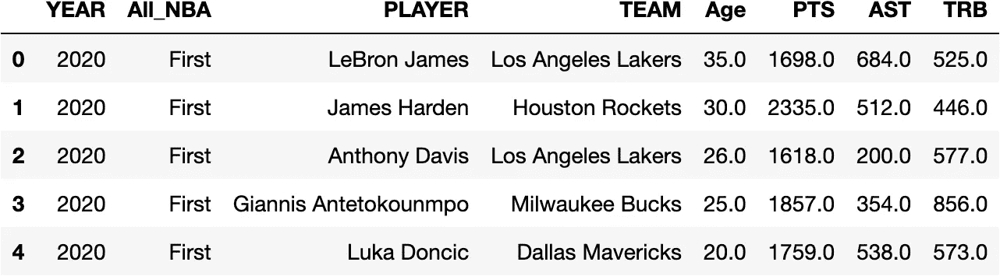
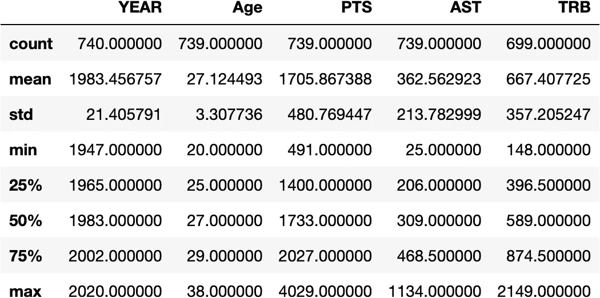
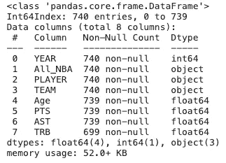
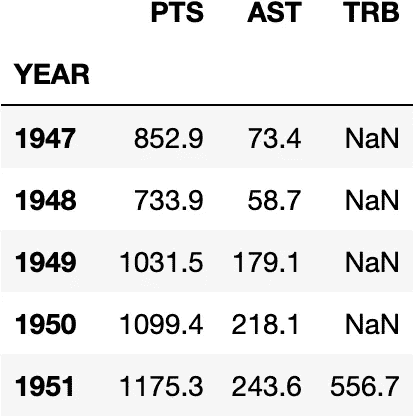
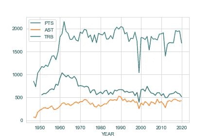
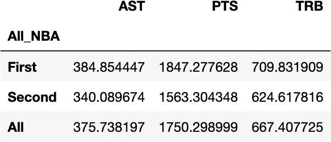
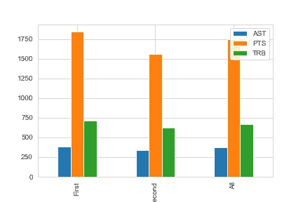

# 分析熊猫的数据

> 原文：<https://towardsdatascience.com/analyzing-data-in-pandas-7b7d500f6aed?source=collection_archive---------34----------------------->

## 当熊猫脱颖而出


[斯科特·格雷厄姆](https://unsplash.com/@homajob?utm_source=medium&utm_medium=referral)在 [Unsplash](https://unsplash.com?utm_source=medium&utm_medium=referral) 上拍照

一年前，如果你问我是否认为有比使用 Excel 更好的方法来分析表格数据，我可能会摇头说“没有”，我职业生涯的前 8 年一直在提高我的 Excel 技能，从初级到高级，在公司财务部门担任各种角色。会计部门是一个很好的例子，说明微软 Excel 或谷歌 Sheets 在利用 Python 的 Pandas 软件包方面表现突出，因为它对非技术人员来说更加用户友好，并且易于创建报告，如账户对账。当你开始从一个更程序化的任务转向一个更深入的分析任务时——这就是我认为熊猫脱颖而出的地方。

## 探索数据

当你收到一个很大的 Excel 文件时，除非你有很多外部构建的 [VBA](https://en.wikipedia.org/wiki/Visual_Basic_for_Applications) 宏或其他插件，否则你需要大量的跑腿工作和 Excel 公式来熟悉这些数据。Pandas 用两行非常简单的代码解决了这个难题: **df.info()** 和 **df.describe()。**

```
**#importing pandas**
import pandas as pd**#reading in tabular data of All-NBA teams**
df = pd.read_csv('../Data/YoY_Analysis.csv', index_col = 0)**#selecting needed columns**
df = df[['YEAR','All_NBA', 'PLAYER', 'TEAM', 'Age', 'PTS', 'AST', 'TRB']]**#showing the first 5 rows of data**
df.head()
```



数据帧图像

```
**#pandas code giving statistical information for all numerical columns**
df.describe()
```



数据框架统计信息

```
**#pandas code showing count of all columns and data types**
df.info()
```



数据帧信息

如前所述，导入数据后，仅用两行简单的代码，我们现在就有了所有数字数据的统计数据，包括 **IQR 的**和每列的数据类型。我们不需要编写公式来计算每一列的最小值/最大值/平均值等，并且 **df.info** 还向我们显示，我们的数据集中有一些缺失的信息，如 TRB 的 699 **非空计数**所示——总反弹。经过研究，这是由于 NBA 直到 1951 年才正式追踪篮板。

## 重塑

Excel 为它提供了一个非常有用的数据透视表工具和用户友好的 GUI，但是它不允许您改变数据的形状，除非您在完成数据透视表的构建后选择全部并对其进行硬编码。Pandas 提供了两个内置函数来帮助重塑/聚合你的数据集: **Groupby & Pivot_Table。**

几乎在我最初探索数据集的任何时候，我都倾向于使用 **groupby** ,因为它快速、简单，并且在你想要开始创建视觉效果时非常有用。让我们再来看看我们的数据集，但假设我们对 NBA 球队每年的平均数据感兴趣。

```
**#creating a new dataframe aggregating average stats per year**
annual_averages = df.groupby('YEAR')['PTS', 'AST','TRB'].mean()annual_averages.head()
```



分组数据帧

我们现在也可以很容易地绘制这些数据，显示平均值随时间的变化。这使我们能够快速识别 1999 年停摆缩短赛季，导致只有 50 场常规赛正在进行。

```
annual_averages.plot()
```



**Groupby** 和 **pivot_table** 在熊猫身上的表现非常相似。主要区别在于 **pivot_table** 允许在行和列上进行聚合。让我们通过旋转数据，然后绘制图表，来看看所有 NBA 球队的统计平均值。

```
pivot = df.pivot_table(df[['AST', 'PTS', 'TRB']], **#selecting columns**
               index = 'All_NBA', **#selecting index**
               aggfunc = np.mean, **#selecting aggregate function** 
               margins = True ) **#column totals** pivot
```



数据框架数据透视表

```
pivot.plot(kind ='bar)
```



数据透视表绘图

## 结论

如上所示，在探索数据时，Pandas 是一个令人惊叹的工具。只需几行非常简单的代码，您就可以开始理解您正在处理的数据集。这个库还可以提供更多的东西，但是我希望这个快速浏览能够在下次您收到一个大的 Excel 文件并被要求提供分析见解时有所帮助。