# 分析巴黎迪士尼乐园游客对公园和酒店的评论—第一部分

> 原文：<https://towardsdatascience.com/analyzing-disneyland-paris-visitors-reviews-for-parks-and-hotels-part-1-f3c2ced2a672?source=collection_archive---------33----------------------->

## 对超过 12 万篇猫途鹰评论的探索性数据分析和主题建模📝

我们对巴黎迪士尼乐园的所有英文评论的词频

# 介绍

巴黎迪斯尼乐园是世界上最著名的娱乐胜地之一。它有两个公园，里面有表演、特技和游行、特别活动、人物和游乐设施。它还有几家酒店和餐厅，在 Tripadvisor 上排名第三。

> 准备好享受巴黎迪士尼乐园的神奇时光吧！

是出现在该公司网站上的第一句话之一，总的来说，这种交流似乎旨在与家人或朋友一起享受一种独特的体验。

有了一点关于该公司的背景和大量来自猫途鹰的评论，让我们试着，没有特定的期望，一起发现留下评论的访问者对它说了些什么。

# 关于我们的数据集

在开始分析之前，我们需要了解一些关于数据的细节。我们的数据集由迪士尼乐园和酒店的 **12 万条 Tripadvisor 点评**组成。它们于 2021 年 3 月 12 日在**被提取。**

## 迪士尼乐园

*   巴黎迪士尼乐园→ **41k 评论**
*   朴华特·迪士尼工作室→ **16k 评论**

合并成一个 57，799 行(216 MB)的数据集

## 迪士尼乐园酒店

*   迪士尼乐园酒店***** → **8k 评论**
*   迪士尼纽约酒店**** → **8k 评论**
*   迪士尼新港湾俱乐部**** → **8k 评论**
*   迪士尼的红杉小屋*** → **12k 评论**
*   迪士尼夏延酒店** → **11k 评论**
*   迪士尼的大卫·克洛科特牧场→ **7k 评论**
*   迪士尼圣达菲酒店** → **10k 点评**

组合成一个 65，250 行(217 MB)的数据集

## 迪士尼乐园自然度假村

*   巴黎自然村****→ **3k 点评**

# 分析巴黎迪士尼乐园🎢

本文将只关注公园评论*(巴黎迪士尼乐园和华特·迪士尼工作室)*。

为什么你会问？因为有更多的酒店*(其中七家)*和评论包含更多的领域，如子评级*(清洁度、睡眠质量、房间、服务、价值)*，我们必须从某个地方开始！

欢迎留下任何评论和反馈，如果你喜欢这篇文章，我们可以在第二部分再写一篇关于酒店的文章😉。现在，我们将分两步来尝试从我们的评论数据集中获得最大的收益。

**探索性数据分析(EDA)**

我们首先探索我们的数据集，并试图得出有趣的见解，如:

*   *游客满意度*
*   *情绪随时间变化*
*   *响应时间和速率*

**文本分析和话题发现**

我们有一堆像样的评论，我们希望了解访问者留下的文字内容*(主要通过提取不同的话题或主题)*。为此，我们将关注以下内容:

*   *评论长度、表情符号和语言*
*   *词频和 N 元语法*
*   *使用 LDA 和 NMF 进行主题建模*

既然一切都准备好了，让我们开始吧！

# **探索性数据分析**

## 每月有多少评论？

Tripadvisor 创建于 2000 年，巴黎迪士尼乐园创建于 1992 年。华特·迪士尼工作室公园在 2002 年晚些时候开放。

从下图中，我们可以看到访客真正开始分享和写评论是从 2010 年开始的。

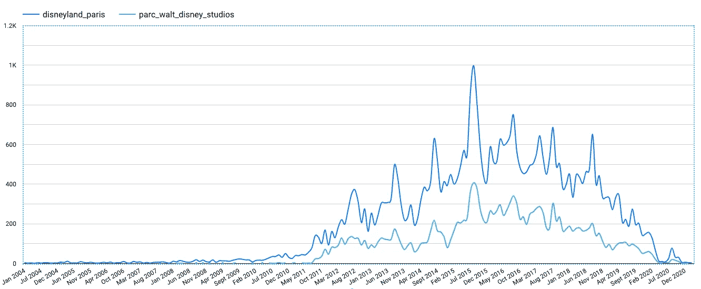

2004 年至 2021 年每月审查次数

观察到大多数峰值对应于 6 月到 8 月这一段时间非常有趣，而且有明显的季节性。

从 2019 年初开始，我们观察到**下降**的趋势，自 2020 年 3 月新冠肺炎疫情开始以来，几乎没有评论留下。

此外，通过计算巴黎迪士尼乐园和工作室公园之间的 CORR()函数，我们看到两条线具有 **97%** 的相关性，这意味着它们具有相同的游客评论季节性和趋势。

我们可以问自己一些问题，为什么冬天没有季节性🎃或者圣诞节🎄)？或者，如何解释 2019 年评论的持续减少？

> **SQL 提示**
> 
> Tripadvisor API 以字符串类型格式返回日期，如下所示 2016–03–17t 12:40:44–04:00。为了解析它，我们在 BigQuery 中使用 PARSE_TIMESTAMP()函数。

## **总体评分和一段时间内的平均评分**

除了留下书面文字，访问者还可以从 0 到 5 颗星评价他们的体验，我们将其转换为可读的标签。

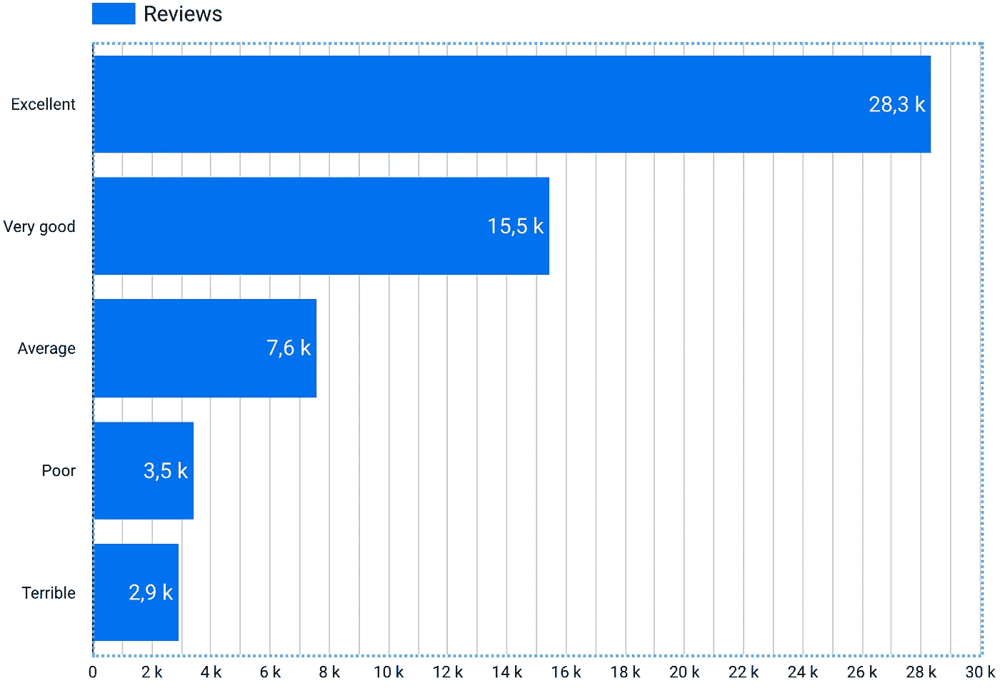

按评分分组的评论(1-5 星)

在我们所有的评论中，报道的都是**总体而言的美好体验**。

对于这两个公园，游客的体验更有可能是*优秀*或*非常好*。

> 总的来说，游客似乎真的很享受这种体验，但这种体验会随着时间的推移而改善吗？

让我们使用一个季度的平均评分，可能从 2012 年开始，因为从今年开始，访问者开始留下很多评论。

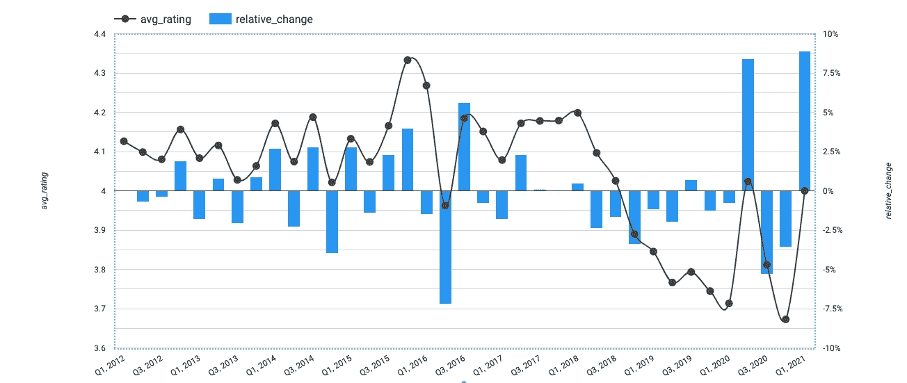

平均评分和季度间的相对变化

不要让图表的比例产生误导。我们看到的平均评分在 3.7 到 4.3 星之间，这仍然是一个很小的区间。我们可以把这个图分成两部分，在 Q1 2018 年奥运会之前的 T36 和之后的 T38。

之前，似乎从 2012 年的**到 2018 年的**，平均评分正在超过**的 4 星**，其中最大的下降是从**的 2016 年到 2016 年第三季度，平均评分从**下降到**的 3.95 星。**

同样引人注目的是，**从 2018 年第三季度到 2020 年 Q1**持续下降，达到最低评级之一。

> **SQL 提示**
> 
> 为了获得季度，我们使用带有季度参数的 TIMESTAMP_TRUNC()函数。此外，我们正在利用 BigQuery 中 LAG()函数的功能计算相对变化。

让我们尝试一种不同的可视化方式，使用绿色-琥珀色-红色指示器*(基本上将我们的评级转换为阴性-中性-阳性指示器)*。

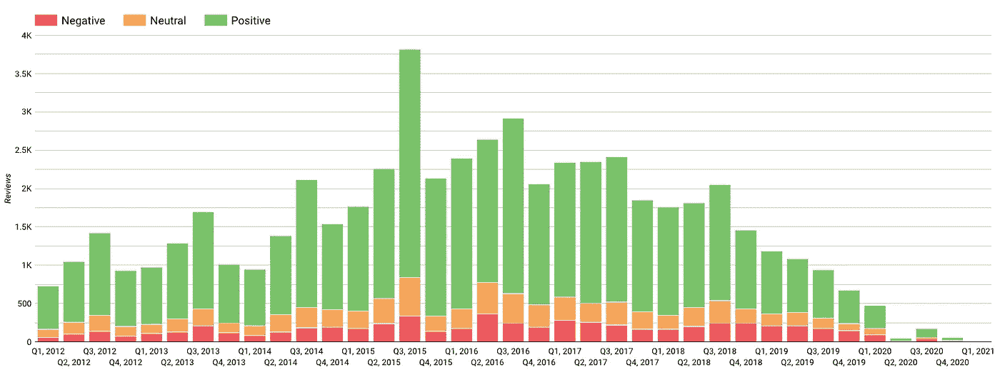

红色-琥珀色-绿色指示器，用于季度评审

在 2021 年 Q1 奥运会上，只有 **8 条评论**，这甚至没有显示在我们的规模上，但正如我们在第一张图表上看到的(*每月评论*)我们从 2017 年底到 2021 年 3 月有下降趋势，这意味着正面评论的数量也在减少，占总评论的比例更小。

## 响应速度和响应时间

评论可以由猫途鹰页面所有者回答，在这种情况下，是巴黎迪士尼团队。我想到的一个指标是响应率和响应时间。

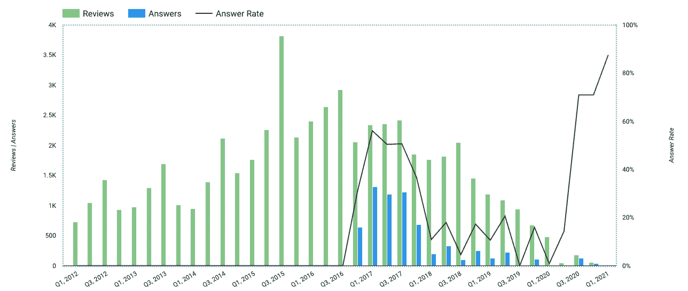

巴黎迪士尼团队于 2016 年底开始在 Tripadvisor 上为各公园解答问题。他们在回答大多数评论方面有一个很好的开始，至少三个季度的回答率在 40%到 60%之间，然后这个比率急剧下降。

总的来说，巴黎迪士尼乐园的平均回答率为 **15%。**这意味着 Tripadvisor 上剩下的 100 条点评中，只有 15 条会得到回复。

响应时间呢？

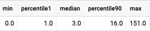

以天为单位的响应时间的百分比

中值为 3 天，16 天后得到答案的可能性较小。除了这张表，平均回答时间是 **5，7 天。**

> **SQL 提示**
> 
> 为了统计一个季度中的回答数量，我们将 owner_response 字段转换为布尔值 1 或 0。然后，我们可以使用 SUM()函数在单个查询中对其进行聚合。

# 文本分析和主题发现

我们分析的第二部分将更加关注我们的访问者在这些评论中表达了什么*(我们将尽力找出答案*👀 *)* 。

我们将使用不同的技术来帮助我们发现应该深入探究的话题、主题或问题。由于我们不知道这些评论中包含了什么，我们将使用大多数无人监管的方法来**探索**和**发现**。

## 评论长度、表情符号和语言

单纯出于好奇，我们来看看每次评论的字数有没有什么规律。为此，我们统计了一篇评论的字数，并在几个月和几年内进行平均。

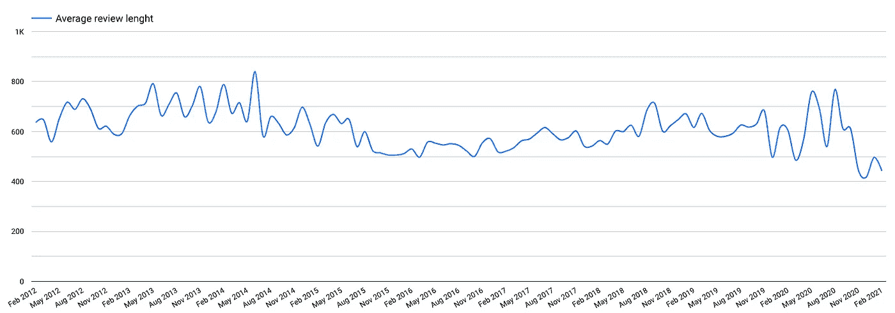

一段时间内的平均审核长度

平均来说，我们的访问者每次评论使用 550 到 800 个字符。随着时间的推移，它看起来相当平坦，没有什么真正突出的。

表情符号能给我们一些有趣的暗示吗？这里需要注意的是，只有**1.7%**的评论包含表情符号，这在我们的评论数据集中所占的份额非常低。

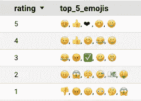

查看不同评级中最常用的表情符号，我们可以看到 4-5 星的表情符号与爱、笑和幸福有关，1-2 星的表情符号与金钱、愤怒和困惑有关。

> **SQL 提示**
> 
> 表情符号是从每个评论中提取的。它们以字符串格式存储在 BigQuery 中，用两个方括号封装: *[😎,🎉]*
> 
> 为了解析这个字段，我们使用 JSON_EXTRACT_STRING_ARRAY()将我们的字符串转换成一个单值数组。解析逗号分隔值列表非常有用。

来自世界各地的游客参观巴黎迪士尼乐园，因此，评论可能会用许多不同的语言编写。

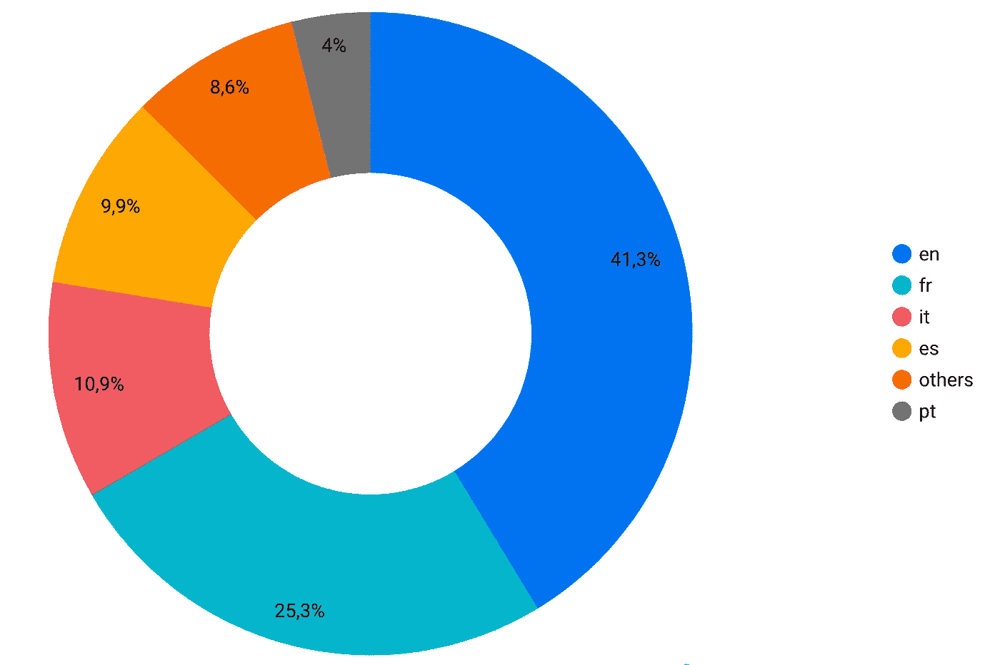

在所有评论中，我们观察到五种主要语言。

大多数人的评论都是用英语写的。这可能代表美国、加拿大或英国等国家。

**法国是第二大代表国家**，紧随其后的是意大利和西班牙。

为了进行我们的主题分析，我们将只保留英文评论，这些评论仅占我们数据集的 41% ，这意味着我们将错过来自其他国家和语言的其他观点或想法。

## 字频率

词频是一种测量给定文本中最频繁出现的单词或概念的技术。然后，我们将它们显示为单词云，以帮助区分最具代表性的单词。

在我们的例子中，我们从评论中删除了一些词，如*、*或*、*以及所有停用词(*、*、*、【他们】、*、*、【你的】、*、*、【我们】、*等)

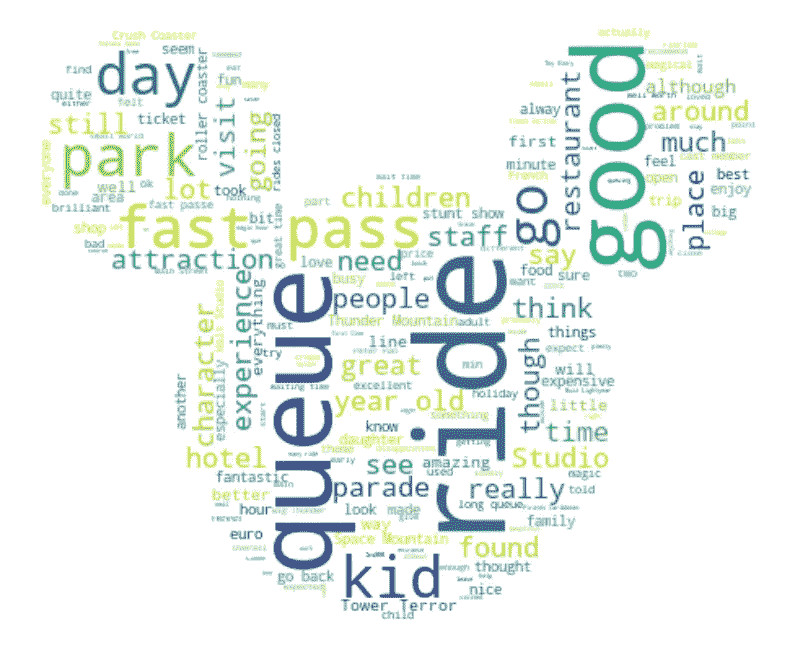

我们对巴黎迪士尼乐园的所有英文评论的词频

例如，这里我们看到单词*、*、*、*在我们的评论集中出现得最多。很难确切说出它暗示了什么，但值得注意。

让我们尝试应用相同的方法，但将其分为**正面(4-5 星)**和**负面(1-2 星)**评论，看看我们是否能注意到每个子集中的特定单词。

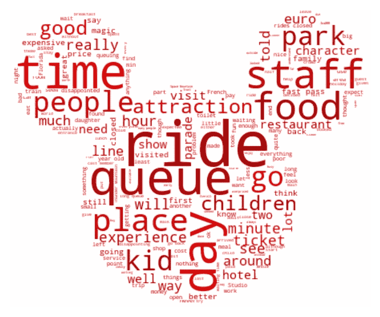

正面评价在左边是绿色，负面评价在右边是红色

我们已经可以注意到，有些词是两个词云共有的，比如*、*、*、*或*、【日】、*。我们可以说它们适用于消极或积极的感觉。

因此，我们可以观察到大多数出现在一个或另一个子集中的单词。

*   *“时间”、“人员”或“食物”*大多出现在否定集中
*   *“人物”、“游行”或“小鬼”*大多出现在正面集合中

这很有趣，但如果脱离上下文，只解释一个词可能会有点困难。我们将试着看看搭配，看看哪些单词通常会出现在一起。

> **Python 提示**
> 
> 我们没有使用正方形图像格式显示 wordcloud，而是使用了自定义的。PNG 图像来显示米老鼠形状中的单词。wordcloud librairy 允许我们使用“mask”参数来使用任何自定义图像。

# 搭配/ n-grams

搭配有助于识别共同出现的单词。它有助于识别句子中隐藏的意思。

例如，我们看到*“Rides”*这个词被频繁提及。但也许它与其他有意义的词同时出现，如*、*、*、【趣味骑行】。*

再比如，在我们之前的文字云中，我们看到了*【快速】**【通过】这几个字。*在互联网上，我们发现巴黎迪士尼乐园提供了一张通行证，让游客在一些游乐设施上跑得更快。我们可以假设这些单词更有可能一起出现，而不是单独出现。

为了不使陷入过于复杂的分析，我们将看看 bi-gram(两个相邻的词，如*“快传”*)和 tri-gram(三个相邻的词，如*“大雷山”*)。

**我们的 top 按频率找到了二元模型**

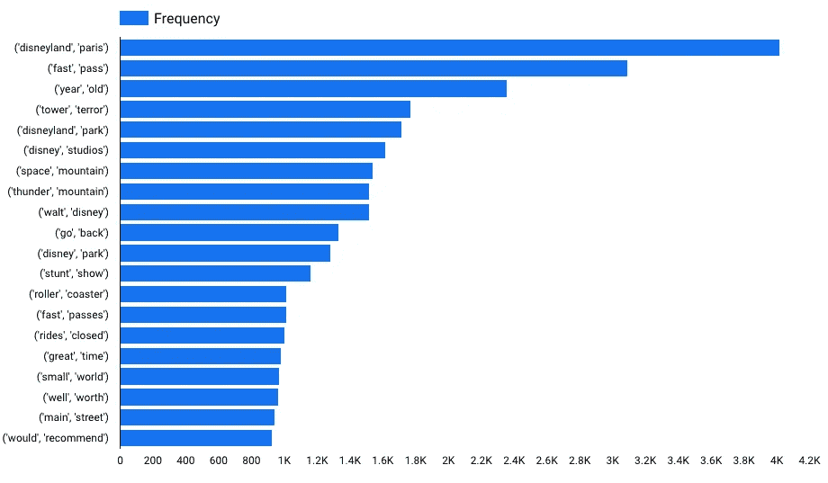

两个相邻单词的前 20 次出现(双字母组)

有些联想似乎比其他联想更有可能发生，如*、【巴黎迪士尼】、【快速通行证】、*、*、【过山车】、*。

但也许更有趣的是，我们有“G*o Back”*或*【值得】*的意思是游客可能愿意回来，因为他们的旅程值得。

另一个*“游乐设施关闭”*可能表示景点经常关闭，这是一个反复出现的话题。

## **我们的 top 按频率找到了三元组**

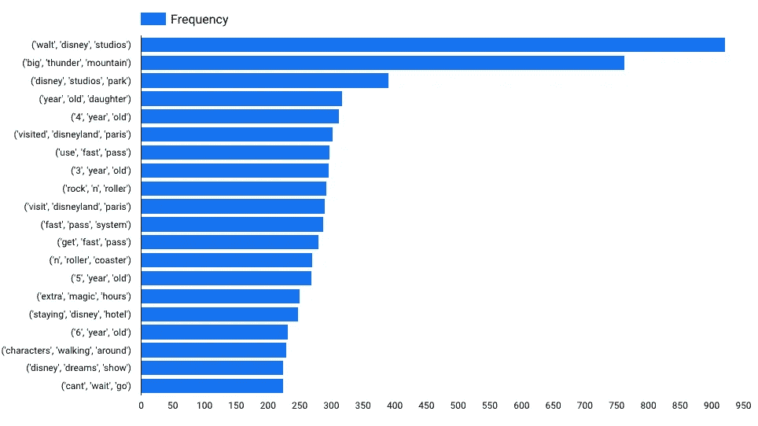

前 20 个出现的三个相邻单词(三元组)

我们已经看到，这三个词的组合在我们的评论语料库中出现的频率大大降低了。

好像有几个是指向孩子年龄的，像*【6 岁】**【3 岁】*或者*【4 岁】。*

“*额外魔法时间”*和“*人物走动”*可能是公园提供的有趣功能，值得一看。

三元语法的列表更长，但它们可能不太相关，因为它们出现在更少的评论中。

> **巨蟒提示**
> 
> 我们使用一个自定义的清理功能来词条化和删除停用词，然后降低和修复编码问题。然后，NLTK librairy 给了我们 ngrams()函数。最后，我们将结果转换成可以在 BigQuery 中接收的数据帧。

# 主题建模

我们的目标是按照主题自动组织文本。在我们的例子中，我们有一堆评论，我们想弄清楚所有这些评论会产生什么主题。

例如，以下评论可以在一个名为**神奇的地方的主题中建模。**

*   *“我对这个神奇的地方爱得无以言表。”*
*   *“真正神奇的体验和物超所值只要你在去哪里吃饭上做足功课，我绝对会再去！”*
*   “从《料理鼠王》和《海底总动员》这种独一无二的游乐设施来看，一切都很神奇。”

我们将使用两种算法， **LDA** (潜在狄利克雷分配)和 **NMF** (非负矩阵分解)来卧底这些话题。

这两种算法的工作原理是，根据评论包含的单词将评论分组，并注意它们之间的相关性。我们使用两种方法来比较发现的主题，即使它们不同，但它们应该会带来相似的结果。

**LDA 发现的主题**

使用 LDA 发现的主题

*   第一个话题听起来是关于好玩的游乐设施，比如太空山和大雷山
*   第二个话题是关于排队和等待时间。可能相关或由于封闭的游乐设施。
*   **第三个**话题好像是关于员工抽烟和钱的。
*   第四个主题描述了一次由于游行和迪斯尼人物而带来的神奇和令人惊奇的经历。
*   **第五个**主题似乎是与酒店和货币价值有关，或者也与烟火和一天中的繁忙时间有关。

要找到对这些主题的清晰解释并不总是容易的，但至少它给出了指示，也许是进一步探索的主题。

**NMF 发现的话题**

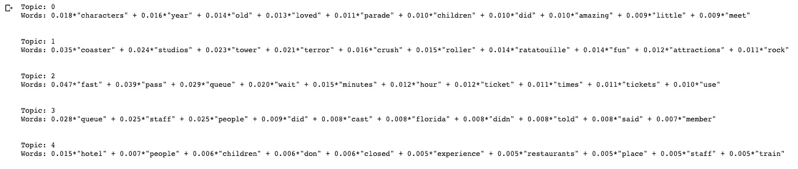

使用 NMF 发现的主题

至于 LDA，这种方法的结果也是主题的形状。

*   第一个话题可能是关于孩子们喜欢游行和见到迪斯尼人物。
*   第二个主题是关于有趣的游乐设施，类似于我们的 LDA 主题，但有替代名称(碾压过山车、恐怖塔、料理鼠王)。
*   **第三个**好像是关于快速通票和等待时间(小时或分钟之间)。
*   **第四个**话题与工作人员/演职人员和人有关。
*   **第五个**话题是关于酒店、餐厅、火车。

> **Python 提示**
> 
> 在这个例子中，我们使用 python Gensim librairy。LDA 函数提供了足够的参数进行调整，因此我们可以获得良好的结果。这里，提示可以是使用 Sparse2Corpus()函数来转换转换后的评论集。此外，我们使用两个工人来分配计算过程。

# 我们的下一步是什么？🐭

我们一直在分析关于两个巴黎迪士尼乐园的评论，但看看评论告诉我们关于酒店的什么也是很有趣的。

此外，我们只考虑了英语评论的文本分析部分。我们可以尝试使用不同的图书馆，以包括其他语言，如法语，西班牙语或意大利语的评论。

此外，我们可以针对不同的评级或情绪对文本进行详尽的分析。例如，对我们的正面和负面评论分别应用主题建模方法。

就是这样！我希望你喜欢这篇文章，了解更多关于文本分析的可能性，不要犹豫留下反馈或评论🤓