# 用 NLP 分析迪士尼乐园评论

> 原文：<https://towardsdatascience.com/analyzing-disneyland-reviews-b916b6dcccf4?source=collection_archive---------28----------------------->

## 情感分析、情感检测、搭配和主题建模

与刘培、路畅、帕萨·塔玛塞比和马英凯(加州大学欧文分校 MSBA 分校 21 年级)合作

> **项目目标**:使用情感分析、情感检测和 n-gram 联想，比较顾客对三个迪士尼乐园地点(阿纳海姆、巴黎和香港)景点的情感。使用主题建模识别关键词，帮助迪士尼确定游客痛点并改善公园体验。要查看我们的代码，请参考 GitHub 库[这里](https://github.com/MarshDee/DisneyNLP)。

**数据集:**我们使用了在 [Kaggle](https://www.kaggle.com/arushchillar/disneyland-reviews) 中找到的数据集，该数据集包含来自猫途鹰的 42，000 条关于三个迪士尼乐园分店的评论:加州、巴黎和香港。我们决定按分支位置分割数据，以便在计算上更容易分析较小的样本。关于阿纳海姆的评论有 19406 条，关于巴黎的有 13630 条，关于香港的有 9620 条。数据变量包括评论 ID、评级、年月、评论者位置、评论文本和迪士尼乐园分支。

**探索性数据分析:**首先，我们进行了探索性数据分析(EDA ),以了解所有地点的平均评分，我们的访问者来自哪里，以及评分如何随时间变化。

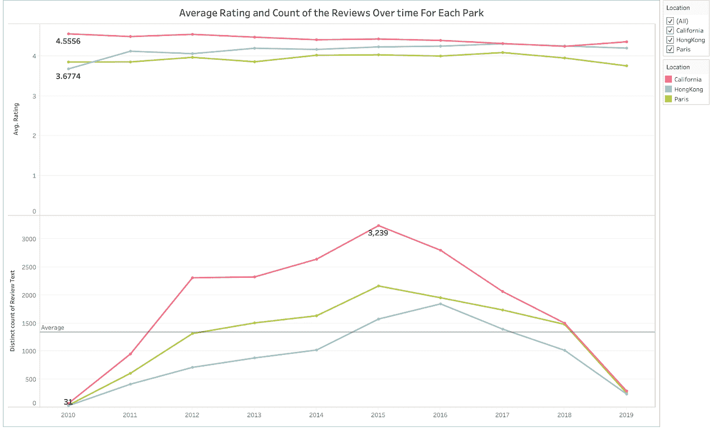

上图显示了公园所在地每年的平均评分。下图显示了每年针对每个地点撰写的评论数量。

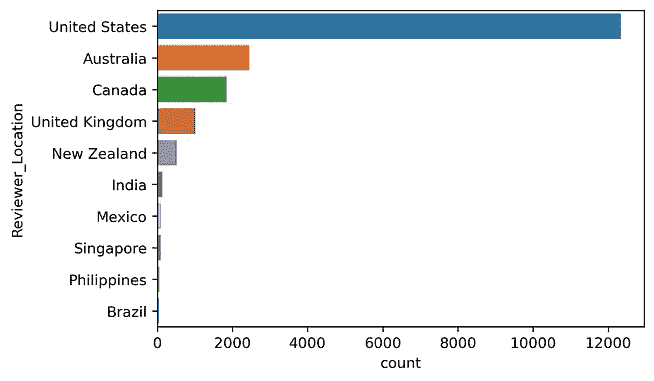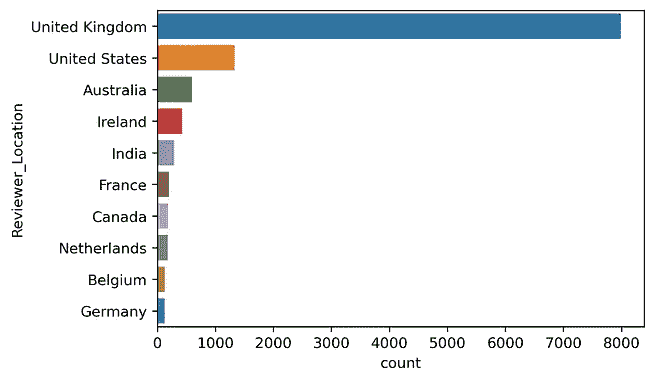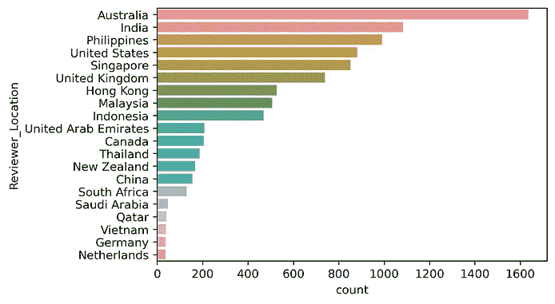

显示了前 10 个国家的游客来自的频率。加州、巴黎和香港(从左至右)

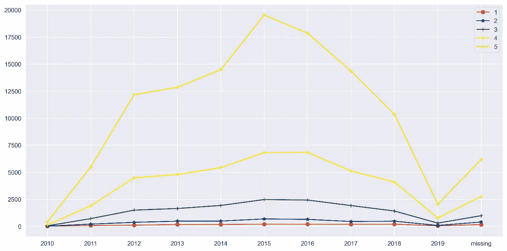

一段时间内的评级频率。2019 年的下降可能是因为没有全年的数据。有些评论没有日期。

我们找到了每个公园的平均评分(满分 5 颗星):加州 4.41，巴黎 3.96，香港 4.20。游客的国籍取决于地理位置——例如，许多香港游客来自邻近国家(如澳大利亚、印度、菲律宾)，大多数巴黎游客来自英国，许多加州游客来自美国。

**单词云:**我们生成了单词云，以便对游客在回顾他们的迪士尼乐园体验时谈论的内容有一个大致的了解。在我们的分析中，我们只对用英语写的评论感兴趣，并删除重复的评论。

为了创建单词云，我们对评论中的单词进行了标记，并删除了停用词。有许多方法可以自定义文字云的字体、背景颜色和轮廓。你可以参考[这个网站](https://www.w3schools.com/colors/colors_picker.asp)来寻找 HTML 颜色或者[这个](https://matplotlib.org/stable/tutorials/colors/colormaps.html)来获得更多可以用来增强你的图表的颜色图选项。

```
tokenizer = RegexpTokenizer(r'\w+')
text = text.lower()
cleaned_text = re.sub('\W', ' ', text)
stopword = stopwords.words("english")
snowball_stemmer = SnowballStemmer("english")
word_tokens = nltk.word_tokenize(cleaned_text)
stemmed_word = [snowball_stemmer.stem(word) for word in word_tokens]
processed_text = [word for word in stemmed_word if word not in stopword]
text_string=(" ").join(processed_text)#make word cloud
mask = np.array(Image.open("m2.jpg"))
wordcloud = WordCloud(background_color="white", font_path='arial', mask = mask).generate(text_string)#applies colors from your image mask into your word cloud
image_colors = ImageColorGenerator(mask)
plt.figure(figsize=(15,8))
plt.imshow(wordcloud.recolor(color_func=image_colors), cmap=plt.cm.gray, interpolation="bilinear")
plt.axis("off")
plt.show()
```

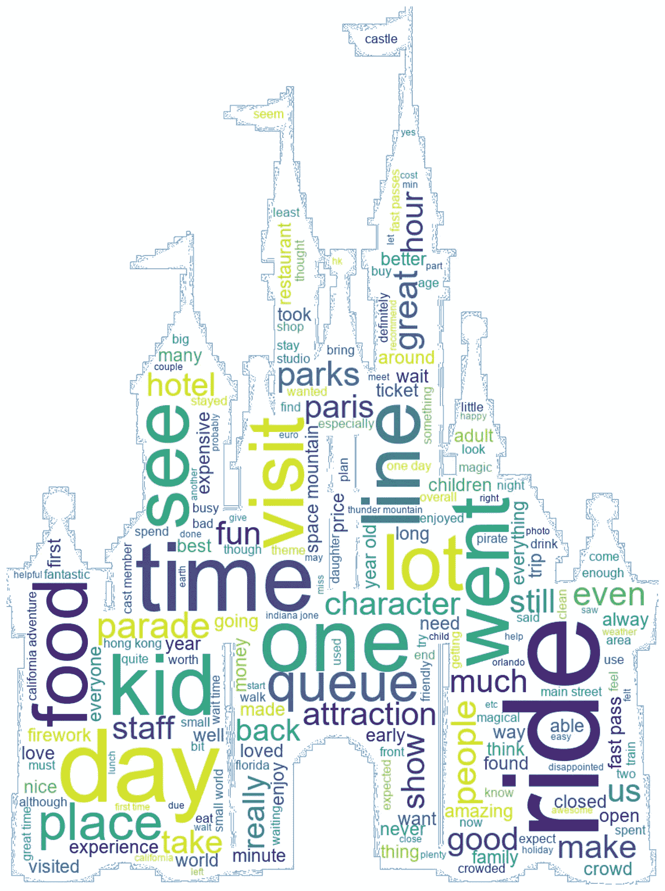

生成关于所有公园位置的文字云。

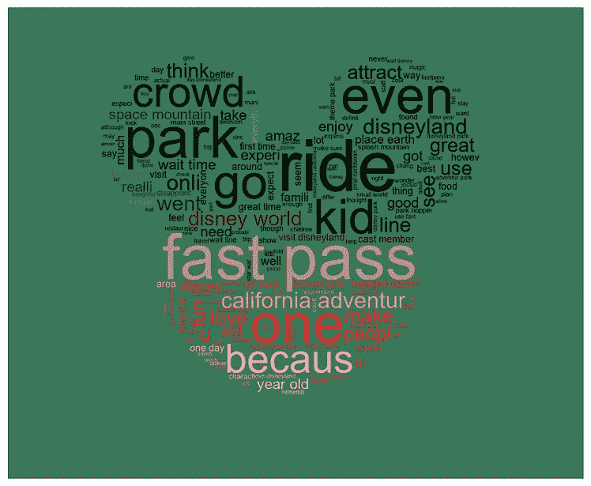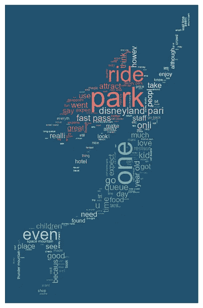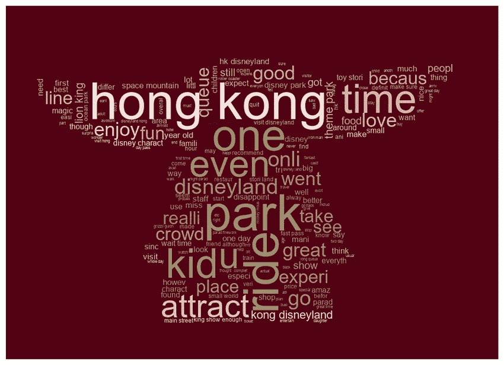

从左至右:加州、巴黎、香港

总的来说，这三个地方的评论都提到了快速通道、排队、游客统计、乘车和景点。

**情感分析:**我们想更深入地了解评论揭示了访问者的情感。对于这一步，我们使用了三种方法来获得使用 TextBlob 和 Vader 的情感。

1.  这种方法使用复合分数来分配情绪“积极”或“消极”。

```
#assign sentiment based on compound score
df['sentiment'] = np.where(df['vader_comp'] >= 0.05, 'positive', 'negative')
```

2.我们还尝试了其他方法来附加情感，通过使用不同的复合得分阈值来分类“正面”、“中性”和“负面”:

```
df['nltk_sentiment_type'] = ''
df.loc[df.nltk_compound > 0, 'nltk_sentiment_type'] = 'POSITIVE'
df.loc[df.nltk_compound == 0, 'nltk_sentiment_type'] = 'NEUTRAL'
df.loc[df.nltk_compound < 0, 'nltk_sentiment_type'] = 'NEGATIVE'
```

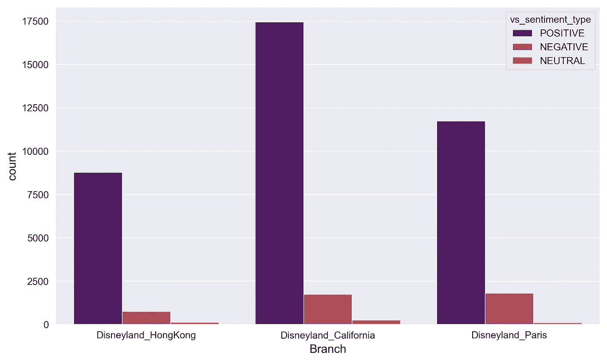

每个公园位置的情感频率。

3.另一种方法是基于评级来分配情感:

```
# assigning sentiment using rating
rating = df['Rating']
def label_func(rating):
    if rating >= 4:
        return "Positive"
    elif rating == 3:
            return "Neutral"
    else:
        return "Negative"

df['Sentiment'] = df['Rating'].apply(lambda x: label_func(x))
```

我们想知道情绪的两极性和主观性在多大程度上影响了游客对迪士尼乐园体验的评价。下面是一个例子，说明我们如何衡量使用“最幸福的地方”和“地球上最幸福的地方”这两个短语的关于香港的评论的极性和主观性

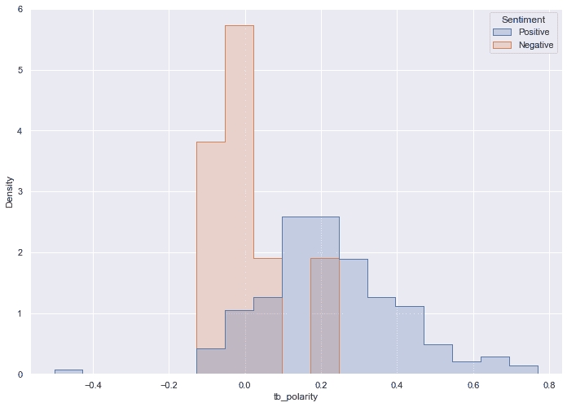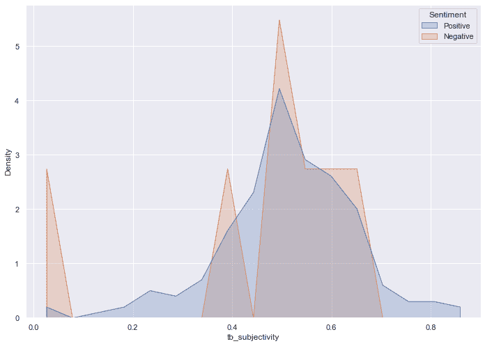

从上面的图表中，我们可以推断出，情绪积极、极性得分高的评论对他们的公园体验非常满意。主观正面评价比主观负面评价多。主观性衡量一篇评论有多固执己见，因此我们可以推断，那些持负面观点的人给出了更严厉的评论，因为他们的期望在访问期间没有得到满足。

**情绪检测:**我们使用 NRCLex 来分配情绪，NRC lex 基于文本来测量情绪影响。情绪影响包括:积极、消极、期待、信任、恐惧、惊讶、愤怒、悲伤、喜悦和厌恶。我们还尝试使用软件包 [text2emotion](https://pypi.org/project/text2emotion/) ，它将情绪分为快乐、愤怒、悲伤、惊讶和恐惧。然而，text2emotion 的问题是它会给“恐惧”打高分(这对地球上最快乐的地方来说没有意义)，所以我们选择使用 NRCLex 进行分析。

```
from nrclex import NRCLex#nrclex outputs a score for all 9 emotions, but we only want the emotion with the highest score (usually the first output)emotion = []
for i in range(len(df)):
    emotions = NRCLex(df['Review_Text'][i])
    emotion.append(emotions.top_emotions[0][0])
df['emotion'] = emotion
```

检测情绪后，我们为每个位置创建了可视化效果，以显示每种情绪的频率:

```
graph = sns.countplot(y = "emotion", data = df, palette = "flare")
graph.set(xlabel = 'Frequency', ylabel = 'Emotion', title = 'Emotion from reviews about Disneyland (CA)')
figure = graph.get_figure() 
```

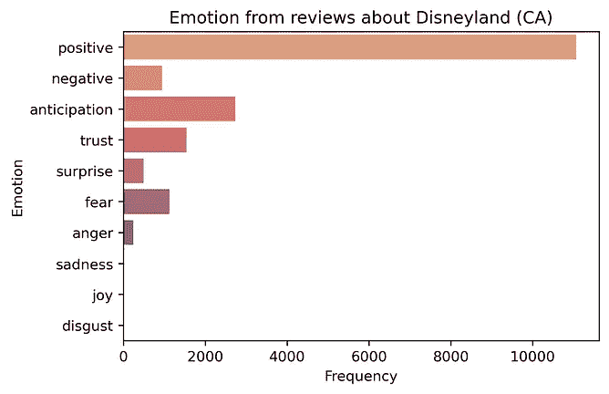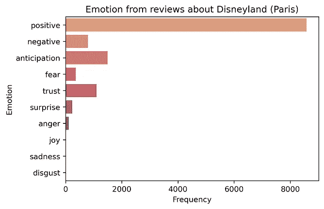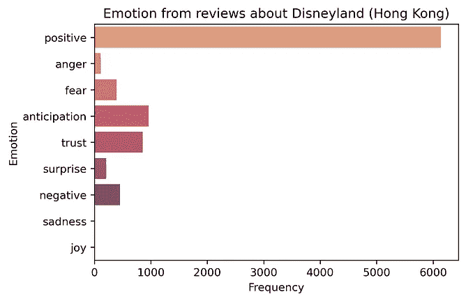

在这三个地方中，香港是唯一一个没有感到“厌恶”的地方。

总的来说，这三个公园都有高频率的“积极”情绪。然而，我们必须仔细看看与负面情绪(愤怒、恐惧、消极、厌恶、悲伤)相关的评论，这样我们才能了解为什么有些游客有不愉快的公园经历。

我们发现了一些有趣的评论，其中情绪被分为“厌恶”或“负面”:

1.  **巴黎的顾客服务:** *“不要在欧洲迪斯尼浪费你的时间……那里的工作人员不友好，粗鲁，对顾客一点也不感兴趣！如果你不说法语，你就被忽视了！”*
2.  **加州物价:** *“这无疑是一个传奇的地方，但我认为不值得为过度拥挤和过高的价格而花钱。迪士尼继续提高门票价格，每天的人潮都很荒谬。”*
3.  **加州客服:** *“去过佛罗里达的迪士尼世界，加州迪士尼乐园让人大失所望。洗手间很脏。送餐员会转过身来挖鼻孔。”*
4.  **酒店住宿，客户服务，公园可及性，香港的线路:** *“圣诞节假期去过。整个旅程都被令人恶心的服务和糟糕的经历所破坏…甚至对我的孩子来说也没有魔力。那里的员工大多在生闷气(可能是因为他们需要在假期工作)。回复主要是照着剧本念的，听起来像是破了的单调唱片。有两个亮点，我希望我会忘记.....为我的小宝贝租了一辆婴儿车。一位皱着眉头的工作人员接待了她，递给她一张 HKD 1000 美元的钞票，但找错了零钱(HKD 少了 500 美元)问她，她尖叫了一声！！然后她用广东话咒骂，坚持说她身上没有 HKD 1000 元的钞票，我真笨，给了一张 HKD 500 元的钞票。第二个亮点是当我们排队观看 3D 表演时，一群印度人插队到了队伍的前面。告知工作人员，他们坚决告知，没有排队的规定，并继续聊天。插队者反驳说他们是贵族，排在队伍前面是他们的权利。工作人员笑着点点头，继续他们之间的闲聊。史上最可怕的噩梦....永远不要去那里.....最好还是坚持东京或者我们。”*

将情绪和情感结合起来使用可以帮助迪士尼找到客户不满意的地方以及他们不满意的原因。然后，这些信息可用于进行必要的适当更改，以增强游客体验。

**搭配:**我们希望找到评论中的常用短语，这样我们就可以识别访问者经常讨论的关键词或主题。通过这样做，迪士尼可以识别评论的上下文，而不必单独阅读每一篇评论。我们采取措施寻找搭配——由一个以上的单词组成的短语，通过 n 元语法关联共同出现。

**二元联想** —识别两个频繁出现的词，以获得关于评论上下文的更多洞察。我们发现，只过滤形容词和名词更有意义:

```
def rightTypes(ngram):
    if '-pron-' in ngram or '' in ngram or ' 'in ngram or 't' in ngram:
        return False
    for word in ngram:
        if word in stop_words:
            return False
    acceptable_types = ('JJ', 'JJR', 'JJS', 'NN', 'NNS', 'NNP', 'NNPS')
    second_type = ('NN', 'NNS', 'NNP', 'NNPS')
    tags = nltk.pos_tag(ngram)
    if tags[0][1] in acceptable_types and tags[1][1] in second_type:
        return True
    else:
        return False
```

以下是每个公园位置的顶级二元模型:

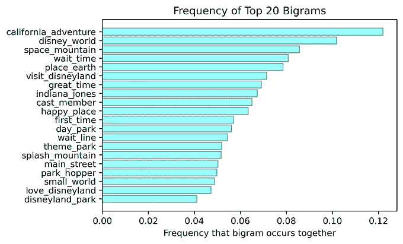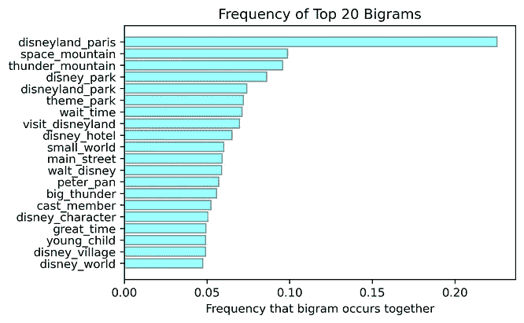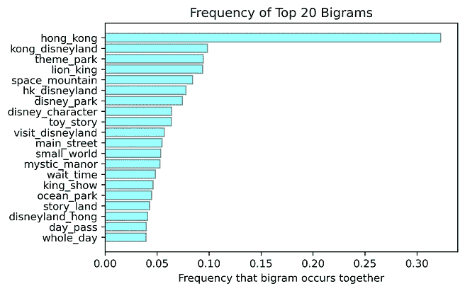

从左至右:加州、巴黎、香港

最常见的二元模型包括热门景点、使用的门票类型(一日通票、公园票)、员工(演职人员)和等待时间。

**三元组关联** —识别三个频繁出现的词，以获得对评论上下文的更多洞察。三元模型可以给我们更多关于游客在主题公园做什么的信息。我们也将只考虑形容词和名词给我们有意义的上下文。

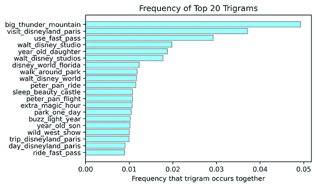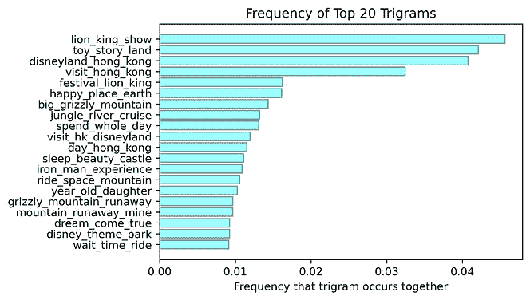

从左至右:加州、巴黎、香港

似乎去加州的游客会鼓励其他人“使用快速通道”来缩短等待时间。这些评论还谈到加州冒险，比较他们的经验，佛罗里达州的华特·迪士尼世界，使用公园跳跃者，和受欢迎的公园景点。巴黎评论家还提到使用快速通道，受欢迎的景点，并与其他公园进行比较。关于香港的评论提到了热门景点和乘车等待时间。

我们可以使用通过搭配识别获得的结果，进一步分析游客对景点的情感。为此，我们将查找提到“太空山”或“超空间山”的评论，并比较这三个地方对该旅程的总体看法。我们只对游客使用的与游乐设施相关的词汇感兴趣，所以我们只考虑形容词。

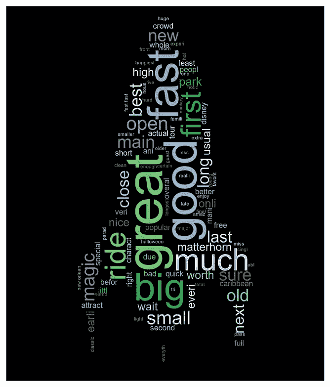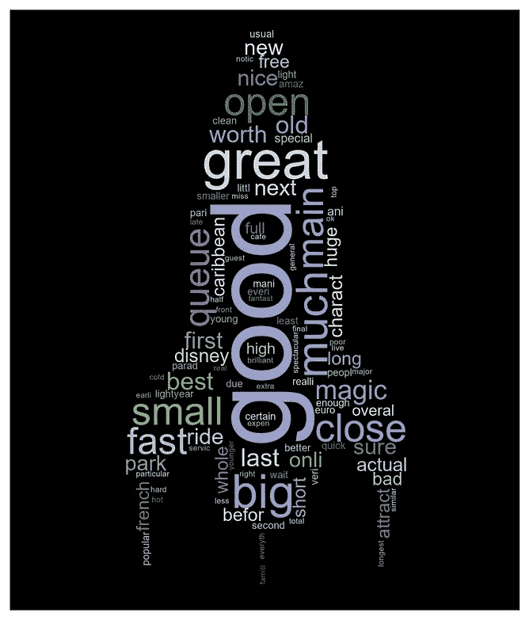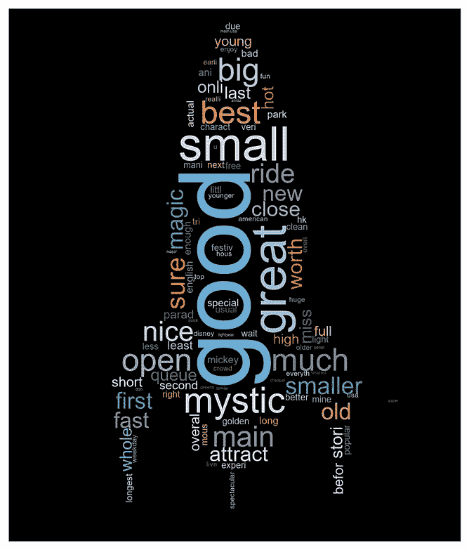

从左到右:与太空山加州、巴黎和香港相关的前 100 个单词

总的来说，当我们可视化与太空山相关的评论时，来自所有三个地方的评论者使用相似的形容词。

**主题建模:**我们希望使用主题建模来提取评论中使用的关键词，以帮助迪士尼确定公园游客关注的具体问题。我们可以建立一个字典，并使用无监督学习算法 ld a(潜在狄利克雷分配)来训练我们的主题模型，以发现文本中的隐藏模式。这也将产生主题出现在我们的模型中的概率。在构建这个模型之前，我们删除了标点符号、停用词，并对文本进行了词条化。然后，我们找到了 k(主题数量)的最佳值，将其与 coherence score 进行对比。我们选择了一致性分数最大的理想 k 值。我们使用 gensim 包来完成这项任务。

```
def compute_coherence_values(dictionary, corpus, texts, start, stop):
    """
    Compute c_v coherence for various number of topics
    """
    coherence_values = []
    model_list = []
    for num_topics in range(start, stop):
        model = gensim.models.ldamodel.LdaModel(corpus=corpus, 
                                              num_topics=num_topics,
                                              id2word=id2word,
                                              random_state=90,
                                              alpha='auto',
                                              eta='auto',
                                              per_word_topics=True)
        model_list.append(model)
        coherencemodel = CoherenceModel(model=model, texts=texts,
                             dictionary=dictionary, coherence='c_v')
        coherence_values.append(coherencemodel.get_coherence())
    return model_list, coherence_values
start=4
stop=11
model_list, coherence_values = compute_coherence_values(dictionary=id2word, 
                                    corpus=corpus,
                                    texts=data_lemmatized,
                                    start=start, stop=stop)x = range(start, stop)
plt.figure(figsize=(10,7))
plt.style.use('ggplot')
plt.plot(x, coherence_values, color = "blue",marker=".")
plt.xlabel("Num Topics", size=14)
plt.ylabel("Coherence score", size=14)
plt.title('Number of Topics Based on The Coherence Score',size=18)
#plt.savefig("output/k_topic.jpg", bbox_inches='tight', dpi = 300)
plt.show()
```

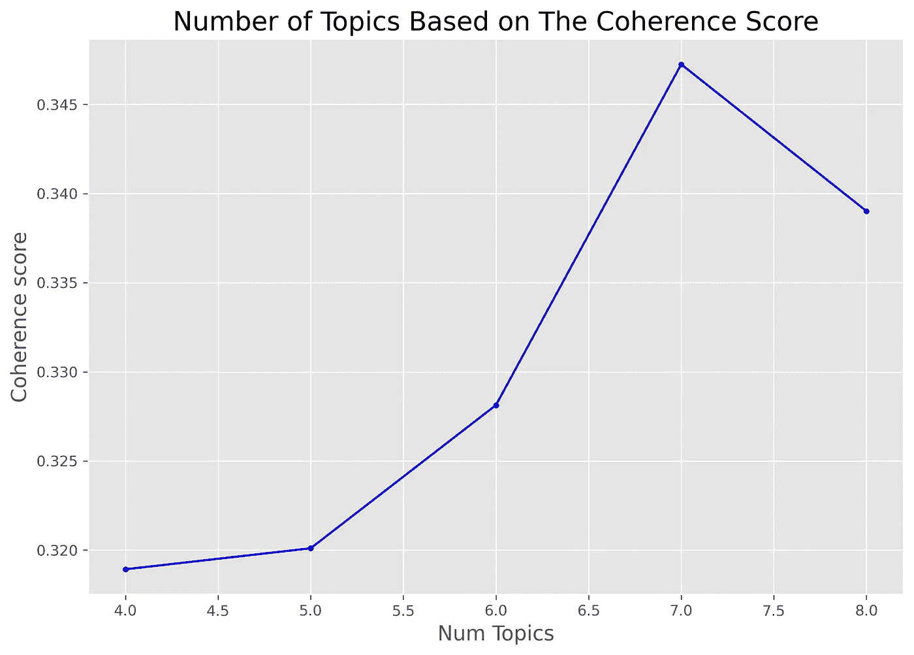

对于加利福尼亚的位置，理想的主题数是 7。这给出了 0.35 的一致性分数和-6.94 的困惑分数。应用这个 k 值，我们获得每个主题中的热门单词:

```
[(0,
  '0.089*"year" + 0.078*"kid" + 0.052*"old" + 0.033*"child" + 0.032*"come" + '
  '0.031*"little" + 0.029*"character" + 0.018*"young" + 0.018*"daughter" + '
  '0.015*"adult"'),
 (1,
  '0.079*"wait" + 0.076*"line" + 0.066*"pass" + 0.050*"fast" + 0.043*"long" + '
  '0.038*"people" + 0.037*"hour" + 0.026*"minute" + 0.023*"ticket" + '
  '0.019*"get"'),
 (2,
  '0.051*"ride" + 0.049*"go" + 0.040*"time" + 0.040*"day" + 0.037*"park" + '
  '0.030*"get" + 0.018*"do" + 0.016*"good" + 0.014*"food" + 0.014*"take"'),
 (3,
  '0.087*"mountain" + 0.080*"space" + 0.041*"pirate" + 0.033*"detail" + '
  '0.028*"disneyworld" + 0.022*"haunted_mansion" + 0.022*"walt" + '
  '0.020*"matterhorn" + 0.019*"caribbean" + 0.018*"indiana_jone"'),
 (4,
  '0.020*"area" + 0.018*"tell" + 0.013*"give" + 0.013*"put" + 0.012*"re" + '
  '0.012*"parking" + 0.011*"patience" + 0.011*"gate" + 0.011*"leave" + '
  '0.010*"truely"'),
 (5,
  '0.078*"disneyland" + 0.051*"disney" + 0.038*"place" + 0.030*"great" + '
  '0.029*"love" + 0.027*"visit" + 0.025*"park" + 0.020*"world" + 0.019*"fun" + '
  '0.017*"well"'),
 (6,
  '0.034*"overprice" + 0.032*"halloween" + 0.030*"effort" + 0.022*"party" + '
  '0.021*"event" + 0.013*"group" + 0.013*"weekday" + 0.013*"local" + '
  '0.011*"trick" + 0.010*"sandwich"')]
```

为了在二维空间中可视化主题，我们将使用 gensim 的 pyLDAvis 并创建一个我们模型的交互式可视化。


从我们的主题模型中，我们能够获得每个主题的热门关键词:

1.  42.5%的代币是关于乘车、表演和食物的。
2.  24.4%的人认为家庭公园体验是积极有趣的。
3.  12%的代币关于排队等候和使用快速通行证。
4.  7.8%的游客与谁一起参观主题公园。
5.  7.2%的代币关于停车和入口。
6.  3.5%的热门游乐设施代币(太空山、加勒比海盗、鬼屋、马特宏峰、印第安纳琼斯、大雷山)。
7.  2.5%的代币关于节假日(万圣节和圣诞节)。

我们应用同样的技术提取关于巴黎和香港的主题，发现了以下结果:

*   对于巴黎迪士尼乐园，我们发现了 6 个主题:公园体验、景点、排队和快速通道、酒店住宿、天气和公园可达性。
*   对于香港迪士尼乐园，我们提取了 7 个主题，涉及:公园体验、家庭娱乐、酒店和餐厅住宿、客户服务、假期和庆祝活动(万圣节、冬季、生日)、积极体验和游客建议。

通过寻找关键主题，迪士尼可以确定他们可以改善的具体领域，以提高游客体验。同样的技术可以用于分析情绪消极的评论，以便发现主题公园中出现的问题。

我们用这种方法分析了关于香港的负面评论，并找出了与负面情绪相关的话题:排队、价格、插队和餐馆。在谷歌上快速搜索一下，就会发现插队在香港已经存在多年了。香港迪士尼乐园还在他们的[公园条例](https://www.hongkongdisneyland.com/park-rules/)中增加了一条，游客应该“……在参观期间尊重公园的其他游客，注意不要撞到、推搡或超过其他排队的游客。”(参见[本](https://www.tripadvisor.co.nz/ShowTopic-g294217-i1496-k6608628-Queue_cutting_etc_at_HK_disney-Hong_Kong.html)猫途鹰论坛上的问题)。

我们对巴黎的评论应用了同样的方法，发现这些话题与负面情绪有关:长队和人群、客户服务、预订和住宿、吸烟、游览时间和糟糕的公园体验。吸烟在法国很普遍；巴黎迪士尼乐园甚至在园区内有[指定的吸烟区](https://www.disneylandparis.com/en-us/faq/theme-parks/smoking-areas/)。一些评论抱怨这个问题，并声称它已经“摧毁了魔法。”([这里](https://www.tripadvisor.co.nz/ShowTopic-g2079053-i21935-k8539072-Disneyland_magic_destroyed_by_indiscriminate_smoking-Disneyland_Paris.html)是一个关于这个问题的猫途鹰论坛)。游客们表示，他们的孩子呆在空气中飘散的烟雾周围是不安全的。

我们发现在加州常见的问题是:长队和人群，家庭体验，食物，可达性和婴儿车。这个地方的一个独特问题是婴儿车拥挤、出租、停车和盗窃。评论者提到，如果婴儿车挡住了道路，演职人员有时会移动婴儿车，或者在必要时切断他们的锁。这个动作会让公园的游客感到困惑，特别是如果他们不知道他们的婴儿车被移动到了哪里。([这里](https://discuss.micechat.com/forum/disney-theme-park-news-and-discussion/disneyland-resort/8563019-disneyland%E2%80%99s-stroller-problem)是一个关于这个问题的有趣论坛。[这里的](https://www.themeparkinsider.com/flume/201703/5498/)是一篇关于一个公园游客建议迪士尼应该解决这个问题的文章——根据婴儿车的*尺寸*向游客收费。)

**分类建模:**我们希望使用多种方法构建一个健壮的分类器，以便对未来数据进行分类。我们分别实现了**随机森林**和**逻辑回归**，并在 unigrams 上使用**单词包**和 **TF-IDF** 作为集合模型。我们用于评估每个模型的指标是 F1 分数*。我们还使用了微平均方法用于集成分类器。

** F1-得分是精确度和召回率指标的加权平均值，您可以使用混淆矩阵计算每个指标。*

我们的分析结果如下:

1.  **袋字**

**香港**

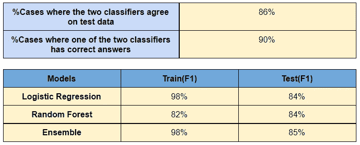

**加州**

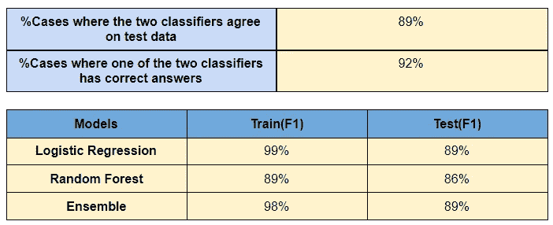

**巴黎**

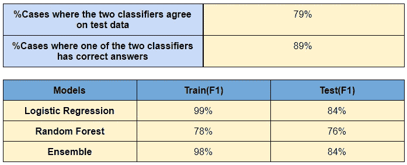

**2。TF-IDF**

**香港**


**巴黎**


**加利福尼亚**

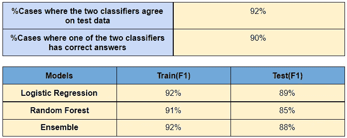

**进一步分析:**通过按月对比评论，我们可以更深入地了解*何时发生*常见公园问题。我们还可以分析不同年份的评论，以告知我们每个分支机构是否试图做出改变来改善游客体验。

**推荐:**很多游客痛点源于排队和人潮的挫败感。大量时间花在排队上，这会激怒人们，并导致更负面的体验。另一个导致排长队问题的常见痛点是公园容量——更多的游客意味着等待景点和食物的时间更长。迪士尼应考虑以下一些建议，采取措施缓解负面公园体验的症状:

*   迪士尼应该想办法优化他们的快速通行证系统。全天提供免费移动快速通行证。
*   在旺季，尤其是夏天，设置最大的公园容量，这样就不会有太多的人排队。炎热的天气只会加剧游客的挫败感。
*   让等待的队伍互动，或者在队伍附近设立小吃摊。让更多的角色在受欢迎的游乐设施周围走动——让该游乐设施中的一些角色与排队的游客互动，并与他们合影。
*   鼓励演职人员执行公园规则，以便游客只在指定区域吸烟(巴黎)，不插队(香港)，并遵守推车政策(加州)。然而，我们意识到这些都是很难解决的问题，因为有些游客试图打破规则，如果他们没有任何后果的话。
*   迪士尼应该在受欢迎的景点附近指定区域来停放或存放婴儿车。这可以减少人行道上的拥挤和盗窃/财产损失。

**参考文献:**

NRCLex:[*https://pypi.org/project/NRCLex/*](https://pypi.org/project/NRCLex/)

https://pypi.org/project/vaderSentiment/

text blob:[*https://pypi.org/project/textblob/*](https://pypi.org/project/textblob/)

基于复合得分的情感赋值:[*https://www . analyticsvidhya . com/blog/2021/01/opinion-analysis-Vader-or-text blob/*](https://www.analyticsvidhya.com/blog/2021/01/sentiment-analysis-vader-or-textblob/)

搭配:[*https://medium . com/@ nicha ruch/collocations-identifying-phrases-that-act-like-individual-words-in-NLP-f58 a 93 a2 f84 a*](https://medium.com/@nicharuch/collocations-identifying-phrases-that-act-like-individual-words-in-nlp-f58a93a2f84a)

航空公司推特:[*https://medium . com/analytics-vid hya/airlines-on-Twitter-理解-客户-投诉-with-NLP-81278 F2 b 68 DC*](https://medium.com/analytics-vidhya/airlines-on-twitter-understanding-customer-complaints-with-nlp-81278f2b68dc)