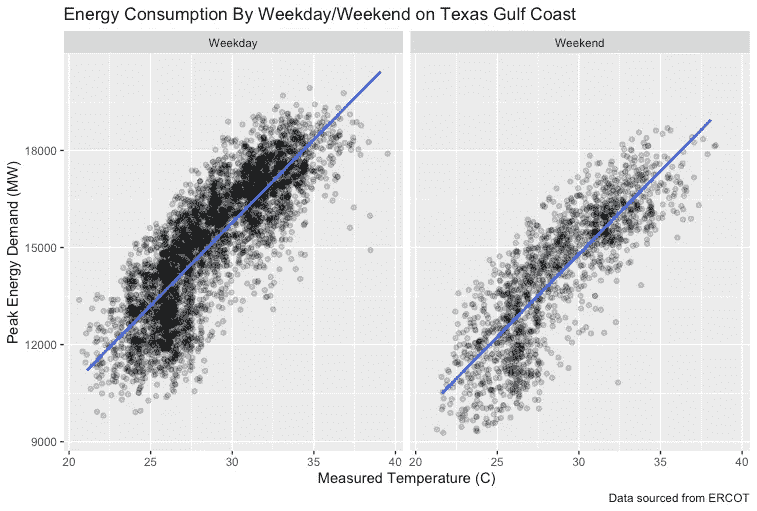

# 分析德克萨斯海湾沿岸的能源消耗习惯

> 原文：<https://towardsdatascience.com/analyzing-energy-consumption-habits-of-the-texas-gulf-coast-ea46a7dfbb9e?source=collection_archive---------36----------------------->

## RStudio 中的多元回归、自举和方差分析


弗拉德·布苏约克在 [Unsplash](https://unsplash.com?utm_source=medium&utm_medium=referral) 上拍摄的照片

# **摘要**

这项分析旨在综合 2010 年至 2016 年期间每年 6 月至 8 月三个月的夏季德克萨斯州墨西哥湾沿岸电力消耗数据。所用数据直接来自 ERCOT，该公司管理着该州约 90%的电力负荷，代表着超过 2600 万德州客户。所有计算均使用 R 和 RStudio 进行。

通过这一分析，我将试图回答两个主要问题:

1.在夏季，工作日与周末相比，白天的耗电量高或低多少？

2.平均而言，功耗如何随温度增加？这种关系在周末和工作日之间似乎有所不同吗？

# **关于数据**

用于此分析的数据集包含 5，820 个关于德克萨斯州墨西哥湾沿岸地区功耗的单独条目。这包括休斯顿周围的地区，并延伸到马塔哥达湾以南。如果你想直观地了解这个地区，你可以在这里查看地图。该数据集中的列如下:

> 时间:每个数据点的日期和时间戳。每个点覆盖上午 9 点到下午 7 点之间的一个小时间隔，并从列出的时间戳开始。
> 
> COAST:指定时间内德克萨斯州整个沿海地区的峰值需求(以兆瓦为单位)。请参见上面的链接地图，进一步了解这一点。
> 
> Temp:休斯顿威廉·p·霍比国际机场气象站记录的所列一小时间隔内的平均温度。所有单位都是摄氏度。
> 
> Weekday:一个二元指示器，表示所讨论的那一天是否是工作日。在本分析中，1 =工作日，0 =周末。

# **接近**

在直接处理任何问题之前，让我们先构建手头数据的可视化。通过执行以下代码块，创建一个简单的日间能耗散点图，作为温度的函数，并按日分类分面，可以很容易地做到这一点:

```
ggplot(data=load_summer, mapping=aes(x=temp, y=COAST)) +
  geom_jitter(width=0.5, alpha=0.2) +
  geom_smooth(se=F, method=lm) +
  facet_wrap(~weekdaytf) +
  labs(
    title = "Energy Consumption By Weekday/Weekend on Texas Gulf Coast",
    caption = "Data sourced from ERCOT",
    x = "Weekday vs. Weekend",
    y = "Peak Energy Demand (MW)"
  )
```

这产生了下面的图:



图片由作者使用 [RStudio](https://rstudio.com/) 制作

毫不奇怪，在峰值能源需求和测量温度之间可以看到一个积极的趋势。我们稍后将进一步研究这种关系。不过，现在让我们来解决第一个问题。

要回答工作日和周末之间的日间功耗变化程度，拟合一个简单的多元回归模型会很有用。这可以用 R 来构造，如下所示:

```
lm1 = lm(COAST ~ temp + weekday + temp:weekday, data=load_summer)
coef(lm1) %>%
  round(3)
```

正如您在这里看到的，我在这个模型中包含了三个主要的预测项:

1.  温度的主要影响
2.  日分类的主要作用
3.  两种主要效应之间的相互作用项

在执行时，给出以下结果:

```
(Intercept)         temp      weekday temp:weekday 
    -569.919      512.214      962.098        0.461
```

这允许我们通过以下线性方程来表达这些变量之间的关系:

*能量需求* = -569.919 + 512.214* *温度* + 962.098* *工作日* + 0.461* *温度:工作日*

虽然这个模型对于简单的估计来说很好，但是它很容易产生很大的误差。为了克服这个问题，我使用了一个简单的 bootstrap 和重新采样的 load_summer 数据，并根据这些结果计算了每个参数的置信区间:

```
lm1_boot = do(10000)*lm(COAST ~ temp + weekday + temp:weekday, data=resample(load_summer))confint(lm1_boot) %>%
  mutate_if(is.numeric, round, 3)
```

**注意:当试图引导一个多元回归模型时，R 有时会很挑剔。如果在运行这段代码时收到奇怪的错误消息，可以直接在原始线性模型上运行 confint()函数。你的置信区间会宽一点，但是在同一个邻域内。*

运行此命令后，我们可以在控制台中查看每个模型参数的 95%置信区间:

```
 name     lower    upper   level   method   estimate
1    Intercept -1013.626 -116.096  0.95 percentile -569.919
2         temp   496.896  527.219  0.95 percentile  512.214
3      weekday   422.334 1487.091  0.95 percentile  962.098
4 temp.weekday   -17.385   18.722  0.95 percentile    0.461
5        sigma  1136.468 1177.841  0.95 percentile 1157.655
6    r.squared     0.691    0.713  0.95 percentile    0.702
7            F  4333.136 4823.466  0.95 percentile 4571.931
```

如果您直接在非自举线性模型上运行 R 的 confint()函数，下面是输出。如前所述，这个简化方法的上限和下限会稍微偏离自举模型提供的估计值。然而，出于本分析的目的，这两种方法都适用:

```
 2.5 %   97.5 %
(Intercept)  -1043.794  -96.044
temp           495.783  528.646
weekday        398.141 1526.056
temp:weekday   -19.075   19.998
```

仅从这些结果来看，我们可以说，在工作日与周末相比，白天的功耗预计会从**422 MW 增加到**1487 MW——保持所有其他变量不变。鉴于该地区的地理位置和一年中的时间，这是有道理的。当这个国家的其他地区可能会在周末看到更高的能源需求，因为个人花更多的时间在家里，休斯顿是热的。办公室和家庭每个月都不得不在空调上花费大量金钱，因此，当全市的办公室试图为员工提供一些夏日阳光时，能源消耗会更高是有道理的。

但是，观测到的温度和能量消耗之间是否也有关联呢？如果是的话，这种关系在周末和工作日之间也有所不同吗？让我们把焦点转移到第二个问题上来，把这个问题搞清楚。

如果你看一下本分析开头的可视化，这两个变量之间的正相关是相当明显的。同样，这也是合乎逻辑的——由于室内气候控制系统的更多使用，能源消耗必然会随着温度的升高而增加。在再次查看了我们的自举置信区间的输出后，看起来平均而言，对于温度上升一度，峰值需求有望从 **~496.896 MW 增加到 527.219 MW。**

评估这种关系在周末和工作日之间是否不同的最简单方法是进行简单的方差分析(ANOVA)。这可以在 R 中通过将 simple_anova()函数应用于我们的原始模型来完成:

```
simple_anova(lm1) %>%
  round(3)
```

执行此代码块将产生以下结果:

```
 Df  R2     R2_improve  sd     sd_improve  pval
Intercept       1 0.000             2120.9                 
temp            1 0.659      0.659  1238.4     882.52 0.000
weekday         1 0.702      0.043  1157.6      80.86 0.000
temp:weekday    1 0.702      0.000  1157.7      -0.10 0.963
Residuals    5816
```

**注:方差分析表本身受制于其中变量的排序，也应如此解读。上面的方差分析表不是这个模型的***方差分析表，而是它的一个单一版本。幸运的是，我们感兴趣的联合效应不会因为任何排序的变化而受到影响。然而，如果将来你发现自己在一个更复杂的回归模型上运行 ANOVA，一定要记住这一点。**

*在回顾了这些结果之后，交互项的增加似乎对模型性能没有太大的改善(至少在小数点后三位没有可测量的 R2 改善)。这是相当明智的。温度对能量消耗的影响不会因天的分类而改变，所以很明显，前面引用的置信区间适用于周末和工作日。*

# ***关闭思路***

*这一分析为德克萨斯海湾地区的能源消耗模式提供了一些很好的见解。然而，我想指出一些缺点。首先，我构建的自举线性模型的置信区间相当宽。由于意外天气事件和电网中断导致能源消耗的巨大自然差异，这并不奇怪。因此，上述模型中引用的数字估计值应被视为估计值。要进一步精确，就需要将消费模式细分为更具体的类别。我个人认为将我们手头的数据与同一时间段的天气报告结合起来会很有趣。这将允许我们建立一个更实用的多元回归模型，因为墨西哥湾沿岸地区比该州的其他地区更容易发生剧烈的天气变化。*

*此外，用于此分析的数据集仅涵盖 6 月至 8 月的三个月夏季。这意味着从这些结果中得出的任何论断都只真正适用于夏季。从这里使用的数据得出任何关于 11 月或 12 月能源消耗习惯的结论都是不明智的。同样，从这一分析中得出国家整体消费习惯的结论也是不可取的。我们的数据受到地点和时间的限制，因此我们的结论也是如此。*

*尽管如此，在过去的一个学期中，这个分析是一个快速而有趣的谜题。该语言内置的 lm()函数使构建回归模型变得简单，只需编写几行代码，而 ggplot2 库允许快速轻松地生成清晰的可视化效果。现代计算能力使得以前复杂的分析变得足够简单，任何人都可以在几分钟内完成。我鼓励大家自己去看看 ERCOT 的数据，看看能做些什么——你可能会发现一些有趣的东西！*