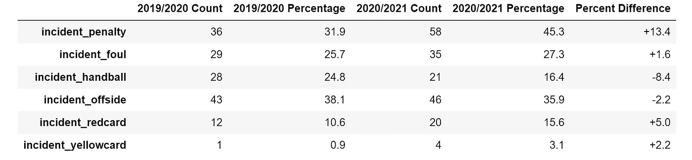

# 英超 VAR 足球决策分析

> 原文：<https://towardsdatascience.com/analyzing-english-premier-league-var-football-decisions-c6d280061ebf?source=collection_archive---------17----------------------->

## 用 Python 回顾英国足球(EPL)中有争议的视频助理裁判的实现

图片由来自 [Pixabay](https://pixabay.com/?utm_source=link-attribution&utm_medium=referral&utm_campaign=image&utm_content=3769454) 的 [chiraphat phaungmala](https://pixabay.com/users/chiraphat-10460848/?utm_source=link-attribution&utm_medium=referral&utm_campaign=image&utm_content=3769454) 拍摄

## **比赛集锦**

> [**动笔:**背景](#42a0)
> [**前半段**:数据采集与准备](#aceb)
> [**后半段:**分析与感悟](#23b4)
> [**专职哨**:结论](#7f8c)

## TL:DR

*   孙香敏是最频繁卷入 VAR 倾覆事件的人
*   风险值事件倾向于在每一半的中间出现**峰值，在每一半的末尾**出现**峰值**
*   **VAR 决策**没有明显偏向**大 6** 团队
*   在两个 EPL 赛季都实施 VAR 的球队中，**布莱顿**拥有**最高**有利于他们的推翻判决的比例(67.9%)，而**西布罗姆维奇**最低(25.0%)
*   链接到这个项目的 GitHub 回购[这里](https://github.com/kennethleungty/English-Premier-League-VAR-Analysis)

我们现在已经准备好开始了，所以让我们继续阅读！

# **启动:背景&背景**

乔纳森·沃德在 [Unsplash](https://unsplash.com?utm_source=medium&utm_medium=referral) 上拍摄的照片

2019 年英超联赛(EPL)引入了视频助理裁判( [VAR](https://www.espn.com.sg/football/english-premier-league/story/3925549/the-ultimate-guide-to-var-in-the-premier-league-all-your-questions-answered) )系统。它包括借助视频回放和音频耳机对裁判判决进行现场审查。

其目的是通过快速纠正明显的错误和严重的失误事件，减少人为错误对比赛结果的负面影响。尽管其意图如此，但由于其对比赛的破坏性影响，大量违反足球逻辑的有争议的规则，以及决策缺乏标准化，它已经受到了大量的抨击。

现在最近两个 EPL 季节已经结束，有足够的数据让我们回顾到目前为止的 VAR 决策。

# 上半年:数据采集和准备

由[托马斯·塞勒](https://unsplash.com/@jesusance?utm_source=medium&utm_medium=referral)在 [Unsplash](https://unsplash.com?utm_source=medium&utm_medium=referral) 上拍摄的照片

***(一)数据来源***

本次分析的数据来自 [ESPN 足球网站](https://www.espn.com.sg/football/english-premier-league/story/4182135/how-var-decisions-affected-every-premier-league-club-in-2020-21)，其分析师在该网站上维护了发生在 EPL 的每个风险值事件的最新公开记录。

以下是关于这些数据的一些重要事实:

*   仅涉及**被推翻的**判决(例如，由现场裁判处理的处罚上诉不包括在内)
*   VAR 仅审核**四种事件类型** : ( **1** )进球/无进球、( **2** )判罚/无判罚、( **3** )直接红牌(非第二张黄牌/警告)、( **4** )认错人(如裁判罚错球员)
*   **2019/2020** 和 **2020/2021** EPL 季节数据分析
*   数据有两个方面: **(1)** 团队 VAR 事件汇总统计 **(2)** VAR 个人事件信息

***(二)数据准备***

虽然数据以清晰的表格格式出现，但是在进行探索性分析之前，仍然需要执行几个预处理步骤。以下是采取的一些关键步骤:

*   对事件描述文本应用字符串操作和正则表达式，以提取裁判判决(即**代表**、**反对、**或**中立**)、事件类型、比赛时间以及所涉球员姓名等特征
*   标准化足球队的名称，因为它们在不同的数据集中以不同的方式表示(例如，曼联和曼联、西布罗姆维奇和西布罗姆维奇、狼队和狼队等)。)
*   删除重复的行，以防止重复计算每个事件，因为每个事件有一行代表团队的“决定”,另一行代表对手的“决定”。

两个重复行的示例，按作者表示同一 VAR 事件|图像

数据准备的代码和细节请参考 [GitHub repo](https://github.com/kennethleungty/English-Premier-League-VAR-Analysis) 。

# 下半年:分析和见解

由[拍摄的混乱足球齿轮](https://unsplash.com/@chaossoccergear?utm_source=medium&utm_medium=referral)在 [Unsplash](https://unsplash.com?utm_source=medium&utm_medium=referral) 上

现在是时候通过从数据中收集有价值的见解来实现一些目标了。我发现通过首先提出业务问题，然后以问答的形式组织分析后的见解来构建分析是最理想的。

## **问题 1:哪些玩家最常卷入风险值事件？**

使用 Python 的`Counter`子类及其`most_common`方法，我们可以识别在 VAR 事件中出现频率最高的足球运动员姓名(名和姓)。我们可以很容易地发现一些熟悉的名字，只要看看计数为 6 或以上的值。

经常参与 VAR 颠覆活动的玩家的名字/姓氏|图片由作者提供

可以看出，VAR 倾覆事件中最常涉及的前五名参与者(括号中显示的数字)是:

*   ***孙香民*** (10)
*   ***萨迪奥·马内*** (8)
*   ***加布里埃尔·赫苏斯*** (7)
*   ***卡勒姆·威尔逊*** (7)
*   ***布鲁诺·费尔南德斯*** (6)

自 2019/2020 赛季引入 VAR 以来，Son Heung-Min 是卷入 VAR 事件次数最多的球员|图片来源:[http://www.soccer.ru/galery/940971.shtml](https://en.wikipedia.org/wiki/Son_Heung-min#/media/File:Son_Heung-min_2016.jpg)(许可:维基共享，CC BY 3.0)

以上强调了领域知识在数据相关项目中的重要性，因为需要熟悉 EPL 足球运动员才能准确识别和解释这些名字。

## **问题 VAR 事件在比赛中最常发生在什么时候？**

接下来，我们研究 VAR 推翻事件在比赛期间是如何分布的。我使用 Tableau 来创建可视化，而不是使用像`seaborn`这样的库，因为 Tableau 的 GUI 使得生成和编辑美观的图表更加有效。

90 分钟内 VAR 倾覆事件的分布。**注**:上半场和下半场的补时已经分别包含在第 45 分钟和第 90 分钟的时间点|图片由作者提供

VAR 倾覆事件数量趋向于在每半场中间**达到高峰(即上半场 24-25 分钟和下半场 76-77 分钟)，在每半场**结束**达到高峰(即 45 和 90 分钟)。**

每半场结束时大量的 VAR 事件可能反映了球队在试图赢得或挽救比赛时进攻(甚至抗议)方法的紧迫性和强度。

## **Qn 3:2020/2021 年的新风险值规则对事件类型的比例有何影响？**

英超推出[2020/2021 赛季新规则](https://www.premierleague.com/news/1816257)改善 VAR 实施，那么让我们看看它对 VAR 事件类型的影响。

就总数而言，与 2019/2020 赛季( **113** )相比，2020/2021 赛季( **128** )出现的 VAR 逆转略多。至于事件类型，最明显的区别是涉及处罚的事件比例**更高**(即+13.4%)。

VAR 倾覆事件类型对比(2019/2020 和 2020/2021 赛季)。事件% do **不等于**到 100%,因为事件类型**不与**互斥|图片由作者提供

从表面上看，有人可能会认为[新的处罚侵犯规则](https://www.premierleague.com/news/1816257)是这种增长的原因。然而，深入调查发现，与 2019/2020 年的**4**(36 起处罚事件)相比，只有**3**(58 起处罚事件)涉及**侵占**。这意味着这一较高的比例可能是由于偶然(或其他不确定的原因)。

新的越位规则也是最近的重大变化，但越位事件的比例仍然大致相同。总体而言,**新规则似乎并未对风险值事件的概况造成重大变化**。

## **问题 4:“六大”团队是否有更多有利于他们的风险值决策？**

欧洲超级联赛的溃败引起了很多争议，EPL 的“六大”球队想要脱离出来，组建他们自己的精英比赛。根据[对“大 6”](https://www.goal.com/en-sg/news/who-are-premier-league-big-six-top-english-clubs-nickname/130iokmi8t8dt1k3kudou73s1k)的定义，看看风险值决策是否对这些顶级团队有任何偏见将是很有吸引力的。

EPL 六大球队。俱乐部价值基于来自[福布斯](https://www.forbes.com/sites/mikeozanian/2021/04/12/the-worlds-most-valuable-soccer-teams-barcelona-on-top-at-48-billion/?sh=234fcad916ac)(2021 年 4 月)|作者图片

三个指标用于评估团队从 VAR 推翻决策中获得的收益:

1.  **净得分:**支持决策的总数减去反对决策的总数
2.  **净目标分数:**根据所有风险值决策授予团队的净目标数
3.  **主观净得分**:主观判定“赞成”的数量(即场上裁判的判定)减去主观判定“反对”的数量

通过三个净指标比较大 6 和非大 6 团队的箱线图。分数越高，团队优势越大|作者图片

仅通过观察方框图，VAR outcomes 似乎更倾向于支持**非大 6，而不是**，主要是在*净主观得分*和*净得分*。

为了从统计上而不是从视觉上证实这一点， [Welch 的 t 检验](https://www.statisticshowto.com/welchs-test-for-unequal-variances/)被用于在所有三个指标上比较两组。

使用 Python 的 SciPy 库运行 Welch 的 t-tests |作者图片

Welch 的 t 检验得出的所有 3 项指标的 p 值均大于 0.05(即**大 6 和非大 6 之间的得分无统计显著差异**)。这意味着没有明显的风险值决策倾向于(或反对)6 大团队，这是令人鼓舞的。

**奖金**洞察力:如果你想知道，在*净进球得分*和*净主观得分*方框图中，大 6 的上部异常值实际上是**曼联**。

## **Qn 5:哪个 EPL 团队的有利决策比率最高(或最低)？**

因为我们看到没有明显偏向六大团队的情况，所以深入了解每个团队的“决策”比率将会很有意思。这将允许我们评估哪些团队拥有对他们有利的最高比例的 VAR 决策。

“支持决策”的百分比是通过将支持团队的决策数除以风险值推翻事件的总数获得的。

EPL 团队的决策比率(降序)|作者图片

看起来布莱顿的风险值推翻决定的比例最高(67.9%)，而诺里奇的比例最低。然而，鉴于**诺维奇**在实施 VAR 的两个赛季中只有一个赛季在 EPL(他们随后被降级)，更公平的说法是**西布罗姆维奇**在两个赛季都在 EPL 的球队中比例最低。

顺便提一下，布莱顿**布莱顿**也**从 VAR 推翻决定中受益最多(与曼联并列)，这是基于对他们有利的决定的绝对数量(19)。**

# **全职哨:结论**

****

**照片由 [Jannes Glas](https://unsplash.com/@jannesglas?utm_source=medium&utm_medium=referral) 在 [Unsplash](https://unsplash.com?utm_source=medium&utm_medium=referral) 上拍摄**

**在这个激动人心的足球分析中，我们使用 Python 分析了公开的 EPL 风险值数据，以更深入地了解最近两个 EPL 赛季所做的风险值决策。**

**笔记本中有更多的见解，所以请在 [GitHub repo](https://github.com/kennethleungty/English-Premier-League-VAR-Analysis) 中查看。**

# **在你走之前**

**欢迎您**加入我的数据科学学习之旅！**点击此[媒体](https://kennethleungty.medium.com/)页面，查看我的 [GitHub](https://github.com/kennethleungty) ，了解更多精彩的数据科学内容。同时，祝你自举愉快！**

**说完了，该回更衣室了，下一场比赛再见！**

** [## 在条形图竞赛中可视化财富 500 强公司

### 使用 Python 和 fluorescent 可视化世界最大公司的排名和收入趋势

towardsdatascience.com](/the-fortune-500-bar-chart-race-9612dc9d0e63)  [## 新冠肺炎疫苗——公众情绪如何？

### 使用 NLP (Stanza、NLTK Vader 和 TextBlob)对新冠肺炎疫苗推文进行逐步情感分析

towardsdatascience.com](/covid-19-vaccine-whats-the-public-sentiment-7149c9b42b99)  [## 两周内获得 Tableau 桌面认证的 3 个步骤

### 获得 Tableau 专家认证，展示您的数据可视化技能和产品知识

towardsdatascience.com](/3-steps-to-get-tableau-desktop-specialist-certified-in-2-weeks-abbef25778de)**