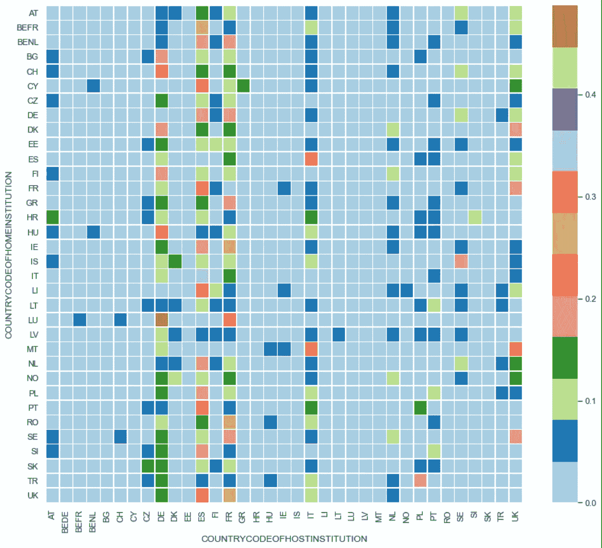

# 解析伊拉斯谟与熊猫的学习交流

> 原文：<https://towardsdatascience.com/analyzing-erasmus-study-exchanges-with-pandas-e1da38896265?source=collection_archive---------51----------------------->

## 在 Erasmus 计划 2011–12 中进行的 200，000 次研究交流的数据集分析结果

由 [Unsplash](https://unsplash.com?utm_source=medium&utm_medium=referral) 上的[窗口](https://unsplash.com/@windows?utm_source=medium&utm_medium=referral)拍摄

自 1987 年以来，伊拉斯谟项目每年为成千上万的欧洲学生提供在另一个欧洲国家度过一个学期或一年的机会，为他们提供一个简单的交流过程以及经济支持。这是一次真正有价值的经历，它打开了他们的思想和心灵，让他们了解欧洲不同的民族、语言和文化。

我在奥地利的维也纳做了我的伊拉斯谟交换，那也是一次难忘的经历。我在那里上过一门课，我们必须做一个关于数据分析的项目， [Hilke van Meurs](https://www.linkedin.com/in/hilke-van-meurs-06346010a/) 和我决定对 2011-12 学年的 [Erasmus exchange 数据进行分析，这些数据可以在](https://data.europa.eu/euodp/en/data/dataset/erasmus-mobility-statistics-2011-12/resource/392ede10-eee8-4191-93ef-7a807ba8cf82)[欧盟开放数据门户](https://data.europa.eu/euodp/en/data/)中找到。一年后的今天，我和你们分享这个项目。

# 设置

我们在这个任务中的主要需求是使用 [JupyterLab](https://data.europa.eu/euodp/en/data/dataset/erasmus-mobility-statistics-2011-12/resource/392ede10-eee8-4191-93ef-7a807ba8cf82) 作为工作环境，使用 [Python](https://python.org) 作为编程语言，使用 [Pandas](http://pandas.pydata.org) 作为数据处理库。此外，我们必须使用 [Matplotlib](http://matplotlib.org) 来绘制一些图形，以及 [Scipy](https://scipy.org) 和 [Numpy](http://numpy.org) 来执行一些操作。

# 理解数据

从[欧盟开放数据门户](https://data.europa.eu/euodp/en/data/)下载的[数据集](https://data.europa.eu/euodp/en/data/dataset/erasmus-mobility-statistics-2011-12/resource/392ede10-eee8-4191-93ef-7a807ba8cf82)是一个 CSV 文件，其中每一行代表一名学生，每一列给出关于她交换的信息，比如她来自的国家和去的大学、学习领域、交换长度……

伊拉斯谟数据集的预览

有很多列，其中很多对这个项目没有用，所以现在不描述它们，我会在我们需要使用它们的时候解释它们的意思。另一个重要的事实是，这个数据集不仅提供了关于学习交流的信息，还提供了其他类型的伊拉斯谟实习的信息，如实习。因为这个项目只关注学习交流，其他的将会被取消，我们很快就会看到。

# 下载和清理数据

所以让我们开始工作吧！首先，让我们从在 JupyterLab 中创建一个新的笔记本开始，导入一些我们需要的基本库，并设置绘图样式:

然后，我们必须从欧盟数据门户服务器下载数据集，并将其转换为熊猫数据框架:

最后，由于该数据集涵盖了学习和实习交流，并且我们希望仅关注学习交流，因此我们将删除与职位安排相对应的行和列:

# 分析单变量

## 年龄、获得的资助和学分

现在，我们的数据已经准备好进行分析，让我们开始计算一些单一变量的最小、最大、平均和标准偏差，如学生的年龄、他们获得的助学金或他们学习的 ECTS(学分)数。为了更好地理解这些数据，我们还会将其绘制成直方图。

例如，让我们看看如何获得学生年龄的那些统计指标(列*年龄*):

2011-12 学年最年轻的伊拉斯谟学生只有 17 岁，太神奇了！但最令人惊讶的是，年龄最大的竟是 83 岁，真是难以置信。我们非常震惊，于是我们在数据集中搜索关于这个人的更多信息，出乎意料的是，不止一个，而是两个英国绅士决定参加这个交换项目。然而，平均年龄是 22 岁。

这同样适用于总计( *STUDYGRANT* )和每月(*study grant/length study period*)收到的资助和学分数(*TOTALECTSCREDITS*)–您可以在完整的笔记本中找到代码。

## 性别百分比

确定男女比例也是非常有趣的。这可以通过从数据帧中获取*性别*列并计算' *F* '(女性)和' *M* '(男性)的出现次数来实现:

很简单，对吧？看起来 60.59%的学生是女性，而男性只有 39.41%。然而，这个比率在不同的目的地大学之间变化很大，我们稍后会看到。

60.59%的学生是女性，39.41%是男性

## 发送和接收大学

你很好奇欧洲送留学生比较多的大学有哪些？然后，只需从 DataFrame 中获取列' *HOMEINSTITUTION* '，用 *value_counts()* 方法计算其唯一值和频率，并绘制成条形图:

发送机构前 10 名

如果你想获得接收机构的前 10 名，只需将' *HOMEINSTITUTION* '替换为' *HOSTINSTITUTION* '即可！不言而喻，前 10 个发送机构中有 8 个也是前 10 个接收机构。

## 语言

英语被认为是世界通用语言，但这并不意味着欧洲学生出国交流时会学习莎士比亚语言的课程。对于数据集中的每个学生，*language teached*列给出了他们接受课程时所用的语言，因此让我们为这些课程画出十种最流行的语言:

正如我们所料，英语是最受欢迎的，有 10.3 万名学生，其次是西班牙语，有 2.7 万名学生，几乎低 4 倍。

到目前为止，英语是教得最多的语言

那么，这是否意味着在英国和爱尔兰，伊拉斯谟的学生用英语授课的比例要比在西班牙用西班牙语、法语等授课的比例高得多？让我们去发现它！

伊拉斯谟学生用当地语言学习的前 10 个国家

一点也不！英国 91.9%的伊拉斯谟学生用英语学习(因此，尽管英语无所不能，但即使在英国也有外语课程)，其次是爱尔兰的 86.8%。第三，西班牙 84.5%的伊拉斯谟学生用西班牙语上课，第四，法国 81.1%的学生用法语上课。第一名和第五名(英国和意大利)的差距只有 14%。

## 主题领域

另一个基本问题是伊拉斯谟学生最受欢迎和最不受欢迎的学科领域是什么。根据[联合国教科文组织的 ISCED 分类](https://en.wikipedia.org/wiki/International_Standard_Classification_of_Education#ISCED_1997_fields_of_education)，有九个学习领域:*教育，人文&艺术，社会科学&商业&法律，科学，工程&制造业&建筑，农业，卫生&福利，服务*。对于我们数据集的每一行，在列 *SUBJECTAREA* 中有一个代表学生学科领域的数字。然而，从那个字段我们只需要第一个数字，所以请注意代码，因为它有一个复杂的函数:

拥有超过 8 万名学生，目前最受欢迎的学习领域是社会科学、商业和法律。银牌和铜牌分别授予*人文&艺术*和*工程、制造&建筑*，分别为 44.7k 和 30.8k 的学生。

# 分析多个变量

## 按接收大学分列的性别比例

有没有想过欧洲有没有「女子大学」或者「男子大学」？嗯，我们很惊讶地知道，有许多机构只接收男性或女性学生，你知道吗？我们可以很容易地对进入大学的女生比例排名前 30 名，对进入大学的男生比例排名前 30 名。

令人惊讶的是，在这两个排名中，男性或女性的百分比都是 100%。除非你列出前 123 所大学，否则你不会看到低于 100%的男性比例，除非你列出前 256 所大学，否则女性比例也不会低于 100%。

## 接收大学的平均年龄

想知道哪些大学接收最老的学生，哪些是最年轻的？

虽然在最年轻的排名中，差距很小，从 18 岁(即巴塞罗那的波布伦努，事实上，它不是一所大学，而是一所技术学院中心)到前 10 名中的 19.5 岁，但在最老的排名中，差距更大:德国的第 21 所大学为 45 岁，而第 10 名是法国的阿尔伯特·加缪中学，其新生的平均年龄为 32 岁。

## 每个国家的学生流入和流出比率

我出生的国家，西班牙，是欧洲学生最向往的出国目的地之一。然而，很多西班牙学生也参加了伊拉斯谟竞赛，就像我一样，所以比例相当均衡。然而，有些国家向海外输送了大量学生，却几乎没有接收任何学生，反之亦然。通过柱状图，我们可以很容易地看到每个国家的发送/接收比率。

# 分析变量之间的相关性

## 母国和东道国

母国和目的地国是分类变量，而不是数字变量，因此计算相关指数并不简单。出于这个原因，我们选择了更直观的东西，比如热图。

在上面的热图中，每行代表一个国家，每列代表一个目的地。每个国家的结果都是标准化的，这意味着颜色代表每个国家(行)选择每个目的地(列)的学生的百分比。从图表中可以看出，这两个变量的熵值非常低，这意味着对于一个特定的国家来说，哪一个是首选目的地是完全可以预测的。让我们为一个国家检查一下:

如果原籍国和目的地国之间没有相关性，那么对于每个原籍国，每个目的地国将接收 2.86%的学生。然而，从上面的热图和饼图来看，情况并非如此。例如，在饼图中，我们可以看到西班牙学生非常喜欢意大利(21.3%)、法国(12.4%)、德国(11.1%)、英国(9.4%)、葡萄牙(6.8%)和波兰(6.6%)。

## 目的地和主题区域

欧洲各地有非常著名的大学，但是很难找到一所在每个知识领域都出类拔萃的大学。因此，了解每个学科领域是否存在对某些机构的偏好会很有意思。因为我们再次处理分类变量，让我们应用和以前一样的技术。

如果学科领域和目的地大学之间的相关性为零，对于每个学科领域，每个目的地大学将接收 0.04%的学生。然而，对于大多数学科领域，接收更多学生的机构在 1%和 3.7%之间，表明这两个变量之间的熵并不高。然而，从这个意义上说，我们找不到任何一所大学比其他大学更突出。“普通”类别的百分比非常高，只有三所院校接收了几乎 50%的学生。

## 母国和东道国以及每月补助金

当我在 2019 年为我的 Erasmus exchange 做文书工作时，我记得西班牙政府根据生活成本设置了三组目的地国家，每个月给每个人不同的补助金。我一到那里，就惊讶地发现一些来自其他欧洲国家的朋友收到的钱比我多或少。那么，每月的补助取决于什么:你要去的国家，还是你来自的国家？让我们去发现它！

每个目的地国家每月补助的方框图

每个派遣国每月赠款的方框图

比较这两个图，排除大量的异常值，很明显，在学生收到的钱的数量上，母国比目的地国是一个更具决定性的因素。在第一张图中，看起来每个目的地国家的每月赠款的平均值相当同质，对于大多数目的地国家来说，方差非常高，从平均值的 50%到 150%不等，而在第二张图中，方差非常低，平均赠款非常异质。因此，正如我在做这个分析之前所想的，每月的补助金主要取决于你来自哪个国家。

我希望这封信对你来说不会太长。事实上，在这篇文章中，我跳过了我们的一些见解，以免写得太长，所以如果你感兴趣，这里有[完整的笔记本](https://github.com/gbarreiro/erasmus-data-analysis/blob/main/Erasmus.ipynb)。我还想再次对 [Hilke van Meurs](https://www.linkedin.com/in/hilke-van-meurs-06346010a/) 为这个项目所做的工作表示感谢。当然，如果你有任何问题或建议，请在评论中告诉我。

# 参考

*   https://jupyter.org/install
*   熊猫 data frame:[https://pandas . pydata . org/pandas-docs/stable/reference/API/pandas。DataFrame.html](https://pandas.pydata.org/pandas-docs/stable/reference/api/pandas.DataFrame.html)
*   https://matplotlib.org/api/
*   伊拉斯谟 2011-12 年数据集:[https://data . Europa . eu/eu ODP/en/data/dataset/伊拉斯谟-移动性-统计-2011-12](https://data.europa.eu/euodp/en/data/dataset/erasmus-mobility-statistics-2011-12)
*   GitHub 中的 Jupyter 笔记本:[https://GitHub . com/gbarreiro/Erasmus-data-analysis/blob/main/Erasmus . ipynb](https://github.com/gbarreiro/erasmus-data-analysis/blob/main/Erasmus.ipynb)