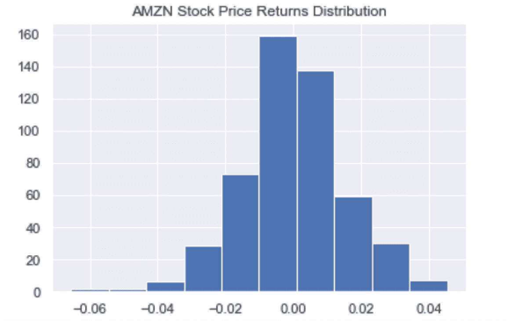
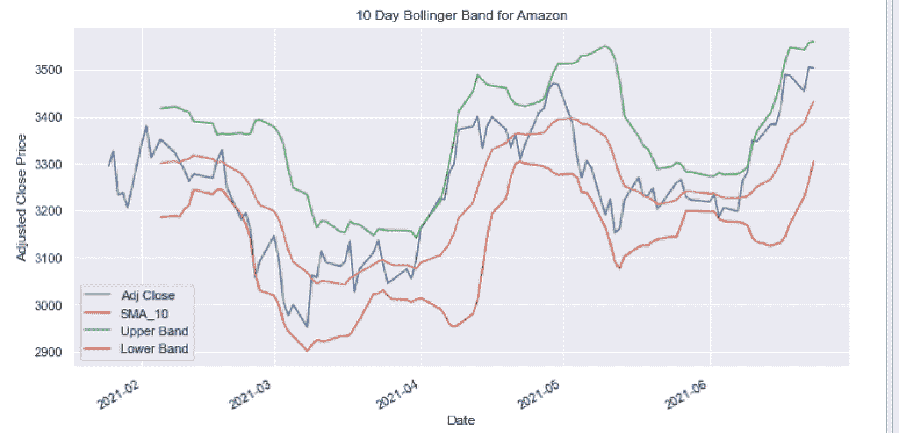

# 用 Python 分析金融数据

> 原文：<https://towardsdatascience.com/analyzing-financial-data-in-python-ccf5c99f55e8?source=collection_archive---------10----------------------->

## 探索 Python 中的金融数据


照片由[energepic.com](https://www.pexels.com/@energepic-com-27411)在[像素](https://www.pexels.com/photo/blue-and-yellow-graph-on-stock-market-monitor-159888/)上拍摄

探索性数据分析(EDA)是每个数据科学家工作流程的重要组成部分。EDA 允许数据科学家总结他们正在处理的数据的最重要的特征。在金融数据分析中，这包括生成简单的汇总统计数据，如回报率和平均回报率的标准差，通过关联热图可视化股票之间的关系，生成股票价格时间序列图、箱线图等。

让我们来分析一下三只股票:亚马逊(Amazon)、谷歌(Google)和苹果(Apple)。我们将看到如何对这些股票进行简单的探索性数据分析，方法是生成汇总统计数据和可视化数据、风险和回报分析，以及生成滞后指标以了解股价趋势。对于想开始学习如何用 Python 分析金融数据的初学者来说，这应该是一个坚实的基础。在我们开始之前，这里有一些我们将使用的工具。

pandas-datareader 是一个 Python 库，允许用户轻松访问股票价格数据并执行统计分析任务，如计算回报、风险、移动平均线等。此外，matplotlib 和 seaborn 是 Python 中的库，进一步允许您创建数据可视化，如箱线图和时间序列图。这些库的组合使数据科学家能够用相对较少的代码行从金融数据中获得强大的洞察力。

股票风险分析对于理解股票价格波动的不确定性非常重要。这可以帮助投资者根据他们的风险承受能力选择他们想要投资的股票。我们可以使用移动平均线计算，通过描述股票价格运动的方向趋势，进一步为投资决策提供信息。

最后，布林线图是可视化价格波动的有用方法。布林线图和均线就是我们所说的滞后指标。这意味着它们基于长期变化，有助于我们理解长期趋势。这与用来预测未来价格变动的领先指标形成对比。

**使用 Pandas-Datareader 访问财务数据**

首先，我们需要在终端中使用以下命令安装 pandas-datareader 库:

pip 安装熊猫-datareader

接下来，让我们打开一个新的 Python 脚本。在脚本的顶部，让我们从 pandas_datareader.data 模块导入 web 对象。让我们也导入内置的 datetime 包，它将允许我们创建 Python datetime 对象:

```
import pandas_datareader.data as webimport datetime
```

现在让我们提取 Amazon 的股票价格数据，将其存储在一个名为 amzn 的变量中，并显示前五行数据:

```
amzn = web.DataReader(‘AMZN’,’yahoo’,start,end)print(amzn.head())
```


作者图片

我们看到数据框有高、低、开仓、收盘、成交量和调整收盘等列。这些值基于交易时段(通常是上午 9:30 到下午 4:00)的股票价格。让我们考虑一下这些列的含义:

*   高价:股票在交易过程中的最高价格
*   低价:股票在交易过程中的最低价格
*   收盘价:股票在交易时段结束时的价格
*   开盘价:股票在交易时段开始时的价格
*   调整后收盘价:对股票分割和股息进行调整后的收盘价

接下来，我们应该使用 pandas to_csv 方法将这些数据保存到一个. csv 文件中:

```
amzn.to_csv(f’amzn_{start}_{end}.csv’, index=False)
```

现在我们已经有了 AMZN 的数据，让我们提取 GOOGL 和 AAPL 的数据。我们将从谷歌开始，然后转移到 AAPL。

```
googl = web.DataReader(‘GOOGL’,’yahoo’,start,end)print(googl.head())googl.to_csv(f”googl_{start}_{end}.csv”, index=False)
```


作者图片

接下来，我们来拉一下 AAPL:

```
aapl = web.DataReader(‘AAPL’,’yahoo’,start,end)print(aapl.head())aapl.to_csv(f”aapl_{start}_{end}.csv”, index=False)
```


我们现在应该有三个文件，包含 AMZN、GOOGL 和 AAPL 两年的股票价格数据。让我们把这些文件读入新的熊猫数据帧:

```
import pandas as pdamzn_df = pd.read_csv(f’amzn_{start}_{end}.csv’)googl_df = pd.read_csv(f’googl_{start}_{end}.csv’)aapl_df = pd.read_csv(f’aapl_{start}_{end}.csv’)
```

**探索和可视化财务数据**

接下来，我们可以生成一些简单的统计数据。理解股票价格变动的一个重要指标是回报率。回报的定义是开盘价减去收盘价除以开盘价(R =[开盘价-收盘价]/开盘价)。让我们计算每个股票的收益。让我们从计算 AMZN 的日回报率开始:

```
amzn_df[‘Returns’] = (amzn_df[‘Close’] — amzn_df[‘Open’])/amzn_df[‘Open’]
```


作者图片

我们可以创建一个简单的可视化图形，即 AMZN 股票价格的每日回报直方图。我们可以使用 seaborn 进行样式设计，使用 matplotlib 生成直方图:

```
import matplotlib.pyplot as pltimport seaborn as snsamzn_df[‘Returns’] = (amzn_df[‘Close’] — amzn_df[‘Open’])/amzn_df[‘Open’]amzn_df[‘Returns’].hist()plt.title(‘AMZN Stock Price Returns Distribution’)plt.show()
```



作者图片

我们可以对谷歌重复这一点:

```
googl_df[‘Returns’] = (googl_df[‘Close’] — googl_df[‘Open’])/googl_df[‘Open’]googl_df[‘Returns’].hist()plt.title(‘GOOGL Stock Price Returns Distribution’)plt.show()
```


作者图片

和 AAPL:

```
aapl_df[‘Returns’] = (aapl_df[‘Close’] — aapl_df[‘Open’])/aapl_df[‘Open’]aapl_df[‘Returns’].hist()plt.title(‘AAPL Stock Price Returns Distribution’)plt.show()
```


作者图片

我们还可以计算每只股票的平均回报率和回报率的标准差，并将它们显示在直方图的标题中。这些统计数据对投资者来说非常重要。平均回报率让我们了解股票投资的盈利能力。标准差是衡量回报波动程度的指标。在金融界，我们称之为风险。通常情况下，高风险伴随着高回报。让我们展示一个 AMZN 的例子。首先，我们将平均值和标准偏差存储在变量中，并使用 f 字符串来格式化标题:

```
mean_amnz_returns = np.round(amzn_df[‘Returns’].mean(), 5)std_amnz_returns = np.round(amzn_df[‘Returns’].std(), 2)plt.title(f’AMZN Stock Price Returns Distribution; Mean {mean_amnz_returns}, STD: {std_amnz_returns}’)plt.show()
```


作者图片

另一个有用的数据可视化是箱线图。类似于直方图，这是另一种可视化数据的均值、离散度和偏斜度的方法。在我们的财务数据的背景下，它可以帮助我们比较每只股票的平均回报、回报的离差和回报的偏度，这有助于为投资决策提供信息。首先，让我们将每只股票的回报合并到一个数据框架中:

```
amzn_df[‘Ticker’] = ‘AMZN’googl_df[‘Ticker’] = ‘GOOGL’aapl_df[‘Ticker’] = ‘AAPL’df = pd.concat([amzn_df, googl_df, aapl_df])df = df[[‘Ticker’, ‘Returns’]]print(df.head())
```


为了生成箱线图，我们使用以下代码:

```
sns.boxplot(x= df[‘Ticker’], y = df[‘Returns’])plt.title(‘Box Plot for AMZN, GOOGL and AAPL Returns’)plt.show()
```


作者图片

我们将讨论的最后一个可视化是退货的关联热图。这种可视化有助于我们理解股票价格回报之间是否存在线性关系。这很重要，因为它可以提供投资者投资组合中股票之间关系的见解，因此也有助于了解投资者如何构建投资组合。为了创建我们的热图，让我们首先创建一个新的数据框，其中包含每个 ticker 的一列:

```
df_corr = pd.DataFrame({‘AMZN’:amzn_df[‘Returns’], ‘GOOGL’:googl_df[‘Returns’], ‘AAPL’:aapl_df[‘Returns’]})
```


接下来让我们计算每只股票收益之间的相关性:


作者图片

这张热图显示，每只股票都有正的线性关系。这意味着，当 AMZN 的日收益增加时，AAPL 和谷歌也可能增加。反之亦然。如果 AMZN 收益减少，其他也可能减少。一个好的投资组合包含多样化的资产。在这种情况下，这意味着我们应该选择彼此相关性不强的股票，如 AAPL、AMZN 和 GOOGL。这是因为如果一只股票的回报下降，你的整个投资组合的回报也会减少。在股票互不相关的多元化投资组合中，一只股票的价格不一定会随着其他股票的价格一起上涨或下跌。

**滞后指标**

我们接下来要做的计算是两种不同的滞后指标，移动平均线和布林线图。移动平均线是分析师用来消除股价短期波动以了解价格方向趋势的常用技术。在这里，我们将绘制 AMZN、GOOGL 和 AAPL 的移动平均线。先说 AMZN。我们将绘制 AMZN 调整后收盘价的 10 天移动平均线，并考虑 2021 年 1 月 23 日之后的股价:

```
cutoff = datetime.datetime(2021,1,23)amzn_df[‘Date’] = pd.to_datetime(amzn_df[‘Date’], format=’%Y/%m/%d’)amzn_df = amzn_df[amzn_df[‘Date’] > cutoff]amzn_df[‘SMA_10’] = amzn_df[‘Close’].rolling(window=10).mean()print(amzn_df.head())plt.plot(amzn_df[‘Date’], amzn_df[‘SMA_10’])plt.plot(amzn_df[‘Date’], amzn_df[‘Adj Close’])plt.title(“Moving average and Adj Close price for AMZN”)plt.ylabel(‘Adj Close Price’)plt.xlabel(‘Date’)plt.show()
```


作者图片

在上图中，蓝线是移动平均线，橙色是调整后的收盘价。我们可以为 GOOGL 做同样的事情:

```
googl_df[‘Date’] = pd.to_datetime(googl_df[‘Date’], format=’%Y/%m/%d’)googl_df = googl_df[googl_df[‘Date’] > cutoff]googl_df[‘SMA_10’] = googl_df[‘Close’].rolling(window=10).mean()print(googl_df.head())plt.plot(googl_df[‘Date’], googl_df[‘SMA_10’])plt.plot(googl_df[‘Date’], googl_df[‘Adj Close’])plt.title(“Moving average and Adj Close price for GOOGL”)plt.ylabel(‘Adj Close Price’)plt.xlabel(‘Date’)plt.show()
```


作者图片

最后是 AAPL:

```
aapl_df[‘Date’] = pd.to_datetime(aapl_df[‘Date’], format=’%Y/%m/%d’)aapl_df = aapl_df[aapl_df[‘Date’] > cutoff]aapl_df[‘SMA_10’] = aapl_df[‘Close’].rolling(window=10).mean()print(googl_df.head())plt.plot(aapl_df[‘Date’], aapl_df[‘SMA_10’])plt.plot(aapl_df[‘Date’], aapl_df[‘Adj Close’])plt.title(“Moving average and Adj Close price for AAPL”)plt.ylabel(‘Adj Close Price’)plt.xlabel(‘Date’)plt.show()
```


我要讨论的最后一种图是布林线图，这是一种可视化移动平均线离差的方法。波段由上限和下限定义，上限和下限与简单移动平均线相差两个标准差。这对交易者很有用，因为这让他们可以利用价格波动的优势。让我们为 AMZN 生成一个布林线图:

```
amzn_df[‘SMA_10_STD’] = amzn_df[‘Adj Close’].rolling(window=20).std()amzn_df[‘Upper Band’] = amzn_df[‘SMA_10’] + (amzn_df[‘SMA_10_STD’] * 2)amzn_df[‘Lower Band’] = amzn_df[‘SMA_10’] — (amzn_df[‘SMA_10_STD’] * 2)amzn_df.index = amzn_df[‘Date’]amzn_df[[‘Adj Close’, ‘SMA_10’, ‘Upper Band’, ‘Lower Band’]].plot(figsize=(12,6))plt.title(’10 Day Bollinger Band for Amazon’)plt.ylabel(‘Adjusted Close Price’)plt.show()
```



作者图片

对于谷歌来说:

```
googl_df[‘SMA_10_STD’] = googl_df[‘Adj Close’].rolling(window=10).std()googl_df[‘Upper Band’] = googl_df[‘SMA_10’] + (googl_df[‘SMA_10_STD’] * 2)googl_df[‘Lower Band’] = googl_df[‘SMA_10’] — (googl_df[‘SMA_10_STD’] * 2)googl_df.index = googl_df[‘Date’]googl_df[[‘Adj Close’, ‘SMA_10’, ‘Upper Band’, ‘Lower Band’]].plot(figsize=(12,6))plt.title(’10 Day Bollinger Band for Google’)plt.ylabel(‘Adjusted Close Price’)plt.show()
```


最后对 AAPL 来说:

```
aapl_df[‘SMA_10_STD’] = aapl_df[‘Adj Close’].rolling(window=10).std()aapl_df[‘Upper Band’] = aapl_df[‘SMA_10’] + (aapl_df[‘SMA_10_STD’] * 2)aapl_df[‘Lower Band’] = aapl_df[‘SMA_10’] — (aapl_df[‘SMA_10_STD’] * 2)aapl_df.index = aapl_df[‘Date’]aapl_df[[‘Adj Close’, ‘SMA_10’, ‘Upper Band’, ‘Lower Band’]].plot(figsize=(12,6))plt.title(’10 Day Bollinger Band for Apple’)plt.ylabel(‘Adjusted Close Price’)plt.show()
```


作者图片

如果你有兴趣访问这篇博客中使用的代码，可以在 [GitHub](https://github.com/spierre91/builtiin/blob/main/financial_data_analysis.py) 上找到。

有各种各样的有用工具可以从财务数据中提取、分析和生成见解。这些工具的组合使得初学者可以很容易地开始使用 Python 处理金融数据。这些技能可以用于个人投资、算法交易、投资组合构建等等。对于任何对金融感兴趣的分析师或数据科学家来说，能够快速生成统计见解、可视化关系并精确定位金融数据的趋势是非常宝贵的。

如果你有兴趣学习 python 编程的基础知识、Pandas 的数据操作以及 python 中的机器学习，请查看[*Python for Data Science and Machine Learning:Python 编程、Pandas 和 sci kit-初学者学习教程*](https://www.amazon.com/dp/B08N38XW2Q/ref=sr_1_1?dchild=1&keywords=sadrach+python&qid=1604966500&s=books&sr=1-1) *。我希望你觉得这篇文章有用/有趣。*

***本帖原载于*** [***内置博客***](https://builtin.com/data-science/) ***。原片可以在这里找到***[](https://builtin.com/data-science/financial-data-analysis)****。****