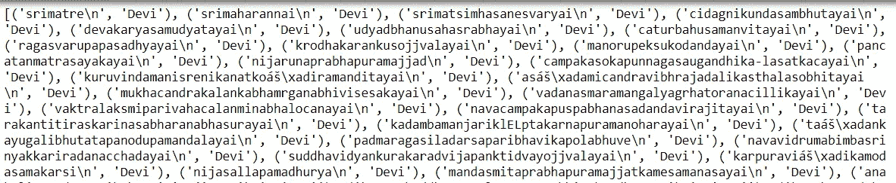
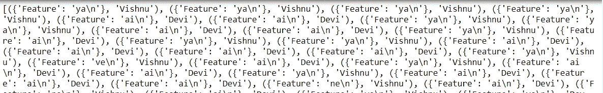
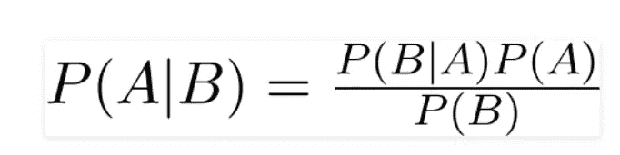
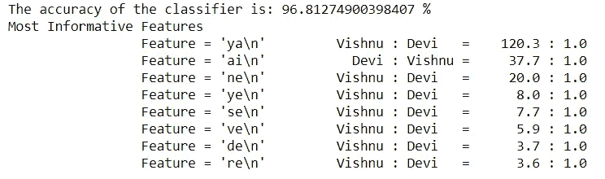
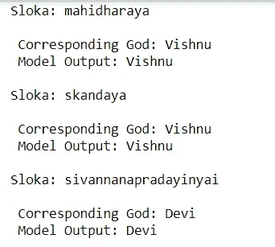

# 用自然语言处理分析印度诗歌

> 原文：<https://towardsdatascience.com/analyzing-hindu-verses-with-nlp-25d72986703b?source=collection_archive---------30----------------------->

## 使用 Python 对“毗湿奴”和“魔鬼”斯洛卡进行分类


布达扬·巴德汉在 [Unsplash](https://unsplash.com?utm_source=medium&utm_medium=referral) 上拍摄的照片

“文本分类”是一种机器学习技术，用于分析文本，然后根据模式或结构对其进行组织或分类。文本分类在人工智能领域有很多 [*应用*](/text-classification-applications-and-use-cases-beab4bfe2e62) 比如新闻文章分析、仇恨言论识别、性别分类等。在这篇文章中，我使用“文本分类”和使用 Python 的自然语言处理(NLP)来分析印度教经文并对它们进行分类。在我们更深入地研究 Python 的技术方面之前，让我们快速地看看我们将处理哪些数据。

“[Sahasranama](https://en.wikipedia.org/wiki/Sahasranama)”——字面上有 1000 个名字(其中“ *sahasra* ”的意思是 1000，而“ *nama* ”的意思是名字)——是一首赞美印度教神的圣歌。<https://en.wikipedia.org/wiki/Lalita_Sahasranama>*【颂难近母女神】和 [*毗湿奴*](https://en.wikipedia.org/wiki/Vishnu_Sahasran%C4%81ma) 【颂摩诃毗湿奴】就是这样两个颂难近母女神和摩诃毗湿奴的诗句，各有 1000 个不同的名字。我从以下链接中获得了用于我们分析的数据:'[*Lalitha Sahasranama*](https://vignanam.org/english/sree-lalita-sahasra-namavali.html)'和'[*Vishnu Sahasranama*](https://stotranidhi.com/en/sri-vishnu-sahasra-namavali-in-english/)'，并对其进行了清理，删除了“om”和“namah”，并将数据保存为 [*文本文件*](https://github.com/dpakapd/sahasranama_analysis) 。*

## *导入库:*

*第一步是导入我们分析所需的库。从下面的代码中可以看出，我们使用了 3 个不同的库。*

```
*#Import required librariesfrom nltk.classify import accuracy #For accuracy predictor
import random #For randomly shuffling the names
import nltk #Natural Language toolkit*
```

*NLTK —自然语言工具包*

*NLTK 准确性——用于显示我们预测的准确性*

*Random —用于为我们的训练集和测试集随机排列名称*

## *加载数据和标记:*

*在“读取”模式下使用 [*open()*](https://docs.python.org/3/tutorial/inputoutput.html) 功能，然后使用 [*readlines()*](https://www.w3schools.com/python/ref_file_readlines.asp) 功能将文件的内容分配给一个列表。*

*读取数据并标记它*

*下一步是将标签' *Devi* '和' *Vishnu* '分配给被读取的相应诗句。这个标签后面会用来给诗句分类。*

**

*标签分配的输出 Jupyter 笔记本的屏幕截图*

*[*random . shuffle()*](https://docs.python.org/3/library/random.html)函数用于随机打乱列表，使数据均匀分布在两个列表中。*

## *特征提取:*

*定义特征提取的函数*

*我们定义一个函数来从列表中传递的诗句中提取特征。定义的函数提取最后 2 个字符来开发模型。*

**

*从诗歌列表中提取特征 Jupyter 笔记本截图*

## *使用朴素贝叶斯分类器创建模型:*

**

*图像专家:走向数据科学— [朴素贝叶斯分类器。什么是量词？|作者 Rohith Gandhi |走向数据科学](/naive-bayes-classifier-81d512f50a7c)*

*朴素贝叶斯分类器基于贝叶斯定理，该定理用于通过假设第二个事件 B 已经发生来找出事件 A 发生的概率。*

*第一步是将数据分为训练集(前 1000 节)和测试集(后 1000 节)。*

*检查最具信息性的特征和模型准确性*

*[nltk . classify . accuracy()](https://www.nltk.org/api/nltk.classify.html)函数用于显示使用训练集或测试集作为参数的预测结果的准确性。*

*[show _ most _ informational _ features](https://www.nltk.org/api/nltk.classify.html#nltk.classify.naivebayes.NaiveBayesClassifier.show_most_informative_features)(n)函数基于特征提取突出显示可用诗句的最具信息性的 n 个特征。*

*分类器精度和“显示大多数信息特征”的输出如下所示。这个分类器有将近 97%的准确率。我们也看到，与神摩诃毗瑟奴相对应的诗句通常以“ya”结尾，而与女神难近母相对应的诗句通常以“ai”作为最后两个字符。*

**

*我们的数据集最具信息性的特征 Jupyter 笔记本截图*

## *检查分类输出:*

**

*检查分类输出 Jupyter 笔记本的屏幕截图*

*让我们检查分类输出，并将其与之前分配给诗句的原始标签进行比较。为此，我们创建一个空列表，然后使用(classifier . classify(name _ features(name)))函数比较模型的输出，并将其与之前最初分配的标签进行比较。如果我们有兴趣查看那些不匹配的，我们可以简单地替换“If”条件来查找输出，其中 model_output！=神。这里显示了一个正确分类输出的示例。*

*检查模型输出与标签*

*整个代码可以通过 [*Github 库*](https://github.com/dpakapd/sahasranama_analysis.git) 下载。*

## *参考资料:*

1.  *[分类(bgu.ac.il)](https://www.cs.bgu.ac.il/~elhadad/nlp16/Classification.html) —使用 NLTK 进行性别分类的优秀范例*
2.  *[Python |使用 NLTK 的性别识别— GeeksforGeeks](https://www.geeksforgeeks.org/python-gender-identification-by-name-using-nltk/)*
3.  *[朴素贝叶斯分类器。什么是量词？|作者 Rohith Gandhi |走向数据科学](/naive-bayes-classifier-81d512f50a7c)*
4.  *[nltk.classify 包— NLTK 3.6.2 文档](https://www.nltk.org/api/nltk.classify.html)*
5.  *[Python 编程教程](https://pythonprogramming.net/naive-bayes-classifier-nltk-tutorial/)*
6.  *[Python 的自然语言工具包(NLTK)教程第 3 部分|作者:Ishan Dixit | Medium](https://medium.com/@ishan.cdixit/pythons-natural-language-tool-kit-nltk-tutorial-part-3-84a8bcb089bd)*