# 使用 QGIS 和 PostGIS 函数分析孟买的出租房屋

> 原文：<https://towardsdatascience.com/analyzing-houses-for-rent-in-mumbai-using-qgis-and-postgis-functions-7383e4223d0d?source=collection_archive---------23----------------------->

## 基于 QGIS 的空间数据分析

作者图片

# 介绍

孟买是印度人口最多的大都市之一，人口持续增长，超过 2000 万。它也被认为是印度的经济首都，因为这里有大量的工业和组织总部。因此，来自全国各地的人们带着各种各样的学习和工作前景来到孟买，这使得房地产行业繁荣起来，出租或租赁的公寓价格飞涨。

在这个项目中，我们将尝试使用 PostGIS 和 QGIS 分析 2020 年孟买出租或出售的公寓，并根据一些预定义的条件得出结论。

# 动机

几个月前，我的表弟试图在市区内找到一套合适的公寓出售。她几乎没有条件将搜索范围从整个孟买缩小到一些特定的地点。条件如下。

1.  她想了解这些房产的价格，以便决定她的预算。
2.  公寓应该在[孟买国际机场](https://www.google.com/maps/place/Chhatrapati+Shivaji+Maharaj+International+Airport/@19.0814197,72.8559774,14.43z/data=!4m5!3m4!1s0x3be7c85099bd2947:0x1ecc1a60c474a8ae!8m2!3d19.0895595!4d72.8656144)的 5 公里半径内(因为她在机场工作)。
3.  公寓应该靠近海滩，面朝大海。
4.  最后，她还想找到去[孟买海军造船厂](https://www.google.com/maps/place/Naval+Dockyard+Building,+Fort,+Mumbai,+Maharashtra+400001,+India/@18.9262575,72.8321752,17z/data=!3m1!4b1!4m5!3m4!1s0x3be7d1c4069faccb:0xf0ae6235c8bb1d79!8m2!3d18.9262575!4d72.834285)的最快路线，因为我的 BIL 在那里工作。

这激起了我的兴趣，我参与了这个项目，并为他们找到了一套符合她大部分标准的好公寓。

# 履行

从分析开始，我从 [Kaggle](https://www.kaggle.com/jedipro/flats-for-rent-in-mumbai/data) 导入了孟买房价数据集。该数据集包含位于孟买市的各种公寓的详细信息。该数据集中可用列的描述如下。

*   面积:房屋的建筑面积
*   浴室数量:可用的浴室数量
*   卧室数量:可用卧室的数量
*   城市:物业所在的城市
*   desc:属性的文本描述
*   开发商名称:房地产开发商的名称
*   floor_count:建筑物的总层数
*   floor_num:物业所在的楼层
*   家具:家具状态
*   id:唯一的 ID
*   id_string:用于抓取特定 HTML 页面元素的唯一 id 字符串。
*   纬度:位置的纬度
*   地点:财产所在的地点
*   经度:位置的经度。
*   post_date:酒店在网站上发布的日期。
*   发帖人姓名:发帖人姓名
*   价格:财产的价格
*   项目:住宅区的名称
*   标题:网站上物业广告的标题
*   交易:财产交易的类型
*   类型:住宅区的类型
*   URL:单个属性的 URL
*   user_type:发布广告的用户的类型

我已经将数据下载为 CSV 文件，然后用 python 编写了一个小程序来清理数据，并将其加载到 PostgreSQL 的一个表中。在这里可以找到笔记本[。](https://github.com/aveek22/cs621-spatial-db/blob/master/01_data_cleaning_analysis.ipynb)

我发现这些列中很少有空值，所以为了简化分析，我考虑删除这些列。在数据清理过程之后，现在需要将数据帧转换为 GeoPandas 数据帧，以便在 PostGIS 中表示空间数据。这里使用的 CRS 是 EPSG:4326。然后将数据加载到 PostgreSQL 数据库中，表名为 *mumbai_house_price_raw* 。

# 分析

我们将执行以下分析，然后在分析过程中得出结论。

1.  在地图上可视化整个数据集
2.  按价格区间分析公寓
3.  寻找机场半径 5 公里内的地方
4.  选择面向大海的公寓
5.  距离海军船坞的距离

# 在地图上可视化整个数据集

现在我们已经在 PostgreSQL 表中有了整个数据集，我们可以很容易地将其导入 QGIS，并可视化孟买的各种房屋。首先，让我们将 OpenStreetMap 导入 QGIS 作为背景层。

转到 Web → QuickMapServices → OSM → OSM 标准。

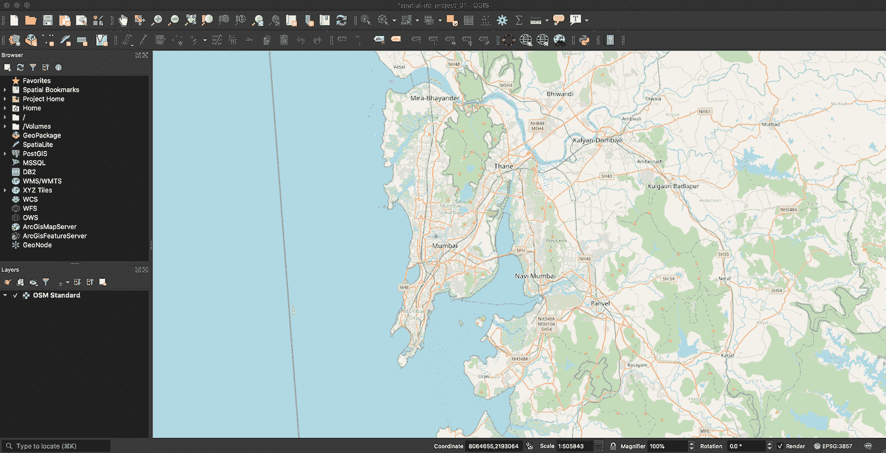

图层→添加图层→添加 Postgis 图层。选择 PostGIS 中可用的表的名称，然后单击添加。

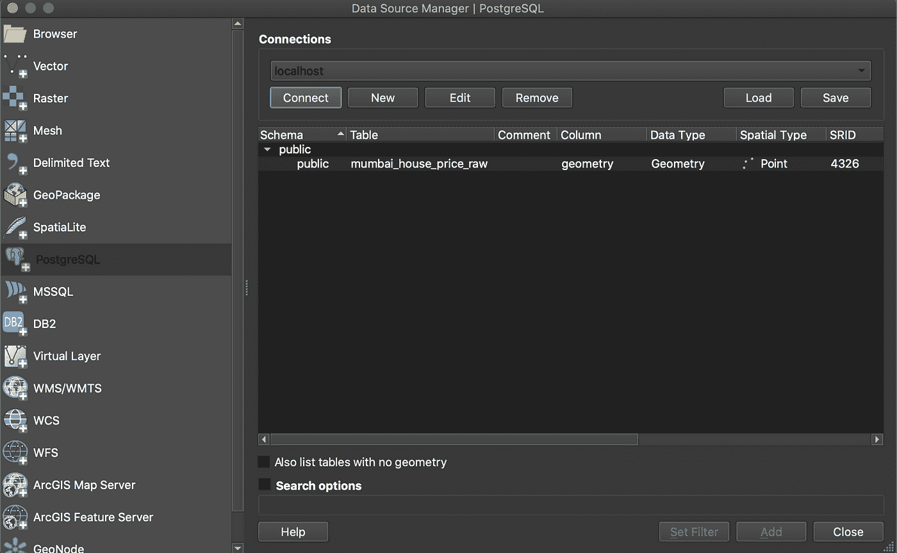

PostgreSQL 表中的所有数据点现在都将加载到 QGIS 图层中，并且这些点将绘制在地图上。为了更好的理解，我还提供了孟买机场和海军船坞的准确位置。

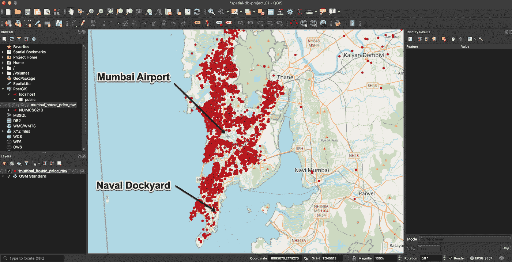

# 按价格区间分析公寓

如上图所示，地图上显示了超过 30000 套公寓。然而，看看这些公寓的价格范围如何因地区而异会很有意思。基本上，我们试图回答的是当地是否对房价有影响。

为此，我们将房价分成如下 3 个部分。

*   低于 20K
*   20K 到 40K
*   40K 以上

我将在 PostgreSQL 表中添加一列，并更新关于 bin 的相关信息。

现在，我们需要刷新已经在 QGIS 中获取的图层。这将带来我们刚刚创建的新列' *house_price_category* 。一旦新列位于图层中，下一步就是基于此类别在地图上显示点。

右键单击图层→属性→符号系统→分类→值= house_price_category →颜色渐变=为 3 个类别创建手动颜色渐变→分类。

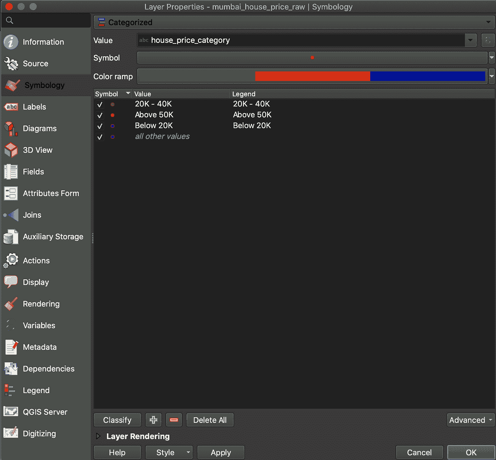

这将把地图上的所有点分类到三个箱中，如下所示。

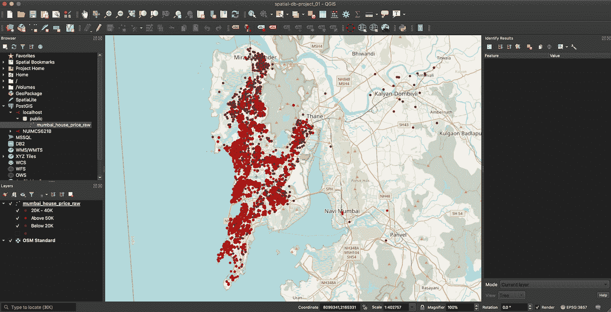

从上面的分析中，我们现在对在孟买市找房子的预算有了一个概念。虽然很少房子的价格低于 40K(绿色和蓝色，T1)，但大多数房子的价格高于 40K(T2 红色，T3)。为了验证上述观察结果，我使用 SQL 做了一个快速检查，以找到每个类别中的公寓数量。

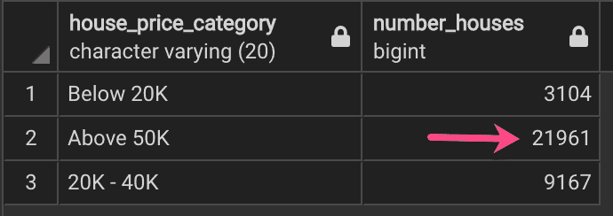

经核实，在 5 万套以上的公寓中，大约有 2 万多套。所以，如果我们保持高预算，租一套更好的公寓的可能性更大。

# 寻找机场半径 5 公里以内的地方

> 孟买机场位置:Lon: 72.874374，Lat: 19.096713

1.  在 PostgreSQL 中创建一个查询，该查询将过滤机场 5 公里半径内的建筑物名称→创建并将其存储在视图中。
2.  将上一步创建的视图提取到 QGIS 中，并绘制公寓图。

以下是距机场 5 公里范围内所有公寓的平面图。

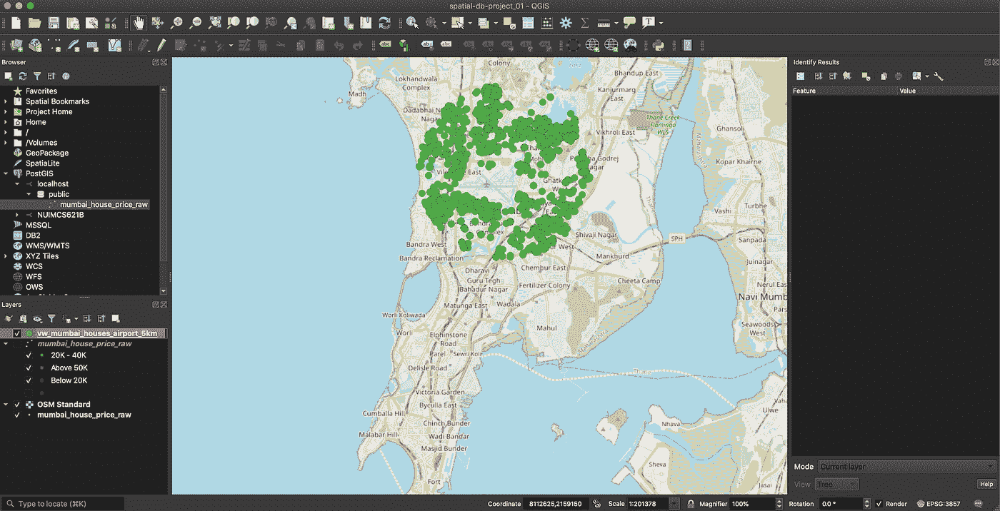

# 选择面朝大海的公寓

在这里，我们需要找到面朝大海的公寓。这是一个棘手的部分，因为我们需要某种基准来决定公寓是靠近还是远离海岸，以及公寓是否面向西方。对于那些靠近海滩但面朝其他方向的公寓，应该排除在分析之外。

我们可以从 OSM 获取海岸线。为此，我们需要安装快速浏览插件，然后选择矢量→快速浏览→快速浏览。在快速查询页签中，提供关键字为*自然*、值为*海岸线*，选择*画布范围*点击*运行查询*。

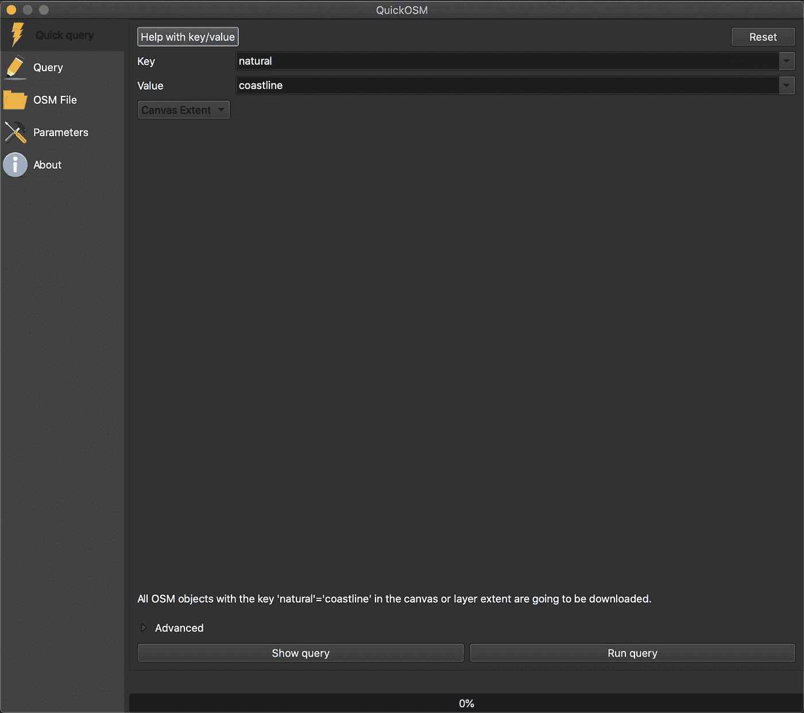

这是在 QGIS 中作为孟买海岸线的一部分导入的。我们可以导出这条海岸线，并将其保存为一个 SQL 转储，然后加载到 PostgreSQL 表中。你可以看到部分海岸线用黑色突出显示。

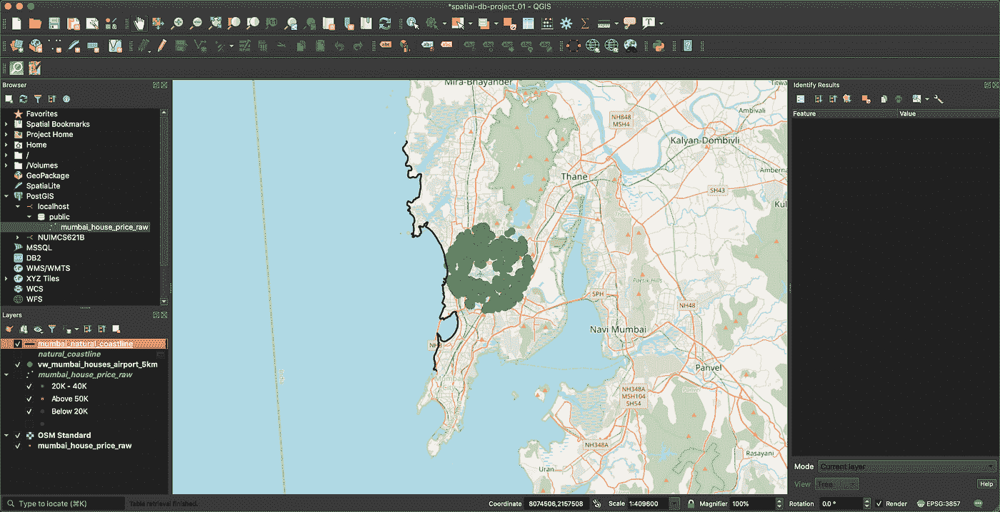

既然海岸线已经准备好了，我们可以在海岸的一边创建一个 1000 米的缓冲区，它会显示缓冲区内的公寓。

转到数据库管理器，编写一个简单的 SQL 查询，如下所示，根据海岸线几何数据获取缓冲区。将其作为新图层导入到 QGIS 中。

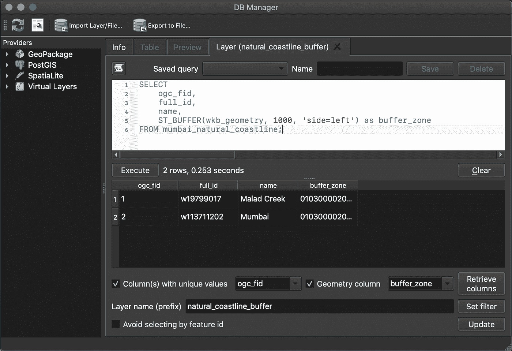

对于面朝大海的公寓，他们需要面朝西方。“ *desc* ”列包含该信息，我们将创建一个视图，使用 REGEX 过滤匹配单词‘T14’朝西’或‘T16’朝西’的记录。将此新视图导入 QGIS 并绘制输出。

以下是最终输出。

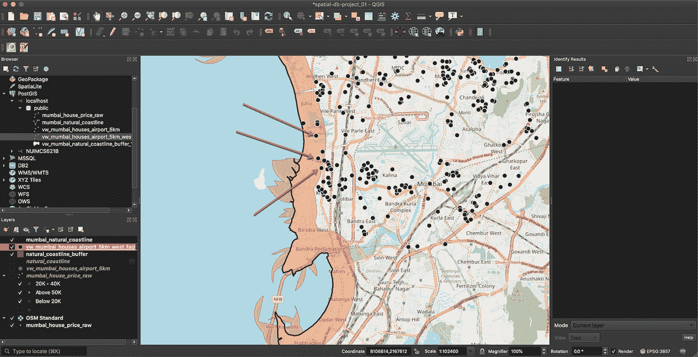

在这里，正如你所看到的，我们有一些朝西的公寓和 1000 米的海岸线缓冲区。位于缓冲区的公寓是我们的兴趣点，因为它们都在海滩的 1000 米范围内，并且都朝西。所以这些公寓可以通过实地参观来进一步调查。

# 最终分析-距海军船坞的距离

经过实地考察，他们决定敲定位于 Juhu Tara 路的 2BHK 公寓，详情如下。

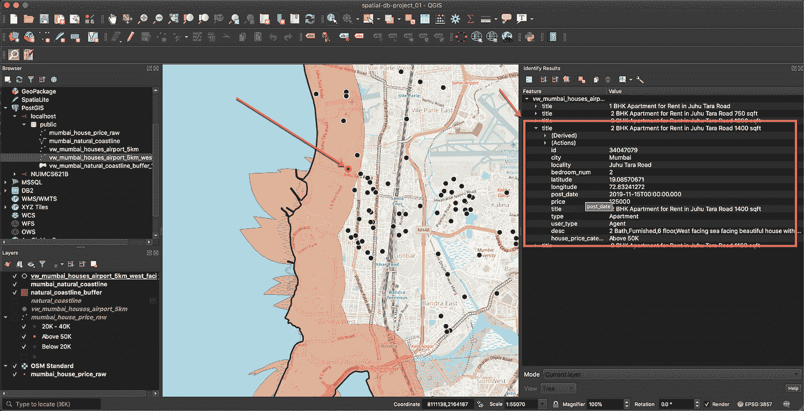

现在，我们将设法找到最快和最短的路线乘车到海军船坞。

> 海军造船厂位置:经度:72.832096，纬度:18.926257

为此，我们将使用名为 ORS 工具的开放路线服务插件。

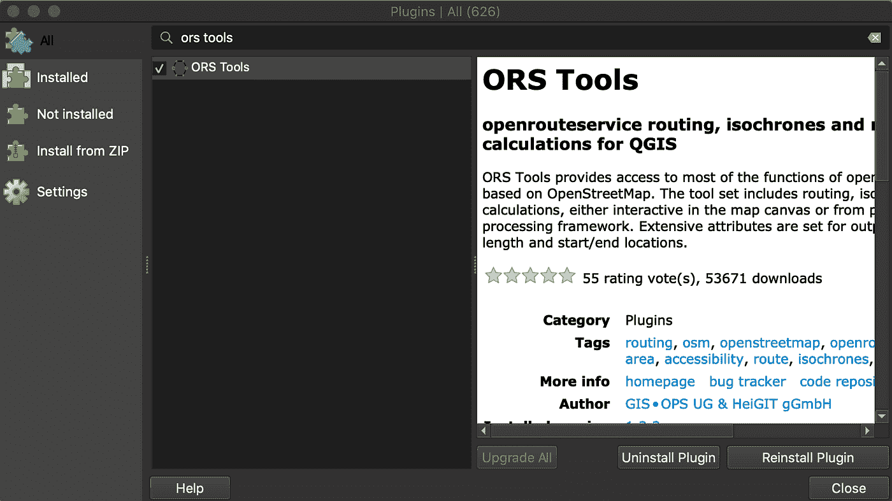

一旦插件安装完毕，下一步就是在[openrouteservice.org](http://openrouteservice.org)注册并获得一个 API 密钥。

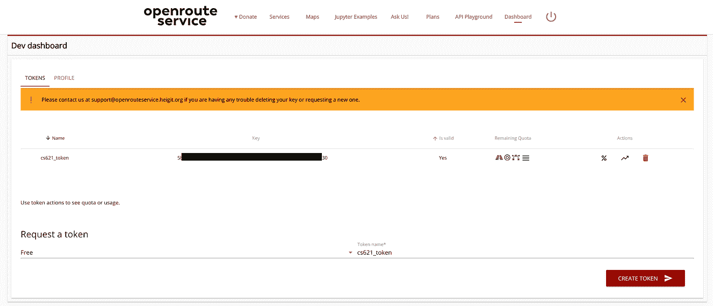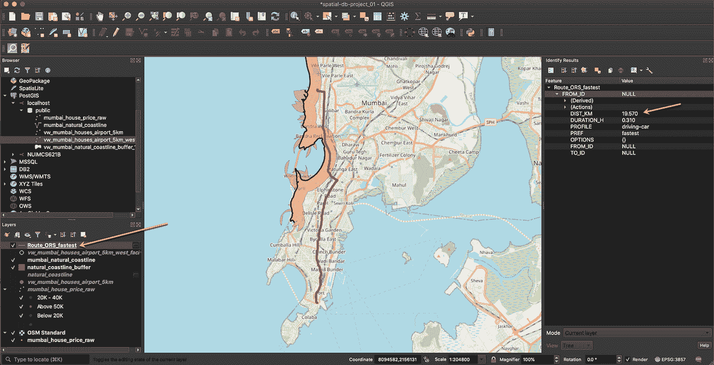

如上图所示，我们选择了起点作为家，终点作为海军船坞交汇处。上面显示了驾驶汽车时最快的路线，距离约为 19.5 公里。

或者，我们也可以进行最短路径分析，看看最快路径和最短路径是否相同。仅通过改变参数重复上述过程。

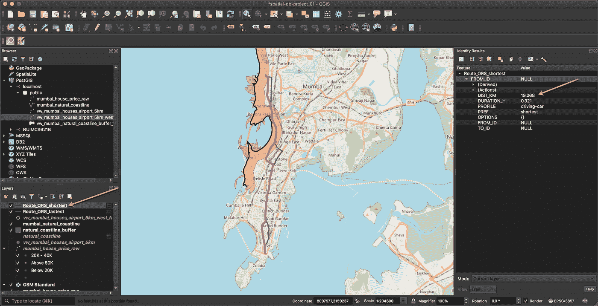

如上图所示，最短路径约为 19.2 公里，在某些点上与最快路径不同。

# 结论

到目前为止，在这个项目中，我们已经广泛利用 QGIS 和 PostGIS 功能来分析孟买市的房屋，并得出了购买或租赁符合我们要求的房屋的结论。我们还计算了从公寓到海军船坞的最快和最短的路线，并了解到两条路线之间有一些小的差异。

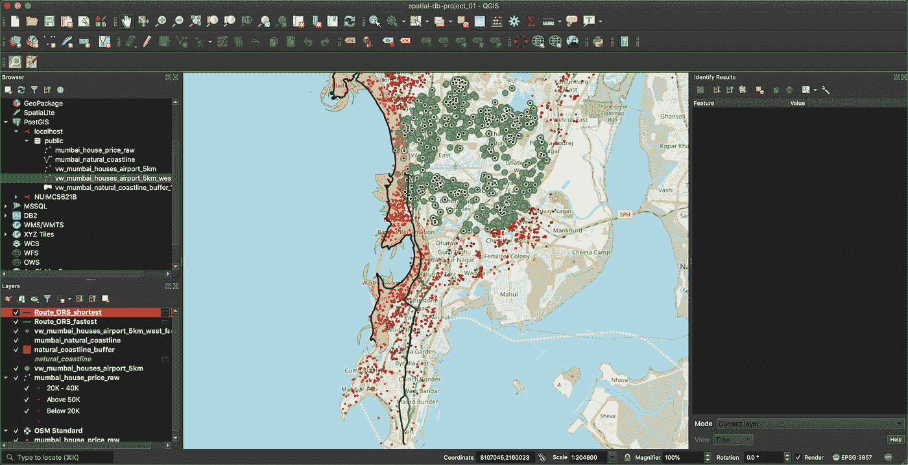

QGIS 所有图层

上面是我们在这个项目中分析过的所有图层的示意图，下面会提到图例。

*   小圆点(红/绿/蓝)——所有可供出售的公寓。
*   绿色大圆圈——机场 5 公里半径内的公寓。
*   带黑点的绿色大圆圈——机场半径 5 公里内的公寓，面朝西。
*   黑线-该区域的海岸线。
*   橙色斑块——海岸线的缓冲区，距离海岸线 1000 米。
*   蓝线——从公寓到海军船坞的最快路线。
*   绿线——从公寓到海军船坞的最短路线。

该项目及其源代码可以在 https://github.com/aveek22/cs621-spatial-db 的[找到。](https://github.com/aveek22/cs621-spatial-db)