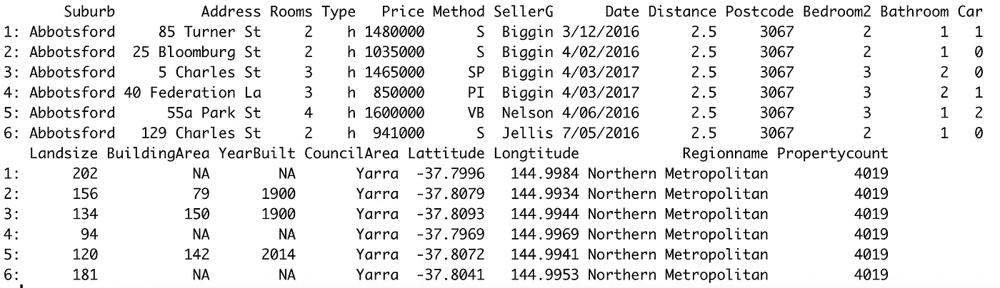
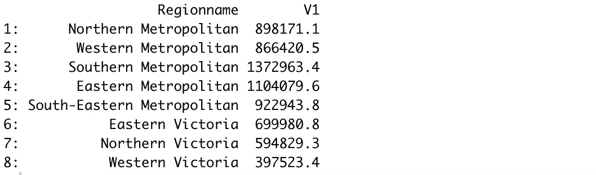
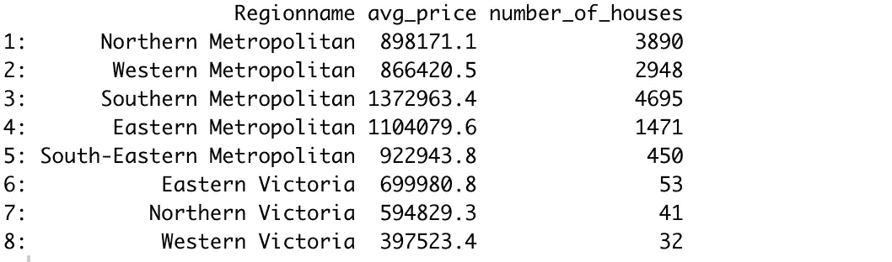
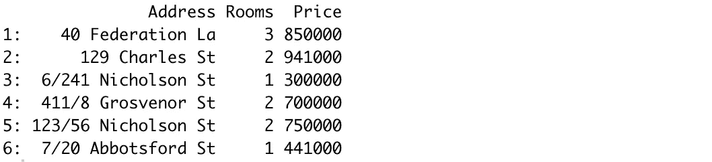
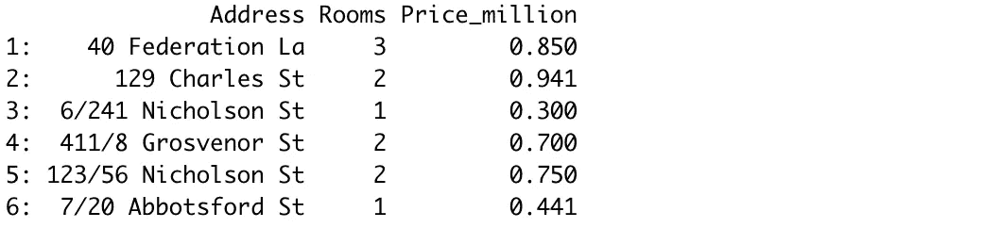
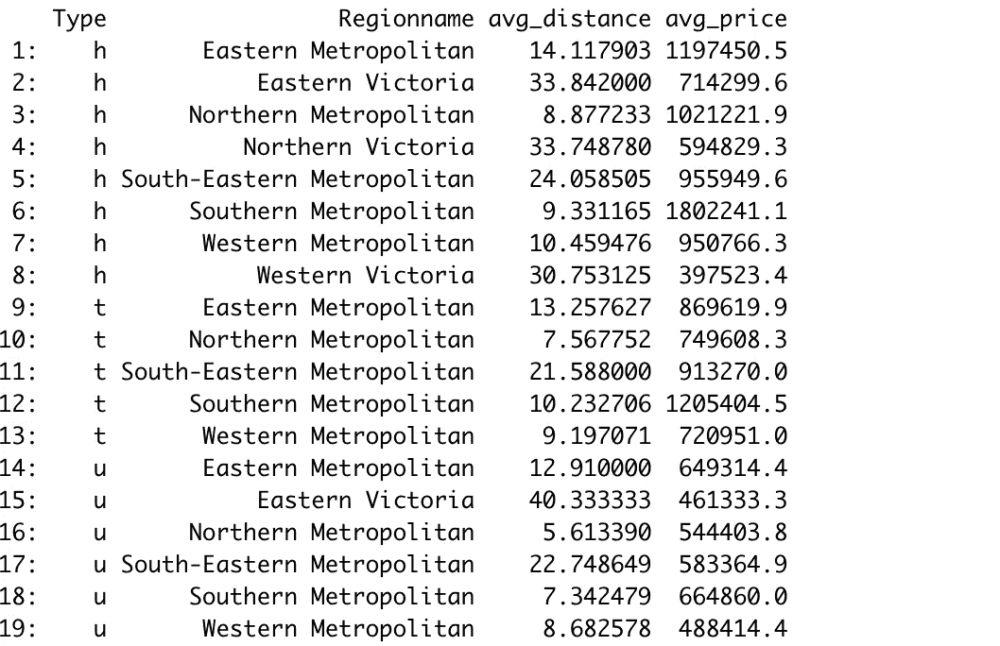
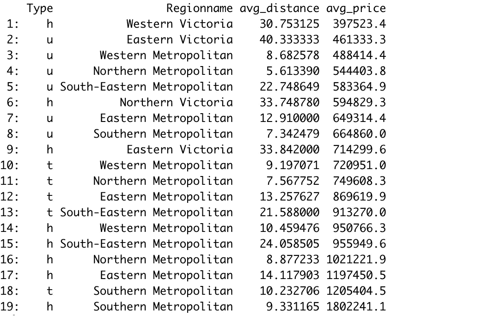

# 用 R 分析墨尔本房价

> 原文：<https://towardsdatascience.com/analyzing-melbourne-house-prices-with-r-5c13218f242d?source=collection_archive---------11----------------------->

## 数据分析综合实践指南。


哈姆扎·扎伊迪在 [Unsplash](https://unsplash.com/s/photos/melbourne-city?utm_source=unsplash&utm_medium=referral&utm_content=creditCopyText) 上的照片

有几个库和包为数据科学家、分析师或任何对数据感兴趣的人提供了执行高效数据分析的功能。它们中的大多数都有很好的文档记录，所以您可以很容易地找到一个函数是做什么的。

然而，学习这些库的最好方法是通过实践。仅仅知道一个函数做什么是不够的。我们应该能够在正确的时间和地点回忆和使用它们。因此，我强烈建议练习学习一个包或库。

在本文中，我们将使用 R 包探索并深入了解 Kaggle 上可用的墨尔本房屋[数据集](https://www.kaggle.com/dansbecker/melbourne-housing-snapshot)。

对于数据分析和操作，我们将使用 r 的 data.table 包。

```
> library(data.table)> house_prices <- fread("Downloads/melb_data.csv")> head(house_prices)
```



(图片由作者提供)

该数据集包含墨尔本房屋的几个属性及其价格。因为这个数据集的焦点是价格，所以最好先了解一下价格列。

```
> house_prices[, summary(Price)] Min.  1st Qu.  Median     Mean  3rd Qu.     Max. 
  85000  650000   903000  1075684  1330000  9000000
```

我们使用 price 列上的 summary 函数来获得基本统计数据的概述。平均房价约 107 万。

我们知道一般的平均房价。我们可能需要比较不同地区的房价。这是一个按任务分组的方法，可以通过添加用于分组的列名来轻松完成。

```
> house_prices[, mean(Price), by = Regionname]
```



(图片由作者提供)

聚合列表示为“V1 ”,这并不能提供很多信息。我们可以为聚合列指定一个名称，只需稍微改变一下语法。让我们也计算一下每个地区的房屋数量以及平均房价。

```
> house_prices[, .(avg_price = mean(Price), number_of_houses = .N), by = Regionname]
```



(图片由作者提供)

数据集中有 3 种类型的房屋，h 代表住宅，u 代表单元住宅，t 代表联排住宅。data.table 包还允许过滤以及聚合和分组。

例如，我们可以计算北部大都市地区每种房屋类型的平均土地面积。

```
> house_prices[Regionname == 'Northern Metropolitan', .(avg_size = mean(Landsize)), by = Type] Type  avg_size
1:    h  619.2491
2:    u  495.0265
3:    t  317.3257
```

我觉得还是详细阐述一下 data.table 库使用的语法结构比较好。

```
datatable[ filter/order , select/aggregate/update , by ]
```

第一个逗号之前的表达式用于排序或过滤。在前面的示例中，我们根据 region name 列过滤了观察值(即行)。

第二部分用于汇总、选择或更新。正如您在示例中看到的，我们已经计算了这一部分的平均价格。最后一部分是根据给定列中的类别对行进行分组。

语法结构提供了执行数据操作、选择和转换的有效方式。例如，我们可以创建一个子集，其中只包含价格低于 100 万英镑的房屋的地址、房间数量和价格。

```
> subset = house_prices[Price < 1000000, .(Address, Rooms, Price)]
> head(subset)
```



(图片由作者提供)

我们还可以在选择列的同时执行数据转换或聚合。例如，我们可以在子集中以百万为单位表示价格。

```
> subset = house_prices[
     Price < 1000000, 
     .(Address, Rooms, Price_million = (Price/1000000))
]
> head(subset)
```



(图片由作者提供)

如果我们使用“keyby”参数而不是“by”参数，那么结果集将根据类别的升序进行排序。考虑下面的例子。

```
> house_prices[
      ,.(avg_distance = mean(Distance), avg_price = mean(Price)) 
      ,keyby =.(Type, Regionname)
]
```



(图片由作者提供)

正如我们所看到的，type 和 region name 列中的类别是按升序排序的。

data.table 包允许链式操作，这进一步简化了更复杂操作的语法。回想一下前面的例子，我们计算了每种类型和地区名称组合的房屋的平均距离和价格。

我们可能希望根据聚合值(如平均价格)对组进行排序。下面是我们如何完成这项任务。

```
> house_prices[
      ,.(avg_distance = mean(Distance), avg_price = mean(Price)) 
      ,by =.(Type, Regionname)
][order(avg_price)]
```



(图片由作者提供)

默认情况下，order 函数按升序对值进行排序。我们可以通过在列名前面添加一个减号(例如 order(-avg_price))来将其更改为降序。

## 结论

我们已经做了几个例子来演示 data.table 包用于数据分析和操作的简单而有效的方法。

能够将过滤、选择、转换和聚合组合到一个方括号中，这使得操作更加直观。

在 data.table 包中还有更多的内容要介绍，但是我们在本文中介绍的内容为高效的数据分析提供了一组不错的操作。

感谢您的阅读。如果您有任何反馈，请告诉我。