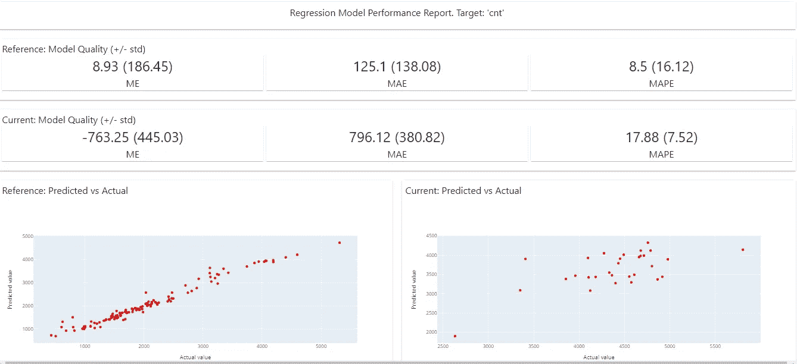
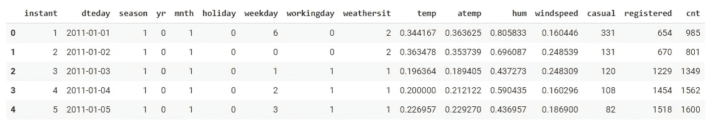
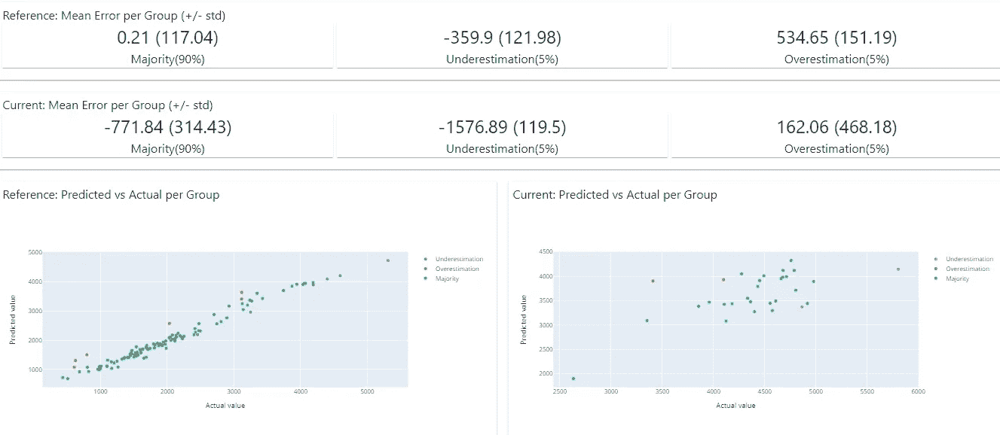

# 使用仪表板分析 ML 模型

> 原文：<https://towardsdatascience.com/analyzing-ml-model-using-dashboard-f69e17a942f9?source=collection_archive---------14----------------------->

## 显然用于创建机器学习模型仪表板



来源:作者

解释机器学习模型是一个困难的过程，因为通常大多数模型都是一个黑盒，我们并不真正知道模型内部发生了什么。创建不同类型的可视化有助于理解模型是如何执行的，但是很少有库可以用来解释模型是如何工作的。

一个模型的性能可以基于不同的度量标准，如分类报告、MAE、MSE 等。类似地，有不同的可视化显示数据的漂移，这意味着特征分布的变化，我们也可以在目标变量中找到这种漂移。

显然是一个开源 Python 库，用于创建交互式可视报告、仪表盘和 JSON 配置文件，有助于在验证和预测期间分析机器学习模型。它可以创建 6 种不同类型的报告，涉及数据漂移、分类或回归的模型性能等。

在本文中，我们将探索并创建交互式报告/仪表板。

让我们开始吧…

# 安装所需的库

我们将从使用 pip 安装开始。下面给出的命令可以做到这一点。

```
!pip install evidently
```

# 导入所需的库

在这一步中，我们将导入创建 ML 模型所需的库。我们还将导入一些库，这些库将用于创建一个仪表板来分析模型性能。此外，我们将导入熊猫来加载数据集。

```
import pandas as pd
import numpy as np
from sklearn.ensemble import RandomForestRegressor
from evidently.dashboard import Dashboard
from evidently.tabs import RegressionPerformanceTab
from evidently.model_profile import Profile
from evidently.profile_sections import RegressionPerformanceProfileSection
```

# 加载数据集

在这一步中，我们将加载数据，并将其分为参考数据和预测数据。

```
raw_data = pd.read_csv('/content/day.csv', header = 0, sep = ',', parse_dates=['dteday'])ref_data = raw_data[:120]
prod_data = raw_data[120:150]ref_data.head()
```



数据集(来源:作者)

# 创建模型

在这一步中，我们将创建机器学习模型，对于这个特定的数据集，我们使用随机森林回归模型。

```
target = 'cnt'
datetime = 'dteday'
numerical_features = ['mnth', 'temp', 'atemp', 'hum', 'windspeed']
categorical_features = ['season', 'holiday', 'weekday', 'workingday', 'weathersit',]
features = numerical_features + categorical_featuresmodel = RandomForestRegressor(random_state = 0)model.fit(ref_data[features], ref_data[target])ref_data['prediction']  = model.predict(ref_data[features])
prod_data['prediction'] = model.predict(prod_data[features])
```

# 创建仪表板

在此步骤中，我们将创建仪表板，用于解释模型性能和分析模型的不同属性，如 MAE、MAPE、误差分布等。

```
column_mapping = {}
column_mapping['target'] = target
column_mapping['prediction'] = 'prediction'
column_mapping['datetime'] = datetime
column_mapping['numerical_features'] = numerical_features
column_mapping['categorical_features'] = categorical_featuresdashboard = Dashboard(tabs=[RegressionPerformanceTab])dashboard .calculate(ref_data, prod_data, column_mapping=column_mapping)dashboard.save('bike_sharing_demand_model_perfomance.html')
```



仪表板(来源:作者)

在上面的图片中，我们可以清楚地看到显示模型性能的报告，您可以下载我们使用上面的代码为本文创建的 HTML 报告。HTML 报告是可共享的，可以在不同的浏览器中打开。

继续尝试使用不同的数据集和机器学习模型仪表板。如果您发现任何困难，请在回复部分告诉我。

本文是与 [Piyush Ingale](https://medium.com/u/40808d551f5a?source=post_page-----f69e17a942f9--------------------------------) 合作完成的。

# 在你走之前

***感谢*** *的阅读！如果你想与我取得联系，请随时通过 hmix13@gmail.com 联系我或我的* [***LinkedIn 个人资料***](http://www.linkedin.com/in/himanshusharmads) *。可以查看我的*[***Github***](https://github.com/hmix13)**简介针对不同的数据科学项目和包教程。还有，随意探索* [***我的简介***](https://medium.com/@hmix13) *，阅读我写过的与数据科学相关的不同文章。**