# 分析音乐品味

> 原文：<https://towardsdatascience.com/analyzing-music-taste-64202f602bcd?source=collection_archive---------24----------------------->

## 使用 Spotify API 的音乐属性来评估我的音乐品味，并预测我是否会喜欢一首歌


阿列克谢·鲁班在 [Unsplash](https://unsplash.com?utm_source=medium&utm_medium=referral) 上的照片

我是一个音乐迷，大约 8 年来，我一直专门使用 Spotify 的平台来听音乐和播客，发现新音乐，并与朋友合作播放列表。Spotify 也有一个强大的 API，可以提供 Spotify 上 5000 多万首歌曲的大量信息，包括独特的音频属性——捕捉歌曲各种分类方式的数字特征。更多关于音频属性的信息可以在[这里](https://developer.spotify.com/documentation/web-api/reference/#object-audiofeaturesobject)找到。

Spotify 使用这些音频功能以及一整套复杂的模型来识别您喜欢的新音乐的良好匹配(为什么您的 Discover Weekly 播放列表可以如此有效地向您显示您将重复播放一整周的下一首歌曲)。在这篇文章中，我分析了我的流媒体历史的特征，并使用机器学习方法来尝试和预测我是否会喜欢我输入到模型中的歌曲。

我从 Spotify 请求您的数据时收到的 zip 文件中获得了. JSON 格式的流媒体历史记录。如果您想为您的帐户获取相同的信息，请从桌面登录您的帐户，单击“隐私设置”，然后单击“下载您的数据”下的“请求”

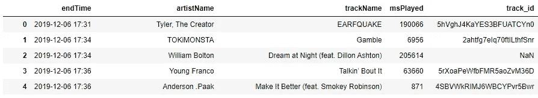

我的流历史数据帧的前几行。图片作者。

使用 Spotify 的 API，我获得了数据帧中每首歌曲的音频属性。

在删除了一些不太有用的返回列后，我们剩下的是:

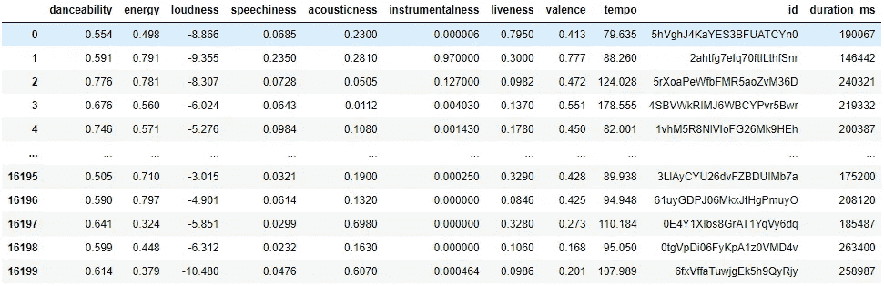

具有音频功能的数据帧。图片作者。

我听了多少音乐？

```
print(‘Streaming history shows a total of %s listened minutes’ % format((df[‘msPlayed’].sum()*.001)/60))>>> Streaming history shows a total of 30602.300566666665 listened minutes
```

根据这个列表，在 12/6/19 到 12/6/20 之间大约有 30.6k 分钟(这和我的“2020 Wrapped”总结告诉我的差不多)。

我很好奇每首歌的节奏(每分钟节拍数)有多准确。对于我列表中最慢的两首和最快的两首歌曲，我也用[软件](https://taptempo.io/)录制了 BPM。看起来 API 中的一些录制的节奏实际上是我对节奏分类的细分，因为四首歌中有三首是我录制的 BPM 的两倍:

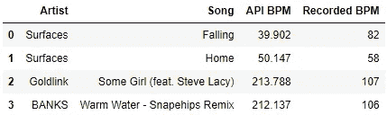

## 探索性数据分析

在深入 EDA 之前，我生成了两个数据集，一个“好”和一个“坏”播放列表，用于训练一个模型来分类我喜欢和不喜欢的音乐。虽然使用具有 15，800 个数据点的流媒体历史数据集是理想的，但数据将是高度不对称的，因为我没有长度相等的播放列表来播放我不喜欢的歌曲。相反，我在我的账户上使用了不同的播放列表——202 首歌曲。我为我不喜欢的歌曲生成了一个相当于 200 首歌曲的播放列表。这不是一个有趣的任务，但浏览“热门电台歌曲”让它很快过去。感谢 Spotify！

深入研究 EDA，让我们首先绘制每个音频特性的频率分布。

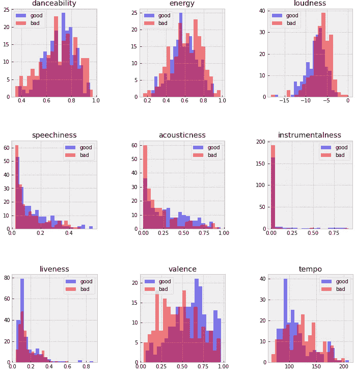

虽然一些要素的分布显示出明显的重叠，但我们现在将保留它们，因为包含所有要素的数据集和维度很小。我对节奏的分布感到非常惊讶——我不期望看到明显的区别。跨 3 个数据集比较的每个特征的平均值绘制如下(在最小最大缩放速度和响度特征之后)。

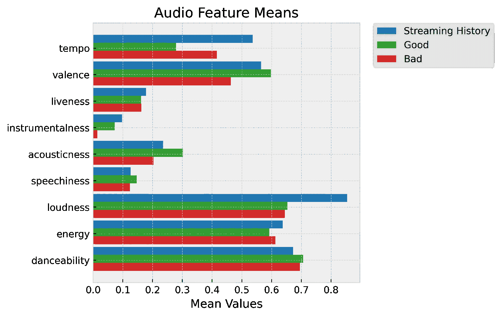

图片作者。

在一些特征中，例如效价和可跳舞性，好/坏之间的平均值相当接近。对于某些功能，我的“好”播放列表准确地代表了流历史的样本，但对于其他功能，流历史更接近于“坏”所有歌曲在工具性、语言性和生动性方面的价值都相当低。

我将好的/坏的数据集连接起来，并添加了一个“目标”列，用于监督学习。最后一个要查看的 EDA 图是一个相关矩阵，用于查看每个特性之间的相关程度，以及这些特性与目标的相关程度。

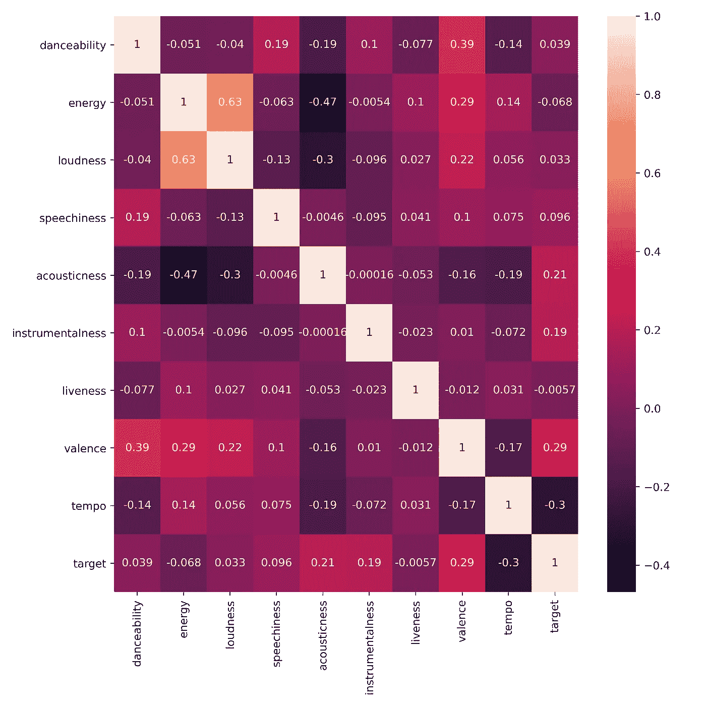

响度和能量是正相关的，而能量和声音是负相关的。不幸的是，这些特性和识别好与坏的目标之间没有太多的关联，所以我怀疑用这些数据生成的模型有多大用处。

## 监督学习

我尝试了各种监督学习方法，利用网格搜索来优化每种方法的超参数。

对数据训练 K-最近邻模型。

对于 kNN，最佳超参数如下:

```
{'metric': 'manhattan', 'n_neighbors': 23, 'weights': 'distance'}
```

然后，我用调整后的超参数重新拟合分类器。

除了 kNN，我还测试了 SVM、逻辑回归和随机森林分类器。随机森林分类器似乎给出了所有分类器中最高的准确度。

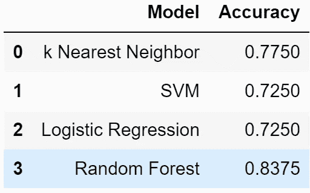

图片作者。

然而，即使是最好的结果也只有大约 84%的准确率——不是很好。只有 400 首歌曲用于训练模型，一些特征的频率分布明显重叠，我怀疑我能达到的模型精度。没有额外的特征选择来改进模型，因为使用所有特征作为输入获得了最高的精度。

# 后续步骤

我需要更多的数据。所以我联系了一些朋友，其中一个同意把他的流媒体数据发给我。他的音乐品味足够多样，但与我的截然不同。完美！这个策略将试图训练一个模型来辨别我的音乐品味和我朋友的音乐品味之间的区别，而不是“好”和“坏”之间的区别。

我按照上面相同的步骤将 json 字典转换成包含音频特性的数据帧。Joe 在他的流历史中有更少的独特歌曲，所以我通过从我的流历史中随机抽样独特的条目来确保类分布对于目标变量是相等的。

然后，我重新拟合模型，将我的流历史与新的流历史数据集进行比较。

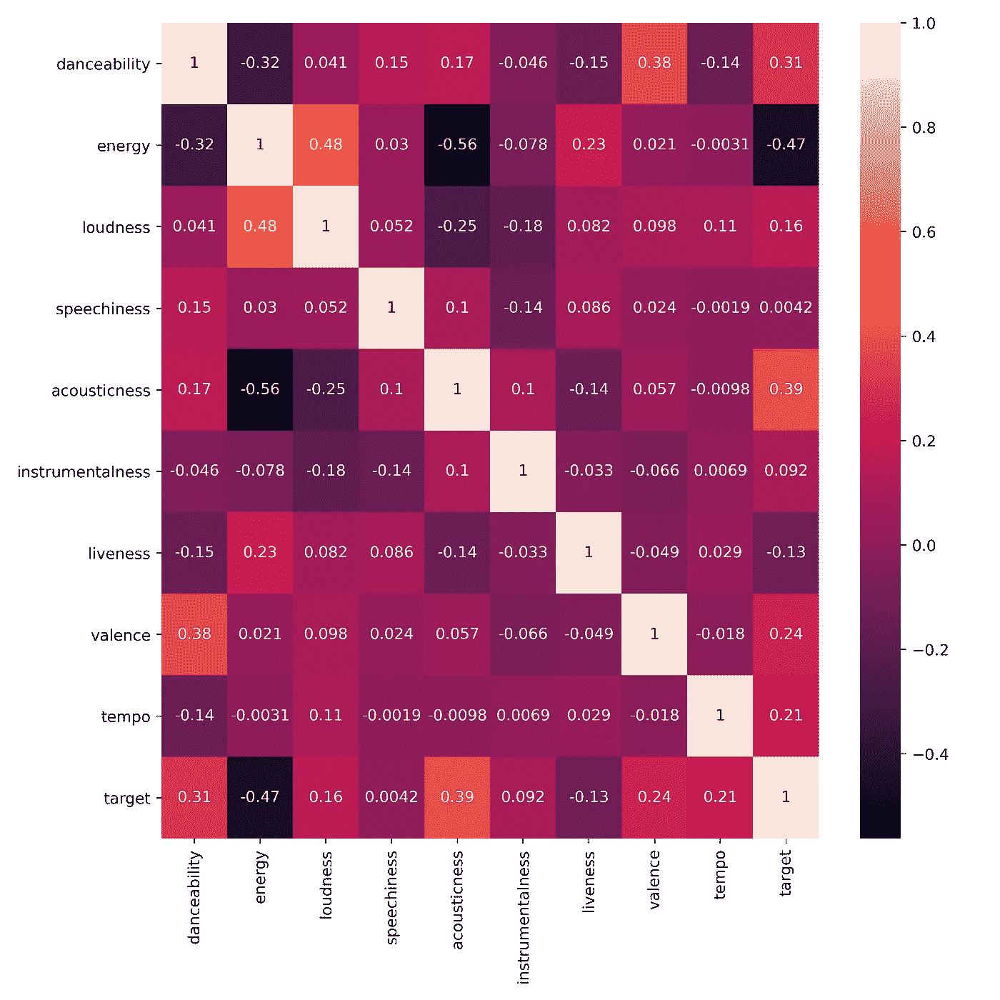

相关矩阵仍然不是最佳的。没有一个特征与用于比较两组流历史数据点的目标变量高度相关。图片作者。

尽管更新的相关性矩阵缺乏增加的相关性，但当输入 300%以上的数据时，每个模型的交叉验证分数表现得更好(与手动选择“不喜欢”的歌曲样本相比，通过使用我朋友乔的流媒体历史，样本的多样性更大)。

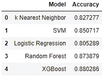

图片作者。

通过在 XGBoost 模型上调整超参数，我能够达到大约 90%的准确率。

为了进一步测试模型的性能，我从 Joe 和我在 Spotify 上的“每周发现”播放列表中抓取了歌曲，这是一个包含 30 首歌曲的播放列表，每周都会更新你没有听过的新歌，Spotify 根据他们的推荐算法认为你会喜欢这些新歌。使用此播放列表中的歌曲可以确保我们不会意外地让模型根据之前在流媒体历史中看到的数据进行预测。

结果…令人失望。

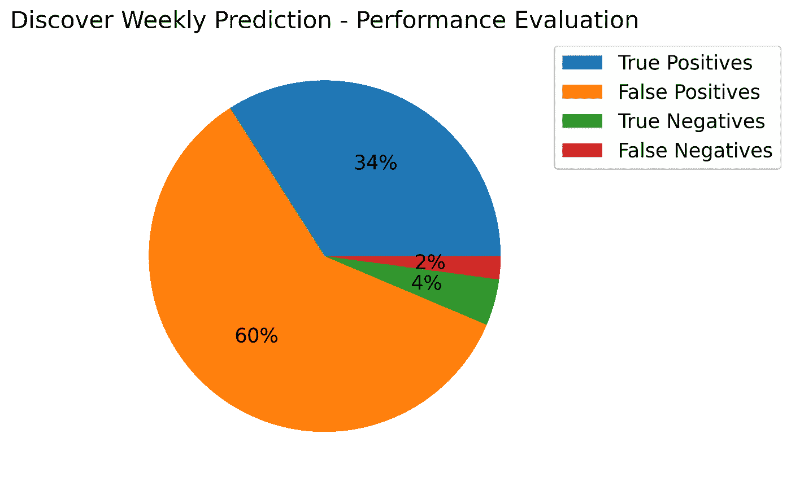

用于预测乔和我的流历史之间的分类的混淆矩阵结果。图片作者。

当将优化后的模型应用于这个新数据时，我无法实现高于 38-55%的分类准确率。从上面的图表来看，该模型有大量的误报，并且它过度分类了更可能是乔的播放列表的歌曲。

其他模型产生了相同的结果——从主数据集中保留的测试数据具有相当高的准确性，但在尝试对 discover weekly 歌曲进行分类时，类似的预测具有大约 50%的准确性。

我还尝试过采样我的数据来改变类别分布，以便为“我的音乐”类别保留更高百分比的歌曲我还尝试重新拟合 XGBoost 模型，添加 early_stopping_rounds 参数(在 20 轮后停止)，以确保模型不会过度拟合训练数据。

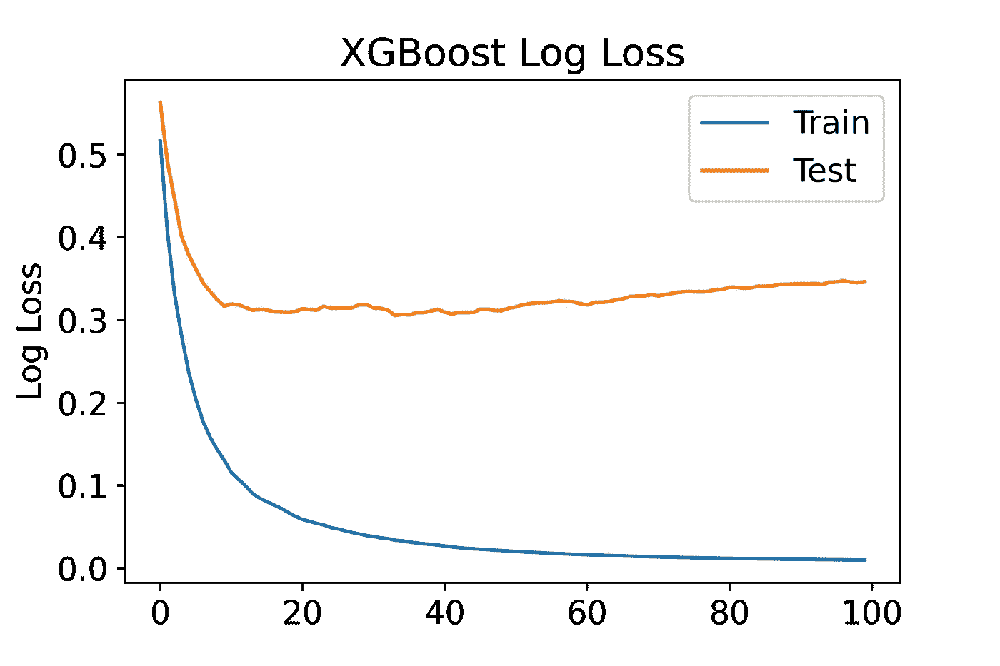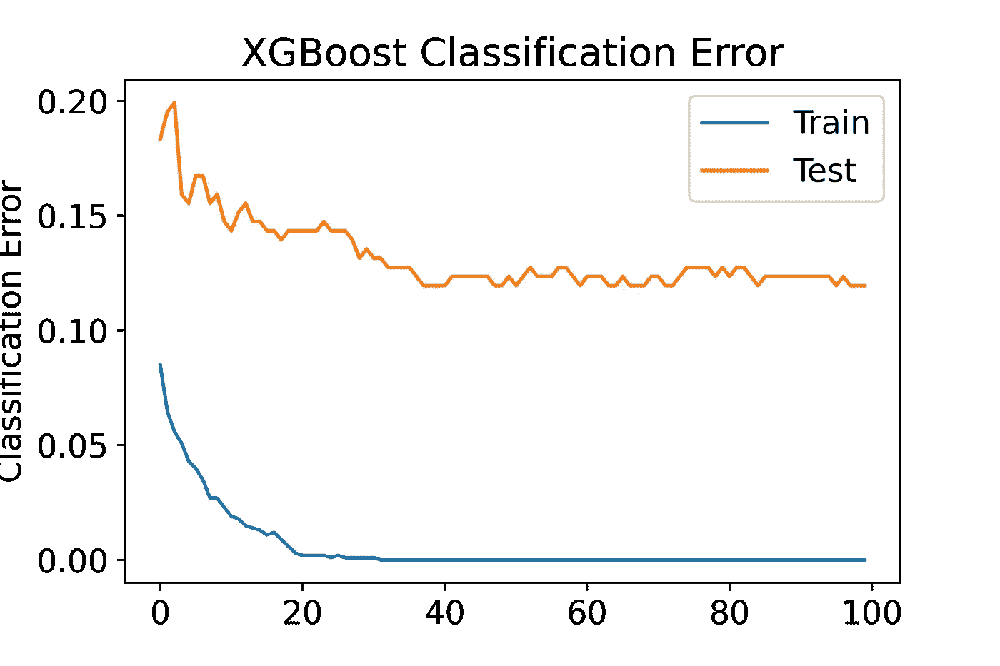

在训练 XGBoost 模型时绘制对数损失和分类误差，以确定一个合适的训练时期，并在该时期尽早停止。我用了 20 的值。

虽然模型的表现不如我希望的那样好，但我也想检查特征的重要性——模型说什么特征对我的音乐品味最重要？

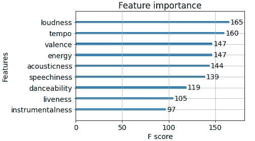

图片作者。

响度、速度、效价和能量似乎是预测的最重要特征，而乐器性是最不重要的。

# 包扎

我仍在熟悉机器学习实践，我可能错过了数据处理或特征工程步骤。然而，我对《发现周刊》预测准确性低的假设并不是建模问题的结果，而是方法和用于该方法的数据量的结果。我最终采用的方法是——尝试对属于某个人的播放列表的歌曲进行分类，这可能是一项具有挑战性的任务，尤其是考虑到我必须处理的数据点数量有限。

关于我将从我的朋友 Joe 那里接收到的数据，我曾错误地做出一个假设，即数据集将具有相似数量的歌曲，并且歌曲多样性的广度将大致相同。在我的流媒体历史中，我有 16260 首歌曲，其中 27%是独特的。Joe 的流媒体历史记录仅包含 2109 首歌曲(但独立实例的百分比非常相似，为 30%！).如果 Joe 的流媒体历史也有至少 4000 首独特的歌曲，那么该模型可能会表现得更好。

还要记住的是，流媒体历史记录包括没有从头到尾播放的歌曲，因此如果您正在播放喜爱的播放列表，并且在一两秒钟后跳过了一首歌曲，它仍然会显示在流媒体历史记录中。也许你不喜欢那首歌，所以模特的表现会受到影响。

作为快速检查，看看这个事实对唯一条目的百分比有多大影响，我在过滤了大于 30000 的“msPlayed”后再次计算了这个数字，假设如果你听一首歌至少 30 秒，你可能会听完整首歌。结果与我所期望的相反。我的流媒体历史记录中歌曲的变化从 27%下降到 20%。乔保持稳定，仅从 30%下降到 29%。我想我听的音乐种类没有我想象的那么多！

最终，如果我有办法为“坏”歌曲生成大量数据点，我会很乐意回到这个项目。我认为我的第一个想法是根据我喜欢或不喜欢的歌曲对模型进行分类，这可能是实现具有令人满意的性能的模型的更好方法，但是即使花费在管理 200 首糟糕歌曲的播放列表上的时间也是非常长的，更不用说数量级更大的播放列表了。从互联网上的其他地方获取这些数据也是不可能的，因为好的和坏的音乐对听众来说是主观的。Spotify 在一个大规模矩阵中拥有数亿个数据点，他们用这些数据点来推荐音乐。我敢肯定，当您有能力查看如此大规模的大数据时，本项目中使用的音频属性功能会提供更多见解。

感谢阅读！如果您对如何提高 discover weekly 数据的模型性能有什么见解，请随时联系我们。这个项目的代码可以在我的 github [这里](https://github.com/jspitze/Spotify_Analysis)找到。

另外，我发现了一篇文章，其中的分析与我执行的分析非常相似，这让我感觉比作者无法在原始数据集之外的数据上实现高性能模型要好一些。那篇文章可以在[这里](https://opendatascience.com/a-machine-learning-deep-dive-into-my-spotify-data/)找到。