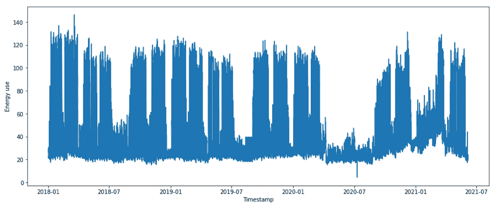
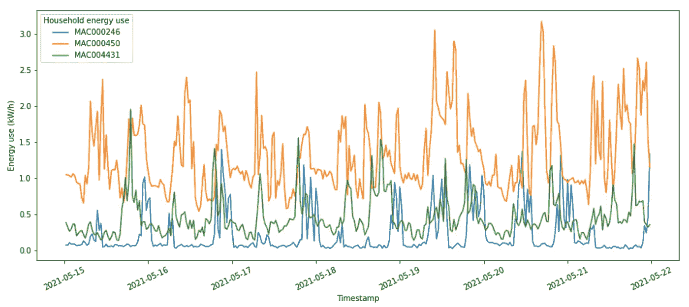
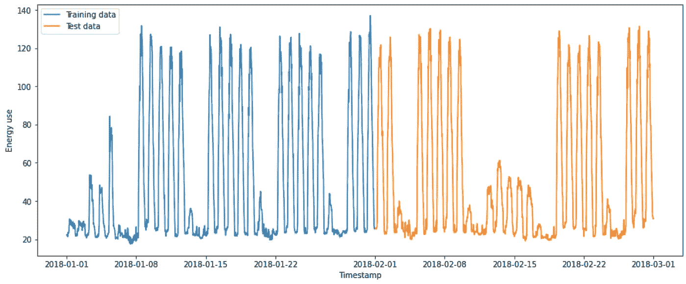
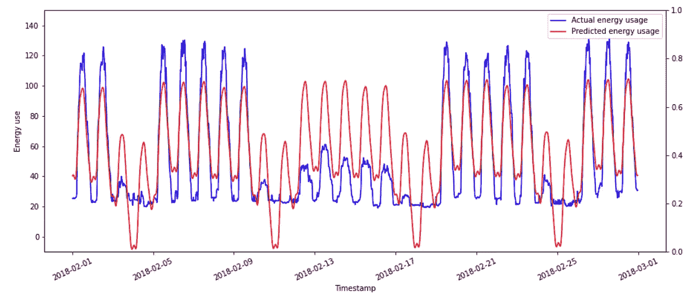
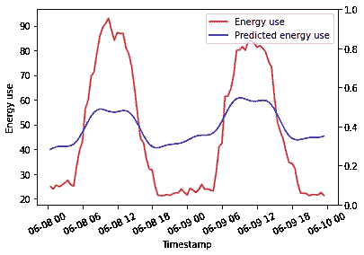
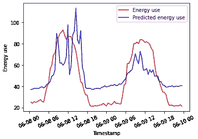
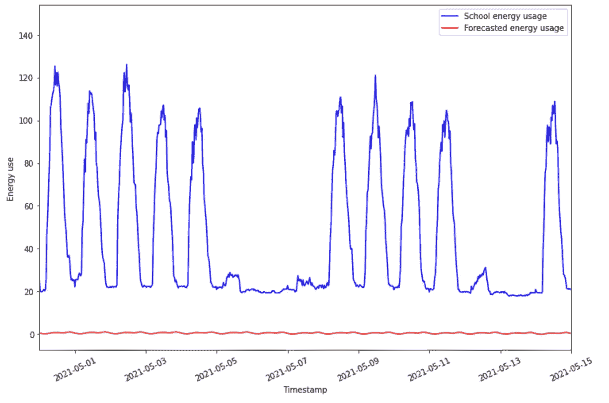
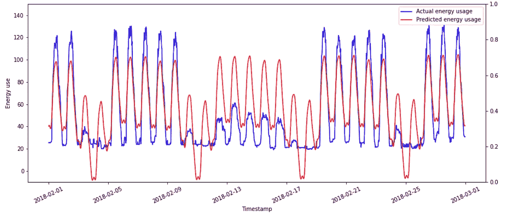
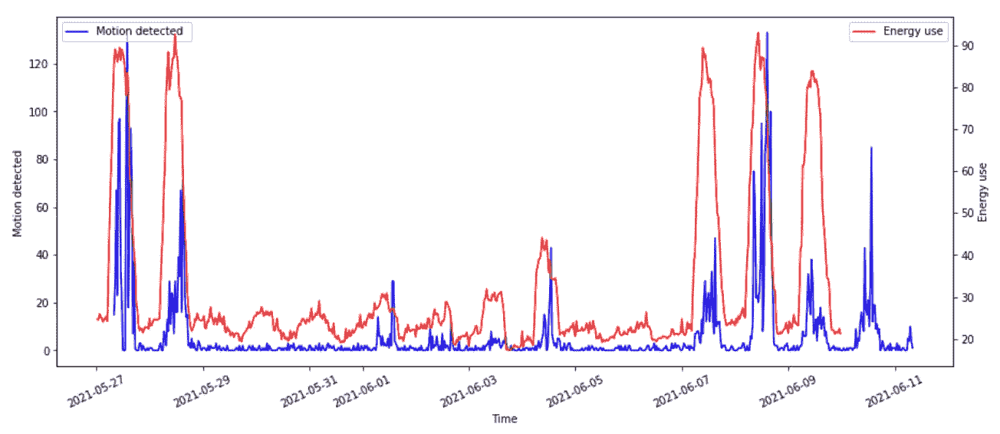

# 用机器学习分析学校用电

> 原文：<https://towardsdatascience.com/analyzing-power-usage-in-schools-with-machine-learning-ba07f089d547?source=collection_archive---------44----------------------->

## 人工智能在学校项目中的发现

今年，我与温布尔登高中的一组教师合作，开发并推出了我们的 AI in Schools 计划的第一个迭代，通过分析真实数据，向高中生教授数据科学和机器学习技能。

 [## 学校中的人工智能项目

### 向高中生介绍编程、数据科学和人工智能

nwheeler443.medium.com](https://nwheeler443.medium.com/the-ai-in-schools-program-896f7000f31f) 

我们关注了气候变化问题，并特别关注了学校的用电情况。女孩们使用三个数据源来调查学校的用电情况:

*   学校能源使用数据是作为[能源火花](http://energysparks.co.uk)计划的一部分收集的。
*   女孩们还对 Arduinos 进行了编程，以收集学校周围战略位置的光线、运动和温度数据。
*   我们从整个伦敦的家庭获取智能电表数据作为“大数据”集，以补充和比较我们的学校用电数据。

# 我们的发现

我们使用 Kaggle 分析数据，因此您可以自己用笔记本[这里](https://www.kaggle.com/nwheeler443/ai-day-level-1)、[这里](https://www.kaggle.com/nwheeler443/ai-day-level-2)和[这里](https://www.kaggle.com/nwheeler443/ai-day-level-3)探索代码和数据。

## **1。学校的能源使用量很高，甚至在学校关闭时也是如此**

学校的基准能耗约为 20 千瓦/小时，最高日能耗通常达到约 120 千瓦/小时。相比之下，伦敦典型家庭的最高能耗不到 5 千瓦/小时。因此，让学生有机会设计干预措施来减少学校的能耗，可能会比鼓励学生改变自己家中的能耗产生更大的影响。

我们还可以看到，在 2020 年，当学生呆在家里时，能源使用会明显下降。

三年来学校的能源使用情况

三个伦敦家庭的能源使用

## **2。能源使用显示出明显的时间趋势。**

当我们绘制几个月来学校的能源使用情况时，我们可以看到能源使用的每日趋势，在上课时间达到峰值，在放学时间下降。我们还可以看到能源使用的每周趋势在周末下降，尤其是在周日。也有固定的假期，学生可以休息一下，一周的能量消耗会大幅下降。

## **3。脸书的 Prophet 时间序列建模工具捕捉到了其中的一些趋势**

我们尝试了脸书的 Prophet 工具，该工具在用户很少输入的情况下对时间序列数据进行建模，这意味着初学者可以快速采用它，而无需学习时间序列建模的数学基础来建立模型。下面是真实的能源使用数据(蓝线)和来自训练模型的预测(红线)。

我们可以看到，该模型学习了每日振荡趋势，并学习了周末的能源使用下降。它没有意识到的是，周末的能源使用差异要小得多，所以它重复了同样的振荡趋势，但平均值更低。这导致周六夜间的能源使用预测为负值，而周末的能源使用预测过高。

该模型还没有学会的另一件事是如何预测学校假期。因此，该模型对节假日和学期时间的峰值能源使用进行平均，导致学期时间的能源使用预测不足，节假日的能源使用预测过高。

## **4。包含额外的元数据可改善预测**

学生们使用 Arduinos 收集了整个学校的光线、温度和运动数据。每个组都有来自一个位置的一种数据类型。当这个数据被包含在模型中时，能源使用预测随着时间的推移会有所改善。

在两天的期限内，原始模型(左)和包含运动作为协变量的模型(右)的预测。

## 5.所有数据来源都有缺点

我们拥有的最大数据源是一个关于伦敦电力使用的公开数据集，但这个使用数据看起来与我们在学校看到的模式非常不同。学校用电高峰在工作日，而家庭用电高峰在上班前后。同样，家庭在周末用更多的电，学校在工作日用更多的电。

根据伦敦家庭数据训练的模型预测的能源使用(红色)与真实的学校能源使用(蓝色)

第二大数据源是学校的智能电表数据，这对预测未来的能源使用要有用得多。但是，学校放假和停课不会在可预测的时间间隔内发生，也不会以 Prophet 精心设计的方式进行建模，因此预测通常会连续几周出错。

根据学校能源使用数据训练的模型预测的能源使用(红色)与实际的学校能源使用(蓝色)

最小的数据集是 Arduinos 收集的数据。运动数据与电力使用特别相关，但我们只有几周的数据用于建模，其中一些时间是在期中休息期间，所以我们只能对未来几天进行预测(见发现 4)。

运动数据(蓝色)与程序持续期间的能耗(红色)的关系图

## 摘要

检查学校能源使用的真实数据提供了有用的见解，可以导致干预措施，以减少学校的能源消耗。例如，当学校不使用时，将整个学校的供暖设置为下降，可能会导致假期和未来封锁期间的消费下降。

这些数据还让学生们有机会培养自己的编程、数学、批判性思维和项目管理技能。学生们收集的数据部分涵盖了一个期中假期，这意味着峰值用电量低于平时。这让学生们有机会看到算法所犯的错误，并试图找出为什么某一周的用电量被大大高估了。

随着该项目在温布尔登高中的继续，我们计划从 Arduinos 中收集更多的数据，随着时间的推移，这将有望导致更好的模型。这是关于构建人工智能以做出有价值的预测的一个很好的教训——提前计划并尽早开始收集数据是值得的。但收集正确的数据也很重要，因为大量不相关或误导性的数据可能比少量相关数据更糟糕。