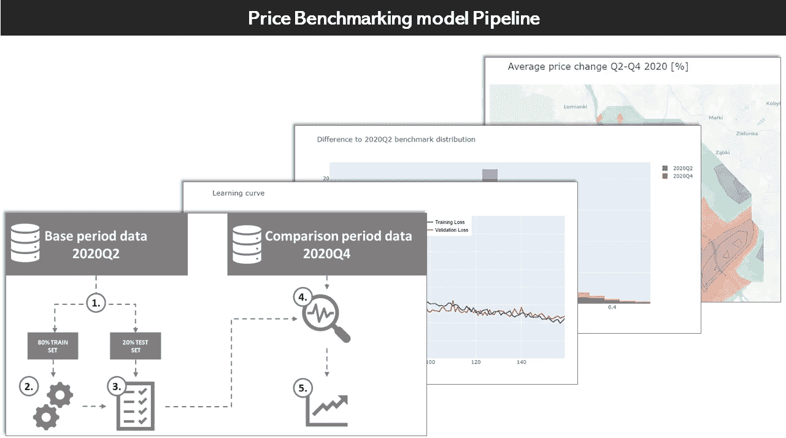
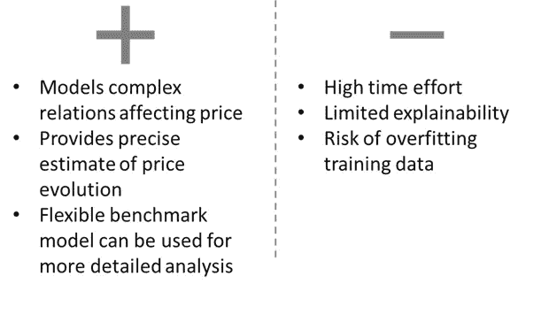
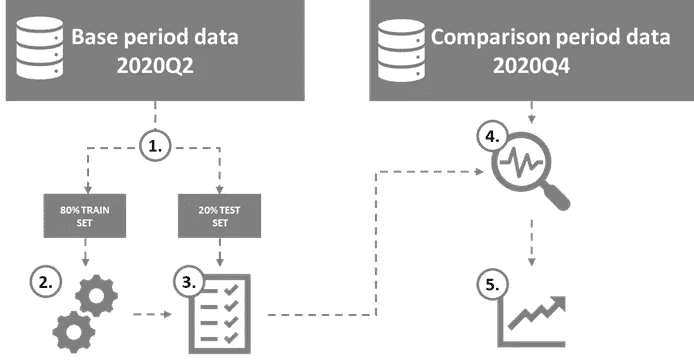
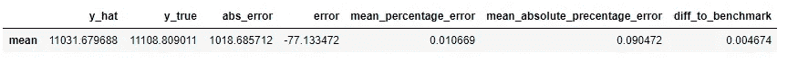
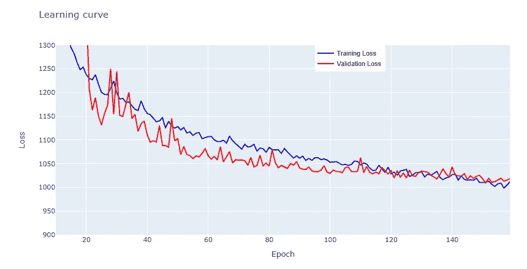
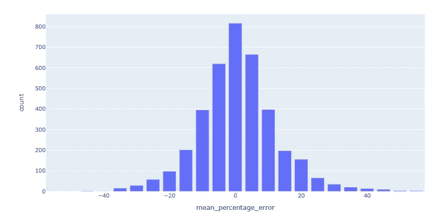
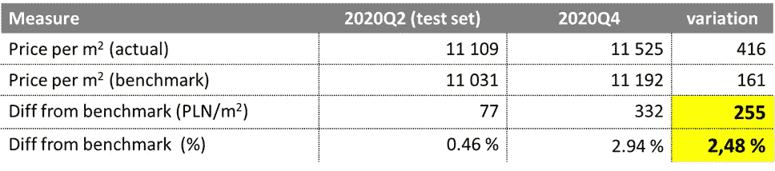
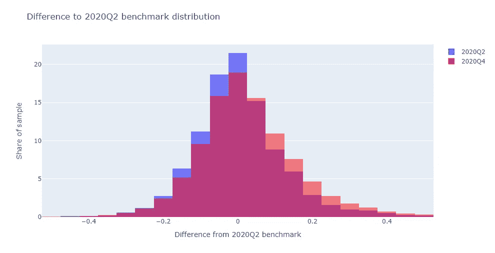
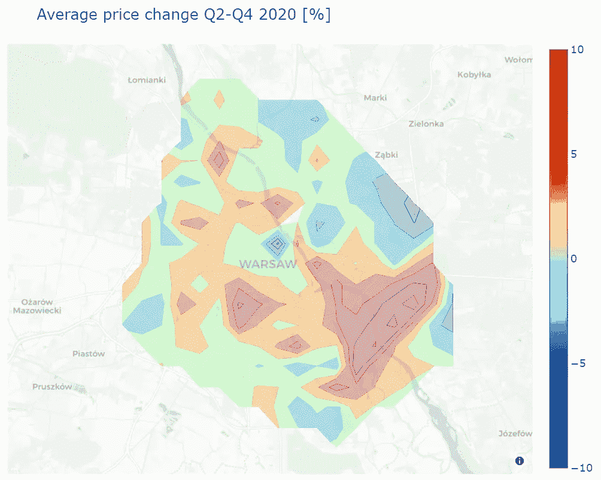

# 使用高级分析基准模型调查价格趋势

> 原文：<https://towardsdatascience.com/analyzing-price-trends-with-advanced-analytics-benchmarking-model-1aa57928c1b8?source=collection_archive---------31----------------------->

## 利用 ML 深入了解房地产价格趋势…看看我们是否能胜过线性回归模型。

作者照片

# 1.介绍

在我的上一篇文章[“去年房地产价格如何变化”](/how-did-the-real-estate-prices-change-last-year-38242f692722)
中，我描述了处理非同质商品(如房地产)价格数据的主要挑战，通过我们的分析，样本构成各不相同。

我建议至少阅读前一篇文章的介绍，它将为你提供一些关于我们正在试图解决的问题的背景。

简单回顾一下，我们的目标是消除样本变化对分析时间段的影响，这样我们就可以自信地回答这个问题:不管样本变化如何，价格本身变化了多少。在使用两个更简单的解决方案完成这项任务后:商业智能分析和统计测试，我们可以继续利用高级分析并比较这些方法的结果。

这篇文章的代码可以在 [GitHub](https://nbviewer.jupyter.org/github/Jan-Majewski/Medium_articles/blob/0a0bef252505bf5c3981b2ec4c0509af6af654ee/03_Price_analysis/03_01_Price_trend_analysis.ipynb) 上获得(笔记本的第 6 部分& 7)。

# 2.高级分析方法

作者图片

这种方法依赖于利用机器学习来精确建模我们在某个时间点的价格环境——在我们的例子中，华沙房地产价格为 2020 年第二季度，然后将其作为基准，与模型未看到的时间段(在我们的例子中为 2020 年第四季度)的数据进行比较。为了更容易理解整个过程，我准备了一个简单的 5 步图如下。

## 价格基准管道

作者图片

1.  我们从想要比较的时期创建一个基线数据集。我们将这些数据分为训练和测试数据，以确保我们不会过度拟合——这是我们在这种方法中需要避免的主要风险。
2.  我们使用训练集来训练我们的模型，其目的是复制我们基线数据的定价环境。
3.  我们使用我们的测试集来评估我们的模型是否可以作为基线数据的可靠定价基准。首先，我们需要避免过度拟合，并确保我们的模型没有高估或低估的趋势。
4.  一旦我们对第 1-3 点感到满意，并可以假设我们可以可靠地模拟基线数据的价格，我们就可以将我们想要比较和估计的 2020 年第 4 季度到 2020 年第 2 季度房地产价格的数据输入到这个模型中。
5.  最后一步是比较比较数据集中的实际价格——在我们的例子中，是 2020 年第四季度的价格与 2020 年第二季度同一房产的基准价格。如果我们努力地执行前面的步骤，从基准的平均变化将会给我们一个在两个被分析的时期之间的价格趋势的相当精确的视图。

# 3.可靠的基准模型清单

我们的方法在很大程度上依赖于这样的假设，即我们能够从基准期对定价环境进行建模，并将其转移到比较期。如果我们在第 1-3 阶段不小心，继续使用一个模型，这个模型不能完成这个任务，我们也不能完成这个基本假设，基准测试的结果可能会非常误导人。

此外，一旦我们过了阶段 3，我们就没有进一步的方法来验证我们的模型是否可靠。在继续基准测试流程之前，我们需要进行三项关键的健全性检查:

## 3.1 分析平均绝对百分比误差和平均百分比误差

首先，我们需要确保我们的模型能够很好地预测价格。我建议使用两个关键 KPI:

*   平均绝对百分比误差-告诉我们模型预测值与实际值的差距。在房地产的例子中，任何低于 10%的都很好，阈值取决于商品和价格的波动性。但是，如果您试图评估几个百分点的变化，并且您的平均模型误差为 20%+则您可能没有足够的特征来为价格建模。
*   平均百分比误差—告诉我们我们的模型是否有高估或低估的趋势。这个值应该尽可能接近 0%,这意味着平均价格预测与实际价格一致，这是基准中的一个理想特征。

测试集性能

在我们的模型中，我们的 mean_percentage_error 在 1%左右，这已经足够好了，因为我们没有明显的高估或低估倾向。平均绝对百分比误差为 9%，这也是可以接受的。

## 3.2 不惜一切代价避免过度配合

过度拟合总是不好的，但是如果我们想用我们的模型作为价格基准，过度拟合会产生更坏的影响。通过这种方法，我们不再专注于对单个样本的完美预测，而是依赖于获得正确的关键价格驱动因素。

当我为我的模型使用神经网络时，通过结合退出和批量标准化来避免过度拟合。我还在 160 个周期后停止了训练，尽管为了避免过度适应的风险，在以后的周期中可能会有所改善。

## 3.3 误差分布应接近平均值= 0 的正态分布

测试集上的误差分布

第 3.3 点。与前两个任务有很强的联系——如果你答对了，它应该被确认为一个均匀的误差分布。如果您的误差分布严重偏斜或不以 0 为中心，这意味着您的模型在整个数据范围内没有稳定的性能。

这可能与过度拟合训练集有关，这通常会导致 mean_percentage_error 远离 0。这是一个大问题，因为如果它甚至不能在基线数据集上获得正确的平均预测，就很难依赖这个基准作为可靠的定价表示。

如果分布不均匀，这意味着您可能会遗漏一些关键特征，推动具有特定特征的房地产价格，从而导致该数据子集的持续高估或低估。

# 4.结果分析

一旦我们确信我们的模型在基线 2020 年第二季度数据集上足够好，我们就可以用它来预测 2020 年第四季度的房地产价格与半年前相比会是什么样子。

2020 年第二季度-第四季度对比

我们可以看到，对于我们的基准测试集，我们模型的预测价格仅为 77 PLN/m2，比实际值低 0.46%，这是一个令人满意的性能，但在对我们的比较数据集进行基准测试时，我们还应该考虑这一轻微的低估。

我们 2020 年第四季度数据集的平均价格基准比 2020 年第二季度高出 161 波兰兹罗提/平方米，这表明我们样本的构成变为质量稍高的公寓——即使在 2020 年第二季度的基线期，它们的平均价格也将高于基线期的样本。

当我们将 2020 年第四季度每平方米的平均实际价格与基线期基准价格进行比较时，差异增加了近 3%。在减去 0.5 个百分点后，我们可以估算出最终价格上涨 2.5%或 255 波兰兹罗提/平方米。

如果我们回到上一篇文章，我们可以看到 a 用一种简单得多的基于统计的方法和线性模型得出了非常相似的结果(2.5%，270 PLN/m2)。那么我们在复杂的神经网络模型上的所有工作都是不必要的吗？

恰恰相反，用更简单的线性回归方法得到类似的结果，更容易验证和理解，而复杂的 ML 模型可以让我们对后者更有信心，并利用其灵活性来增加我们分析的深度。

# 5.利用 ML 模型的灵活性

线性回归模型可以很好地分析整个样本的主要趋势和价格驱动因素，但我不建议用它来准确预测单个结果。

另一方面，一旦我们完成了我们的基准模型清单，并对我们的基准预测有信心，我们就可以用它来评估价格在更细粒度数据上的表现。

2020 年 Q2 nad 第四季度的价格与基准分布

让我们从基准分布的变化分析开始，我们可以看到 2020Q4 的红色直方图在整个数值范围内稍微向右移动。这表明价格上涨是大多数价格的总体趋势。

## 映射价格变化

按位置汇总基准结果可用于绘制地理价格趋势图。在上面的地图上，我们可以看到华沙的大部分地区，尤其是中心地区是稳定的。另一方面，我们可以看到郊区和最大的公园和绿地附近的房价大幅上涨近 10%，这可能表明这一特征开始在买家决策中发挥重要作用。

## 其他使用案例

基于不限于时间段的各种特征，使用 ML 模型的基准的类似方法可以用于比较不同的数据集。

在修改我们用来划分基线和比较数据集的内容后，我们可以使用相同的原则来估计 A/B 测试对更广泛的客户群中的一个群体的治疗效果，或者比较最终报价和有效报价之间的价格。如果我们在训练模型时很勤奋，我们可以将可靠的结果与复杂模型的灵活性结合起来。

# 6.摘要

我希望这两篇关于分析非统一商品价格趋势的不同方法的文章表明，这一挑战比听起来要复杂得多。

我想总结一下关于方法选择的指导方针:

*   如果你正在对过去进行广泛的分析，商业智能方法可能是最有效的。这一步对于更复杂的方法也是一个很好的起点，并且最容易向更广泛的受众解释。
*   如果您希望对您的结果更有信心，并确保样本变化不会导致误导趋势，那么统计方法是对上一步的良好安全检查。
*   如果您想深入研究定价问题并成功完成前两种方法，您可能可以安全地使用本文中描述的最复杂的方法。

我建议不要从高级分析方法开始，而不使用更简单的方法进行至少一次简单的分析，原因有两个:

*   基于 ML 的方法是最难解释的，并且有许多可能导致误导结果的陷阱。如果您在前面的步骤中了解了数据和关键驱动因素，那么避免它们会容易得多
*   ML 模型的灵活性是一把双刃剑，正如 R.Coase 所说*“如果你折磨数据足够长的时间，它会承认任何事情”*并且相信我 ML 模型可以是一台令人印象深刻的数据折磨机器。如果您想要用于分段的时间变量在线性模型中不重要，则应用更复杂的变量只会提供任何重要的结果…如果它们实际上是误导性的或由过度拟合引起的。

## 感谢您的宝贵时间！我希望所描述的方法能帮助你进行价格分析。