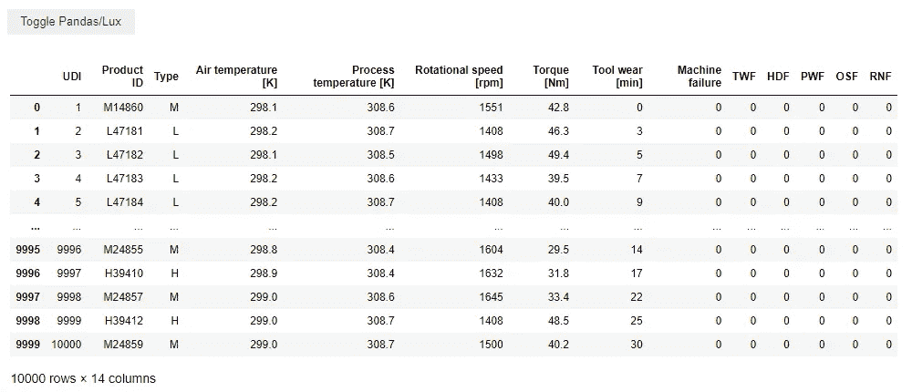
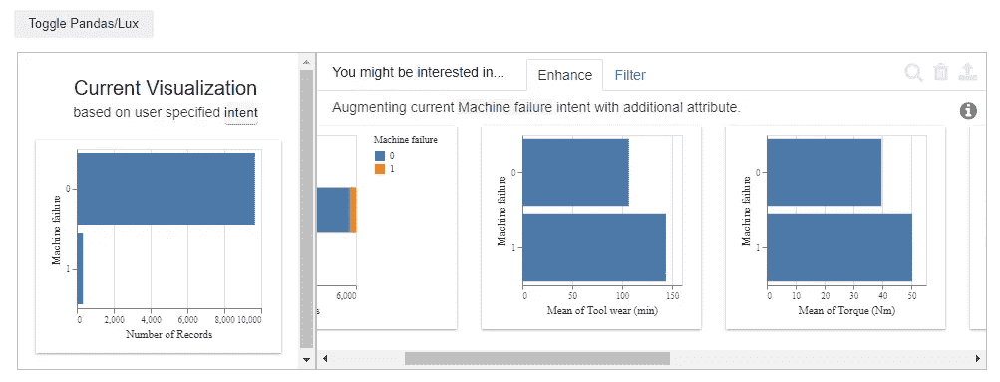
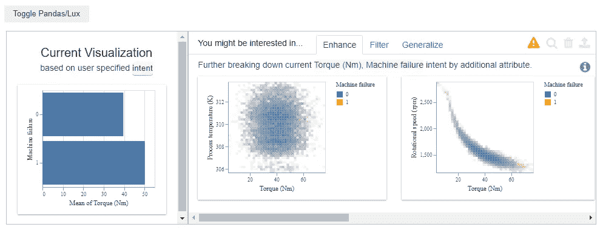
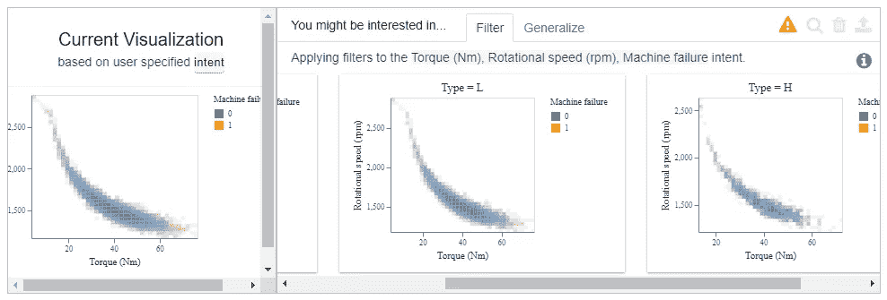

# 使用 Python 的 LUX 库分析生产数据

> 原文：<https://towardsdatascience.com/analyzing-production-data-with-pythons-lux-library-34812267d109?source=collection_archive---------17----------------------->

## 仅使用交互式可视化技术执行预测性维护任务


乔纳森·博尔巴在 [Unsplash](https://unsplash.com?utm_source=medium&utm_medium=referral) 上的照片

作为数据科学家，我们都知道我们将大部分时间花在探索性的数据分析、数据清理和预处理上。通常，开发机器学习、做所有的训练、验证和测试工作都是次要的。一些最大似然模型比其他模型表现得更好，你可以调整一些参数，最终得到更好或更差的结果。但是通常，你会很快找到一个能很好地处理数据的模型。

因此，问题是如何加快最初的探索性数据分析步骤。由于这一步涉及大量的交互式工作，一个可能的解决方案是使用所谓的无代码或低代码库。使用这些库可以让你快速检查你的数据集，大大减少甚至不需要编码。换句话说，您可以完全专注于分析数据集的创造性工作。
在 Python 内部，几个低代码/无代码库已经上市，而在本文中，我们将重点关注 [Lux](https://github.com/lux-org/lux) 。

Lux 宣传自己是一个 Python 库，可以在处理 Pandas 数据帧的同时实现可视化和数据分析过程的自动化。因此，Lux 会自动建议突出显示底层数据集中有趣的趋势和模式。

# 使用案例

网上已经有一些使用 Lux 进行数据分析的教程。尽管如此，大多数教程都是针对较小的数据集，重点是对 Lux 进行一般性介绍。因此，在本文中，我们将尝试对来自生产领域的大量数据进行深入分析。

该数据集已于 2020 年在 AI4I 会议上在本文[中介绍，随后被上传到 UCI 机器学习知识库。它是免费的，可以通过这个](https://github.com/lux-org/lux)[链接](https://archive.ics.uci.edu/ml/datasets/AI4I+2020+Predictive+Maintenance+Dataset)下载。
总之，数据集描述了由 10 000 个数据点和 14 个特征组成的生产工厂的模拟。对于我们的任务，我们对以下各列感兴趣:

*   类型:此栏由字母 L、M 和 H 组成。L 代表低(所有产品的 50%)，M 代表中(30%)，H 代表高(20%)产品质量变体。
*   空气温度[K]:由随机游走产生，大约 300 开尔文
*   过程温度[K]:通过随机游走生成，并加上空气温度加 10 开尔文
*   转速[rpm]:使用 2860 W 的功率计算，并叠加正态分布噪声
*   扭矩[Nm]:40Nm 左右的正态分布值
*   工具磨损[分钟]:对于质量变量，H/M/L 5/3/2 分钟的工具磨损加到过程中使用的工具上。
*   机器故障:表明机器是否出现故障的标签。

数据集包含更多信息，例如给出机器故障原因的详细信息。但是因为我们不想搞清楚这一点，所以其他列将被忽略。总之，用例的目标可以总结如下

> **通过使用 Lux 库的交互式可视化，找出机器故障的一些可能原因**

# 对其他图书馆的快速调查

正如介绍中提到的，Python 中有几个低代码/无代码库。以下是对其他一些例子的快速回顾:

*   [Bamboolib](https://bamboolib.8080labs.com/) :是一个在熊猫数据框架上工作的 GUI，可以很容易地集成到 Jupyter 笔记本中。可视化和分析数据集是相当交互式的。不幸的是，它不是开源的，免费版只能让你使用有限的功能。
*   [米托](https://trymito.io/):给你的 Jupyter 笔记本添加某种 Excel 电子表格。您在电子表格中所做的更改会被翻译成 python 代码。这对于市民数据科学家来说尤其有趣，因为他们可以在熟悉的环境中进行数据分析
*   PyCaret :这不是探索性的数据分析，而是提供了一个低代码的 ML 库。它特别适合数据科学新手，因为您可以用很少的代码行解决完整的 ML 任务

# 设置 Lux

让我们开始吧。首先，我们需要安装所需的库 Lux 和 Pandas。要安装这两个库，只需在命令提示符下使用 PyPI 和以下命令，并键入

```
pip install lux-api
pip install pandas
```

此外，要激活 LUX 作为 Jupyter 笔记本扩展，请在命令提示符下键入以下两个命令。注意，也许你需要重启 Jupyter 内核

```
jupyter nbextension install --py luxwidget
jupyter nbextension enable --py luxwidget
```

接下来，在 Jupyter 笔记本中导入这两个库，并从 UCI 存储库中加载原始数据集。加载完。csv 文件，你应该会看到一个按钮写着“切换熊猫/力士”。当然还有你的数据框的摘录。



作者图片

首先，我们删除完成任务不需要的列。此外，我们需要重命名剩余的列。如果列名中包含方括号，Lux 表示分布图有困难。因此，需要用圆括号替换它们。注意，本文是用 Lux 0 . 4 . 0 版编写的。也许这个问题在未来的版本中不会继续存在。

最后，用 Lux 检查结果(在 Jupyter 笔记本中，只需单击切换按钮)。情节应该是这样的:


作者图片

让我们看看选项卡后面有什么:

*   相关性:有 10 个散点图显示不同过程值的行为。空气温度和过程温度显示出或多或少的线性行为。最后一幅图显示了扭矩和合理速度之间的非线性行为。
*   分布:以直方图的形式显示每个过程变量的分布。
*   发生:Flux 自动将定量变量和分类变量彼此分开。在数据帧中有两个分类属性，即机器故障和类型。此外，我们移动条形图，您可以获得以下信息:9661 次生产正常运行，339 次出现机器故障

# 一大特点:意图属性

到目前为止，这并没有给人留下深刻的印象，但是这个库提供了一个很好的特性，叫做意图属性。可以选择一个(甚至几个)将在图中突出显示的列。

在我们的例子中，只需一行代码，就可以检查机器在不同质量类型下的表现。因此，只需输入


作者图片

那挺有意思的。尤其是第二个情节。在“H”高，“L”低和“M”中等质量的三种类型中，现在 Lux 还标记是否有机器故障。通过点击“过滤器”标签，甚至有一个更详细的看法。通过悬停在条形图上(要做到这一点，下载 [jupyter 笔记本](https://github.com/Ckuehnert/lux_review))，Lux 只给我们记录的数量，但是计算故障率是相当直接的。结果是:

*   男:83/2914 = 0.028
*   l:235/5765 = 0.04
*   h:21/982 = 0.021

因此:**低品质产品的机器故障率最高**。最后，让我们看看是否有可能找出导致机器故障的原因。请记住，这是我们最初想要实现的实际目标。让我们将 intent 的属性设置为“机器故障”并检查结果。



作者图片

Lux 告诉我们，如果机器出现故障，过程变量的平均值会如何变化。

检查结果，两个变量突出，即“工具磨损”和“扭矩”。如果机器出现故障，这两个变量都有较高的值。
让我们进一步研究扭矩。因此，标记该地块，并点击右上角的放大镜。



作者图片

现在，我们得到了所有变量的散点图，如果有一个机器故障或没有额外的标记。滚动到“扭矩”而不是“转速”，可以让我们清楚地了解情况。如果机器在低扭矩和高转速下运行，或者在高扭矩和低转速下运行，则存在机器故障。

最后，选择这个散点图并点击放大镜。同样，结果也很有趣。作为附加信息，数据分为三种产品质量。通过比较这些图，我们看到，转速大于 2.500、扭矩大于 60 NM 的产品很少能生产出高质量的产品。因此，高质量的产品很少导致机器故障。



作者图片

# 结论

本文将介绍 Lux 库，并评估它是否可以分析生产数据。请记住，这篇文章只是触及了库提供的可能性的表面。

对我来说，有几件事很有趣:

*   令人印象深刻的是只需要几行代码。此外，理解它们并不复杂
*   令人印象深刻的是，几乎不需要统计知识。你需要对散点图和直方图有一个基本的了解，但仅此而已。
*   不需要 ML/AI 来寻找机器故障的原因之一。请记住，这是分析生产数据时的常见结果。用一些领域知识仔细查看生产数据通常足以获得对数据的新见解。
*   最后，最令人印象深刻的是浏览数据集是多么的快速和直观。通过不必编写代码，可以专注于主要任务，分析过程数据并获得新的见解。

如果你有兴趣，你可以通过点击[这个](https://github.com/Ckuehnert/lux_review)链接下载 Jupyter 笔记本和使用过的数据集