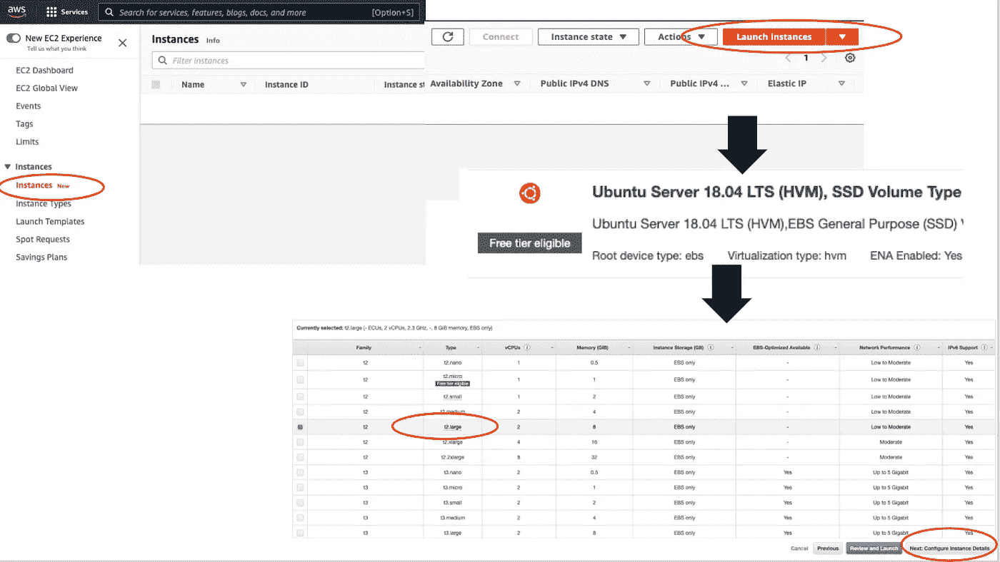
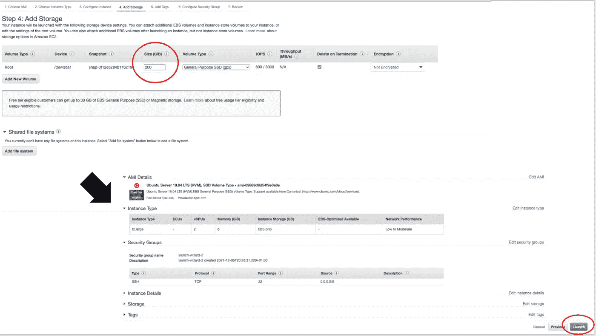
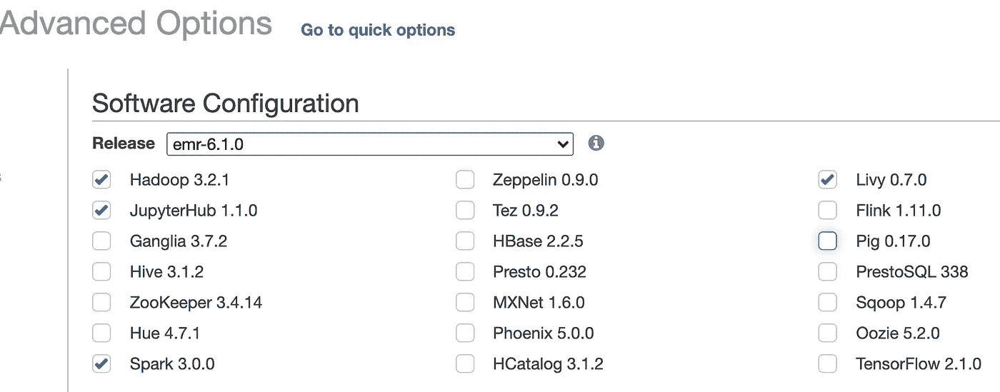
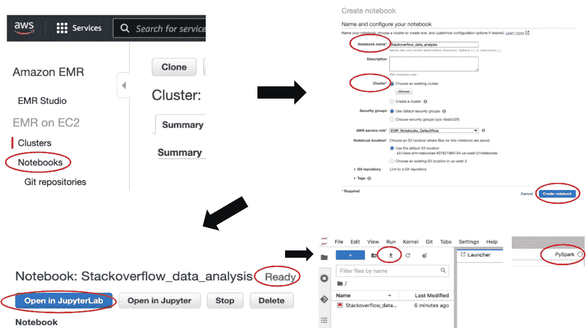
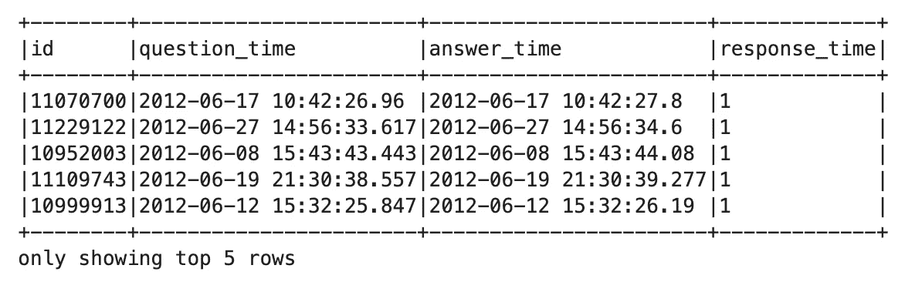
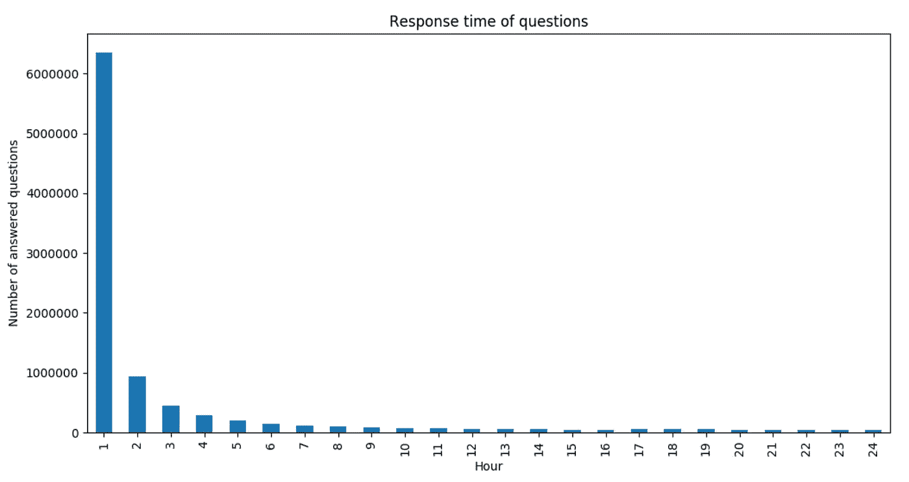
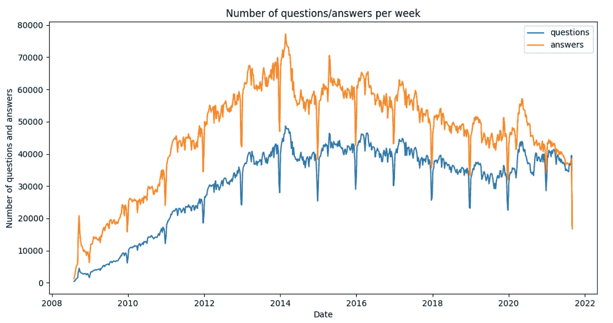
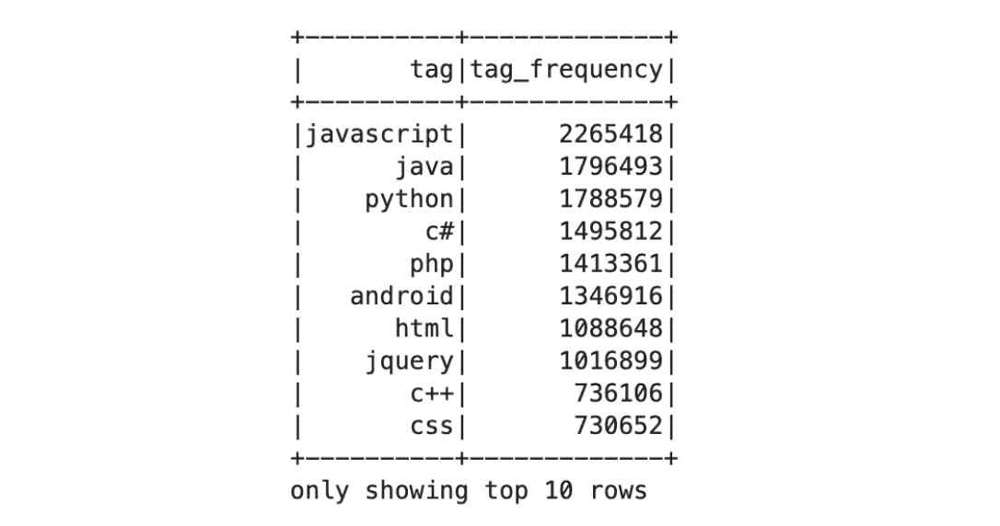
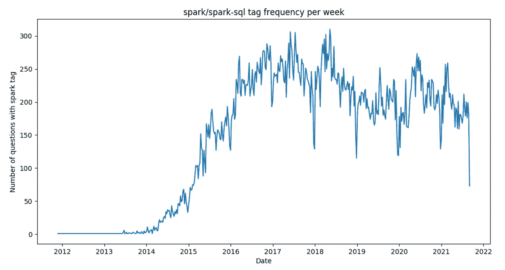

# 用 Apache Spark 3.0 分析堆栈溢出数据集

> 原文：<https://towardsdatascience.com/analyzing-stack-overflow-dataset-with-apache-spark-3-0-39786c141829?source=collection_archive---------19----------------------->

## 在 Amazon EMR 上使用 Spark SQL 和 Jupyter 进行端到端数据分析


从 [Pixabay](https://pixabay.com/cs/illustrations/otazn%c3%adk-hromada-ot%c3%a1zka-ozna%c4%8dit-1495858/) 下载的图像

数据科学家和分析师经常选择 Python library Pandas 进行数据探索和转换，这是很常见的，因为它的 API 漂亮、丰富且用户友好。Pandas 库提供了 DataFrame 实现，当数据量适合单台机器的内存时，这真的非常方便。对于更大的数据集，这可能不再是最佳选择，而 Apache Spark 等分布式系统的强大功能变得非常有用。事实上，Apache Spark 成为了大数据环境中数据分析的标准。

在本文中，我们将看到一步一步地分析特定数据集的方法，即来自堆栈溢出数据库的转储。本文的目标并不是通过一些具体的结论进行详尽的分析，而是展示如何使用 Apache Spark 和 AWS 堆栈(EMR、S3、EC2)进行这样的分析。我们将在这里展示所有的步骤，从从堆栈交换存档下载数据，上传到 S3，数据的基本预处理，到使用 Spark 的最终分析，包括使用 Matplotlib 和 Pandas 绘制的一些漂亮的图表。

在这里，我们将看到使用 Spark 和 Python 生态系统对大数据集进行数据分析的一种非常常见的模式。该模式有三个步骤，第一，用 Spark 读取数据，第二，做一些减少数据大小的处理——这可能是一些过滤、聚合，甚至是数据的采样，最后将减少的数据集转换成 Pandas 数据框架，并在 Pandas 中继续分析，这允许您使用 Matplotlib 在幕后绘制图表。

我们将在本文中使用的所有代码也可以在我的 [GitHub 库](https://github.com/davidvrba/Stackoverflow-Data-Analysis)中找到，所以请随意查看。

本文假设读者对 AWS 有一些基本的了解，比如在那里有一个帐户，能够生成 EC2 密钥对，等等。**此外，让我在这里强调，这些服务，如 EC2、EMR 和 S3，需要信用卡信息，亚马逊将向您收取使用费用。**因此，请确保在完成后终止 EC2 实例和 EMR 集群，并在不再需要时从 S3 中删除数据(包括日志、笔记本和其他可能在此过程中创建的文件)。

EC2 和集群设置的步骤将通过 AWS 文档的相关链接进行简要描述，AWS 文档非常广泛，其他资源也可以在网上找到。让我们看看我们将执行的所有步骤:

1.  从 Stack Exchange 归档文件下载数据转储(这是一个 7z 压缩的 XML 文件)
2.  解压缩下载的文件
3.  将文件上传到 S3(AWS 上的分布式对象存储)
4.  将 XML 文件转换为 Apache Parquet 格式(再次在 S3 上保存 Parquet)
5.  分析数据集

对于步骤 1–3，我们将使用一个带有更大磁盘的 EC2 实例。对于第 4 步和第 5 步，我们将使用 Spark 3.0 和 JupyterLab 在 AWS 上部署一个 EMR 集群。

我们将使用 Spark 执行的分析本身独立于运行 Spark 的云，因此，如果您不想使用 AWS，但您在其他地方运行 Spark，并且您可以将数据存储到您的存储系统，您仍然可以使用我们将在下面使用的查询。

# 数据集

[栈溢出](https://stackoverflow.com/)很受程序员欢迎，你可以在那里提问，也可以回答其他用户的问题。转储本身可以在栈交换[档案](https://archive.org/download/stackexchange)中找到，并且可以在知识共享许可 cc-by-sa 4.0 下获得(更多信息参见[细节](https://archive.org/details/stackexchange))。

数据由更多的文件组成，分别是*帖子*、*用户*、*评论*、*徽章*、*投票*、*标签*、*历史记录、*和*帖子链接*。在本文中，我们将只使用压缩 XML 中有 16.9 GB 的 *Posts* 数据集(截止到 2021 年 12 月)。解压缩后，大小增加到 85.6 GB。要查看各个表及其列的含义，我建议查看 Stack Exchange 上的这篇[帖子](https://meta.stackexchange.com/questions/2677/database-schema-documentation-for-the-public-data-dump-and-sede)，这篇帖子很好地描述了这一点。我们将处理的帖子包含所有问题及其答案的列表，我们可以根据 *_Post_type_id* 来区分它们，其中值 1 代表问题，值 2 代表答案。

# 数据下载和解压缩

为了从 Stack Exchange 归档文件中下载数据，我们将使用 EC2 实例 *t2.large* 和 200 GB 的磁盘空间。为了做到这一点，你需要登录到 [AWS 控制台](https://aws.amazon.com/)，进入 EC2 实例，点击*启动实例*并选择操作系统，例如，Ubuntu Server 18.04 LTS。接下来，您需要指定实例类型，使用 *t2.large* 很好，但是其他选项可能也不错。然后单击*配置实例详细信息*，并在*添加存储*选项卡中添加一个磁盘卷。您需要指定磁盘的大小，我选择 200 GB，但是更小的磁盘应该也可以。只需记住，解压缩后数据集将有近 90 GB。我在这里添加了一些与描述的步骤相关的截图:



作者创造的形象。



作者创造的形象。

此外，AWS 会建议您设置一些安全组来限制可以使用该实例的 IP 地址，所以您可以随意这样做，并查看 [AWS 文档](https://docs.aws.amazon.com/AWSEC2/latest/UserGuide/working-with-security-groups.html#creating-security-group)。最后，要启动实例，您需要有一个 EC2 密钥对，如果您还没有，您可以继续并生成它。同样，要生成新的密钥对，请参见 AWS [文档](https://docs.aws.amazon.com/AWSEC2/latest/UserGuide/ec2-key-pairs.html#having-ec2-create-your-key-pair)。在实例运行之后，您可以从终端使用您的密钥(您需要在下载密钥的同一个文件夹中)对它进行 ssh:

```
ssh -i key.pem ubuntu@<the ip address of your instance>
```

然后，在控制台上安装 *pip3* 和 *p7zip* (第一个是 Python3 的包管理系统，我们将用它来安装 2 个 Python 包，第二个是用来解压 7z 文件的):

```
sudo apt update
sudo apt install python3-pip
sudo apt install p7zip-full
```

接下来安装 Python 包*请求*和 *boto3* ，我们将使用它们进行数据下载和 S3 上传:

```
pip3 install boto3
pip3 install requests
```

然后使用 *vi data_download.py* 创建一个新文件，并在其中复制以下 Python 代码(在 vi 编辑器中，您需要通过按 *i* 键切换到插入模式):

```
url = 'https://archive.org/download/stackexchange/stackoverflow.com-Posts.7z'local_filename =  'posts.7z'
with requests.get(url, stream=True) as r:
  r.raise_for_status()
  with open(local_filename, 'wb') as f:
    for chunk in r.iter_content(chunk_size=8192):
      if chunk:
        f.write(chunk)
```

然后保存(按 *esc* 键并使用 *:wq* 命令)并使用*python 3 data _ download . py*运行。数据下载本身可能需要一段时间，因为如上所述，该文件有近 17 GB。接下来使用以下命令解压缩文件

```
7z x /home/ubuntu/posts.7z
```

之后，创建另一个 python 文件 *vi upload_to_s3.py，*并将数据上传到 s3 的代码复制到那里:

```
from boto3.session import *
import osaccess_key = '...'
secret_key = '...'
bucket = '...'
s3_output_prefix = '...'session = Session(
  aws_access_key_id=access_key, 
  aws_secret_access_key=secret_key
)
s3s = session.resource('s3').Bucket(bucket)local_input_prefix = '/home/ubuntu'
file_name = 'Posts.xml'input_path = os.path.join(local_input_prefix, file_name)
output_path = os.path.join(s3_output_prefix, file_name)s3s.upload_file(input_path, output_path)
```

正如您在代码中看到的，您需要填写 S3 的凭证( *access_key* 和 *secret_key* )、您的 bucket 的名称和 *s3_output_prefix* ，这是文件上传的最终目的地。如果没有 *access_key* 和 *secret_key* ，可以生成(参见[文档](https://docs.aws.amazon.com/powershell/latest/userguide/pstools-appendix-sign-up.html))。如果您没有存储桶，您可以[创建](https://docs.aws.amazon.com/AmazonS3/latest/userguide/create-bucket-overview.html)它。

让我也提一下，还有其他方法如何访问堆栈溢出数据，即有一个公共的 [API](https://api.stackexchange.com/docs) 允许您查询数据库，还有一个 Python [包装器](https://stackapi.readthedocs.io/en/latest/)构建在其上。

# 数据预处理

从存档中下载数据并存储在 S3 上后，我们现在将做一些基本的预处理，为分析查询准备数据。更具体地说，我们将把格式从 XML 转换为 Apache Parquet，并将列重命名/重新键入为更方便的格式。

## 正在启动 EMR 群集

对于这个预处理步骤，以及实际的数据分析，我们将使用 Spark 3.0 和 JupyterHub 启动一个 EMR 集群。要启动集群，请转到 EMR(在 AWS 服务中)并点击*创建集群。*之后，你就需要指定一堆设置了。转到*高级选项*，在那里您可以选择 EMR 版本并检查集群上将安装哪些应用程序。这里我们使用了 *emr-6.1.0* ，我们将需要的关键组件是 Hadoop、Spark、JupyterHub 和 Livy(另见所附截图):



作者创造的形象。

在下一步中，您可以配置您的群集将有多少个节点，您可以使用默认设置，但是对于一些查询，您将不得不等待一段时间—它不会有超级响应。换句话说，拥有一个更大的集群会导致更快的查询，但是集群的成本也会更大。在下一步中，您可以为群集选择一个有意义的名称，并取消选中*终止*保护。最后，在点击*创建集群*之后，它会将您带到一个页面，您会看到您的集群正在启动。接下来，您可以点击*笔记本*并创建一个笔记本，您可以从中运行 Spark 查询。为笔记本选择一个名称，并选择该笔记本将连接到的已创建群集。几秒钟后，您可以点击*打开 JupyterLab* 按钮，打开 Jupyter:



作者创造的形象。

在 JupyterLab 中，你会看到你可以打开使用的笔记本。除此之外，您还可以使用菜单中的上传按钮来上传其他笔记本。

对于数据预处理和分析，您可以将我的[存储库](https://github.com/davidvrba/Stackoverflow-Data-Analysis)克隆到您的本地机器上，并上传这两个笔记本:

*   stack overflow-Data-Analysis/Data-prepare/Data-prepare . ipynb
*   stack overflow-Data-Analysis/Data-Analysis/Posts-General-Analysis . ipynb

在笔记本本身，确保你使用的是正确的内核，你可以在右上角看到(也可以看上面的截图)。出于我们的目的，我们将需要 PySpark 内核。

## 转换为拼花地板格式

让 EMR 集群运行 Spark 和 Jupyter，我们就可以开始处理数据了。我们要做的第一步是将格式从原始的 XML 转换成 Apache Parquet，这对于 Spark 中的分析查询来说要方便得多。为了读取 Spark SQL 中的 XML，我们将使用 [*spark-xml*](https://github.com/databricks/spark-xml) 包，它允许我们指定格式 *xml* 并将数据读入数据帧

作为这个 ETL 过程的一部分，我们还将所有列重命名为 snake-case 样式，并将 *creation_date* 列转换为 *TimestampType* 。将数据转换为拼花后，大小从 85.6 GB 减少到 30 GB，这是因为拼花压缩，也因为我们没有在最终的拼花中包括所有列。这里我们可以考虑的另一个步骤是按照*创建年份*甚至可能是从*创建日期*中导出的*创建月份*来划分数据。如果我们只想分析数据的某一部分，也许是最后一段时间等等，这将是很方便的。

# 数据分析

最后，我们将进入探索数据并可能揭示其一些有趣属性的部分。我们将回答关于数据集的 5 个分析问题:

## 1.计算计数

让我们计算以下有趣的计数:

*   我们有多少问题
*   有多少个答案
*   有多少问题已经接受了答案
*   有多少用户提问或回答了一个问题

在上面的代码中，我们首先读取了所有的帖子，但是只选择了在进一步的分析中需要的特定列，并且我们缓存了它们，这将非常方便，因为我们将在所有的查询中引用数据集。然后，我们根据 *post_type_id* 将帖子分成两个数据帧，因为值 1 代表问题，值 2 代表答案。帖子总数为 53 949 886，其中 21 641 802 是问题，32 199 928 是回答(数据集中还有其他类型的帖子)。当过滤 *accepted_answer_id* 不为空的问题时，我们得到了具有可接受答案的问题的数量，它是 11 138 924。对 *user_id* 列上的数据集进行重复数据删除，我们得到提问或回答问题的用户总数为 5 404 321。

## 2.计算响应时间

我们在这里将响应时间定义为从提出问题到得到被接受的答案所经过的时间。在下面的代码中，您可以看到我们需要将问题与答案连接起来，这样我们就可以将问题的创建日期与其被接受的答案的创建日期进行比较:

当根据响应时间对数据进行排序时，我们可以看到最快的可接受答案出现在一秒钟内，您可能会想，为什么有人能如此快速地回答一个问题。我明确地检查了其中的一些问题，发现这些问题是由发布问题的同一个用户回答的，所以显然他/她知道答案，并将其与问题一起发布。



作者创造的形象。

将响应时间从几秒钟转换为几个小时，并进行汇总，我们可以显示在问题发布后的每个小时内有多少问题得到了回答。

这里我们将时间限制为 24 小时，以查看问题发布后第一天内的行为。正如您在图表中看到的，大多数问题都在第一个小时内得到了回答:



作者创造的形象。

## 3.查看问题/答案的数量如何随着时间的推移而变化

观察每个时间单位的问题和答案的数量如何随着时间的推移而变化是非常有趣的。要使用 Spark 计算聚合，我们可以使用 [*window()*](https://spark.apache.org/docs/latest/api/python/reference/api/pyspark.sql.functions.window.html#pyspark.sql.functions.window) 函数进行分组，它有两个参数，第一个是具有时间含义的列的名称，第二个是我们希望对时间维度进行分组的时间段。这里我们选择时间单位为一周。在聚合本身中，我们可以使用 *when* 条件计算答案和问题，如下所示:

按窗口分组创建了一个具有两个*结构字段的*结构类型*,**开始、*和*结束*，因此在这里为了绘图，我们使用了*开始*字段，它是每周开始的日期。



作者创造的形象。

## 4.计算标签的数量

每个问题都有一些代表一些主题的标签—在堆栈溢出数据集中，这些通常是用户询问的一些技术。然而，标签是以字符串的形式存储的，格式为*<tag 1><tag 2><…>*，所以为了分析它们，将这个字符串转换成这些标签的数组并去掉尖括号是很有用的。为此，我们将首先使用 [*split*](https://spark.apache.org/docs/latest/api/python/reference/api/pyspark.sql.functions.split.html#pyspark.sql.functions.split) 函数拆分字符串，之后，我们将使用高阶函数 [*TRANSFORM*](/higher-order-functions-with-spark-3-1-7c6cf591beaa) 使用[*regexp _ replace*](https://spark.apache.org/docs/latest/api/sql/index.html#regexp_replace)删除数组中每个元素的尖括号。为了计算所有标签的总非重复计数，我们将最终 [*展开*](https://spark.apache.org/docs/latest/api/python/reference/api/pyspark.sql.functions.explode.html#pyspark.sql.functions.explode) 该数组并对其进行重复数据删除:

计数的结果显示 61 662 个不同的标签。要查看哪些标签被使用的次数最多，我们只需按标签对展开的数据集进行分组，计算每个标签的数量，并按计算出的频率进行排序。这就产生了这个列表，从这个列表中可以看出使用最多的标签是 javascript:



作者创造的形象。

## 5.查看一些特定标签的流行程度

将 tags 列转换为一个数组后，我们现在可以过滤这个数组并研究特定的标记。这里我们将看看人们用标签 *apache-spark* 或 *apache-spark-sql* 问了多少问题。为此，我们可以使用函数 [*array_contains*](https://spark.apache.org/docs/latest/api/python/reference/api/pyspark.sql.functions.array_contains.html#pyspark.sql.functions.array_contains) ，该函数有两个参数，第一个参数是数组的列，第二个参数是一个特定的元素，我们希望确定它是否包含在数组中。该函数返回*真*或*假*，因此我们可以在过滤器内部直接使用它。像这样过滤问题后，我们可以根据*创建日期*按周对它们进行分组。最后，我们将其转换为熊猫数据帧并绘制成图:

最终的曲线图显示，在 Stack Overflow 上，人们在 2014 年开始对 Spark 感兴趣，每周被问及最多的问题是在 2017 年和 2018 年:



作者创造的形象。

# 结论

在本文中，我们看到了如何使用 Spark 来分析公开可用的数据集，但是，我们首先需要下载、解压缩并存储在某个分布式存储系统中，这样我们就可以使用 Spark 有效地访问它。

堆栈溢出数据集包含大量有趣的信息，我这样说不仅仅是指实际答案形式的内容，还包括问题、答案、评论和用户之间一些有趣的关系。在本文中，我们展示的只是冰山一角，我们已经看到了这个数据集上的一些基本查询，在未来的一些帖子中，我们将回到它并应用一些更高级的分析工具，如使用 Spark 的机器学习和图形处理来揭示数据的更多属性。