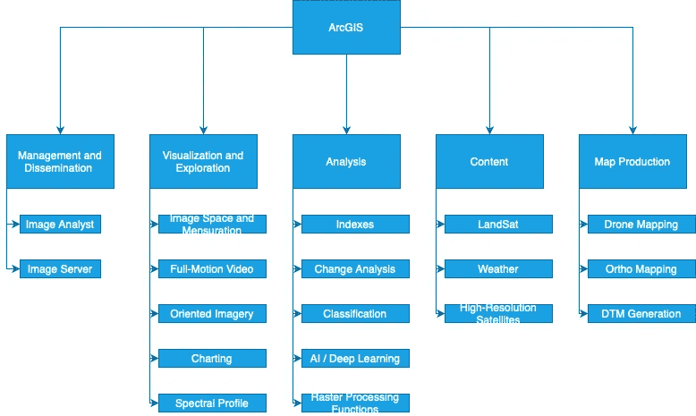
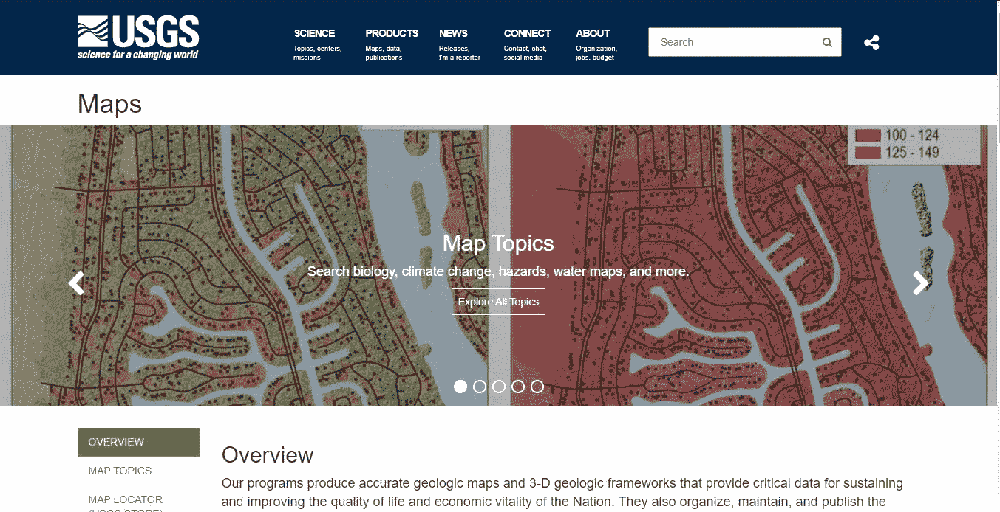
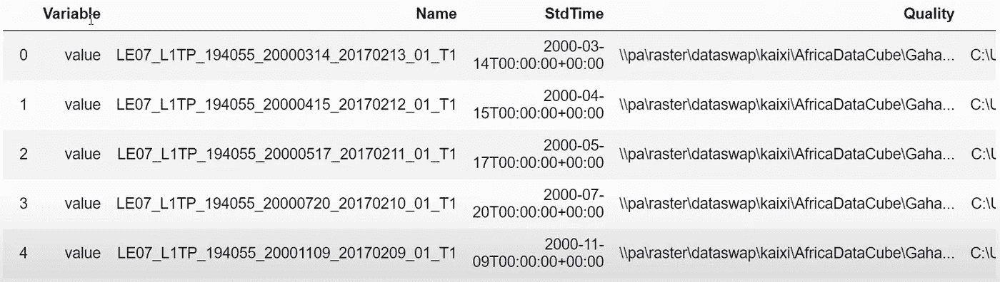
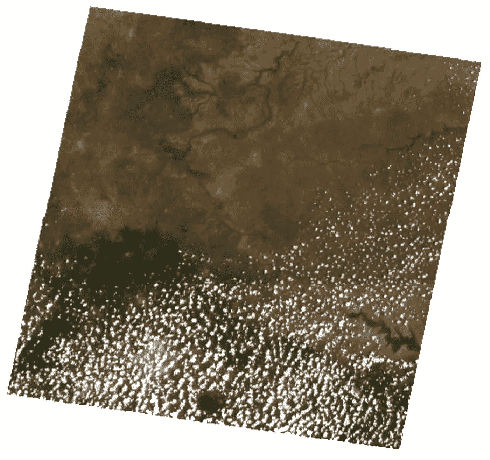
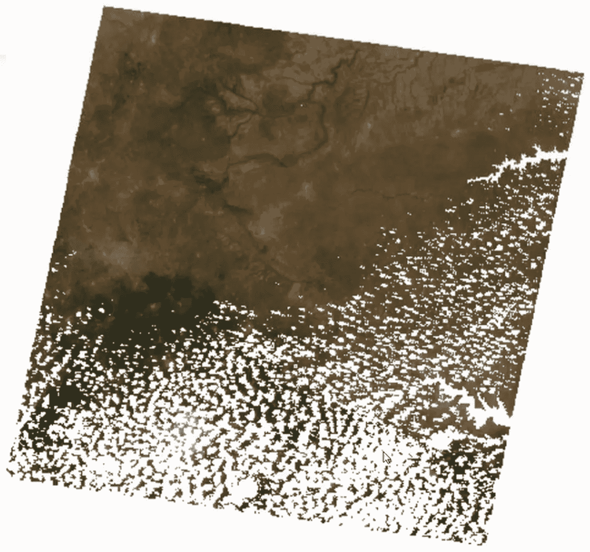
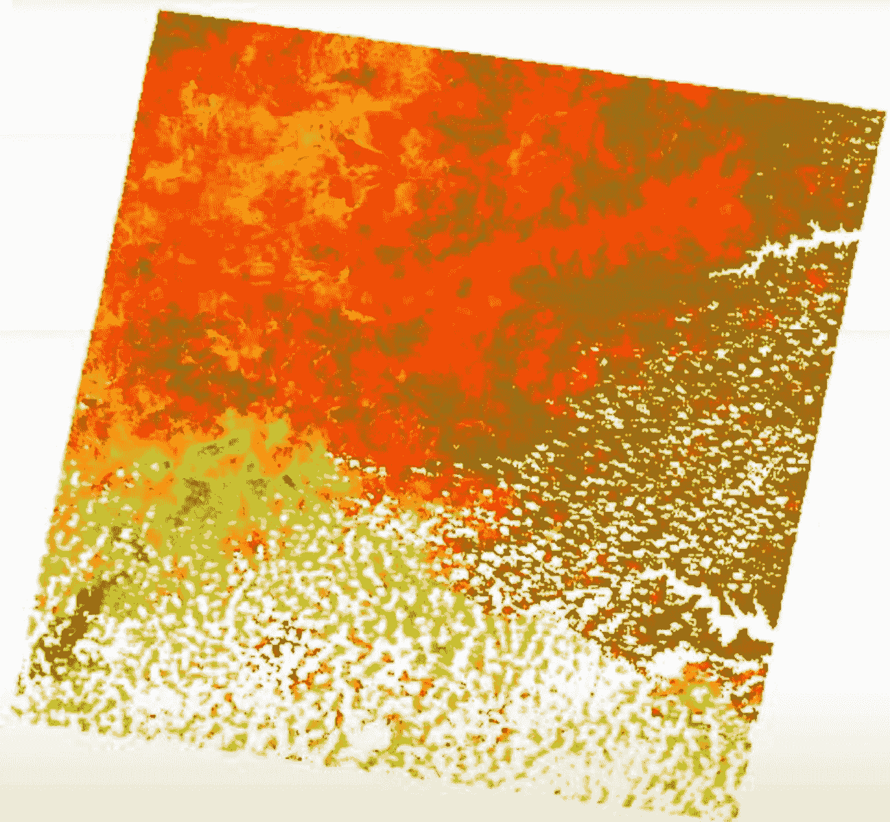
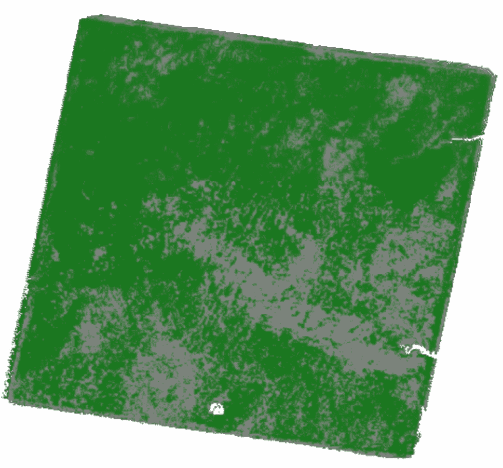

# 如何分析 NDVI 趋势

> 原文：<https://towardsdatascience.com/analyzing-the-annual-maximum-ndvi-trend-using-time-series-landsat-images-a95a686c0c2c?source=collection_archive---------16----------------------->

## 利用时间序列陆地卫星图像分析年最大 NDVI 趋势


由 [Unsplash](https://unsplash.com?utm_source=medium&utm_medium=referral) 上的[hkon grim stad](https://unsplash.com/@grimstad?utm_source=medium&utm_medium=referral)拍摄的照片

[归一化差异植被指数(NDVI)](https://eos.com/make-an-analysis/ndvi/) 是一个简单的图形指示，可用于分析遥感数据，通常来自空间平台，以确定被观察的目标是否有活着的绿色植被。

归一化差异植被指数的卫星数据可用于量化生态系统生产力的变化模式(NDVI)。另一方面，利用 NDVI 时间序列对趋势的估计会因所研究的卫星数据集、相关的时空分辨率和所使用的统计方法而有很大差异。我们分析了各种趋势估计方法的有效性，并表明性能随着 NDVI 时间序列的年际变化的增加而降低。

# ArcGIS

环境系统研究所维护着 ArcGIS，这是一个用于处理地图和地理信息的地理信息系统。它用于创建和利用地图、收集地理数据、分析地图信息、分发和查找地理信息、在各种应用程序中使用地图和地理信息，以及管理数据库中的地理数据。



ArcGIS 的产品/服务(作者创建)

在这个场景中，我使用了 Arcpy.ia 和 ArcGis API for Python。arcpy.ia 是一个用于管理和处理影像和栅格数据的 Python 模块。该模块还提供了 ArcGIS Image Analyst 扩展模块提供的所有地理处理方法，以及用于实现栅格处理工作流自动化的增强功能和类。

事不宜迟，让我们开始吧。我将在解释代码时描述这个过程。首先，我将所需的模块导入到我的工作流中。

```
import osimport matplotlib.pyplot as pltimport arcpyarcpy.CheckOutExtension("ImageAnalyst")
```

# 根据时间序列 Landsat 图像创建栅格集合

## 获取文件夹中所有陆地卫星场景的列表。

我建立了我的数据文件夹。我从美国地质调查局收集了这些数据，你可以在美国地质调查局注册获得类似的数据。我还创建了四个数组供将来使用。



美国地质调查局网站

```
folder = r"\\landsat\\LE70820552011359EDC00"raster_lists = []acquisition_time = []names = []quality_bands = []
```

在下面的代码中，我从源文件夹中检索所有 tif 文件，并将它们添加到栅格数据集中。我还包括每个数组的获取时间和文件名。但是，在添加文件名之前，我用. xml 对其进行了更改。

```
for directory in sorted(os.listdir(folder)):for file in os.listdir(folder+"\\"+directory):if file.endswith("xml") and len(file.split(".")) == 2:raster_lists.append(folder+"\\"+directory+"\\"+file)time = file.split("_")[3]acquisition_time.append(time[:4]+"-"+time[4:6]+"-"+time[6:])names.append(file.replace(".xml", ""))quality_bands.append(folder+"\\"+directory+"\\"+file.replace(".xml", "") + "_pixel_qa.tif")
```

## 创建栅格集合

为了生成栅格集合，我使用了 raster collection 方法。RasterCollection 对象可以轻松地对一组栅格进行排序和过滤，并为后续处理和分析准备集合。RasterCollection 对象有六种方法可用于为集合栅格中匹配波段上的每个像素生成统计数据(最大值、最小值、中值、平均值、多数和总和)。

```
rc = arcpy.ia.RasterCollection(raster_lists, {"Varieble": "Landsat7", names, "STDTime": acquisition_time, "Quantity": quality_bands})
```

# 过滤器

我们使用的数据集涵盖了 18 年的数据。所以我只用了 10 年的数据。我们可以通过使用 filterByCalanderRange 函数来实现这一点。

```
filtered_rc = rc.filterByCalenderRange(calender_field = "YEAR", start = 1997, end = 2007)
```

## 可视化栅格集合

不，我们可以查看栅格集合。

```
filtered_rc
```

结果如下。如我们所见，它显示变量、名称等等。



结果(作者创建)

## 项目中的可视光栅

下面的代码从集合的最终条目中检索栅格。我使用 arcpy.ia.Render 函数来呈现结果，并使用 exportImage 方法将其显示为图像。

要改进符号系统，请使用渲染功能来调整栅格对象的外观。当在 Jupyter 笔记本上工作时，数据显示是一个重要的优势，这个功能非常有用。该函数使用指定的渲染规则或颜色映射生成一个光栅对象。必须至少给出一个呈现规则或颜色映射。

```
first_item = filtered_rc[0]['Raster']rendered_raster = arcpy.ia.Render(first_item_raster, rendering_rule = {"bands": [3, 2, 1], "min": 500, "max": 1000, colormap='NDVI'})rendered_raster.exportImage(width = 500)
```

这是结果图。正如我们所看到的，这张图片有很多云。因此，我们必须清理这个形象。



结果图像(作者创建)

# 预处理

在预处理阶段，我将处理之前获得的图像，去除云、阴影、水和雪。

在下面的代码中，我首先检索栅格和每个栅格的质量。然后，我保存需要从栅格中移除的像素值。接下来，我使用 arcpy.ia.Apply 和 bandRaster 来应用于每个栅格。bandRaster 将屏蔽指定 RGB 波段中的像素。然后，我分配一个已清理的评定者，并将其分配给 return。

```
def clean(item):raster - item["Raster"]qa_raster = arcpy.Raster(item["Quantity"])values_tb = (qa_raster != 68) & (qa_raster != 72) & (qa_raster != 80) & (qa_raster != 96) & (qa_raster != 132) & (qa_raster != 136) & (qa_raster != 112) & (qa_raster != 144) & (qa_raster != 160) & (qa_raster != 176)masked_clean_band_list = []for bandRaster in raster.getRasterBands([1, 2, 3, 4, 5, 6]):masked_clean_band = arcpy.ia.Apply((values_tb, bandRaster, 0), "Local", args = {"Operation": "StdTime"})masked_clean_band_list.append(masked_clean_band)masked_clean_raster = arcpy.ia.CompositeBand(masked_clean_band_list)return {"raster": masked_clean_raster, "Name" : item["Name"], "StdTime" : item["StdTime"]}cleaned_rc = filtered_rc.map(clean)
```

## 设想

使用这段代码，我在集合的第二个项目中检索栅格。

```
first_item_raster = cleaned_rc[0]['Raster']rendered_raster = arcpy.ia.Render(first_item_raster, rendering_rule = {"bands": [3, 2, 1], "min": 500, "max": 1000, colormap='NDVI'})renderes_raster.exportImage(width = 500)
```

如下图所示，整个水域都被遮罩掉了。



结果图像(作者创建)

# 计算 NDVI

我定义了一种称为 clacNDVI 的方法来计算 NDVI，并使用 arcpy.ia.NDVI 从项目栅格和两个波段值创建 NDVI 栅格。最后，我返回项目、名称和标准时间等参数。

```
def clacNDVI(item):ndvi = arcpy.ia.NDVI(item['Raster'], nir_band_id = 4, red_band = 3)return {"raster": ndvi, "Name": item["Name"], "StdTime": item["StdTime"]}ndvi_rc = cleaned_rc.map(calcNDVI)
```

当我们调用这个函数时，我们得到了 NDVI 栅格。

## 设想

让我们用和我之前一样的方式来可视化栅格。

```
first_item_raster = ndvi_rc[0]['Raster']rendered_raster = arcpy.ia.Render(first_item_raster, rendering_rule = {"bands": [3, 2, 1], "min": 0, "max": 1.0, colormap='NDVI'})rendred_raster.exportImage(width = 500)
```

这与上一个栅格相同。然而，它现在显示 NDVI。



结果图像(作者创建)

# 每年获得最大 NDVI

我使用下面的代码转换了多维栅格集合。此方法返回一个多维栅格数据集，栅格集合中的每个项目代表多维栅格中的一个切片。

```
anual_max_ndvi_mdraster = arcpy.ia.Aggregate(ndvi_mdraster, demension_name = "StdTime", raster_function = "MaxIgnoreNoData", aggregate_definition = {"interval": "yearly"})
```

我使用 arcpy.ia.Aggregate 函数来确定每年的最大 NDVI。此方法基于提供的多维栅格生成栅格对象。默认情况下，将为与所选维度链接的所有变量计算聚合。在本例中，我使用 STDTime 作为维度时间，使用 MaxIgnoreNoData 作为栅格函数，其时间间隔为一年。

# 生成趋势

现在，我对年度最大多维栅格应用线性趋势。线性趋势线是估计基本线性关系的最佳拟合直线。线性趋势表示以一致的速度增加或减少的变化速度。

```
max_ndvi_linear_trend = arcpy.ia.Apply(Annual_max_ndvi_mdraster, "TrendAnalysis", raster_function_arguments = {"DimensionName": "StdTime", "RegressionType": 0})
```

# 设想

我们可以使用下面的代码检索趋势栅格的斜率。getRasterBands 为多波段栅格数据集中提供的每个波段返回一个栅格对象。在这种情况下，我使用 1 作为栅格波段。

```
slope - max_ndvi_linear_trend.getRaterBands(1)
```

## 再变换

为了修改负像素值，我使用了重映射函数。重映射功能允许您更改或重分类栅格数据像素值。这可以通过提供映射到输出像素值的像素值范围或者通过使用表格将像素值映射到输出像素值来实现。因此，输出将是一个布尔映射。

```
increase_decrease_trend_map = arcpy.ia.Remap(slope, input_ranges=[-10000, 0, 0, 10000], output_values=[-1, 1])
```

## 提供；给予

我用不同颜色的渲染函数进行渲染(绿色和灰色)。

```
rendered_raster = arcpy.ia.Render(increase_decrease_trend_map, colormap = {"values":[0, 1], "colors": ["#B0C4DE", "green", "gray"]})rendered_raster.exportImage(width = 500)
```

当我们看这张图片时，我们可以看到绿色区域的 NDVI 在增加。图像上的灰点代表 NDVI 减少的区域。



结果图像(作者创建)

# 让我们回顾一下

NDVI 是使用 GIS 工具对影像执行的逐像素数学计算。它是通过测量红光和近红外光的吸收和反射来确定的植物健康指标。NDVI 可用于研究世界各地的土地，使其既适用于重点实地研究，也适用于大陆或全球范围的植被监测。ArcGIS 是一个用于处理地图和地理信息的地理信息系统，由环境系统研究所维护。ArcGIS 可用于计算 NDVI。

*参考*

[*什么是 NDVI(归一化差异植被指数)？*](https://gisgeography.com/ndvi-normalized-difference-vegetation-index/)

[*ArcGis 文档*](https://doc.arcgis.com/en/)

<https://www.linkedin.com/in/rkavishwara/> 