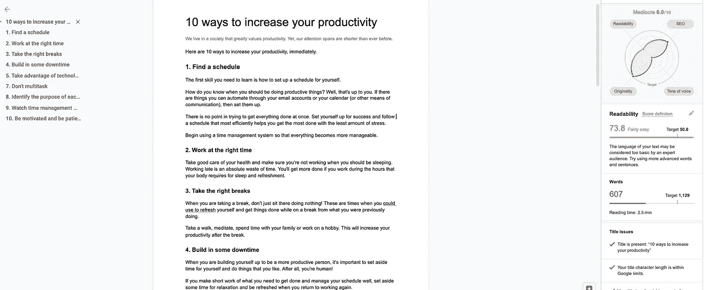
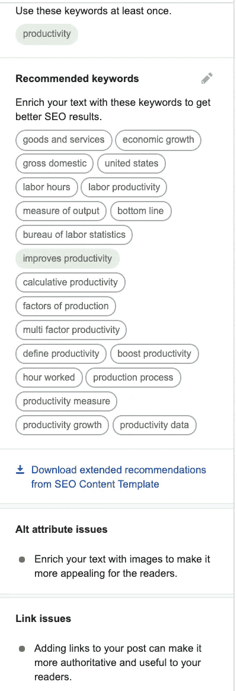
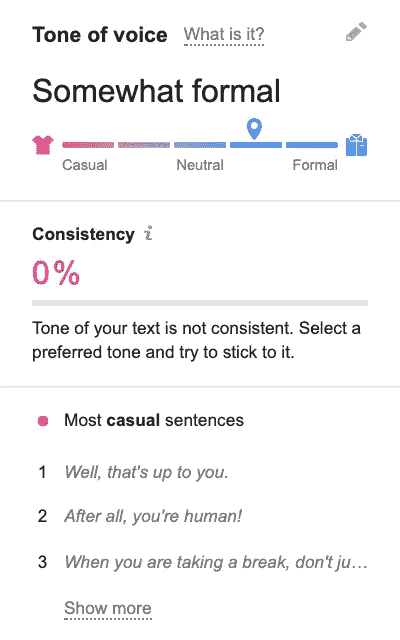

# GPT-3 在搜索引擎优化方面有多好？

> 原文：<https://towardsdatascience.com/analyzing-the-seo-score-of-an-article-gpt-3-wrote-59108dd105af?source=collection_archive---------34----------------------->

## 使用自动化人工智能生成的内容有哪些实际和更广泛的社会关注？

[附身摄影](https://unsplash.com/@possessedphotography?utm_source=medium&utm_medium=referral)在 [Unsplash](https://unsplash.com?utm_source=medium&utm_medium=referral) 上拍照

机器人正在写文章。机器人正在编写代码。活着是多么令人兴奋的时刻啊！

GPT 3 号现在风靡一时。这是一个生成性的预训练深度学习模型，用于生成类似人类的文本。它是由专门从事人工智能研究的实验室 OpenAI 创建的。

作为一名作家、数字营销人员和一名有抱负的数据科学家，我对这种模式可能有助于创造的可能性感到兴奋。所以，我测试了这个模型。

我想给你看一下 [Semrush](https://medium.com/u/66ea53c1199c?source=post_page-----59108dd105af--------------------------------) 的 SEO 写作工具对一篇文章的评估结果，由 GPT-3 生成。然后，我们将讨论这种模式进入主流阶段的意义——它的局限性，以及对社会和地球的潜在影响。

# 一个机器人写了这篇文章

最近，OpenAI [宣布](https://en.wikipedia.org/wiki/GPT-3)用户可以请求访问其用户友好的 GPT-3 API——一种“机器学习工具集”——以帮助 OpenAI“探索这项新技术的优势和局限性”。

由于我对它的访问是待定的，我使用了一个服务，已经在他们的应用程序中应用了该模型，简称为ai。

虽然 shortly.ai 被誉为市场上最成熟的作家，但它目前相当昂贵，所以我不会以任何方式支持购买。至少现在还不行，在 OpenAI 发布 alpha 之前。

开始很容易。你会被提示选择一个文章类型(故事或博客/文章)，然后写一个标题和几个句子来提示模型开始写作。

然后，瞧！GPT 3 号不到 3 分钟就完成了我的工作。

查看它为您自己写的示例文章。

 [## 提高工作效率的 10 种方法

### 一篇文章，GPT 写的-3

lazarinastoy.medium.com](https://lazarinastoy.medium.com/10-ways-to-increase-your-productivity-c4154b765b9a) 

现在，让我们开始分析。

# 评价

Semrush 的 SEO 写作助手是一款针对内容优化的工具。它对你输入的目标关键词使用谷歌搜索结果中前 10 名竞争对手的分析。它提供的建议可以提高它所分析的文本的 SEO 友好性、可读性和语调。它可以作为谷歌文档的附加组件。

以下是它对这篇人工智能文章的评论。

6/10——一般。哎哟。我们来看看为什么。

作者谷歌文档的屏幕截图(图片由作者提供)

## 可读性

可读性分数是最低的之一。原因是这篇课文是为一个五岁的孩子写的。十分清楚，平心而论！句子简单易懂，这不一定总是坏事，但好的写作需要一些变化。

很明显，这里少了点什么。事实是，书面内容要想真正成功，需要与观众建立联系。这往往是由作者的轶事，甚至随机切线，个人经验分享，批判性讨论，思想。

目前，这篇文章最多只能变成一个维基百科。这是一个想法转储，一个粗略的草稿，需要一些关键的编辑迭代才能发表到任何值得尊敬的出版物。

搜索引擎优化部分——作者谷歌文档的屏幕截图(图片由作者提供)

## 搜索引擎优化

SEO 部分包括关键词和链接推荐，以及 alt 标签检查。

因为我们的文章没有任何图像，所以没有丢失 alt-tag 警告，但是，我们被提醒，有图像的文章对读者更有吸引力。

也没有添加链接。这是我在阅读这篇文章时没有立即注意到的，但是，我认为它非常重要。GPT 3 写体面，逻辑的内容。然而，却找不到认可其观点的地方。

再一次，我们回到彻底编辑的需要——最好是如批判性地评估所做的声明，在此过程中使用各种权威来源。

最后，使用的相关关键词并不多。当然，其中一些是不相关的，但是提供的目标关键字(即生产力)是一个相当广泛的目标。

如果输入的句子为主题提供了更多的上下文，应该如何处理，以及重要的主要和次要关键字，这可能是模型可以做得更好的事情。

语调部分——作者谷歌文档的屏幕截图(图片由作者提供)

## 语音语调

现在，谈谈语气。语调是信息呈现的方式，包括用词、顺序、节奏和语速的选择。

塞姆拉什用五分制给语调打分:

*   很随意(*“这是有史以来最愚蠢的建议。”)*
*   有点漫不经心(*“那其实并不聪明。”)*
*   中立(*“没有人要求这个建议。”)*
*   有点正式(*“不需要推荐信。”)*
*   非常正式(*)“给定的推荐是不请自来且不受欢迎的，将不会被接受。”).*

Semrush 说,[语音评分使用机器学习算法，基于科学证明的研究和数以千计的人类评分文本。](https://medium.com/u/66ea53c1199c?source=post_page-----59108dd105af--------------------------------)

生成的文本有些正式，但完全不一致。

## 独创性

并不奇怪，但文字是 100%原创。

原创部分——作者谷歌文档的截屏(图片由作者提供)

GPT-3 模型使用自然语言处理来理解不同的文本语料库，它已经通过许多不同的数据集进行了预训练。这允许自然语言理解，而不需要时间密集的数据标记。它生成的任何文本都是原始的和新的。

## 判决

印象深刻，印象深刻，印象深刻。尽管如此，在将这个模型应用到现实世界的任何地方之前，人类是绝对必要的。

通过人类辅助的机器学习，可以实现内在的人类元素，如情感和细微的视觉线索，以改善模型的输出。单独使用机器学习算法是行不通的，至少对于长格式内容来说是这样。还没有。

# 对广泛实施 GPT 协议-3 的广泛影响和担忧

首先，你可能想知道——谷歌对这种生成内容的程序化方法有什么看法？

是的——假设他们现在反对，你可能是对的。在写这篇文章的时候，[谷歌的质量指南](https://support.google.com/webmasters/answer/2721306?hl=en)说:

> 自动生成(或“自动生成”)的内容是以编程方式生成的内容。如果谷歌的目的是操纵搜索排名，而不是帮助用户，谷歌可能会对这些内容采取行动。这些包括但不限于:(…)
> 
> 通过自动化过程生成的文本，如马尔可夫链(…)

虽然，[他们说](https://youtu.be/kPVNl7btFHQ?t=3185)在未来的某个时候，可能会对这些指导方针进行修订。

更令我担心的是社会对 GPT-3 模型更广泛实施的担忧，这在布朗和开放人工智能实验室的学者们的研究中得到了强调。

该研究的作者强调了该模型的一些令人关注的应用，目的是支持研究和立法工作以降低风险:

*   **恶意滥用—** 将 GPT-3 用于错误信息、垃圾邮件、网络钓鱼、滥用法律和政府程序、欺诈性学术论文写作和社会工程伪装
*   **认可和维持关于种族、偏见和代表性的现有刻板印象** —当出现在训练数据中时，这些会导致模型生成刻板印象或偏见内容
*   **保持对职场男性的刻板印象**——作者报告称，他们测试的 388 种职业中，有 83%更有可能被 GPT-3 的男性识别符跟随
*   **强化关于种族的现有刻板印象** —当被提示谈论种族时，当讨论“黑人”时，检测到的模型情绪一直很低(亚洲人——高；白色—中性)
*   **强化现有的关于宗教的刻板印象** —因为模型与宗教术语相关联，表明当被提示谈论宗教时，这些术语有时在世界上是如何呈现的，如暴力、恐怖主义和恐怖主义等词与伊斯兰教比与其他宗教更频繁地同时出现。

作者还强调了训练模型所需的能源使用，以及这种模型的广泛发展对地球及其资源的潜在影响。

# 外卖

GPT 3 号是令人兴奋的，崭新的，闪亮的；然而，它远非完美。

仍然非常需要人类来帮助创建公平、健壮、批判性、深刻和吸引人的美丽内容。

虽然这种模式的好处大于成本，但至少在测试中，广泛使用 GPT-3 的影响在为被歪曲和代表不足的社区争取平等和正义的斗争中可能是有害的。

这种主流模式的实施存在着深刻的悖论，这在对这些局限性的讨论中表现得尤为明显。与任何机器学习模型一样，GPT-3 是在现有的文本片段上训练的。很明显，虽然这很了不起，但对于我们所坚持的好的写作标准来说，这仍然是易错的。如果广泛实施(没有编辑过程)，它将导致质量更差的文本和偏见的永久化，这将最终扼杀其发展。

相反，似乎需要的是并肩努力改进这一模式，并帮助它与时俱进。怎么会？通过写得更好，通过编辑它的输出，通过报道它的缺陷。这似乎是我们人类能够帮助研究人员动态推进这个模型的唯一方法。

如果您确实想继续使用 GPT-3 来帮助自己生成内容，请在发布内容之前查看以下方便的清单:

1.  **语言是不是太简单了？** —如果需要，添加更复杂的句子。
2.  **用的字是基本的吗？** —尽可能替换为高级单词。
3.  **添加图像，并插入 alt-tag 以方便使用。**
4.  **批判性地评估自始至终提出的主张—** 尽可能提供权威来源的链接。
5.  **使用的相关关键词是否足够？这篇文章是否连贯地阐述了主题？** —如果需要，添加更多相关关键字。使用[answerthepublic.com](http://answerthepublic.com)等工具添加紧迫问题的答案。
6.  写这篇文章的语调是否一致？ —你的内容的最佳基调将取决于你的用户、你的信息和你的品牌。
7.  **文字读起来像你或你的品牌会说的话吗？** —根据需要，添加、删除、编辑适当的部分以定制您的文本。
8.  **生成的文本是有偏见的，还是支持现有的关于性别、种族或其他代表性问题的刻板印象？** —意识到模型的局限性可以帮助你剔除固有的有害偏见。