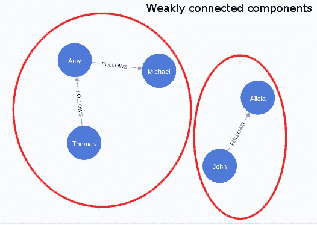

# 用 Neo4j 图形数据科学分析数字游牧民的旅游日志

> 原文：<https://towardsdatascience.com/analyzing-travel-logs-of-digital-nomads-with-neo4j-graph-data-science-b7a13d6ba544?source=collection_archive---------12----------------------->

## 使用 Neo4j Graph 数据科学平台分析数字游牧民的出行模式，预测新的可能路线。

几天前，我偶然发现了由[皮特·里维斯](https://twitter.com/levelsio)在他的[游牧者网站](https://nomadlist.com/)上制作的[旅行日志的网络可视化](https://nomadlist.com/graph)。NomadList 是一个建立基础设施的网站，帮助数字游牧民生活在世界上的任何地方，并与志同道合的人联系。所以我在 Twitter 上问 Pieter 他是否可以分享旅行日志的底层数据，你瞧，就在第二天，他公开了聚合的旅行日志数据。对我来说，唯一合适的下一步是将这些数据插入 Neo4j 并进行试验。这篇博文将展示我的一些发现，并向您展示如何使用新的链接预测管道来预测图中的新连接。

如果你想跟随这篇文章中的例子，我推荐在 [Neo4j 沙箱](https://neo4j.com/sandbox/)中使用一个空白项目。它是 Neo4j 数据库的免费云实例，预装了 APOC 和图形数据科学插件。

## 图形模型


图形模型模式。图片由作者提供。

图模型由城市和旅行日志组成，城市用节点表示，旅行日志用关系描述。旅行日志已经聚集在底层数据中，所以我们只知道从一个城市到另一个城市旅行了多少次。不幸的是，数据中没有时间成分，所以我们无法比较大流行前后的旅行或一个人在那个城市呆了多长时间。我们所知道的是，所有的旅行都发生在 2014 年至 2021 年之间的某个地方，数据可用于每个大洲的前 50 个城市。在更技术性的层面上，我们正在处理一个有向加权图。

## 图形导入

如果您想继续，请打开您的 Neo4j 沙箱实例，并在我们进行的过程中复制 Cypher 查询。如果你想用的话，我还准备了所有的代码在 Jupyter 笔记本里。

首先，我们将在城市节点上定义一个[唯一属性约束](https://neo4j.com/docs/cypher-manual/current/constraints/)。唯一属性约束确保属性值对于特定标签的所有节点都是唯一的，而且还会自动为该属性添加索引，以便更快地导入和查询。

```
CREATE CONSTRAINT ON (c:City) ASSERT c.id IS UNIQUE;
```

接下来，我们将从流浪者网站导入旅行日志。在网站上可以方便地获得 JSON 格式的文件。我们可以使用 *apoc.load.json* 过程从页面中检索数据。我们还将使用 *apoc.periodic.iterate* 过程进行批处理。在[文档](https://neo4j.com/labs/apoc/4.1/graph-updates/periodic-execution/)中阅读更多关于如何批量交易的信息。

```
CALL apoc.periodic.iterate('
  CALL apoc.load.json("https://nomadlist.com/graph.json")
  YIELD value
  WITH value, [x in keys(value) WHERE x <> "README" | x] AS keys
  UNWIND keys AS source_city
  WITH source_city, value
  RETURN source_city, value
','
  MERGE (s:City{name:source_city})
  WITH value[source_city] as destinations, s
  WHERE destinations <> []
  WITH destinations, keys(destinations) as destination_cities, s
  UNWIND destination_cities AS destination_city
  MERGE (t:City{name:destination_city})
  MERGE (s)-[r:TRAVEL_TO]->(t)
  SET r.weight = destinations[destination_city]', 
  {batchSize:10})
```

城市之间的距离在原始数据集中不可用。你可以使用 [APOC 空间程序](https://neo4j.com/labs/apoc/4.1/overview/apoc.spatial/)来检索 GPS 位置。为了避免向 OSM 服务器发送垃圾邮件，我准备了一个包含所有城市位置的 CSV 文件，并将其存储在 GitHub 上。就像从互联网上获取 JSON 文件一样，你也可以从任何网页上获取 CSV 文件。运行以下查询来导入城市的位置。

```
LOAD CSV WITH HEADERS FROM "https://raw.githubusercontent.com/tomasonjo/blog-datasets/main/nomad/nomad_cities_location.csv" as row
MATCH (c:City)
WHERE c.name = row.city
SET c.location = point({latitude:toFloat(row.latitude), longitude:toFloat(row.longitude)})
```

在我们进入分析之前，最后一件事是根据城市的位置信息计算城市之间的距离。

```
MATCH (s:City)-[r:TRAVEL_TO]->(t:City)
WITH r,distance(s.location, t.location) / 1000 AS distanceInKm
SET r.distance = distanceInKm
```

## 探索性图形分析

既然数据集已经导入，您可以通过在 Neo4j 浏览器中运行以下 Cypher 查询来检查样本子图。

```
MATCH p=()-[r:TRAVEL_TO]->()
RETURN p LIMIT 25
```

*结果*


旅行日志的示例子图。作者图片

只要一些节点和关系出现在屏幕上，不要担心没有得到相同的可视化。让我们首先检查我们的图表中表示了多少个旅行日志。记住，在我们得到数据之前，数据已经被聚合了，所以我们需要查看所有旅行关系的 weight 属性的总和。

```
MATCH p=()-[r:TRAVEL_TO]->()
RETURN sum(r.weight) as all_travels
```

在我的例子中，我总共得到了 26657 个旅行日志。你可能会得到一个更高的数字，因为我相信数据不是静态的，会定期更新。现在是时候检查哪些是最受欢迎的目的地。对于那些喜欢技术术语的人，我们将研究具有最高加权入度的节点。

```
MATCH (c:City)<-[r:TRAVEL_TO]-()
RETURN c.name as city, sum(r.weight) as travels
ORDER BY travels DESC
LIMIT 10
```

*结果*

令人惊讶的是，伦敦排在第一位。我从来没有想象过，然而在我看来，曼谷位居第二很有意义。如果知道人们只是经过伦敦到达他们的最终目的地，或者他们实际上会在那里停留更长时间，这将是很有趣的。我们缺乏这方面的信息，所以只能假设。总而言之，泰国和西欧似乎是数字游牧民的热门目的地。此外，新加坡、纽约和旧金山也包括在内。

我还对人们平均喜欢旅行多远感兴趣。我们将距离属性添加到关系中，以便我们可以粗略地检查它们的分布。我准备了一个 Cypher 查询，它创建了四个条块，并计算该距离内的行程除以所有行程的比率。

```
MATCH ()-[r:TRAVEL_TO]->()
RETURN sum(CASE WHEN r.distance < 500 THEN r.weight END) 
          / toFloat(sum(r.weight)) AS within_500,
sum(CASE WHEN 500 < r.distance < 1000 THEN r.weight END) 
          / toFloat(sum(r.weight)) AS within_1000,
sum(CASE WHEN 1000 < r.distance < 2000 THEN r.weight END) 
          / toFloat(sum(r.weight)) AS within_2000,
sum(CASE WHEN 2000 < r.distance  THEN r.weight END) 
          / toFloat(sum(r.weight)) AS rest
```

*结果*

几乎 50%的记录行程不到 1000 公里。作为一个欧洲人，我想象 1000 公里的旅程是一夜火车的距离，就我所知，对于美国人来说，这几乎就像是通勤上班。即使是 2000 公里的旅程，平均也只有两个小时的飞行时间。对于其余 30%的旅行，我想它们最有可能是跨洲旅行。我的假设是，数字游牧民喜欢跨洲旅行，然后通过从一个城市到另一个城市来探索那个大陆。当然，这只是我的假设，我也可能是错的。

## 图形数据科学

现在，我们将利用 [Neo4j 图形数据科学库](https://neo4j.com/docs/graph-data-science/current/)中可用的图形算法进行进一步分析。我们将从投影内存中的图形开始，它将被用作执行图形算法的基础。如果你想了解更多关于图形数据科学库和它是如何工作的，我会推荐免费的[图形算法介绍](https://neo4j.com/graphacademy/training-iga-40/enrollment/)课程。

```
CALL gds.graph.create('nomad', 'City', 'TRAVEL_TO', {relationshipProperties:'weight'});
```

几乎所有的图分析都是从弱连通分量算法开始的。它用于查找图中不相连的部分或节点岛。



样本图中的可视化弱连通分量。图片由作者提供。

要获取 WCC 结果的高级统计信息，可以执行以下查询:

```
CALL gds.wcc.stats('nomad')
YIELD componentCount, componentDistribution;
```

结果


WCC 算法发现了 38 个断开的组件，最大的有 295 个成员。根据百分位值判断，似乎有一个单一的超级组件有 295 个成员，然后有 37 个组件只有一个成员。要检查与世界其他地方没有任何联系的城市，我们可以使用下面的 Cypher 查询:

```
MATCH (c:City)
WHERE NOT (c)--()
RETURN c.name as city
LIMIT 10;
```

*结果*

虽然这些城市在游牧数据集中被提及，但它们与外部世界没有任何联系。

## 中间中心性

接下来，我们将看看中间中心性。中间中心性用于识别节点集群之间的桥或连接。它的计算方法是找出所有节点对之间的最短路径，然后查看节点出现在这些最短路径上的次数。


漫威字符数据集上的中间中心性。BC 较高的节点用红色表示。图片由作者提供。

在漫威的例子中，您可以注意到字符 Beast 是网络中心和右侧之间的唯一桥梁，因此具有较高的介数中心性得分。您可以在 nomadlist 投影内存图中执行介数中心性，如下所示:

```
CALL gds.betweenness.stream('nomad')
YIELD nodeId, score
RETURN gds.util.asNode(nodeId).name AS city, score
ORDER BY score DESC LIMIT 10
```

*结果*

一个重要的免责声明是，在这个例子中，中间中心性没有考虑关系权重。如果你要环游世界，遵循典型的数字游牧旅行模式，你可能会在某个时间点到达这些城市。例如，如果你在欧洲和亚洲之间旅行，你很有可能迟早会到达迪拜。我之前已经提到过，我很想知道游牧民族是在伦敦呆得更久，还是只是为了穿越大陆而去。同样，你可以把这些结果解释为纽约和墨西哥是进入或离开北美的入口点。

## 网络可视化

现在，我们将为这篇博文创建一个可爱的特征图像。我只是部分开玩笑，但是对于像这样的小数据集，开发良好的网络可视化是有意义的，因为一个优秀的可视化胜过千言万语。

我们将使用 PageRank 分数来确定节点的大小。在 PageRank 的上下文中，每个关系都可以解释为信任投票。在我们的游牧者旅行日志的例子中，最受欢迎的游牧目的地应该有最高的分数。这是因为 PageRank 算法既考虑了传入连接的数量，也考虑了这些连接来自哪里。

```
CALL gds.pageRank.write('nomad', {relationshipWeightProperty:'weight', writeProperty:'pagerank'});
```

为了确定可视化中节点的颜色，我们将使用 Louvain 模块化算法。Louvain 模块化算法是一种社区检测或聚类算法，它将密集连接的节点分组在一起。

```
CALL gds.louvain.write('nomad', {relationshipWeightProperty:'weight', writeProperty:'louvain'});
```

如果您使用 Neo4j 沙盒或桌面，您可以打开 Neo4j Bloom 并重新创建以下可视化。如果您想了解 Neo4j Bloom 中基于规则的网络可视化的更多信息，请查看[文档](https://neo4j.com/docs/bloom-user-guide/current/bloom-visual-tour/)。


游牧网络可视化。节点基于它们所属的社区被着色，并且它们的大小由 PageRank 算法确定。图片由作者提供。

节点群很好地与大陆对齐。例如，橙色社区代表北美的节点，而紫色社区代表欧洲的节点。这些结果可以解释为，大多数旅行是洲际旅行，因为更多联系紧密的城市聚集在同一个社区。节点的大小决定了该大陆最受欢迎的城市。例如，最受欢迎的亚洲目的地是曼谷、吉隆坡、新加坡、清迈和仓谷。有了 Bloom，你可以专注于一个单一的社区，并探索其中的旅行模式。


亚洲社区的网络可视化。图片由作者提供。

我还包括了北美社区，因为这些网络视觉效果很悦目。


北美社区的网络可视化。图片由作者提供。

完成网络分析后，应该删除投影图以释放内存。

```
CALL gds.graph.drop('nomad')
```

## 链路预测流水线

Neo4j 图形数据科学库 1.7 版本中增加了链接预测管道。链接预测是一种技术，它做的事情和你想象的完全一样。它用于预测网络中尚不存在的新连接。您可以将它视为一个二进制分类模型，它指示节点对之间是否可能存在新的链接。从推荐系统到药物再利用，链接预测有多种应用。首先，您必须定义一个新的链接预测管道。

```
CALL gds.alpha.ml.pipeline.linkPrediction.create('lp-pipeline');
```

作为链接预测管道的一部分，您可以添加执行其他图算法的中间步骤。您希望运行图形算法，其输出将用作链接预测分类器特征。在本例中，我们将使用 FastRP 节点嵌入作为链路预测模型的输入特征。你可以在我的朋友 Clair Sullivan 的这篇[优秀文章中读到更多关于 FastRP 算法的内容。](/behind-the-scenes-on-the-fast-random-projection-algorithm-for-generating-graph-embeddings-efb1db0895)

```
CALL gds.alpha.ml.pipeline.linkPrediction.addNodeProperty(
  'lp-pipeline', 
  'fastRPExtended', {
    mutateProperty: 'embedding',
    featureProperties:['pagerank'],
    embeddingDimension: 128,
    randomSeed: 42
});
```

这里，我们已经定义了链路预测流水线应该通过执行 FastRP 算法开始，该算法将输出网络中所有节点的嵌入。您还可以在此步骤的配置中微调算法超参数。接下来，我们需要定义如何组合链接的源节点和目标节点特征，以生成链接预测模型的输入。请记住，Neo4j GDS 中的链接预测模型是一个二元分类模型，它使用了逻辑回归。无论网络中是否存在连接，输出都是 1 或 0，并且通过考虑源和目标节点特征来组合输入特征。目前，管道有三种不同的方式组合节点功能:

*   L2
*   哈达马德
*   余弦

您可以查看[文档](https://neo4j.com/docs/graph-data-science/current/algorithms/ml-models/linkprediction/#algorithms-ml-linkprediction-train)以获取更多关于将节点特征组合为链接预测模型输入的信息。在本例中，我们将使用余弦组合器来组合成对节点的 FastRP 节点嵌入。

```
CALL gds.alpha.ml.pipeline.linkPrediction.addFeature('lp-pipeline', 'cosine', {
  nodeProperties: ['embedding']
}) YIELD featureSteps;
```

现在是时候定义训练测试划分了。我们可以定义测试列车分流比。流水线使用 k-fold 交叉验证训练技术。关于训练测试分割的一个好处是我们不必开发手动数据分割。

```
CALL gds.alpha.ml.pipeline.linkPrediction.configureSplit(
 'lp-pipeline', {  
   testFraction: 0.3,
   trainFraction: 0.6,
   validationFolds: 7})
YIELD splitConfig;
```

在训练模型之前，我们必须设置的最后一个配置是链路预测模型超参数。您可以提供模型超参数的许多变体。在本例中，我们将提供三种不同的超参数组合，模型将在训练过程中自动选择提供最佳结果的组合。

```
CALL gds.alpha.ml.pipeline.linkPrediction.configureParams(
  'lp-pipeline',  
    [{tolerance: 0.001, maxEpochs: 500},    
     {penalty:0.001, tolerance: 0.01,  maxEpochs: 500},      
     {penalty:0.01, tolerance: 0.01, maxEpochs: 500}])
YIELD parameterSpace;
```

同样，在开始之前，我们需要投影内存中的图形。与之前的微妙区别在于，这里我们将关系投射为无向的。目前，链接预测管道仅支持预测无向关系。

```
CALL gds.graph.create('lp-graph', 
  'City', 
  {TRAVEL_TO:{orientation:'UNDIRECTED'}}, 
  {nodeProperties:['pagerank']});
```

最后，我们开始训练我们的链接预测模型。

```
CALL gds.alpha.ml.pipeline.linkPrediction.train('lp-graph', 
  {pipeline: 'lp-pipeline',
   modelName: 'lp-model',
   randomSeed: 42})
YIELD modelInfo
RETURN  modelInfo.bestParameters AS winningModel,  modelInfo.metrics.AUCPR.outerTrain AS trainGraphScore,  modelInfo.metrics.AUCPR.test AS testGraphScore;
```

您可以使用 mutate 模式生成分类结果，并将预测的关系存储回投影图。

```
CALL gds.alpha.ml.pipeline.linkPrediction.predict.mutate('lp-graph', 
  {modelName: 'lp-model',  
   mutateRelationshipType: 'TRAVEL_PREDICTED',
   topN: 20,
   threshold: 0.45})
YIELD relationshipsWritten;
```

最后一步，您可以使用下面的 Cypher 查询对结果进行流式处理和检查。

```
CALL gds.graph.streamRelationshipProperty('lp-graph', 
  'probability', 
  ['TRAVEL_PREDICTED'])
YIELD  sourceNodeId, targetNodeId, propertyValue
WHERE sourceNodeId < targetNodeId
WITH  gds.util.asNode(sourceNodeId).name as city1, gds.util.asNode(targetNodeId).name as city2, propertyValue AS probability
ORDER BY probability DESC
RETURN city1, city2
LIMIT 10;
```

*链接预测结果*

我们的链路预测主要预测新的本地连接。例如，它预测了葡萄牙的马德拉和埃里希拉或摩洛哥的丹吉尔和阿加迪尔之间的新航线。同样，它预测了柬埔寨、越南和泰国等邻国之间的新联系。唯一一个看起来有点不靠谱的预测是连接几内亚的科纳克里和加拿大的阿伯茨福德。

## 结论

我希望我让您对网络分析以及如何在机器学习工作流中结合网络特征来预测新链接感到兴奋。如果你感兴趣，你可以跳到 Neo4j 沙盒上，按照这个教程或者选择任何其他沙盒项目开始。如果你在游牧数据上发现了任何很酷的见解，或者你对下一步你希望看到的数据分析有任何反馈，请告诉我。

和往常一样，代码可以在 [GitHub](https://github.com/tomasonjo/blogs/blob/master/nomad/NomadList.ipynb) 上获得。