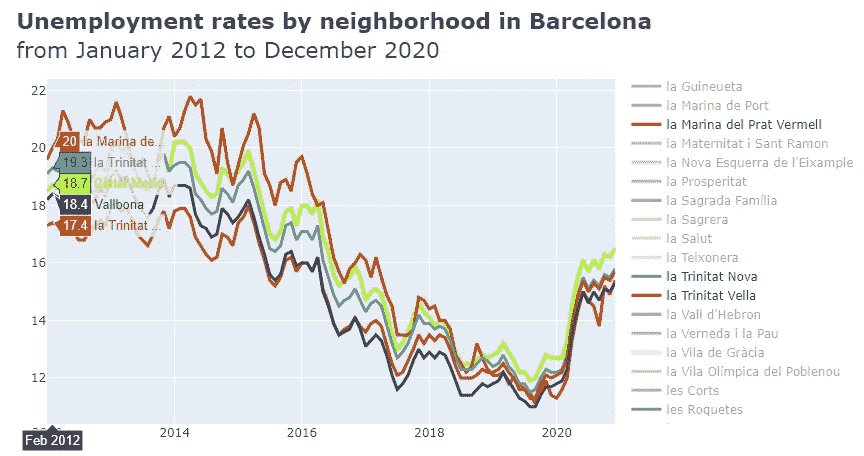
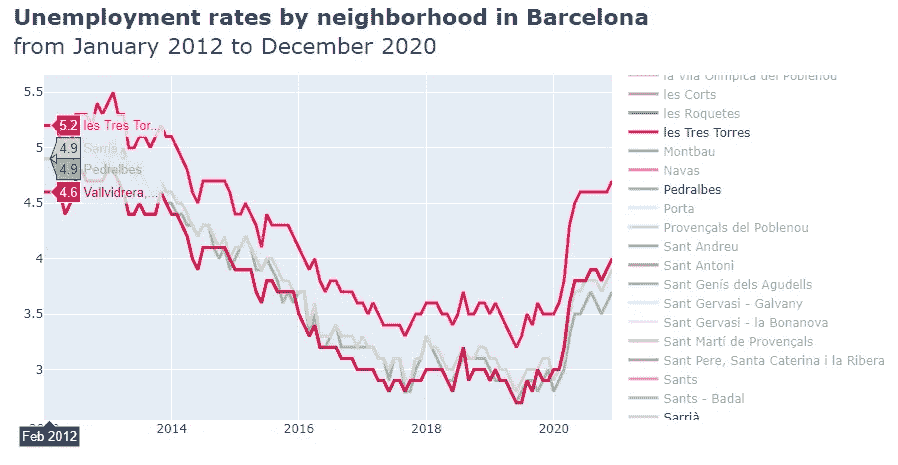
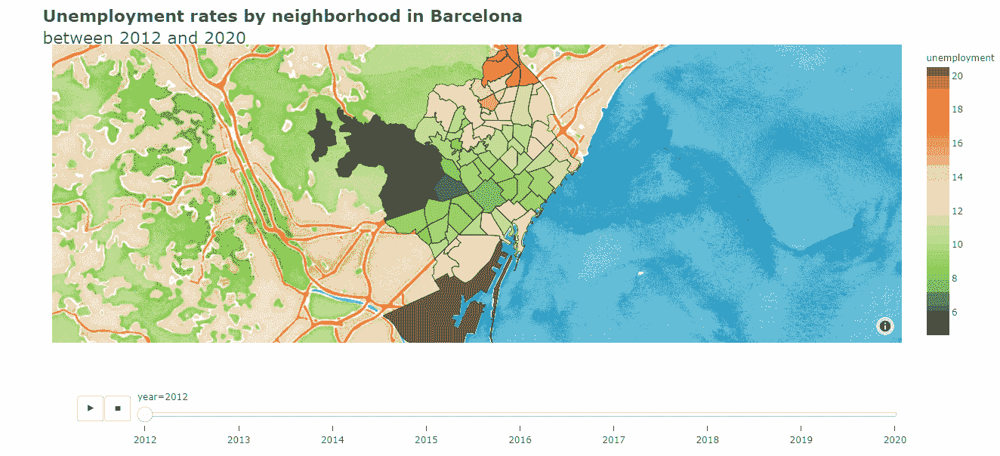
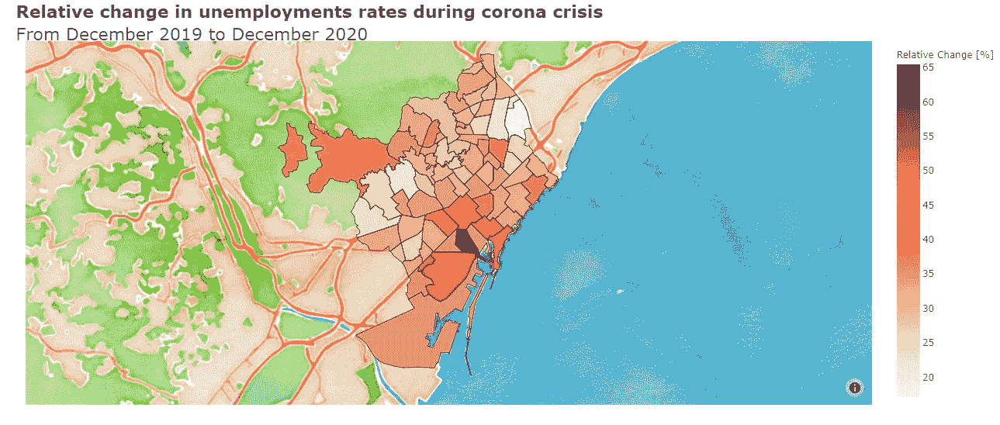
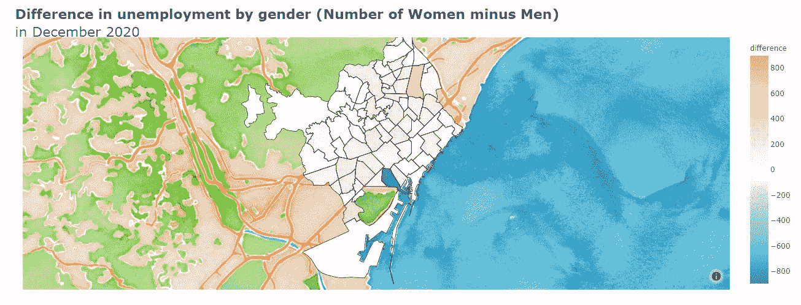

# 用交互式可视化分析巴塞罗那的失业率

> 原文：<https://towardsdatascience.com/analyzing-unemployment-rates-in-barcelona-with-interactive-visualizations-f69f70c03caf?source=collection_archive---------32----------------------->

## 新冠肺炎和社会不平等对巴塞罗纳失业率的影响概述。

爱德华多·伊格莱西亚斯水彩画(经作者授权在此发表)

2008 年的金融危机对西班牙经济产生了重大影响，特别是在失业方面。然而，从 2012 年开始，西班牙经历了缓慢但持续的经济复苏。冠状病毒疫情已经结束了似乎不可阻挡的增长，再次增加了整个国家的失业率。

这篇文章分析了巴塞罗那所有街区过去 8 年的失业率。该研究旨在应对与失业率的时间和地理分布相关的多个方面。电晕危机对失业有多大影响？哪些社区受危机影响最严重？失业率较高的地区在哪里？在失业方面是否存在性别平等？还有更多问题…继续读❤️

# 巴塞罗那开放数据

本文中使用的所有数据集都是从巴塞罗那开放数据中心获得的:

*   **巴塞罗那市 16 至 64 岁人口中登记失业的比重**
*   **登记失业按巴塞罗纳市的持续时间分类**
*   **巴塞罗纳市的登记失业人数**
*   **巴塞罗那市每户平均税收**

 [## 开放数据 BCN

### 每个渴望发现巴塞罗那的人的空间

open data-a jument . Barcelona . cat](https://opendata-ajuntament.barcelona.cat/en/) 

# 按街区分列的失业率的时间演变

我们从分析巴塞罗那不同地区失业率的演变开始这篇文章。下面的交互式可视化显示了从 2012 年 1 月到 2020 年 12 月**失业率的演变。每条线代表巴塞罗那的一个街区，总共 72 个(按字母顺序排列)。默认情况下，除了 Baró de Viver 之外，看不到任何线条；然而，我们可以很容易地激活/停用图线，只需点击图例上它们各自的名称。**

当我们与可视化交互时，我们会注意到一些有趣的见解。**自 2012 年**(我们没有之前的数据)以来，我们可以观察到**几乎所有社区的失业率都呈整体下降趋势**。当冠状病毒危机再次重创巴塞罗那经济时，这座城市仍在从 2008 年的金融危机中恢复。在许多社区，我们可以注意到从 2020 年 2 月到 2020 年 6 月失业率的快速增长。然而，从那时起，我们观察到一个慢得多的增量。

> 自 2012 年以来，我们可以观察到巴塞罗那所有社区的失业率持续回升。这种复苏在 2020 年 2 月被电晕危机打破。

在与上面的可视化互动时，你可能会注意到的另一个方面是不同社区失业率的不同演变。尽管所有社区的总体趋势几乎相同，但我们可以观察到，在失业率较高的地区，就业的季节性差异更大(主要与旅游业和圣诞节有关)。下图显示了高失业率地区失业率的变化。正如你所观察到的，从四月到五月到七月到八月通常会有一个急剧的下降，然后在新年前后会有一个相当不明显的下降。

失业率较高地区的失业变化

然而，在失业率较低的社区，情况却大不相同。这些地区没有季节性变化。这部分是因为这些领域的就业类型需要更高的教育背景，因此更稳定。但是大量的熟练劳动力并不是这些地区拥有更稳定就业的唯一原因。我们不要忘记，这些也是巴塞罗那人均收入较高的街区，我们稍后会看到。

失业率较低地区的失业变化

> **我们观察到，在失业率较高的地区，失业率有较大的季节性变化**。

# 按街区划分的失业率空间分布

处理地理空间数据时，直观地查看地图上的数据通常很有用。在这种特殊情况下，choropleth 图是最佳选择。 **Choropleth 图提供了一种简单的方法，通过使用阴影区域来可视化一个变量在一个区域内的变化。**这些区域通常是行政区划，如国家、城市、州，或者在本例中是街区。

下面的地图显示了巴塞罗那每年的失业率分布(从 2012 年到 2020 年，每年一张地图)。在绘制地图之前，我们已经计算了每个街区的年失业率，因为提供 108 张 choropleth 地图(每月一张)没有任何意义。正如我们将在下面看到的，**失业率的分布在过去几年中几乎没有变化**所以提供年度数据变得更有意义。

在设计视觉效果时，颜色的使用是我们应该牢记在心的关键要素之一。颜色有其相关的含义，因此正确使用颜色以避免误解非常重要。在下面的地图上，我们选择了发散的配色方案。该方案是为强调数据中的低值和高值的情况而设计的。在这种特殊情况下，RdYlGr 方案(之前已翻转)应用于 choropleth 地图，以高亮显示失业率较低(用绿色表示)和较高(用红色表示)的邻域。

> **失业率较高的地区位于港口附近和城市的内北侧。**

当我们与可视化交互时，我们会注意到一些有趣的见解。**失业率较高的地区位于港口附近和城市的内北侧。**尽管从 2012 年到 2020 年，这些街区的失业率有所下降，但这些地区的失业率一直是全市最高的。此外，**我们可以观察到，失业率在巴塞罗那的地理分布并不均匀，因为受影响最严重的地区的失业率是失业率较低的街区的 4 倍左右。**

> **失业率在整个城市的分布并不均匀，因为受影响最严重的社区的失业率比失业率较低的社区高出约 4 倍。**

# 新冠肺炎对失业率的影响

冠状病毒爆发严重影响了全球经济；特别是，西班牙在 2020 年裁员超过 50 万人。这是有道理的，因为西班牙的经济主要基于旅游业，而没有像其他欧洲国家那样强大的生产部门。然而，使用以前的可视化方法，无法计算出哪些地区在失业方面受到了电晕危机的最严重影响。下面的可视化旨在解决这个问题。它显示了按降序排列的相邻地区失业率的相对变化(仅显示前 10 名)。使用以下公式计算相对变化百分比。

> 百分比变化=((2020 年 12 月的比率-2019 年 12 月的比率)/2019 年 12 月的比率)* 100

不出所料，巴塞罗那的所有街区去年都面临着失业率的上升，从 17.11(埃尔邦帕斯托尔)到 65.5(埃尔拉瓦尔)不等。在科罗纳危机期间，共有 6 个区的失业率相对变化超过了 40%:埃尔拉瓦尔、埃尔波布尔-塞、拉丰德拉瓜特拉、拉德雷塔德莱辛普、拉巴塞洛内塔和圣佩雷、圣卡塔林纳和拉里贝拉。然而，如下所示，在电晕危机开始前的失业率和一年后失业率的相对变化之间没有关系，这意味着失业率较高的地区没有比失业率较低的社区遭受更大的相对增长。

> 由于电晕危机，巴塞罗那的所有街区都面临着失业率的上升。

> 2019 年 12 月的失业率与冠状病毒疫情(按街区)导致的失业增量之间没有关系。

**埃尔拉瓦尔是受科罗纳危机影响最严重的社区，失业率甚至达到了 2012 年的水平。**下图显示了电晕危机期间失业率的相对变化，这次使用的是 choropleth 地图。正如你所看到的，受影响最严重的地区位于港口附近；然而，如前所述，我们无法观察到 2019 年 12 月至 2020 年 12 月失业率的相对变化与 2019 年 12 月电晕危机开始前的失业率之间的关系(如上散点图所示)。

> **就失业而言，埃尔拉瓦尔社区受电晕危机的影响最大**

# 按持续时间划分的失业人数(所有社区)

巴塞罗那公开数据还提供了按持续时间和地区分列的失业人数信息。下图显示了 2013 年 1 月至 2020 年 12 月期间所有社区的失业人数(聚合值)。可以看出，失业人数(三组持续时间)随着时间的推移不断减少，直到爆发电晕危机。从那一刻起，长达 6 个月的失业人数迅速增加，直到 2020 年 5 月，这表明许多工人在危机开始时被解雇。从 6 月份开始，我们观察到失业人数在 6 个月内急剧下降，这意味着没有额外的员工被解雇。然而，在疫情电晕期间被解雇的工人在危机期间肯定没有找到工作，因为长期失业(6 个月以上)的人数自危机开始以来一直没有停止增长。

> 疫情在危机期间被解雇的工人在危机期间肯定没有找到工作，因为自危机开始以来，长期失业(六个月以上)的人数一直没有停止增长。

# 按性别分列的失业人数

性别平等必须是任何民主国家议程的焦点。虽然在过去的几十年里，西班牙妇女的角色确实发生了彻底的变化，但仍有许多工作要做💜。

下图显示了所有街区的男女失业人数(合计值)。正如你所观察到的，2020 年 12 月，巴塞罗那大约有 5 万名失业女性和 4.4 万名失业男性。我们注意到，从 2013 年到科罗纳危机开始，男女失业人数都在稳步下降；然而，男性失业率下降得更快。就就业而言，男性比女性从经济增长中获益更多。

如果您对某个特定的地区感兴趣，您可以使用位于左上角的下拉列表进行选择。在与可视化互动一段时间后，你会注意到，**在几乎所有的街区，失业女性的数量都超过了男性**。正如我所说的，仍然有工作要做😉。

> 几乎在所有社区，失业女性的数量都超过了男性。

为了恰当地显示地区之间的差异，我们将使用一个 choropleth 图。下图显示了 2020 年 12 月按街区划分的男女失业人数的差异。粉红色区域代表失业女性人数多于男性人数的社区。正如你所看到的，**还有更多地区的失业妇女人数更多，尽管在其中一些地区，这种差异并不显著**。El Raval 显然是一个例外，因为男性人数明显多于女性。

# 失业与收入

在结束这篇文章之前，我们要分析一下巴塞罗那市各个区的家庭平均收入和失业率之间的关系。如前所示，**巴塞罗那市有些区的失业率是其他区的 4 倍左右**，正如你所料，收入也是如此。正如你在下面观察到的，收入和失业之间有很强的负相关关系，这意味着高家庭收入的社区也有低失业率。在下面的图中，气泡的大小代表 16 至 64 岁之间的人口，动画(播放和停止按钮)让我们可以直观地看到 2015 年和 2018 年之间这种关系的演变(这是我们从巴塞罗那开放数据中获得每户家庭收入信息的唯一年份)。

> 收入和失业之间有很强的负相关关系，这意味着高家庭收入的社区失业率也低。

上图显示，即使在巴塞罗那这样繁荣发达的城市，社会不平等现象依然存在。从这个意义上说，重要的是，政府要尽一切努力尽量减少这些不平等，确保即使是来自低收入地区的人也有平等的生活机会，当然包括工作权。

**注:所有的可视化效果都是由作者**创作的

感谢阅读💜

阿曼达·伊格莱西亚斯