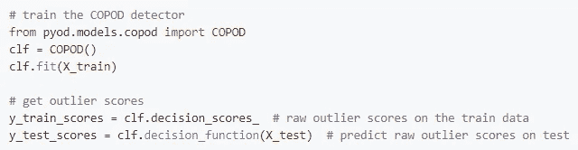
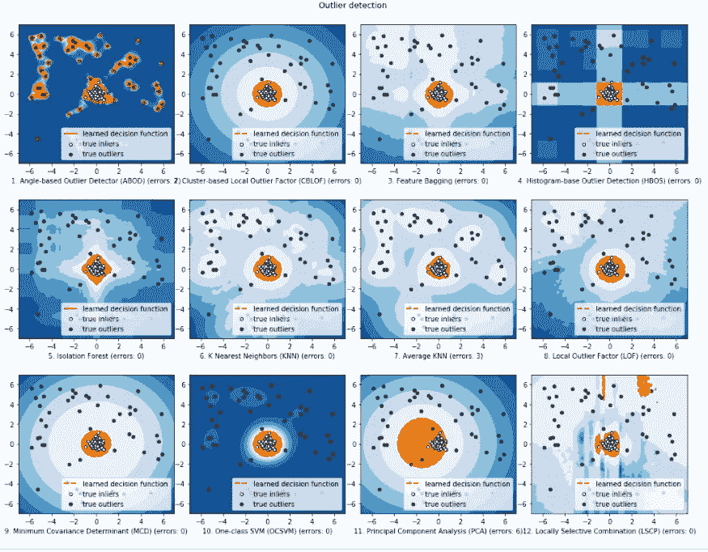

# PyOD 异常检测

> 原文：<https://towardsdatascience.com/anamoly-detection-with-pyod-fea90f0b4b42?source=collection_archive---------18----------------------->

## 这个 Python 库(PyOD)使用算法使异常值检测更加容易和全面

鲁珀特·布里顿通过 [Unsplash](https://unsplash.com/photos/l37N7a1lL6w) 拍摄的照片

上周，我和我的**熨斗学校——数据科学全日制沉浸式项目**同学们进入了我们训练营旅程的科学计算和定量方法阶段，我们接受了在短时间内吸收大量统计知识的挑战。虽然这肯定不是我们最轻松的一周，但通过每次演示、计算和可视化，统计和机器学习的效用之美变得越来越明显。

有一件事特别引起了我的注意，那就是一个简单的三变量计算的重要性:Z 分数。对于那些不熟悉的人，Z 分数的计算如下:

**z = (x-μ)/σ**

“ **z** ”表示一个数据点离总体平均值有多远，以标准偏差为单位。在这个计算中， **x** 是一个实验数据点， **μ** 是平均值， **σ** 是标准差。很简单，对吧？在外行看来，这只是一个数字。

但是当我得知它在统计测试中服务于多少不同的应用时，我感到很惊讶。事实证明，z 分数在数据分析和概率计算中非常有用。此外，它还是检测数据集中异常的各种不同技术的重要组成部分。

# 检测数据中的异常

有各种不同的技术和方法来检测数据集中的异常，主要是因为有大量不同的方法可以做到这一点。到目前为止，我们已经了解了一些，例如:

*   使用像 Matplotlib 和 Seaborn 这样的数据可视化工具来绘制数据集和评估数据分布中的异常值，
*   使用 Pandas 执行无缝数据清理并生成描述性统计数据
*   假设检验策略，如 Z 和 P 检验，利用人工计算的描述性统计

我们在短短几周内学会了这些策略和其他策略，这让我想知道:在最大、最混乱的数据集中…在数百种(如果不是更多)不同概率分布类型的世界中…这些不可能是检测异常值的唯一方法。如果有许多其他不同的方法来检测数据中的异常，是否有一种简单的方法来选择您想要使用的技术并将其应用到您的数据中？毕竟，异常值检测不仅在数据科学中非常重要，而且在大多数其他数学或计算学科中也非常重要。这让我偶然发现了一个迷人的 Python 库:Python PyOD 模块！

# **PyOD —更简单的异常测试**

你看看那个！有一个全面的、可扩展的 Python 工具包用于检测异常值/异常(*注意:这两个术语通常可以互换使用*)，称为 PyOD。你能猜出这个名字代表什么吗？！(*提示:可能与“Python”和“离群点检测”有关)。*

PyOD 的完整文档可以在[这里](https://pyod.readthedocs.io/en/latest/)找到。

PyOD 文档中的第三句话立刻给我留下了深刻的印象:“PyOD 包括 30 多种检测算法。”Welp，这回答了我之前的问题——很明显，在不同类型的数据集中，有多种不同的技术来检测异常值。如果不使用 PyOD 工具包，其中的许多工作将会非常耗时和复杂！

# 为什么

离群点检测包存在于许多其他编程语言中，如 Java 和 R，PyOD 开发团队认识到 Python 中缺少离群点检测的专用工具包。Python 的单一算法工具，如 PyNomaly，仅限于一种算法。或者，多用途框架，如广为人知的 scikit-learn，并没有专门针对异常值检测的问题。

PyOD 的开发人员创建了一个全面的库，它专门用于可扩展的异常值检测，可以根据被评估的数据类型选择所需的方法。

# 它是如何工作的

PyOD 可以与 Python 2 和 3 一起工作，并且还依赖于非常常用的库 NumPy、SciPi 和 scikit-learn 来执行其最基本的功能。对于某些附加功能，如深度学习模型和运行基准，其他依赖项(如 Pandas、Matplotlib 或 TensorFlow)是可选的导入。

PyOD 通过一系列易于使用的统一 API 提供了对离群点检测算法集合的访问。每个 API 都带有完整详细的指导文档和附属示例，以直观地展示如何开始实现每种不同类型的算法。下面是我从 PyOD 文档中提取的一个非常简单的例子，它用 5 行代码演示了异常值检测的 PyOD 实现:

使用 PyOD 只需 5 行代码即可检测异常值

在上面的例子中，COPOD(Copula-Based Outlier Detection)被选为这个计算的异常检测算法。正如您所看到的，PyOD 内置功能使您可以通过简单的导入轻松选择其库中包含的 30 多种算法之一，并在几秒钟内应用复杂的概率函数。幸运的是，这些算法在文档中附有详细的分步示例，引导您完成其功能的示例应用。

更复杂的 PyOD 算法应用程序的例子也可以直接在他们的文档中找到。例如，他们包括了一个[笔记本](https://github.com/yzhao062/pyod/blob/master/notebooks/Compare%20All%20Models.ipynb),对同一个数据集实现了 12 个不同的异常值检测模型，允许进行多用途的比较统计，否则在 Python 中是不容易访问的。看看下面附带的可视化结果。PyOD 功能内置了这种清晰有序的可视化效果。

via [PyOD 文档](https://pyod.readthedocs.io/en/latest/)

# 改变游戏

毫无疑问，PyOD 在机器学习社区享有盛誉。它使访问重要的统计功能变得更加容易，而且功能更加多样。在 Github 上很容易获得这些文档，这些例子使得复杂的机器学习算法技术对像我这样好奇的学生来说不那么可怕了。我迫不及待地想继续玩 PyOD 工具包，探索无限的可能性！