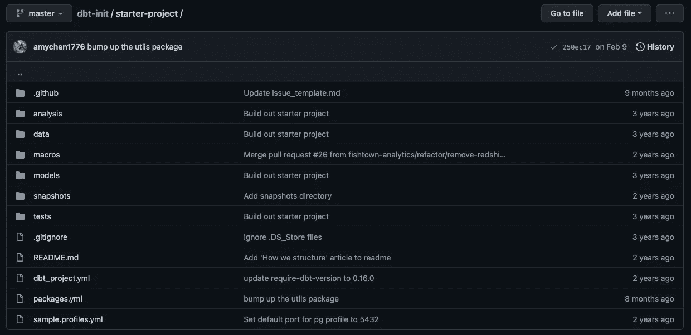

# dbt 项目剖析

> 原文：<https://towardsdatascience.com/anatomy-of-a-dbt-project-50e810abc695?source=collection_archive---------4----------------------->

## 一些基本概念和项目结构可以帮助您开始 dbt 项目。


照片由 [Unsplash](https://unsplash.com?utm_source=medium&utm_medium=referral) 上的[谷仓图片](https://unsplash.com/@barnimages?utm_source=medium&utm_medium=referral)拍摄

对于非技术背景的分析师来说，一开始使用 dbt 可能会令人生畏。编写代码来配置一切需要一些时间来适应，尤其是如果您习惯于使用 UI 来设置一切。

如果您考虑为您的团队使用 dbt，或者刚刚开始使用 dbt 的团队，这篇文章有望帮助您了解项目结构和一些基本概念。我们将浏览下图中的大多数文件和文件夹。你可以在这里进行回购[备案。](https://github.com/dbt-labs/dbt-init/tree/master/starter-project)



图片来自 [dbt-init](https://github.com/dbt-labs/dbt-init/tree/master/starter-project) 项目。

# profiles.yml

该文件包含 dbt 将用来连接到数据仓库的数据库连接。如果您在本地设置了 dbt，那么您只需要担心这个文件。

由于该文件可能包含敏感信息，如项目名称和数据库凭据，因此它不在您的 dbt 项目中。默认情况下，文件创建在文件夹:`~/.dbt/`中。

如果您从头开始您的项目，运行`dbt init`将为您生成这个文件。如果没有，你可能需要在本地创建一个`.dbt`文件夹和一个`profiles.yml`文件。如果您不确定如何设置该文件，请遵循 dbt [文档](https://docs.getdbt.com/dbt-cli/configure-your-profile)或联系回购所有者。

如果您在本地处理多个项目，不同的项目名称(在`dbt_project.yml`文件中配置)将允许您为其他项目设置不同的概要文件。

除了配置数据库连接，您还可以配置目标。目标是如何为不同的环境提供不同的配置。例如，当在本地开发时，您和您的团队可能希望在单独的数据集/数据库上工作。但是当部署到生产环境时，最好将所有表放在一个数据集/数据库中。默认目标是`dev`。

# dbt_project.yml

该文件是项目的主配置文件。如果您正在创建您的项目，请更改项目名称和概要文件名称(最好是相同的值)。此外，用新的项目名称替换`models`部分的`my_new_project`。

除非在模型级别被覆盖，否则此项目中的所有对象都将继承此处配置的设置。例如，您可以配置在`dbt_project.yml`文件中将所有模型创建为表格。但是您可以进入其中一个模型并覆盖该设置来创建一个视图。

在哪里配置什么取决于您项目设置，但是遵循一个好的原则是 DRY(不要重复)。对于应用于整个项目或特定文件夹的设置，请在此文件中定义。对于仅与一个型号相关的选项，请在那里进行配置。

关于设置的完整列表，你可以在这个文件中配置，查看`dbt_project.yml` [文档](https://docs.getdbt.com/reference/dbt_project.yml)。

# 模型

`models`文件夹包含项目中的所有数据模型。在该文件夹中，您可以创建任何想要的文件夹结构。dbt [风格指南](https://github.com/dbt-labs/corp/blob/master/dbt_style_guide.md)中给出的推荐结构如下:

```
├── dbt_project.yml
└── models
    ├── marts
    |   └── core
    |       ├── intermediate
    |       |   ├── intermediate.yml
    |       |   ├── customers__unioned.sql
    |       |   ├── customers__grouped.sql
    |       └── core.yml
    |       └── core.docs
    |       └── dim_customers.sql
    |       └── fct_orders.sql
    └── staging
        └── stripe
            ├── base
            |   ├── base__stripe_invoices.sql
            ├── src_stripe.yml
            ├── src_stripe.docs
            ├── stg_stripe.yml
            ├── stg_stripe__customers.sql
            └── stg_stripe__invoices.sql
```

这里，`models`下面有`marts`和`staging`文件夹。不同的数据源在`staging`下会有单独的文件夹(例如`stripe`)。用例或部门在`marts`下有不同的文件夹(例如`core`或`marketing`)。

注意上面例子中的`.yml`和`.doc`文件。它们是您为模型定义元数据和文档的地方。您可以在`dbt_project.yml`文件中包含所有内容，但是在这里定义它们要干净得多。

这种结构允许您清晰地组织对象，并轻松地应用批量设置。

# 数据

该文件夹包含将由 dbt 加载到数据库的所有手动数据。要将该文件夹中的`.csv`文件加载到数据库，您必须运行`dbt seed`命令。

因为这是一个受版本控制的存储库，所以不要将大文件或包含敏感信息的文件放在这里。定期更改的文件也不适合这种方法。适合`dbt seed`的例子有年度预算、状态映射、类别映射等。

# 宏指令

dbt 中的宏类似于 excel 中的函数。您可以在`macros`文件夹中定义自定义函数，或者覆盖默认宏和宏包。[宏和 Jinja 模板](https://docs.getdbt.com/docs/building-a-dbt-project/jinja-macros)一起，给了你许多 SQL 所没有的功能。

例如，您可以对不同的目标使用控制结构(if 语句和 For 循环)或不同的行为。您还可以抽象出复杂的 SQL 逻辑，使您的代码更具可读性。

```
-- This is hard to read
(amount / 100)::numeric(16, 2) as amount_usd-- This is much easier
{{ cents_to_dollars('amount') }} as amount_usd
```

# packages.yml

dbt 的一个优点是，您可以轻松地使用其他人制作的包。这样做可以节省你大量的时间，你也不必重新发明轮子。你可以在这里找到大多数 dbt 包。

要使用这些包，你需要在`packages.yml`文件中定义它们。只需将如下内容添加到文件中。

```
packages:
  - package: dbt-labs/dbt_utils
    version: 0.7.3
```

在使用这些包之前，您必须运行`dbt deps`来安装这些依赖项。之后，您可以使用 cod 中的包中的任何宏。

# 快照

快照是一个 dbt 特性，用于捕获表在特定时间的状态。快照文件夹包含项目的所有快照模型，它必须与模型文件夹分开。

其用例是为不支持变更数据捕获(CDC)的源构建渐变维度(SCD)表。例如，每次订单状态改变时，您的系统都会用新信息覆盖它。在这种情况下，我们无法知道这个秩序有什么历史地位。

Snapshot 提供了一个解决方案。如果您每天都捕获订单表，您可以保留订单状态随时间变化的历史记录。对于每个记录，dbt 将确定它是否是最新的，并更新旧记录的有效期。


图片来自 dbt [文档](https://docs.getdbt.com/docs/building-a-dbt-project/snapshots)

点击阅读更多关于 dbt 快照功能[的信息。](https://docs.getdbt.com/docs/building-a-dbt-project/snapshots)

# 试验

dbt 项目中的大多数测试都是在`models`下的`.yml`文件中定义的。这些是使用预制或定制宏的测试。这些测试可以应用于模型或列。


图片来自 dbt [文档](https://docs.getdbt.com/docs/building-a-dbt-project/tests)

在上面的例子中，当你运行`dbt test`时，dbt 会检查`orer_id`是否为`unique`和`not_null`，状态是否在定义的值内，并且`customer_id`的每条记录都可以链接到`customers`表中的一条记录。

但是，有时这些测试是不够的，您需要编写自定义的测试。在这种情况下，您可以将那些定制测试存储在`tests`文件夹中。dbt 将评估 SQL 语句。如果没有行返回，测试将通过，如果至少有一行或多行返回，测试将失败。

# 结论

在本文中，我们已经介绍了典型 dbt 项目的一些基本概念和项目结构。我希望这对你来说是一个迷人的新旅程的开始。

快乐的 learning✌️