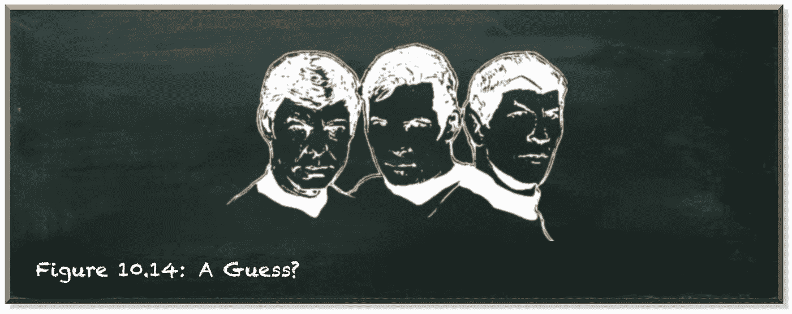
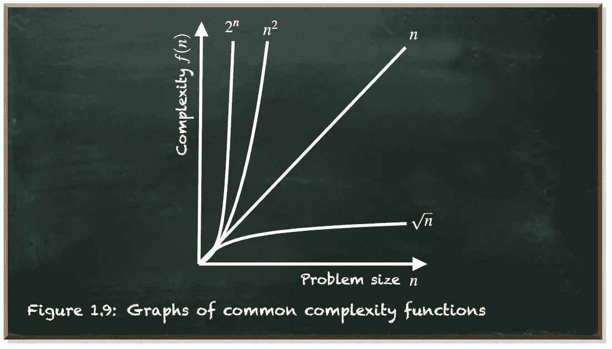
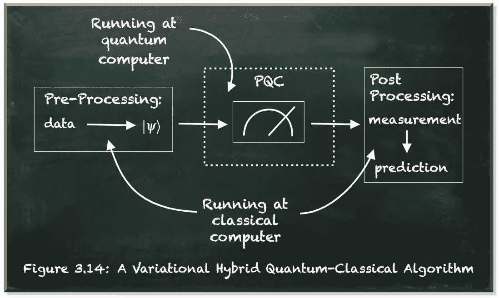
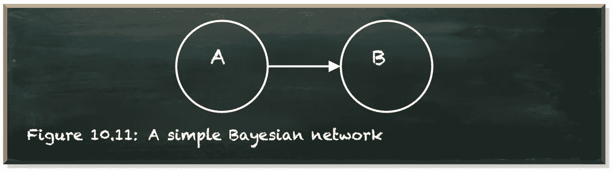
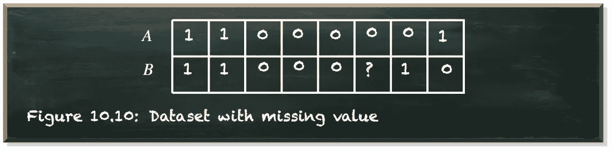
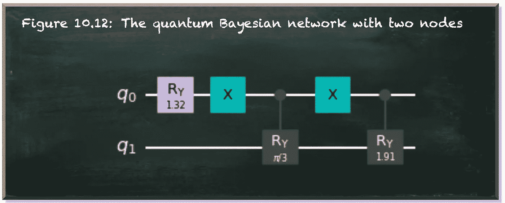
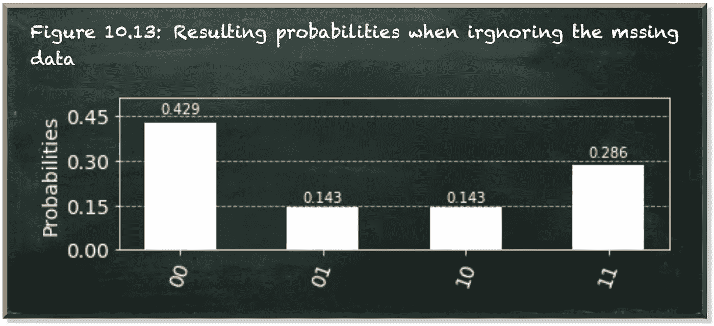

# 一种量子机器学习算法的剖析

> 原文：<https://towardsdatascience.com/anatomy-of-a-quantum-machine-learning-algorithm-24d97dfd388d?source=collection_archive---------45----------------------->

## 什么是**变分量子经典算法，我们为什么需要它？**

本帖是本书的一部分: [**动手用 Python 学习量子机器**](https://www.pyqml.com/page?ref=medium_anatomy&dest=/) **。**

作者弗兰克·齐克特的图片

柯克:*“斯波克先生，你在你的时间重返程序中考虑到鲸鱼和水的可变质量了吗？”*

斯波克:*“斯科特先生不能给我确切的数字，上将，所以……我会猜测一下。”*

柯克:*“一猜？你，史巴克？这太不寻常了。”*

斯波克:对麦考伊说:“我认为他不明白。”

不，斯波克。他的意思是，他觉得你的猜测比大多数其他人的事实更安全。”

斯波克:*“那你是说……这是一种赞美？”*

麦科伊:*“是的。”*

斯波克:*“啊。然后我会尽我所能做出最好的猜测。”*

不，你不需要猜什么是变分量子经典算法。但是你马上就会明白这个介绍是关于什么的。

量子计算是一种不同形式的计算。一种可以改变解决问题的复杂性，使问题变得容易处理的形式。也许，你听说过 Shor 的因式分解算法。该算法将寻找给定数的(质数)因子的复杂度从指数复杂度降低到亚指数复杂度。

如果这听起来没有压倒性的，让我们重新措辞。现代密码学建立在不可能分解一个大数的假设之上。对于经典计算机来说，这是不可能的，因为找到它的复杂性呈指数级增长。

Shor 证明了量子计算机可以在合理的时间内分解一个大数。一台能够运行肖尔算法的量子计算机会像纸牌搭的房子一样瓦解现代密码学。

机器学习面临的挑战堪比因式分解问题。我们为我们的模型寻找一组参数来预测未来。但是有很多可能的参数组合。经典地计算它们实在是太复杂了。

指数级和亚指数级复杂性之间的差异不可低估。例如，你的智能手机能够在几秒钟内将 800 位数相乘。这是一个亚指数问题。

相比之下，这类数字的因式分解在一台超级计算机上需要大约 2000 年。因为这是一个指数级增长的问题。

作者弗兰克·齐克特的图片

只有一个问题。这些算法需要数百万个量子位(qubits)。IBM 和谷歌的旗舰量子计算机目前有大约 50 个量子比特。而这些量子位甚至没有那么好用。

量子计算机需要非常精确。他们需要保持连续的量子态。任何微小的波动都可能毁掉一次计算。但今天的量子计算机噪音太大，最大计算时间以毫秒而不是秒计量。

我们近期预期的量子处理器仍然相对较小且噪音较大。我们生活在一个被称为“嘈杂的中间尺度量子”的时代——T4。

在这个时代，我们无法使用百万量子比特。在这个时代，我们不可能几个小时甚至几天都在运行算法。

当前的 NISQ 设备时代需要一套不同的算法、工具和策略。

例如，**变分量子经典算法**已经成为考虑近期量子设备量子算法的一种流行方式。在这些算法中，经典计算机对它们从量子计算机上运行某些难以计算的计算中获得的信息执行整体机器学习任务。

量子算法基于经典算法提供的一组参数产生信息。因此被称为**参数化量子电路(PQCs)** 。

它们相对较小，寿命较短，因此适用于 NISQ 设备。

变分混合量子经典算法由三部分组成:

*   我们在经典计算机上预处理数据来计算量子态。
*   我们在量子电路中计算我们的解，并测量代表结果的量子位元。
*   我们对测量值进行后处理，并将其转换为预测值。

下图描述了这种算法的结构。

作者弗兰克·齐克特的图片

通常，PQC 包含模型——或者模型的一部分。但它的参数，如神经网络中的权重或贝叶斯网络中的概率，都被排除在外。每次我们运行模型时，它们都会被输入到模型中。

这种结构允许我们永久地存储参数(或者至少比几秒钟更长)。同时，我们可以利用量子电路来降低计算的复杂性。

让我们来看看这样一个算法的运行情况。假设我们的模型是一个有两个节点的量子贝叶斯网络。

作者弗兰克·齐克特的图片

我们有两个二元变量`A`和`B`。我们知道他们不是独立的。`A`是父节点。`B`是我们试图估计其条件概率的子节点。

我们有一些数据，但有一项不完整。我们遗漏了一个值。

作者弗兰克·齐克特的图片

在贝叶斯网络中，我们一直在处理概率。我们为什么不用一个概率分布代替一个特定值来填充缺失的数据点呢？

等等！如果这个分布是我们首先要计算的，那么我们如何用概率分布来填充这个值呢？让我们做点不平凡的事。斯波克。

我们猜测一个分布。我们用它来计算给定 a 的对数似然得分和 B 的下一个分布。

我们在用分布填充缺失数据和估计新的概率分布之间迭代。

下面是这个算法的实现。

我们从从 Qiskit 导入库开始，Qiskit 是用于量子计算的 IBM SDK(第 1–4 行)。然后，我们初始化我们的数据(第 6–8 行)。

我们使用两个方便的函数。首先，`prob_to_angle`-函数(第 11-12 行)获取一个概率，并将其转换成我们可以在量子位变换门中使用的旋转角度。

`log-likelihood`-函数计算模型产生观察数据的可能性(第 15–28 行)。我们使它适应我们的具体情况。它期望`data`是一个元组列表，每个元组有两个条目。此外，它需要我们模型的参数。这些是 A 和 B ( `prob_a_b`)、A 和 not B ( `prob_a_nb`)、not A 和 B ( `prob_na_b`)、not A 和 not B ( `prob_na_nb`)的概率。

我们为列表中的每个元组调用函数`get_prob`，并返回所有结果的总和。这个函数`get_prob`获取一个数据`point`(元组)并评估它的组合。它只是返回相应概率的对数。例如，如果 A 和 B 的值都是`1`，则返回`log(prob_a_b)`—A 和 B 的概率。

如果不能识别组合，则返回`prob_na_b`和`prob_na_nb`之和的对数。这是当我们错过 b 的值时的情况。我们的数据中只有一个案例(`(0, None)`)，其 A 的值是`0`。因此，我们知道它不包含 a，但是我们不确定 b。

下一个代码清单描述了一个量子贝叶斯网络

它从声明两个列表开始。第一个`list_a`(第 4 行)包含我们数据中的所有项目，其中 A 的值为`1`表示 A 为真。第二个`list_na`(第 5 行)包含所有 A 的值为`0`代表非 A 的项目，我们用这些列表计算四个组合(A∧ B，A∧ B，A∧B，A∧B)的概率。

我们从 A 的边际概率(第 8 行)开始。这是我们的数据中 A 为真的项目数(`1`，长度`list_a`)除以我们的数据中的项目总数(`data`的长度)。我们让位置 0 的量子位代表这个概率(第 10-12 行)。

接下来，我们将 A 为假的情况分为 B 为真的情况和 B 也为假的情况(第 13–17 行)。首先，我们通过在位置 0(第 13 行)的量子位上应用非门来“激活”A 为假的状态。当 b 为真时，受控的 RY 门将位置 1 的量子位设置为|1⟩状态(第 14 行)。我们通过将 A 为假而 B 为真的项目数除以 A 为假的项目数来计算概率(第 15 行)。当然，在 a 为真的情况下，我们需要将量子位转换回|1⟩态(第 17 行)。

最后，我们把 A 为真的情况分成 B 也为真的情况和 B 为假的情况。我们应用另一个受控的 RY 门。旋转角度表示假设 A 也为真，B 为真的概率(第 21 行)。

下图用图形描绘了这个量子电路。

作者弗兰克·齐克特的图片

所有这些概率和旋转角度的计算描述了 PQC 的预处理步骤。我们在经典计算机上准备数据以产生有效的量子态。

让我们运行这个量子电路。

作者弗兰克·齐克特的图片

四种不同状态的测量概率代表 A 或 A 和 B 或 B 的可能组合的概率。

一旦我们运行了电路，我们需要对它进行后处理。

让我们将结果输入到我们之前创建的`log_likelihood`函数中。我们为此创建了另一个便利函数。

该功能`eval_qbn`(第 1 行)以`qbn`-功能为模型。但是我们也可以插入任何其他模型，只要它接受给定格式的数据集并返回我们从 Qiskit 获得的结果。第二个参数`prepare_data`是一个处理丢失数据点的函数。我们简单地输入数据，并期待我们输入模型的数据集(第 2 行)。

该函数返回给定模型的对数似然得分(第 3 行)。因此，我们提供了从量子电路得到的概率测量(第 4-7 行)。注意，我们从量子电路中得到的状态是从右边(位置 0 的量子位代表 A)读到左边(位置 1 的量子位代表 B)。

现在，让我们把这些放在一起。

我们用 P(B| A)=0.5 初始化我们的分布，并运行 PQC。

这似乎是一个相当不错的猜测。对数似然得分为 9.476。

但是我们不会就此止步。模型告诉我们 P(B| A)=0.3 的新值。让我们用这个值来运行我们的模型。

我们的模型改进了。我们得到了 9.452 的对数似然得分和缺失数据点的新分布。

显然，我们可以在用分布填充缺失数据和估计新的概率分布之间迭代。

# 结论

这个迭代过程是一般过程的一个例子，称为期望最大化(EM)算法。

先不累，就迭代，直到分数收敛。不过，很难判断新兴市场何时已经收敛。有时候，模型只是在很长一段时间内变得稍微好一点。一旦你认为这个过程完成了，分数就会突然增加。没办法分辨。

这个小程序展示了我们如何有效地实现一个变分量子经典算法。在预处理步骤中，我们将经典数据转换成量子态。然后，我们在量子计算机(或者模拟器——如果你没有量子计算机的话)上运行参数化的量子电路。最后，在后处理步骤中，我们评估量子电路的结果以更新我们的模型并重新开始。

通过将模型保持在量子电路之外，我们可以将它存储更长的时间，并将量子电路限制到最小。这可能允许我们甚至在我们目前生活的 NISQ 时代使用它。

本帖是本书的一部分: [**用 Python 动手做量子机器学习**](https://www.pyqml.com/page?ref=medium_anatomy&dest=/) **。**

在这里免费获得前三章。