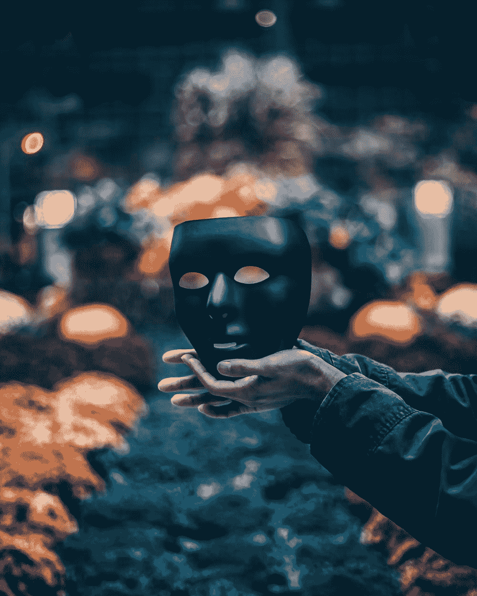

# 增强现实中人脸跟踪的基础知识

> 原文：<https://towardsdatascience.com/anchors-and-facetracking-in-ar-for-dummies-7a297ffbf7fe?source=collection_archive---------21----------------------->

图片由 Unsplash 的 John Noonan 提供

## 锚点、实体、混合形状、系数和表达式

## 一点历史

苹果最新的 iPads 和 iPhones 配备了激光雷达扫描仪，正如你们许多人所知，它代表光探测和测距。它是一个使用红外光从场景中收集深度信息的传感器。在激光雷达之前，我们使用无线电波来实现这一目的……无线电探测和测距(雷达)。它非常适合更短的距离，而且更加精确。激光雷达工作在更远的距离，但在雾或雨不是很准确。

为什么我要说激光雷达？因为它是消费设备中增强现实的下一次飞跃。对于一个四处移动并理解真实世界的机器人来说，它需要理解它的周围环境以及它相对于该空间中其他事物的位置和方向。

你的手机是一个没有四肢的机器人。它是一个大脑和一些为大脑提供信息的传感器，以便更好地了解它的环境。激光雷达是一种增强其视觉的传感器。

我们人类通过利用双眼之间的视角差异来获得深度感。在计算机上同时保持实时帧速率是一项极其昂贵的计算。所以现在我们不得不使用激光雷达传感器和一只眼睛/相机来凑合。

我们已经取得了相当大的进步，从仅仅能够检测水平面到在带有激光雷达的消费设备上相当精确地检测深度。由于我们现在可以用 AR 做更多的事情，我们可以开始利用增加的功能来构建更复杂的体验。

为此，我们需要框架来抽象出底层系统的复杂性，并为程序员、艺术家和设计师提供额外的功能，以便在更短的时间内构建 AR 体验，并减少麻烦。

RealityKit 就是这样一个框架，它的姐妹 iOS 应用程序 Reality Composer 来自 App Store，是该框架的可视化包装器，RealityKit 的拖放功能的启用者，以及隐藏底层框架复杂性的迷你内容创建平台。

## 为什么真人秀作曲家可能成为下一个“iMovie”

iOS 系统上的每个底层操作系统特性都有相应的编程框架。例如用于绘制 UI 的 UIKit、用于 Sprite 动画的 SpriteKit、用于用 iCloud 编程的 CloudKit、用于编程增强现实(AR)体验的 ARKit 等。

RealityKit 框架使用 ARKit 框架来创建 AR 体验。ARKit 框架处理来自 IMU、视觉系统和激光雷达的数据，以在空间中定位自己，并找出周围其他事物的位置。Reality kit 使用这些信息将虚拟对象带入 AR 空间。

RealityKit 还使某些样板任务变得更容易，如在构建共享 AR 体验的同时处理网络上的连接管理。虽然这不是 RealityKit 的出名之处。它主要是因为提供了一个平台来编程骨骼动画、真实的阴影、照明、反射等。这些能力通过一个名为 Reality Composer 的应用程序带给艺术家和设计师。

你会觉得这些东西在虚幻引擎，Unity，Maya，3DSMax，Houdini 等里面处理的比较好。然后可以将它们作为 USDZ 文件导入。苹果为什么需要开发 3D 内容创作平台？也许他们有计划在这个市场上竞争，并在 Mac 上提供端到端的解决方案来创建和消费 AR 体验。这是我的推测。

Reality Composer 是一个用于 AR 的 DCC(数字内容创作)平台。它既可以在 Mac 上运行，也可以在 iPhone 和 iPad 上运行。我在我的笔记本电脑上使用它，我发现它有直观的动作控制。

连按两次以重设世界，捏合以放大和缩小。放下一个手指，用另一个手指旋转，等等。在 iPhone 或 iPad 上，您可以直接在 AR 中设计 3D 内容。虽然现在这可能看起来像是一个噱头，但将来当 AR 平台支持更复杂的设计时，这一点的用处将显而易见。

我们在虚拟现实中达到了一个类似的里程碑，Epic Games 允许虚幻引擎在虚拟世界中运行编辑器。你可以戴着虚拟现实耳机，用你的 Vive 控制器抓住东西并移动它们。

这不是设计关卡的最佳方式，因为长时间在虚拟现实头盔中工作的人在后勤方面存在固有的问题。但是有一点是肯定的——如果它能大规模工作，它将减少迭代时间。

在桌面应用程序上设计一些东西，然后进行构建并在设备上部署构建，以检查您在 VR 中的工作，这是许多不必要的往返。在你的 iPad 或 iPhone 上设计东西并不是一种不舒服或陌生的体验。

因此，iOS 设备上的 Reality Composer 可能有很好的增长潜力，可以作为未来为 AR 创建内容的首选应用程序。即使您要在 Mac 上进行设计，Reality Composer 也支持快速查看功能。

从应用程序中导出场景，通过电子邮件发送给自己或保存在 iCloud 上，并在 iPhone 上打开 Reality Composer 场景。它会向你展示你的设计在现实中的样子。无需在 XCode 项目中导入场景，构建并在设备上部署它来检查您的工作。

你也可以在 Safari 中嵌入场景。Safari 有 AR 的快速查看功能。你可以用你的 iPhone 去 apple.com 看看，在 AR 里浏览他们的每一件产品。使用快速查看功能，直接从 Safari 查看工作区中的 Mac Pro 或 Mac Book。

Reality Composer 现在完全集成到 XCode 中。

对我来说，这是如何将这些部分设计成形成一个端到端的管道，为苹果生态系统中的 AR 创建内容的一瞥。

随着最新的传感器和框架的出现，让我们继续跟踪，看看它们是如何用于跟踪人脸的。

## AR 中的锚和实体

锚点有助于跟踪已识别的对象。当对象被 AR 系统识别时，锚被放置在对象上。它记录了物体在世界空间中的方向和位置。

随着相机四处移动，识别的对象相对于相机移动，AR 系统试图跟踪移动，以便锚可以每帧更新。

锚由一个名为 *didUpdateFrame* 的会话委托函数(回调函数的别称)访问。其中，这个 *updateFrame* 函数接收一个 *ARFrame* 。

*ARFrame* 包含关于摄像机、锚、场景、跟踪、绘图状态、地理跟踪状态、分割(检查人)等信息。大多数 AR 应用程序都需要访问 *ARFrame* 中的数据。它以应用程序帧速率的频率可用。

任何东西都可以放在锚上。宇宙飞船、小球或图像的 3D 模型。

一旦它们被锚定，AR 跟踪系统就会跟踪它们，这样当你四处移动时，它们就可以在世界的同一个地方被维护。就像你在现实世界中四处走动时会看到一棵树一样。

这些放置在锚点的对象在 AR 中被称为*实体*。

当 ARKit 检测到一张脸时，它会在被检测为鼻子的区域的正后方放置一个锚。下图中，黄点是大概的位置。这个锚叫做 *ARFaceAnchor* 。当会话在前置摄像头输入中检测到唯一的人脸时，它会自动将一个 *ARFaceAnchor* 对象添加到其锚点列表中。

作者图片

它是如何检测人脸的？面部跟踪系统是由一串记录眼睛、眼球、眉毛、下巴等运动的数字定义的。这些数字被称为系数。这些系数定义了面拓扑。然后，该拓扑用于创建一个名为 *ARFaceGeometry* 对象的几何体。

该几何模型可用于将自定义对象“附加”到 AR 面上。导出系数和重建面网格几何体也比导出网格更容易，因为网格中顶点的数量远远大于系数的数量。

系数是浮点数，其值的范围从 0.0 到 1.0。系数的不同值记录了不同的面部表情。代表特定表达式的这些系数的集合称为混合形状。因此这些系数被称为混合形状系数。

这些系数使得 3D 角色的面部动画成为可能。从系数开始，让我们看看面网格几何本身。

人脸网格几何是人脸跟踪系统的重要组成部分。您可以在锚点位置放置一个面罩。演员在剧院里用于表演训练的那种面具。该遮罩在 Reality Composer 中作为 3D 网格随时可用。ARKit 将通过在用户移动他们的脸时跟踪底层锚来跟踪面具。

或者你可以使用这种几何图形作为叠加内容的基础，如化妆或酷太阳镜，就像 Snapchat 所做的那样。Snap 使用了这些相同的原则和基本概念，只是他们没有使用 ARkit。他们开发了自己的 AR 系统。

让我们花一点时间来讨论一下跟踪，这样您就可以充分理解使这一切成为可能所需的各种底层技术。

## AR 中的跟踪

追踪并不像听起来那么容易。当你四处移动时，你可能会在离物体几米远的地方徘徊，它可能不会在你的相机视野内。但是如果你决定转身回来，你会希望它停留在你最后看到它的地方。

这些都是计算量很大的计算，所以需要一些捷径来找到实时帧速率和准确性之间的平衡。因此，对象的位置可能会随着时间的推移而改变，您可能会发现锚点的位置与上次看到时略有不同。这种差异被称为漂移。

不同的系统有不同程度的漂移。像 Hololens 和 Magic Leap 这样的头戴式 AR 设备有专用的硬件和更多的资源来执行空间映射(用几何图形/三角形近似相机看到的世界)和跟踪。因此，这些设备往往比手持 AR 设备更准确，如 iPad、iPhone 和越来越好的 Androids。

在 iOS 设备上引入激光雷达是帮助空间制图的一大飞跃，因为激光雷达用精确的深度信息增强了相机数据，所以系统不需要处理来自相机馈送的数据来估计深度。

## 最后

我们讨论了激光雷达及其重要性。我们谈到了 Reality Composer 及其潜力，然后浅尝辄止地研究了跟踪、锚点，尤其是面部跟踪。

希望它有助于作为进入这些有趣的话题的跳板。如果你有任何问题，请在下面留言，我会尽力回答。此外，Apple 的开发人员文档是一个很好的资源，可以找到您可以自己尝试的编码示例。