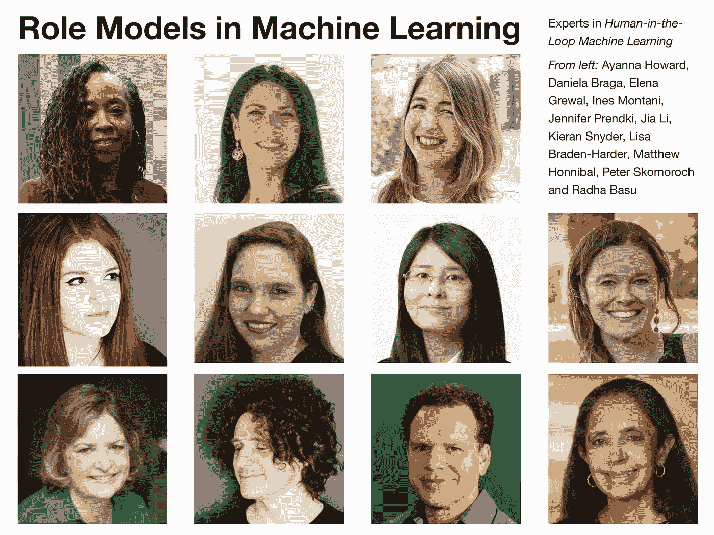
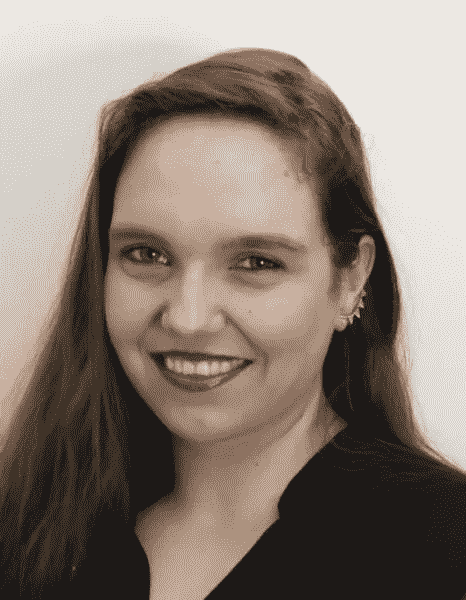

# 机器学习中 11 个榜样的轶事

> 原文：<https://towardsdatascience.com/anecdotes-from-11-role-models-in-machine-learning-d01bc0d65dcd?source=collection_archive---------14----------------------->

## 创建良好数据所需的技能也是优秀领导所需的技能

我最近写了一本书，我*希望*在我被介绍到机器学习时就存在:[人在回路中的机器学习:以人为中心的人工智能的主动学习和注释](https://www.amazon.com/Human-Loop-Machine-Learning-human-computer/dp/1617296740)。大多数机器学习模型都是由人类注释的数据指导的，但大多数机器学习书籍和课程都专注于算法。你经常可以用好的数据和简单的算法得到最先进的结果，但是你很少用坏数据从最好的算法得到最先进的结果。因此，如果你需要首先深入机器学习的一个领域，你可以认为数据方面更重要。

除了这本书的技术重点，它还介绍了 11 位机器学习专家的轶事。每个人都分享了一个关于他们在现实世界中建立和评估机器学习模型时遇到的数据相关问题的轶事。他们的故事更广泛地告诉了我们一些关于机器学习领导力的重要事情，每个轶事都与运行成功的数据科学项目有关。

机器学习领域的 11 位专家在《人在回路中的机器学习》中作了专题介绍。(所有图片均经每位专家许可使用，并在下面以他们各自的轶事重复)

这些专家是根据两个标准挑选的:他们都创建了成功的机器学习公司，他们都直接在机器学习的数据方面工作。对于考虑从事机器学习职业的人来说，他们都是很好的榜样:[阿扬娜·霍华德](https://engineering.osu.edu/about/office-dean/about-dean-ayanna-howard)、[丹妮拉·布拉加](https://www.linkedin.com/in/danielabragaspeech/)、[艾琳娜·格雷瓦尔](https://www.linkedin.com/in/elena-grewal/)、[伊娜丝·蒙塔尼](https://ines.io/)、[詹妮弗·普伦德基](https://www.linkedin.com/in/jennifer-prendki/)、[李嘉](https://www.linkedin.com/in/lijiali/)、[基兰·斯奈德](https://www.linkedin.com/in/kieran-snyder-60572987/)、[丽莎·布雷登-哈德](https://www.linkedin.com/in/lisa-braden-harder-374624/)、[马修·霍尼巴尔](https://www.linkedin.com/in/honnibal/)、[彼得·斯科莫罗如果你正处于职业生涯的早期，正在努力为你的模型创建良好的数据，那么我希望你能理解书中的许多趣闻，分享如下:](https://www.linkedin.com/in/peterskomoroch/)

# 艾安娜·霍华德

## “父母是完美的主题专家”

关于人的模型对于数据中没有表示的人来说很少是准确的。有许多人口统计偏见会导致人们的代表性不足，如能力、年龄、种族和性别。此外，还经常存在交叉偏见:如果人们在多个人口统计中的代表性不足，那么有时这些人口统计的交集不仅仅是各个部分的总和。即使您有数据，也可能很难找到有适当经验的注释者来正确地注释它。

在为有特殊需求的孩子制造机器人时，我发现没有足够的数据来检测儿童的情绪，检测来自代表性不足的种族的人的情绪，以及检测自闭症患者的情绪。没有身临其境体验的人往往很难识别这些孩子的情绪，这限制了谁可以提供训练数据来说明孩子何时真正快乐或沮丧。甚至一些训练有素的儿童医生在处理能力、年龄和/或种族的交叉性时也难以准确地注释数据。幸运的是，我们发现孩子自己的父母是他们情绪的最佳判断者，所以我们为父母创建了快速接受/拒绝模型对孩子情绪的预测的界面。这使我们能够获得尽可能多的培训数据，同时最大限度地减少家长提供反馈所需的时间和技术知识。这些孩子的父母被证明是完美的主题专家来调整我们的系统以满足他们孩子的需求。

*简历:* Ayanna Howard 是俄亥俄州立大学工程学院的院长。她之前是佐治亚理工学院交互计算学院的主席；Zyrobotics 的联合创始人，该公司为有特殊需求的儿童制作治疗和教育产品；曾在美国宇航局工作；拥有南加州大学的博士学位。

# 丹妮拉·布拉加

## “关于采购语言的自白”

在我们公司，我们以付出额外的努力来确保获得最佳数据而自豪，这有时会导致令人捧腹的情况。对于文本和语音数据，最困难的问题通常是找到流利的说话者。在机器学习中，找到具有合适资格和说合适语言的人是最困难和最容易被忽视的问题之一。

最近，我们为一个有特定语言要求的客户做了一个大项目集合。在几次为一种稀有语言寻找合适人选的尝试失败后，我们的一个人去了一个教堂，他知道在那里他会找到符合要求的人。当他为我们的委托人找到他需要的人时，他意外地在忏悔时间出现了。牧师认为他是为此而来，所以，和往常一样，他做了完整的忏悔，包括关于语言的来源。

*简历:*丹妮拉·布拉加(Daniela Braga)是 DefinedCrowd 的创始人兼首席执行官，该公司为机器学习创建训练数据，包括 60 多种语言的文本和语音数据。

# 埃琳娜·格雷瓦尔

## “合成控制:在没有评估数据的情况下评估模型”

如果您正在部署一个不能运行 A/B 测试的应用程序，您如何衡量您的模型的成功呢？综合控制方法是一种可以在这种情况下使用的技术:找到与部署模型的位置在功能上最接近的现有数据，并将该数据用作控制组。

我第一次了解合成控制是在学习教育政策分析的时候。当一所学校尝试一些新的方法来改善学生的学习环境时，不能指望他们只改善一半学生的生活，这样另一半就可以成为统计控制组。取而代之的是，教育研究人员可能会创建一个“综合控制组”,由在学生人口统计和表现方面最为相似的学校组成。我采用了这种策略，当我在 Airbnb 领导数据科学时，我们在那里应用了这种策略。例如，当 Airbnb 在一个新的城市/市场推出产品或政策变化，而无法进行实验时，我们会创建一个最相似城市/市场的合成控制组。然后，我们可以将模型的影响与参与度、收入、用户评级和搜索相关性等指标的综合控制进行比较。综合控制允许我们采取数据驱动的方法来衡量我们的模型的影响，即使我们没有评估数据。

简介:埃琳娜·格雷瓦尔是 D *ata 2 the People* 咨询公司的创始人兼首席执行官，该公司利用数据科学来支持那些旨在对世界产生积极影响的政治候选人。Elena 之前领导 Airbnb 的 200 多人数据科学团队，拥有斯坦福大学的教育学博士学位。

# 伊内斯·蒙塔尼

## “好的界面给你质量，而不仅仅是数量”

当我和人们谈论可用于注释的接口时，他们的反应通常是“何必呢？收集注释并不十分昂贵，所以即使你的工具快了一倍，它仍然没有那么大的价值。”这个观点是有问题的。首先，许多项目需要主题专家的支持，如律师、医生或工程师，他们将做大量的注释工作。更重要的是，即使你给员工的报酬不多，你仍然关心他们的工作，如果你让他们失败，他们就不会给你好的工作。糟糕的注释过程经常迫使工作人员在例子、注释模式和界面之间切换焦点。这需要积极的集中注意力，而且很快就会筋疲力尽。

在我开始从事人工智能工作之前，我从事网络编程，所以注释和可视化工具是我开始考虑的第一批人工智能软件。我对游戏中的“隐形”界面特别感兴趣，它让你思考做什么，而不是怎么做。但游戏化并不是让任务变得像“游戏”一样“有趣”:它是让界面尽可能无缝和沉浸，以给他们最好的机会来做好任务。这将创造更好的数据，并对创造数据的人更加尊重。

*简历:*伊内斯·蒙塔尼是《爆炸》的联合创始人。她是 spaCy 的核心开发者，也是 Prodigy 的首席开发者。

# 詹妮弗·普伦斯基

## “并非所有数据都是平等的”

如果你关心你的营养，你不会去超市，从货架上随机选择商品。你可能最终通过吃超市货架上的随机物品来获得你需要的营养，但是，在这个过程中你会吃很多垃圾食品。我认为很奇怪的是，在机器学习中，人们仍然认为“随机抽样超市”比弄清楚他们需要什么并在那里集中精力更好。

我建立的第一个主动学习系统是必然的。我正在构建机器学习系统，以帮助一家大型零售店确保当有人在网站上搜索时，出现正确的产品组合。几乎就在一夜之间，一家公司的重组意味着我的人工标签预算减少了一半，而我们需要贴标签的库存增加了 10 倍。因此，我的标签团队每件商品的预算只有我们之前的 5%。

我创建了我的第一个主动学习框架来发现哪一个是最重要的 5%。结果比预算更大的随机抽样要好。从那以后，我在我的大部分项目中使用了主动学习，因为不是所有的数据都是相等的！

*生物:*詹妮弗·普伦斯基是 Alectio 的首席执行官，为机器学习寻找正确的数据。她曾在 Atlassian、Figure Eight 和沃尔玛等公司领导数据科学团队。

# 李嘉

## “学术和现实世界数据标注的区别”

与学术研究相比，在现实世界中部署机器学习要困难得多，主要区别在于数据。现实世界的数据是杂乱的，由于制度障碍，通常很难获取。在干净、不变的数据集上进行研究是很好的，但当你将这些模型带入现实世界时，很难预测它们的表现如何。

当我在帮助构建 ImageNet 时，我们不必担心我们在现实世界中可能遇到的每一个可能的图像类。我们可以将数据限制在 WordNet 层次结构中概念子集的图像上。在现实世界中，我们没有这种奢侈。比如，我们无法收集大量与罕见疾病相关的医学影像。标记这样的图像还需要领域专业知识，这带来了更多的挑战。现实世界的系统需要人工智能技术专家和领域专家密切合作，以激发研究，提供数据和分析，并开发算法来解决问题。

*简历:*李嘉是使用机器学习的医疗保健公司 Dawnlight 的首席执行官和联合创始人。她曾领导过谷歌、Snap 和雅虎的研究部门。，拥有斯坦福大学博士学位。

# 基兰·斯奈德

## “您早期的数据决策仍然很重要”

您在机器学习项目早期做出的决策会影响您在未来许多年中正在构建的产品。对于数据决策来说尤其如此:你的特征编码策略、标注本体和源数据将会产生长期的影响。

在我研究生毕业后的第一份工作中，我负责构建允许微软软件在全球数十种不同语言中运行的基础设施。这包括做出基本的决定，比如决定一种语言中字符的字母顺序，这在当时对许多语言来说是不存在的。当 2004 年的海啸摧毁了印度洋周围的国家时，这对斯里兰卡说僧伽罗语的人来说是一个迫在眉睫的问题:没有简单的方法来支持对失踪人员的搜索，因为僧伽罗语还没有标准化的编码。我们为僧伽罗人提供支持的时间从几个月缩短到几天，这样我们就可以帮助失踪人员服务，与母语人士一起尽快找到解决方案。我们当时决定的编码被 Unicode 采纳为僧伽罗语的官方编码，并将永远编码该语言。你不会总是在如此关键的时间线上工作，但是你应该从一开始就考虑你的产品决策的长期影响。

基兰是广泛使用的增强写作平台 Textio 的首席执行官和联合创始人。Kieran 之前在微软和亚马逊担任产品领导职务，拥有宾夕法尼亚大学的语言学博士学位。

# 丽莎·布雷登-哈德

## “注释偏差不是闹着玩的”

数据科学家通常低估了收集高质量高度主观数据所需的努力。当您试图在没有可靠的基础事实数据的情况下注释数据时，人类对相关性任务的认同并不容易，并且只有在强有力地传达了目标、指导方针和质量控制措施的情况下，让人类注释者参与才是成功的。这在跨语言和文化工作时尤其重要。

我曾经收到一个来自美国个人助理公司的韩国敲门笑话的请求，该公司正在向韩国扩张。向产品经理解释为什么这不可行，并为他们的应用程序找到文化上合适的内容，这不是一个快速的对话:它解开了许多假设的知识。即使在说韩语的人中，创建和评估笑话的注释者也需要来自与目标客户相同的人口统计数据。这是一个例子，说明了为什么减少偏见的策略会触及数据管道的每个部分，从指导方针到针对最合适的注释劳动力的补偿策略:注释偏见不是玩笑！

*简历:*丽莎·布雷登-哈德是圣克拉拉大学全球社会福利研究所的导师。她是巴特勒希尔集团的创始人兼首席执行官，该集团是最大、最成功的注释公司之一；在此之前，我是 IBM 的一名程序员，并在普渡大学和 NYU 大学获得了计算机科学学位。

# 马修·洪尼巴尔

## “考虑注释项目的总成本”

它有助于与注释您数据的人直接交流，就像您组织中的任何其他人一样。不可避免的是，您的一些指令在实践中是行不通的，您需要与您的注释者密切合作来完善它们。在投入生产后很长一段时间内，您也可能会不断完善指令并添加注释。如果你不花时间考虑完善说明和丢弃错误标签的项目，那么很容易以外包解决方案告终，这种解决方案在纸面上看起来很便宜，但实际上很昂贵。

2009 年，我参与了悉尼大学和澳大利亚一家主要新闻出版商的联合项目，该项目要求命名实体识别、命名实体链接和事件链接。虽然当时学术界越来越多地使用众包工作者，但我们建立了一个小型的注释者团队，并直接签约。从长远来看，这最终要便宜得多，特别是对于更复杂的“实体链接”和“事件链接”任务，在这些任务中，众包工作人员很难完成，而我们的注释者通过与我们直接工作和交流得到了帮助。

*简历*:马修·洪尼巴尔(Matthew Honnibal)是 spaCy NLP 图书馆的创建者，也是 Explosion 的联合创始人。自 2005 年以来，他一直致力于 NLP 研究。

# 彼得·斯科莫洛赫

## “阳光是最好的消毒剂”

你需要深入查看真实数据，才能准确知道要建立什么模型。除了高级图表和聚合统计数据，我建议数据科学家定期检查大量随机选择的粒度数据，让这些示例“冲刷你”。就像高管每周查看公司层面的图表，网络工程师查看系统日志中的统计数据一样，数据科学家应该对他们的数据及其变化有一种直觉。

当我构建 LinkedIn 的技能推荐功能时，我构建了一个简单的 web 界面，其中有一个“随机”按钮，可以显示个人推荐示例以及相应的模型输入，这样我就可以快速查看数据，并直观地了解可能最成功的算法和注释策略。这是确保您发现潜在问题并获得高质量输入数据的最佳方式，这是至关重要的:您正在照亮您的数据，阳光是最好的消毒剂。

*简历:*彼得·斯科莫罗奇是 SkipFlag(被 WorkDay 收购)的前首席执行官，曾在领英的团队中担任首席数据科学家，*发明了*这个“数据科学家”的头衔。

# 拉达·拉马斯瓦米·巴苏

## “人类洞察力和可扩展的机器学习等于生产人工智能”

人工智能的结果在很大程度上取决于投入其中的训练数据的质量。一个小的 UI 改进就像一个魔术棒，当结合定义良好的质量控制过程应用于数百万个数据点时，可以产生巨大的效率。先进的劳动力是关键因素:培训和专业化提高了质量，来自专家劳动力的洞察力可以与领域专家一起为模型设计提供信息。最好的模型是由机器和人类智能之间的建设性和持续的伙伴关系创建的。

我们最近接了一个项目，需要在机器人冠状动脉旁路移植术或 CABG 视频中对各种解剖结构进行像素级注释。我们的注释团队不是解剖学或生理学方面的专家，因此我们实施了临床知识教学课程，以增强 3D 空间推理和精确注释方面的现有核心技能，该课程由一名训练有素的外科医生担任解决方案架构师。我们客户的成果是我们客户的成功培训和评估数据。对我们来说，结果是看到来自资源不足背景的人热烈讨论人工智能的一些最先进的用途，因为他们很快成为医学图像分析中最重要步骤之一的专家。

*简历:* Radha Basu 是 iMerit 的创始人兼首席执行官。iMerit 利用技术和人工智能劳动力为全球客户创造先进的技术工人，其中 50%是来自服务水平低下社区的妇女和青年。Radha 之前曾在惠普工作，担任 SupportSoft public 的首席执行官，并在圣克拉拉大学创建了“节俭创新实验室”。

# 机器学习的领导技能

创建好的数据比创建好的算法需要更广泛的技能。创建良好的培训数据所需的许多技能也是良好的领导技能，我书中提到的专家就是例证:

Radha 是硅谷任何行业中最成功的领导者之一，已经将一家公司上市，现在是一家盈利的人工智能公司的创始人兼首席执行官，该公司雇用了数千人。我特别喜欢她的轶事表明外包注释者可以*成为*领域专家，作为他们工作的结果，他们的职业潜力在增长。

Peter 鼓励数据科学家始终关注数据，表明即使对于公司的领导者来说，理解您正在处理的数据也是非常重要的。

Matthew 的轶事强调了注释本身并不是创建好数据的唯一成本，这一点经常被只使用匿名众包工人的人忽略，这在学术界很常见，但在行业中很少见。

Lisa 强调了查看数据的重要性，但是如果没有正确的文化背景来理解数据，就不可能完全理解数据。这突出了好的领导意味着让比你更有知识的人来完成他们的任务。

基兰的轶事是理解创建数据的人的文化背景的另一个很好的例子，在这种情况下，需要特定语言的知识来支持时间紧迫的灾难响应工作。

贾关于学术和现实世界数据之间差异的轶事强调了大多数人在学术机器学习程序中学习的狭窄技能集往往不适用于现实世界的情况。

Jennifer 还强调了许多现实情况的实际现实:您的时间和预算有限，所以当您仍然需要发布人们会使用的产品时，如何选择正确的数据？

Ines 的职业生涯始于对 web 界面良好用户体验的思考，她强调良好的界面设计对于良好的数据注释工具是多么重要，不管是谁在注释数据。

Elena 强调了现实世界模型的另一个实际现实:当您甚至不能运行 A/B 测试，更不用说使用保留的评估数据时，如何评估模型更改的成功？

丹妮拉的故事谈到了与一个按照他们自己的方式提供语言数据的社区的会面，并提供了一些轻松的东西来提醒我们不要太把自己当回事。

Ayanna 举了一个我最喜欢的例子，说明决定谁可以标记数据是多么重要:有特殊需求的孩子的父母/监护人可能是唯一准确和道德的注释者来理解和编码孩子的情绪。

即使在专注于算法的学术界，研究人员也明白数据的重要性。[斯坦福人工智能实验室主任克里斯托弗·d·曼宁](https://profiles.stanford.edu/chris-manning)在书的前言中分享了这一点:

> “获得正确的数据和正确的注释比采用更先进的机器学习算法更有价值，这是工业中机器学习从业者的公开秘密。”

# 荣誉奖

我认识的其他许多人也有资格成为专家——在职业生涯中从事机器学习数据方面工作的公司创始人——但这本书的时间安排和有限的章节意味着只能包括这么多专家。如果有更多的时间，其他的榜样可能包括[阿莉奥娜·梅德丽安](https://www.medelyan.com/)、[阿曼·奈马特](https://www.linkedin.com/in/amannaimat/)、[方成](https://www.linkedin.com/in/fangcheng/)、[希拉里·梅森](https://hilarymason.com/)、[李建阳](https://www.linkedin.com/in/iylee/)、[约翰·阿克瑞德](https://www.linkedin.com/in/johnakred/)、[马克·西尔斯](https://www.linkedin.com/in/msears/)和[莫妮卡·罗加蒂](https://www.linkedin.com/in/mrogati/)。我还想到了十几个人，包括那些不符合我在书中使用的标准，但仍然是榜样的人。也感谢 [Emmanuel Ameisen](https://www.linkedin.com/in/ameisen/) 给我灵感，邀请专家为我的书做专题介绍。我是在他为他的书[构建机器学习驱动的应用](https://www.oreilly.com/library/view/building-machine-learning/9781492045106/)这样做之后得到这个想法的。

# 机器学习中的角色模型

对于刚接触机器学习的人来说，可能很难确定有哪些职业道路。就像大部分课程侧重于算法一样，大部分机器学习领军人物的榜单侧重于算法研究者。本文中专家背景的多样性表明，有许多可能的职业道路通往机器学习领域的领导者，他们具有教育、语言学、UI 开发、物理和计算机科学以外的许多其他领域的背景。所以，如果你从事机器学习的数据端工作，没有计算机科学背景，你不应该觉得自己是个局外人。研究机器学习中与数据相关的问题是成功职业生涯的必要条件，也是通往领导力的常见道路。

我在这里分享所有的故事，这样你就不必买本书来学习这些专家轶事。如果你真的买了这本书，我会把所有作者的收入捐献给更好的数据集，特别是低资源语言和健康与灾难响应的倡议，这样你就能为慈善事业做出贡献。虽然这不是选择标准的一部分，但所有的专家都致力于对世界产生明显积极影响的应用，所以我很高兴在我的书中给予这 11 个优秀领导的榜样更多的认可！

罗伯特君主
[@WWRob](https://twitter.com/wwrob)

2021 年 9 月 21 日