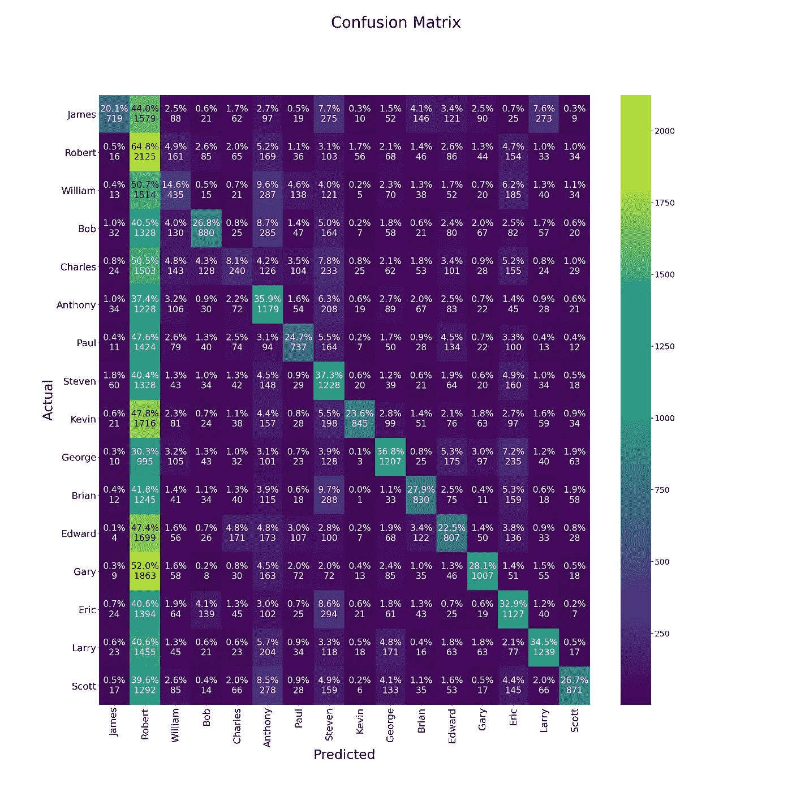

# 基于暹罗网络和均值嵌入的动物识别

> 原文：<https://towardsdatascience.com/animal-recognition-with-siamese-networks-and-mean-embeddings-13d3f27eff93?source=collection_archive---------24----------------------->

## 基于机器学习的物体识别

## 暹罗网络能打败标准分类方法吗？

嵌入投影。作者图片

当听到暹罗网络时，你可能会想到“人脸识别”。这是这类网络最常见的用途。我们试图做些别的事情:只根据俯视摄像机镜头来识别动物。

*图 1:来自数据集的帧，来源:* [*PSRG 数据集*](http://psrg.unl.edu/Projects/Details/12-Animal-Tracking)

如果你对“介绍”不感兴趣，那么跳到[暹罗网络培训](https://erdem.pl/2021/02/animal-recognition-with-siamese-networks-and-mean-embeddings/#siamese-network-training)。

# 为什么是暹罗网？

你可能知道，连体网络广泛用于识别任务。与标准分类相比，它的主要优势在于我们可以使用一张我们希望能够识别的物体的图片，这很有效。当然，这并不简单，但我们的想法是不要在每次我们想要添加另一个类(人或动物或其他东西)时重新训练整个网络。暹罗网络的基本结构是这样的:

*图 2:简单的连体网络结构，*作者图片

网络的第一部分很简单，它只是一个基本的特征提取器(ResNet 或任何其他类似 CNN 的网络)。更重要的是最后的损失函数。目前，大多数 SOTAs 都在使用[三重损失](https://arxiv.org/abs/1412.6622)，但基本思想是最大化不同嵌入(来自 CNN 的编码图像)之间的距离。这只是对暹罗网络的一个简单总结。我真的鼓励你去读读[原文](https://www.cs.utoronto.ca/~gkoch/files/msc-thesis.pdf)和关于三重态损失的那位，以便更好地理解。

# 识别是如何工作的？

在现实生活中，我们通常使用来自相同设备、在相同条件下拍摄的图像，等等。通常情况下，相机是在安检门前或某个我们可以确定每张照片或多或少相似的地方。但在试图识别农场里的动物时，情况并非如此。我们的研究涉及多种不同的摄像机和照明条件(其中一些是夜间视频)。因此，我们不得不使用两个网络，而不是一个。第一是发现目标，第二是识别目标。

# 检测和裁剪

检测非常简单，不需要很多工作(除了用于训练的注释)。我们采用了带有 ResNet50 主干的标准 SSD FPN 网络，并在我们的数据集上对其进行了重新训练。

*表 1:地图得分*

我们不打算关注检测模型，因为它只是我们必须做的额外工作。你可以在我们的 GH Wiki 上阅读更多关于训练[的内容。](https://github.com/burnpiro/farm-animal-tracking/wiki/Detection-training)

# 暹罗网络培训

神奇的事情发生了:)正如我之前提到的，我们使用[三重态损失](https://arxiv.org/abs/1412.6622)作为我们的损失函数。在我们的实验中，我们使用了三种不同的基线网络，然后在其上附加自定义层。这些网络是:

*   ResNet101 [连体网络结构](https://github.com/burnpiro/farm-animal-tracking/blob/main/assets/ResNet101V2_model_fig.png)
*   EfficientNetB5 [连体网络结构](https://github.com/burnpiro/farm-animal-tracking/blob/main/assets/EfficientNetB5_model_fig.png)
*   MobileNetV2 [连体网络结构](https://github.com/burnpiro/farm-animal-tracking/blob/main/assets/MobileNetV2_model_fig.png)

我们没有像人们通常所做的那样，只是在最后一层上附加我们的自定义层。我们的想法是将它们添加到中间的某个地方，以使用更细粒度的功能，而不是高级功能。

*   ResNet101 —连接到*层 4* 的输出
*   EfficientNetB5 —连接到第三层*的输出*
*   MobileNetV2 —连接到*层 10* 的输出

现在，当我们完成网络结构时，我们必须讨论培训过程以及如何准备数据。我们使用 TensorFlow 和他们的三重态损失法，这种方法更容易使用，但也要求我们以特定的方式准备批次。这个特定的损失函数从给定的批次中选择正样本和负样本。因为有 16 种不同的动物，我们必须创建一个批量**，每个类别至少有 2 个样本**。这使得**的最小批量为 32** (我们已经使用了 64)。第二件事是，对于每个时期，我们必须手动调整批次，以确保每个批次中有最小数量的类示例。每次手动混洗，按类混洗图像，然后将混洗的数据集(每个类的数据集)合并为一个，并按给定的批量大小分割它们。

图 3。数据集批处理过程，按作者排序的图像

图 3 展示了我刚刚描述的内容的更简单版本。请注意，每个批处理至少有两个输入属于同一类。通常，我们不会使用批量大小 10，但它可以作为一个例子。

我们的培训脚本[可在 GitHub](https://github.com/burnpiro/farm-animal-tracking/wiki/Siamese-Network-Training-and-Evaluation) 上获得。

# 平均嵌入法

通常，我们将一幅图像与某个锚点(真实的主体图像)进行比较。因为同样的条件。多视角和闪电条件是行不通的。我们可能会尝试将该图像与同一主题的多个图像进行比较，这可能会导致您的脚本变慢，因为您必须检查每个条件。我们的想法是使用已经生成的嵌入，并为每个类创建平均嵌入。

*图 4:样本嵌入空间。每个点代表图像的嵌入向量，每种颜色被分配到不同的类，*图像由作者

我们可以在 [TensorFlow 嵌入投影仪](https://projector.tensorflow.org/)的帮助下，使用 [UMAP](https://arxiv.org/abs/1802.03426) 在 3D 空间中可视化 64D 嵌入。你已经注意到不同的类(颜色)是如何聚集在一起的。图 4 只是一个例子，但是我们必须为我们训练过的每一个连体网络设想这样的空间。

*图 6:列车紧急制动系统。基于 MobileNetV2 暹罗网络的空间，*图片由作者提供

基于 MobileNetV2 的网络产生了最好的结果，因此我们将从它开始。如果我们比较图 6 和图 5，聚类甚至更容易与一个“离群值”聚类(右下角)分开。该额外的聚类具有所有离群值，这些离群值由于最小化损失函数而与其他聚类分离(不幸的是，有时模型更容易牺牲一些示例来最小化损失)。这将很快导致一个问题，但现在，我们可以使用当前的嵌入。

*图 7:列车平均 Emb。基于 MobileNetV2 暹罗网络的空间，*图片由作者提供

图 7 示出了嵌入空间的不同版本。在这种情况下，我们已经计算了给定类中所有示例的平均位置。不再有“离群值”聚类，每个类在空间中只有一个点(准确地说是向量)。利用整个类别平均值，我们可以计算从测试图像到该类别的距离，并将最接近的一个作为预测类别。

*图 8:猪分类的混淆矩阵(基于 MobileNetV2 的暹罗网络)，*作者图片

**这种方法的 F1-得分**是 **0.91** ，这使我们远远高于我们以前使用的分类器(F1 ~ 0.6)。

# 平均值的问题

只看分数本身是不够的，因为有一个小细节我们可能会错过。您可能还记得图 6 中的“异常值”集群。该异常值也存在于测试数据集中，并且因为我们基于到最近均值嵌入的距离对示例进行分类，所以导致**将所有异常值分类为“Robert”**(Robert 的均值是最接近异常值的一个，查看图 8 和 Robert 的列)。我们可以通过添加另一个称为“离群值”的平均值来解决这个问题，但是我们必须定义如何将示例分配给“离群值”类(我们可以使用集群化度量)。

# 另一个网络基地

正如我说过的，MobileNetV2 基础版是最适合我们的问题的。我们尝试了不同的方法，其中 **ResNet101** 是一个非常有趣的方法( **F1 = 0.54** 关于使用均值嵌入方法的分类)。

*图 9:列车紧急制动。空间为 ResNet101 基地连体网络，*图片由作者提供

在这种情况下，我们的嵌入看起来更像图 4。结果比 MobileNetV2 差，但与基本分类器处于相似的水平。

*图 10:猪分类的混淆矩阵(ResNet101 base Siamese Network)，*作者图片

一个更有趣的例子是用 **EfficientNetB5** base 训练的网络。这个网络是最难训练的(与 0.06 MobileNetV2 和 0.01 ResNet101 相比，训练损失为 0.25)。将训练样本投射到嵌入空间给出了一个令人惊讶的结果。

*图 11:列车紧急制动。高效网络空间 B5 基础连体网络，*图片由作者提供

如你所见，我们每个班有不止一个集群。数据本身是聚类的，但是当计算每个类的平均值时，最终向量不在聚类的任何位置附近。除此之外，大部分都非常靠近空间的中心。这导致分类分数非常低( **F1 = 0.32** )。

*图 12:猪分类的混淆矩阵(基于 EfficientNetB5 的暹罗网络)，*作者图片

大多数示例被分配到一个类，而这个类恰好是离空间中心最远的:)即使带有 EfficientNet base 的版本没有按预期工作，它也让我们了解了该方法如何在不同类型的网络中工作。

# 为什么这种方法更好？

*   生产中的计算量更少，你只需计算一次类的平均值，然后将你的例子与所有的平均值进行比较。
*   你可以很容易地添加一个新的类，只需从该类中计算一堆图像，并计算另一个均值嵌入
*   通过一些额外的工作，您可能会有一个“离群值”类。

## 更多的动物呢？

这个网络与 64D 空间一起工作，当处理更复杂的数据集(成千上万的主题)时，增加更多的维度可能是有益的。

# 整个系统是如何运作的？

这是一个困难的部分。我提到过**系统的第一部分是一个检测网络**。Siamese 网络必须处理来自该检测的裁剪图像，而不是裁剪良好的训练/测试数据集。

*图 13:检测输出，*作者图片

*图 14:裁剪后的检测输出(输出中只有 5 个元素)，*作者的图像

图 13 示出了来自检测网络的样本输出。您可以清楚地看到，一些边界框覆盖了不止一种动物。图 14 示出了仅使用来自检测网络的边界框定义的一些裁剪图像。然后将裁剪后的图像发送到暹罗网络，并与均值嵌入进行比较。一些裁剪的图像很容易分类(即左上)，但是一些图像(即右上)在同一图像上有多个动物。这可能导致网络输出基于我们想要的不同动物的特征的嵌入，并最终对结果进行错误分类。我们使用一些自定义的启发式方法来处理这样的情况，但是你应该意识到这个问题。

# 结论

使用均值嵌入对具有暹罗网络的动物进行分类恰好非常有效。我们必须小心一些边缘情况(如上所述),但至少其中一些可以用一些启发法来解决。如果你对这个项目感兴趣(或者只是想看看代码)，我们已经在 [GitHub 资源库](https://github.com/burnpiro/farm-animal-tracking)上发布了所有内容。

项目的主要目标是跟踪和识别视频中的动物，这是一个快速的样本结果。

视频 1:跟踪样本

# 参考资料:

*   格雷戈里·科赫。*“用于一次性图像识别的连体神经网络”。*2015[https://www.cs.utoronto.ca/~gkoch/files/msc-thesis.pdf](https://www.cs.utoronto.ca/~gkoch/files/msc-thesis.pdf)
*   利兰·麦金尼斯，约翰·希利和詹姆斯·梅尔维尔。 *UMAP:一致流形逼近和降维投影。* 2020 年[https://arxiv.org/abs/1802.03426](https://arxiv.org/abs/1802.03426)
*   Stefan Schneider 等人*用于动物个体再识别的相似性学习网络*——超越人类观察者的能力。2019 年 2 月。
*   张量流。嵌入式投影仪—网络访问 2021 年 1 月[https://projector.tensorflow.org/](https://projector.tensorflow.org/)
*   谭明星和郭诉乐。EfficientNet:重新思考卷积神经网络的模型缩放。【https://arxiv.org/abs/1905.11946】2020 年[T21](https://arxiv.org/abs/1905.11946)
*   Mark Sandler 等人 *MobileNetV2:反向残差和线性瓶颈。*2019【https://arxiv.org/abs/1801.04381 2019
*   明凯何等*用于图像识别的深度残差学习。*2015[https://arxiv.org/abs/1512.03385](https://arxiv.org/abs/1512.03385)
*   感知系统研究小组——内布拉斯加大学[http://psrg.unl.edu/Projects/Details/12-Animal-Tracking](http://psrg.unl.edu/Projects/Details/12-Animal-Tracking)
*   南 Schneider，G. Taylor，S. Linquist 和 S. Kremer *用于动物个体再识别的相似性学习网络——超越人类观察者的能力*2020[https://arxiv.org/abs/1902.09324](https://arxiv.org/abs/1902.09324)
*   Elad Hoffer，Nir Ailon *使用三重网络的深度度量学习*2014[https://arxiv.org/abs/1412.6622](https://arxiv.org/abs/1412.6622)

*原载于*[*https://erdem . pl*](https://erdem.pl/2021/02/animal-recognition-with-siamese-networks-and-mean-embeddings)*。*