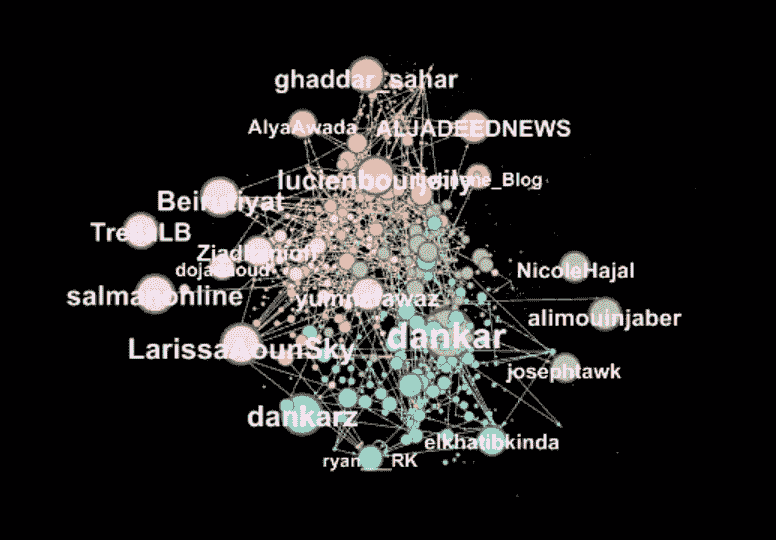
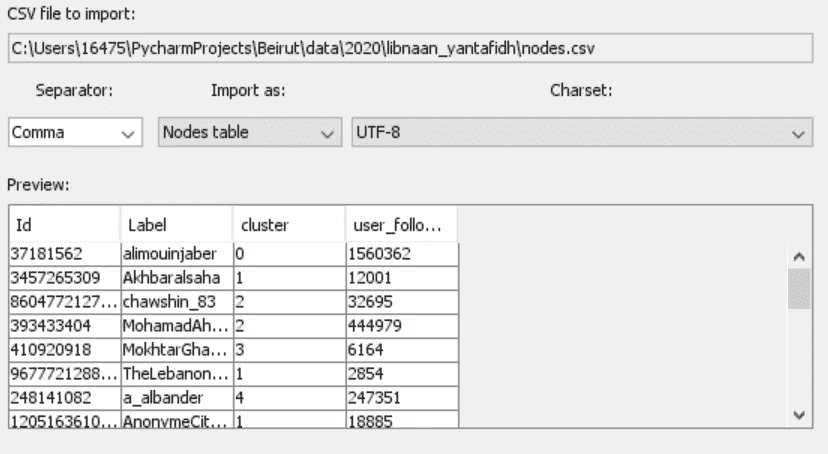
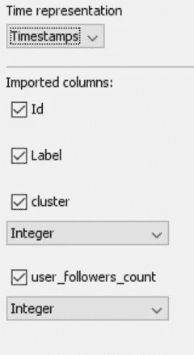
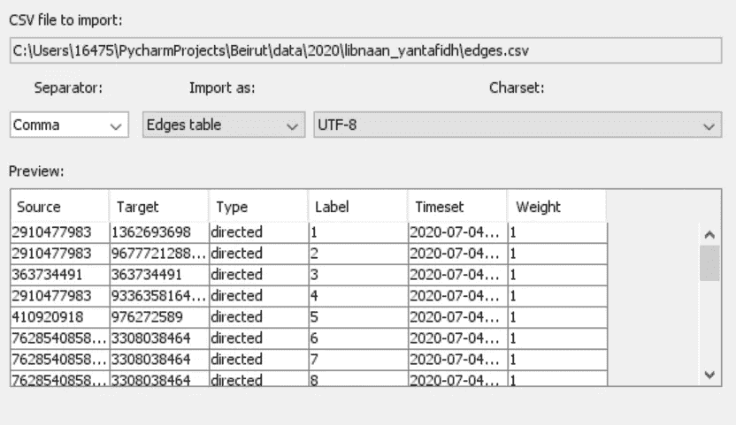
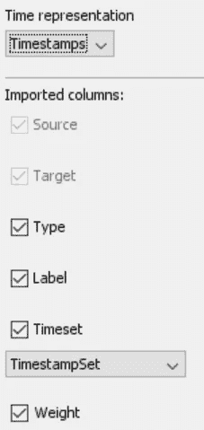
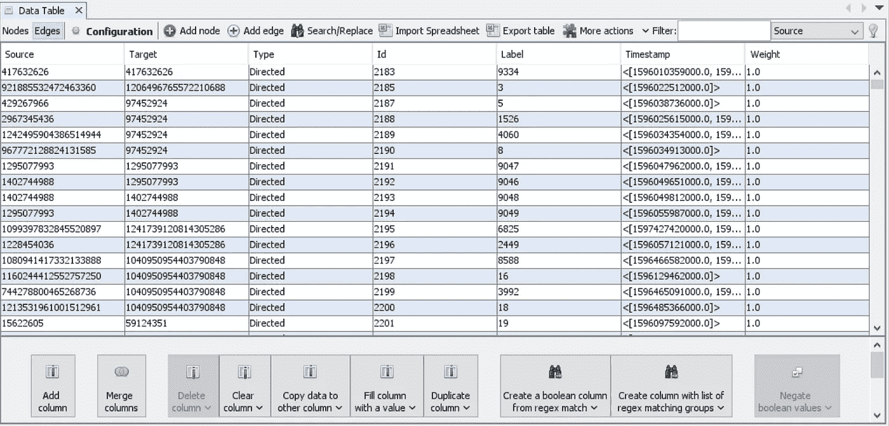
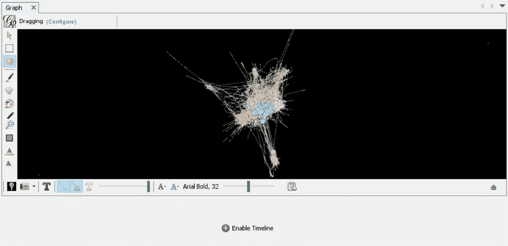
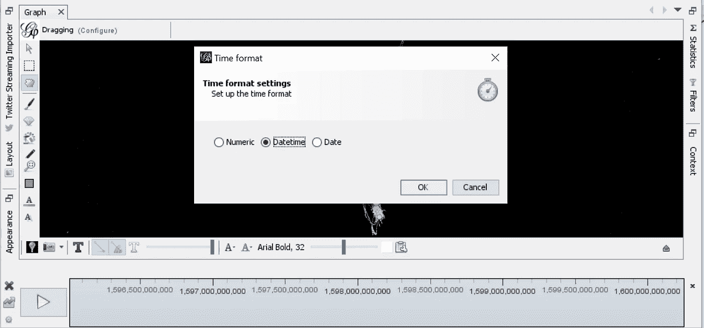
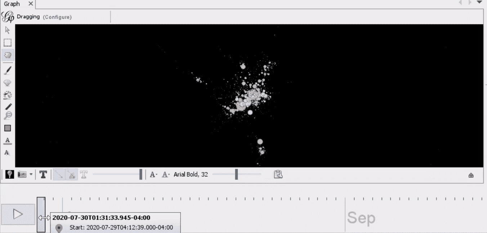

# 用 Gephi 制作动态图形动画

> 原文：<https://towardsdatascience.com/animate-dynamic-graphs-with-gephi-d6bd9faf5aec?source=collection_archive---------15----------------------->

## 社会网络图中时间动态行为动画的数据可视化教程。

一段时间内 Twitter 影响者转发行为的 Gephi 可视化。图片作者。

谈到分析社交网络，我以前的文章主要是关于自然语言处理(NLP)，或者更具体地说是阿拉伯语 NLP。然而，推文不仅仅是文本数据，它们代表了 Twitter 用户之间的网络联系。增加网络分析，允许社交媒体数据的内容和行为之间的综合；因此，将网络和文本数据结合起来，可以对社交媒体网络有更细致入微的理解。

我的 Python 学习之旅是出于需要而开始的，我的目标是制作一个 Twitter 网络图，而编码似乎是解决方案。因此，我的第一个脚本是与熊猫的一场令人流泪的战斗，这一切都是为了创建一个简单的 csv，它将被流行的开源图形可视化软件 Gephi 接受。几个月后，阅读我最早的代码提醒了我的毅力，改进第一个脚本是一堂谦卑的课。

最近，我在与世界银行的研究人员合作进行黎巴嫩调查时，使用了这个改进的脚本。在地区知识和专业技能的指导下，我正在分析一个特定的 Twitter 标签“#لبنان_ينتفض".”数据是在很长一段时间内收集的；追踪始于 2019 年[十月革命](https://en.wikipedia.org/wiki/2019%E2%80%932020_Lebanese_protests)的第一次抗议，收集持续到 2020 年 8 月[贝鲁特爆炸](https://en.wikipedia.org/wiki/2020_Beirut_explosion)，结束于 2020 年 11 月。

作为调查的一部分，我观察了 Twitter 影响者 retweet 网络，有人建议我专注于选定的感兴趣时段，所以我最初的方法是创建静态快照。然而，数据的时间性质促使我去想象转发行为的时间动态。多亏了我的第一个脚本，我能够只用最基本的 Python 和 Gephi 创建几个类似上面例子的动画图形。接下来，我通过使用 [CloudApp](https://www.getcloudapp.com/) 创建截屏 gif，使我的时间动态 Twitter 网络动画可以访问。

在这个简短的数据可视化教程中，我将概述创建网络数据动画图所需的步骤和最少的代码。我将使用 Twitter 作为例子，但是同样的过程也可以用于其他社交媒体网络。由于本教程侧重于数据可视化，我将跳过对数据收集过程的解释。相反，我与我的初学者 Twitter 抓取脚本分享了一个[要点，它足以为本教程的目的收集数据。](https://gist.github.com/haayanau/63d03cad7db813a3f77577038c3f0d5f)

Gephi 有几个选项可以从数据库加载网络数据，或者作为图形文件类型，比如。然而，对于动态图，最简单的选择是将正确标记和格式化的电子表格中的数据加载到 Gephi 中。在网络图术语中，“节点”代表单个 Twitter 用户，“边”代表用户之间的转发连接。我从节点和边 csv 文件开始，用 Python 中的 [networkx](https://networkx.org/) 从原始的未处理 Twitter 数据创建。这篇[优秀的媒体文章](https://medium.com/future-vision/visualizing-twitter-interactions-with-networkx-a391da239af5)解释了如何开始可视化 Twitter 网络，包括如何用 networkx 创建节点和边。

下面的代码片段展示了如何从 nodes 和 edges csv 文件中加载 Twitter 数据，以便可以用 Python 正确地标记和格式化它们。

加载节点和边 csv 文件的 Python 代码片段。

一旦加载了原始 Twitter 数据，我首先处理节点，然后是边，并将它们都保存为 csv 文件。

Gephi 需要一个节点电子表格，其中第一列专门命名为“Id ”,包含 Twitter 用户 Id，第二列应该是“Label ”,包含 Twitter 用户屏幕名称。所有其他列表示节点属性，并且是可选的。在下面的代码示例中，我包含了一个关于 [Louvain](/louvain-algorithm-93fde589f58c) 集群(由在 networkx 中实现的 Louvain 社区检测算法确定)和 Twitter 用户追随者计数的列。处理节点的最后一步是将节点数据帧保存为 csv 格式，以便以后可以将其导入 Gephi。

为 Gephi 处理节点的 Python 代码片段。

接下来，对于 edges 电子表格，与节点类似，Gephi 希望在导入过程中特别标记和排序列。前两个必需的列是“Source”和“Target”，代表参与转发的 Twitter 用户对。第三列应该是“Type”，在这个 Twitter 示例中是“directed ”,因为我们处理的是转发。第四列应该是“Label”，在本例中是一个简单的索引。第五列是最重要的，它应该被命名为“Timeset ”,包含转发的创建时间——特别是以 iso 格式。“时间集”列是时间变量，将用于在 Gephi 中制作网络图动画。最后一列“Weight”是可选的，Gephi 默认为“1”。最后，可以将 edges 数据帧保存为 csv 格式，以便导入 Gephi。

为 Gephi 处理边的 Python 代码片段。

既然 nodes 和 edges 电子表格已经被格式化和标记，它们就可以通过“Import spreadsheet”菜单选项导入到 Gephi 中了。从节点开始，下面的截图显示了第一个导入菜单，其中分隔符应该是“逗号”，导入选项应该是“节点表”，编码应该是“UTF-8”。

节点的 Gephi 电子表格导入屏幕。图片作者。

下一步是选择要导入的列，并为可选属性列分配数据类型。确保在时间表示的下拉菜单中选择“时间戳”,这对我们稍后导入带时间戳的边很重要。

节点导入过程通过将节点添加到新的 Gephi 工作空间来完成。

接下来，添加边电子表格中的边。下面截图中的边导入过程类似于节点导入过程；唯一的区别是选择“边表”的导入选项。

用于 edges 的 Gephi 电子表格导入屏幕。图片作者。

下面的屏幕截图显示了第二个导入屏幕，其中我们将时间表示指定为“Timestamps”，并将“Timeset”列的数据类型指定为“TimestampSet”。

边导入过程的最后一步是将边附加到导入节点时创建的现有工作空间中。在 Gephi 的数据实验室中，edges 表应该是可见的，如下图所示,“时间戳”将以 iso 格式显示。

gephi edges 表截图。图片作者。

按照我通常的程序，我在导入的网络图上工作，通过应用强制定向算法来布局节点，并挑选哪些属性用于节点的着色和大小调整。在下图所示的“概览”窗口中，设计的网络图下方有一个宽栏，显示“启用时间线”选项。

Gephi 推特转发网络图截图。图片作者。

只需选择“启用时间线”，它会显示一个打勾的数字时间条，如下所示。左下角的设置轮允许设置时间格式，我从中选择“日期时间”。

Gephi 调整时间格式设置截图。图片作者。

剩下的就是用光标选择时间间隔窗口的大小，然后按 play。

使用光标调整时间窗口的大小，并拖动到所需的开始位置。按播放开始播放动画。

正如我之前提到的，我使用 CloudApp 创建了动画网络的截屏 gif，然后与我的合著者分享。就是这样！使用一点 Python 代码，很容易修改网络数据，以便可以在 Gephi 中动画化。

我希望这个教程是有帮助的，如果是的话，考虑在下面留下评论，这样我就知道有人对这个话题和/或这种风格的帖子感兴趣。欢迎所有问题和评论，欢迎随时在 [Linkedin](https://www.linkedin.com/in/haaya-naushan-a4b5b61a5/) 上与我联系。