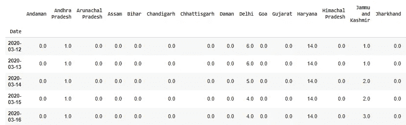
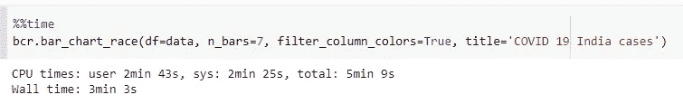
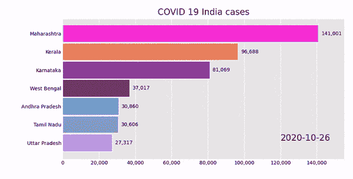

# Python 中时间序列数据的动画条形图

> 原文：<https://towardsdatascience.com/animated-bar-plot-in-python-for-time-series-data-8809dbdf9bc?source=collection_archive---------52----------------------->

## 用 python 实现一个动画赛车条形图


图片由 [janjf93](https://pixabay.com/users/janjf93-3084263/?utm_source=link-attribution&amp;utm_medium=referral&amp;utm_campaign=image&amp;utm_content=3614768) 来自 [Pixabay](https://pixabay.com/?utm_source=link-attribution&amp;utm_medium=referral&amp;utm_campaign=image&amp;utm_content=3614768)

由于大量开源库的存在，ython 在很短的时间内就获得了流行，但在创建动态情节方面仍有不足。探索性数据分析是端到端机器学习项目的重要组成部分之一。

数据集的 EDA 需要开发用于数据可视化的图。有各种各样的库，如 **seaborn、matplotlib、ggplot** 等，可以为数据可视化创建很好的图形。当涉及到动态情节或动画情节时，这些库无法开发动画情节。bar-chart-race 是一个开源 python 库，可以为时间序列数据集创建动态或动画图。

## 安装:

bar_chart_race 库的 Pip 和 Conda 安装:

```
**pip install bar_chart_race
conda install -c conda-forge bar_chart_race**
```

## 用法:

**bar_chart_race** 库是一个开源库，为时序数据集创建**动画条形图。在实施动画条形图之前，需要遵循一系列快速入门指南:**

*   数据集的每一行都应该包含一个时间段。
*   日期时间列应重置为数据框的索引(可选)。
*   数据集的列应该是条形图的类别。
*   每一列都应该包含特定类别的特定值。

下面提到的样本数据集是实施柱状图所需数据框格式的正确示例。



(图片由作者提供)，样本数据集

以上样本数据集是印度各邦的**新冠肺炎病例数。**数据集的列是指印度各邦，值是特定日期的新冠肺炎病例数。数据集的索引被重置为日期列。

## **bar _ chart _ race 函数的语法:**

```
**bcr.bar_chart_race(
df, filename=None, orientation='h', sort='desc', n_bars=None, fixed_order=False, fixed_max=False, steps_per_period=10, period_length=500, interpolate_period=False, label_bars=True, bar_size=0.95, period_label=True, period_fmt=None, period_summary_func=None, perpendicular_bar_func=None, figsize=(6, 3.5), cmap=None, title=None, title_size=None, bar_label_size=7, tick_label_size=7, shared_fontdict=None, scale='linear', writer=None, fig=None, dpi=144, bar_kwargs=None, filter_column_colors=False
)**
```

## **covid 数据和结果的函数实现:**

下面是为 covid 时间序列数据实现动画条形图的 python 代码。其余所有参数都保持默认，可以更改这些参数来改变绘图的显示方式。



(作者 GIF)，动画条形图

要了解如何使用 PivotTable.js 创建交互式数据透视表，请阅读下面的文章:

</interactive-pivot-tables-in-jupyter-notebook-fc74bad8aa67>  

# 结论:

动画条形图是比静态条形图更好的可视化技术。在本文中，我们讨论了如何为时间序列数据集绘制动画或动态条形图。

Matplotlib 动画也可以用来开发动画条形图，但它需要更多的代码来实现。bar_chart_race 库构建在 matplotlib 库之上。

# 参考资料:

[1]条形图-比赛文档:[https://pypi.org/project/bar-chart-race/](https://pypi.org/project/bar-chart-race/)