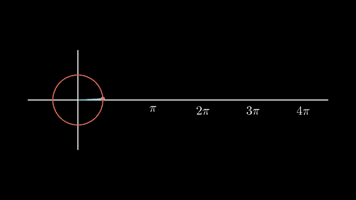
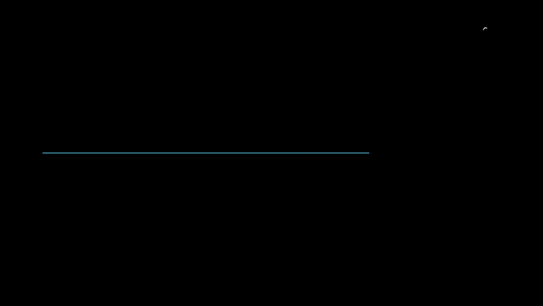
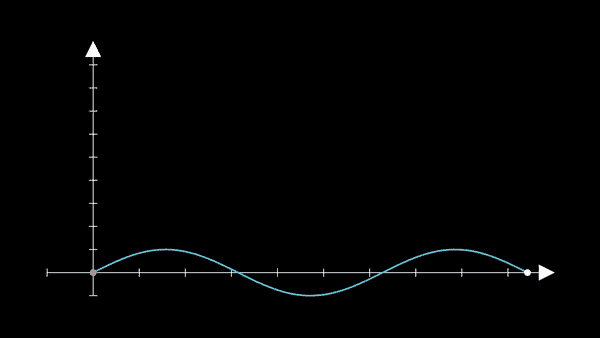

# 动画数学分析

> 原文：<https://towardsdatascience.com/animated-mathematical-analysis-907179ce9c9e?source=collection_archive---------13----------------------->

## 使用 Manim 创建数学动画可视化



马尼姆(来源:作者)

数据可视化有助于理解数据中无法用肉眼看到的隐藏模式。它确定不同数据点之间的关联、不同特征之间的相关性以及目标变量。有多个 Python 库可用于创建可视化效果。

动画可视化使它对实际查看它的用户更有吸引力和更容易理解。动画有助于显示数据是如何分布、关联、相关等的。像 Matplotlib、Plotly 等几个 Python 库提供了可视化的动画。

在本文中，我们将讨论 Manim，这是一个开源的 python 库，致力于创建解释性的数学视频/动画。它通过动画的方式帮助理解不同的数学概念。

让我们开始吧…

# 安装所需的库

我们将从使用 pip 安装一个 Manim 开始。manim 需要几个依赖项。下面给出的命令将安装所有依赖项和 Manim。

```
!sudo apt update
!sudo apt install libcairo2-dev ffmpeg \
    texlive texlive-latex-extra texlive-fonts-extra \
    texlive-latex-recommended texlive-science \
    tipa libpango1.0-dev
!pip install manim
!pip install IPython --upgrade
```

# 导入所需的库

在这一步，我们将导入所需的库和函数来使用 Manim 创建数学可视化。

```
import numpy as np
from manim import *
```

# **创建可视化**

在这一步，我们将开始创建不同的可视化。让我们从一些基本的可视化开始。

1.  **圆到方**

```
%%manim -qm -v WARNING SquareToCircleclass SquareToCircle(Scene):
    def construct(self):
        # Creating shapes
        circle = Circle()
        square = Square()#Showing shapes
        self.play(Create(square))
        self.play(Transform(square, circle))
        self.play(FadeOut(square))
```


动画(来源:作者)

**2。创建图表**

```
%%manim -qm -v WARNING CreateGraphclass CreateGraph(Scene):
    def construct(self):
        axes = Axes(
            x_range=[-3, 3],
            y_range=[-5, 5],
            axis_config={"color": BLUE},
        )# Create Graph
        graph = axes.get_graph(lambda x: x**2, color=WHITE)
        graph_label = axes.get_graph_label(graph, label='x^{2}')graph2 = axes.get_graph(lambda x: x**3, color=WHITE)
        graph_label2 = axes.get_graph_label(graph2, label='x^{3}')# Display graph
        self.play(Create(axes), Create(graph), Write(graph_label))
        self.wait(1)
        self.play(Transform(graph, graph2), Transform(graph_label, graph_label2))
        self.wait(1)
```



图表(来源:作者)

**3。布尔运算解释**

```
%%manim -qm -v WARNING BooleanOperationsclass BooleanOperations(Scene):
    def construct(self):
        ellipse1 = Ellipse(
            width=4.0, height=5.0, fill_opacity=0.5, color=BLUE, stroke_width=10
        ).move_to(LEFT)
        ellipse2 = ellipse1.copy().set_color(color=RED).move_to(RIGHT)
        bool_ops_text = MarkupText("<u>Boolean Operation</u>").next_to(ellipse1, UP * 3)
        ellipse_group = Group(bool_ops_text, ellipse1, ellipse2).move_to(LEFT * 3)
        self.play(FadeIn(ellipse_group))i = Intersection(ellipse1, ellipse2, color=GREEN, fill_opacity=0.5)
        self.play(i.animate.scale(0.25).move_to(RIGHT * 5 + UP * 2.5))
        intersection_text = Text("Intersection", font_size=23).next_to(i, UP)
        self.play(FadeIn(intersection_text))u = Union(ellipse1, ellipse2, color=ORANGE, fill_opacity=0.5)
        union_text = Text("Union", font_size=23)
        self.play(u.animate.scale(0.3).next_to(i, DOWN, buff=union_text.height * 3))
        union_text.next_to(u, UP)
        self.play(FadeIn(union_text))e = Exclusion(ellipse1, ellipse2, color=YELLOW, fill_opacity=0.5)
        exclusion_text = Text("Exclusion", font_size=23)
        self.play(e.animate.scale(0.3).next_to(u, DOWN, buff=exclusion_text.height * 3.5))
        exclusion_text.next_to(e, UP)
        self.play(FadeIn(exclusion_text))d = Difference(ellipse1, ellipse2, color=PINK, fill_opacity=0.5)
        difference_text = Text("Difference", font_size=23)
        self.play(d.animate.scale(0.3).next_to(u, LEFT, buff=difference_text.height * 3.5))
        difference_text.next_to(d, UP)
        self.play(FadeIn(difference_text))
```


布尔运算(来源:作者)

所有这些可视化都需要大量代码，我已经将每一行代码解释为代码中的注释，您可以浏览它，并了解如何创建图形并将其可视化。

让我们创建一些更高级的可视化。

**4。带痕迹的点**

```
%%manim -qm -v WARNING PointWithTraceclass PointWithTrace(Scene):
    def construct(self):
        path = VMobject()
        dot = Dot()
        path.set_points_as_corners([dot.get_center(), dot.get_center()])
        def update_path(path):
            previous_path = path.copy()
            previous_path.add_points_as_corners([dot.get_center()])
            path.become(previous_path)
        path.add_updater(update_path)
        self.add(path, dot)
        self.play(Rotating(dot, radians=PI, about_point=RIGHT, run_time=2))
        self.wait()
        self.play(dot.animate.shift(UP))
        self.play(dot.animate.shift(LEFT))
        self.wait()
```


带痕迹的点(来源:作者)

**5。图形摄像机**

```
%%manim -qm -v WARNING FollowingGraphCameraclass FollowingGraphCamera(MovingCameraScene):
    def construct(self):
        self.camera.frame.save_state()# create the axes and the curve
        ax = Axes(x_range=[-1, 10], y_range=[-1, 10])
        graph = ax.plot(lambda x: np.sin(x), color=BLUE, x_range=[0, 3 * PI])# create dots based on the graph
        moving_dot = Dot(ax.i2gp(graph.t_min, graph), color=ORANGE)
        dot_1 = Dot(ax.i2gp(graph.t_min, graph))
        dot_2 = Dot(ax.i2gp(graph.t_max, graph))self.add(ax, graph, dot_1, dot_2, moving_dot)
        self.play(self.camera.frame.animate.scale(0.5).move_to(moving_dot))def update_curve(mob):
            mob.move_to(moving_dot.get_center())self.camera.frame.add_updater(update_curve)
        self.play(MoveAlongPath(moving_dot, graph, rate_func=linear))
        self.camera.frame.remove_updater(update_curve)self.play(Restore(self.camera.frame))
```



图表相机(来源:作者)

继续尝试不同的可视化。如果您发现任何困难，请在回复部分告诉我。

本文是与 [Piyush Ingale](https://medium.com/u/40808d551f5a?source=post_page-----907179ce9c9e--------------------------------) 合作完成的。

# 在你走之前

***感谢*** *的阅读！如果你想与我取得联系，请随时通过 hmix13@gmail.com 联系我或我的* [***LinkedIn 个人资料***](http://www.linkedin.com/in/himanshusharmads) *。可以查看我的*[***Github***](https://github.com/hmix13)**简介针对不同的数据科学项目和包教程。还有，随意探索* [***我的简介***](https://medium.com/@hmix13) *，阅读我写过的与数据科学相关的不同文章。**