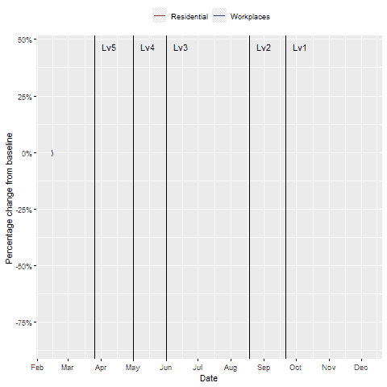

# R 中的动画时间序列图

> 原文：<https://towardsdatascience.com/animated-time-series-plots-in-r-3777fa738456?source=collection_archive---------27----------------------->

## 制作时间序列动画的快速指南

几周前，我发表了一篇分析 2020 年南非人口流动趋势的文章。那篇文章中包括一组动画时间序列图，描绘了一段时间内的移动趋势，描绘了以新冠肺炎锁定为标志的一年中的移动情况。在本文中，我将为我的分析提供一个代码演练，重点是创建如下所示的动画时间序列图。

居住和工作地点的移动趋势|作者图表

我们将使用的数据可以在谷歌的新冠肺炎社区移动报告页面上找到，并且已经包含在我的 GitHub 存储库中。一旦。csv 文件已经加载到 R 中，我们需要拆分出国家级数据。除了这些图之外，该分析还包括一个比较表，显示了每个锁定期内移动性的平均变化。这是通过首先删除对应于南非公共假日的数据点实现的，这些数据点可能是异常值。接下来，将剩余的数据分成每个警报级别，最后，计算每个警报级别的平均值。

计算每个警报级别中移动性的平均变化|数据集的第 9 至 14 列代表每个移动性类别

绘制图表需要几个软件包:

*   ggplot2:用于制作我们的地块
*   ggeasy:用于更方便地访问一些 ggplot2 命令
*   ggpubr:用于格式化我们的 ggplot2 图，并使它们准备好发布
*   gganimate:用于激活我们的 ggplot2 图
*   gifski:用于将我们的动画 ggplot2 图转换为 GIF 格式
*   transformr:用于平滑地激活图中的时间序列路径
*   刻度:用于在图的 y 轴上显示百分比标签

图中设置的另一个元素是为每个警报级别设置标记，我们将这些标记绘制为带有文本标签的垂直线:

除了最后一次，使用过 ggplot2 的人应该对这个情节的代码很熟悉。我们选择我们的国家数据集，将我们的审美映射为 x 轴上的日期和 y 轴上的移动性百分比变化，在同一轴上添加另一个时间序列，添加轴标签，为我们的线设置颜色，并包括我们的垂直线以划分警报级别。最后一行(下面代码片段中的第 15 行)是我们制作情节动画所需的全部内容。我们提供给 *transition_reveal* 函数的参数与我们图表中的 x 轴美学相同，因为我们想要创建一个逐渐揭示的时间序列。

生成居住和工作地点的**移动趋势的代码**图如上所示

最后，我们使用 *animate* 函数将绘图渲染为 GIF，并使用 *anim_save* (默认情况下保存最后渲染的图形)将我们的动画时间序列绘图保存为 GIF。该文件将被保存到与我们正在处理的 R 文件相同的目录中。

将动画绘制为 GIF 格式，并保存。gif 文件

其余的图以同样的方式生成，完整的代码可以在[这里](https://github.com/ValentineChisango/SouthAfrica_Mobility#southafrica_mobility)的库中找到。