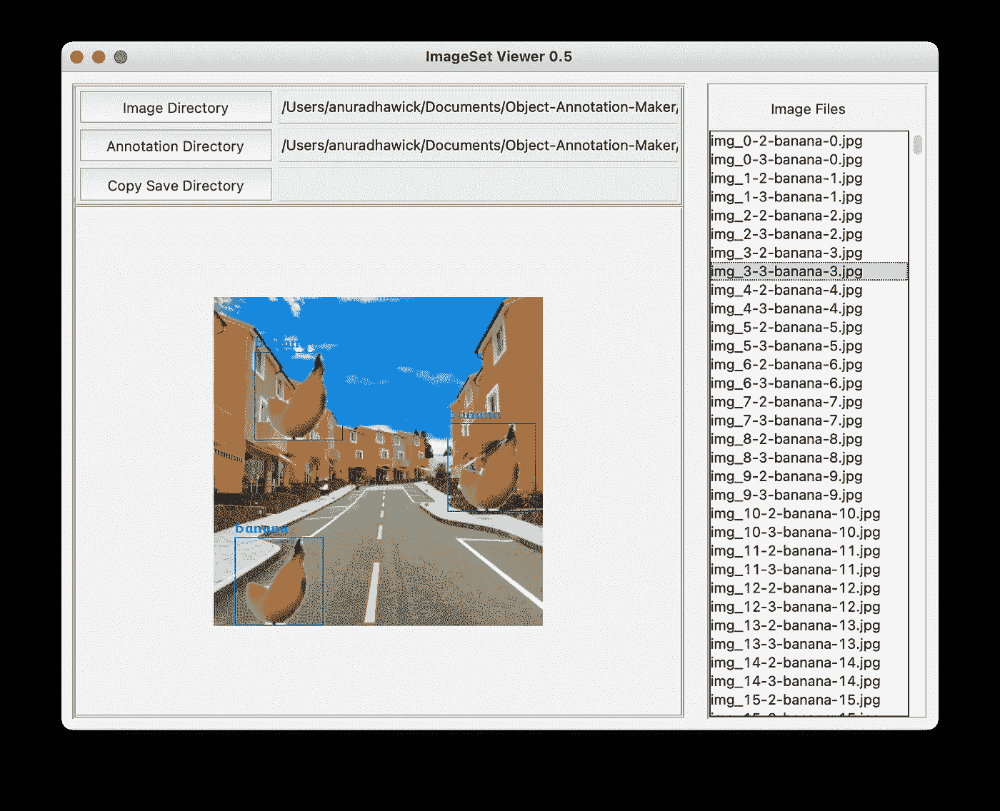

# 用于对象检测的注释器

> 原文：<https://towardsdatascience.com/annotator-for-object-detection-950fd799b651?source=collection_archive---------18----------------------->

## 一个为计算机视觉生成带注释图像的工具

在计算机视觉中，目标检测是一个有着众多应用的有趣领域。像任何其他受监督的机器学习任务一样，我们也需要为这个任务添加注释或标签。然而，对我们许多人来说，图像的注释可能是一项乏味耗时的任务(懒人？).当我写我的上一篇文章时，我强烈地感受到了这一点，链接如下。

</computer-vision-on-edge-b5adb5c6ccde>  

所以大问题来了；

> 我们怎样才能自动生成带有期望背景的带注释的图像？



作者截图

嗯，答案很简单，使用现有的对象，并叠加在一些背景上！互联网上有几个博客会告诉你如何去做。但对我来说，很难找到一个合适的工具，可以为我做一切，这样我就可以专注于主要问题，对象检测。

所以我介绍，[对象注释器](https://github.com/anuradhawick/Object-Annotation-Maker)。它是做什么的，又是如何做到的？这篇文章就是关于这种用途的。

# 准备对象图像

找到物体的图像比找到注释要容易得多。这是因为捕捉物体图像很容易，而且更省力。一个很好的水果图片来源是 Kaggle 中的[水果 360](https://www.kaggle.com/moltean/fruits) 数据集。


作者截图(【https://www.kaggle.com/moltean/fruits】T4)

该数据集包含来自水果的 100×100 个图像，带有关于水果是什么的标签。

# 决定背景

这一步是非常具体的任务。例如，如果您要在火车站检测行人，您最好使用特定车站的照片。或者你房间(或者超市)的照片，如果你在房间里找水果的话。这很容易做到，而且不需要太多的努力。


照片由[上的](https://unsplash.com/s/photos/kitchen?utm_source=unsplash&utm_medium=referral&utm_content=creditCopyText)[水印图案](https://unsplash.com/@watermarkdesigns?utm_source=unsplash&utm_medium=referral&utm_content=creditCopyText)和组成

# 使用对象注释生成器

您可以从下面的 GitHub 存储库中下载注释器。

<https://github.com/anuradhawick/Object-Annotation-Maker>  

存储库的自述文件中提供了运行说明。

**按如下方式组织您的图像；**

```
data
-Fruits
--Banana
---img-1.jpg
---img-2.jpg
--Apple
---img-1.jpg
---img-2.jpg
...
-Backgronds
--bg-1.jpg
--bg-2.jpg
--bg-3.jpg
```

该工具可以为您完成以下任务；

*   **重新缩放图像** —如果你想缩小图像尺寸，这很有帮助。例如，用于训练的最常见图像大小是 224x224。所以你需要有大约 80x80 大小的对象。该选项可通过使用参数`--resize-images 80,80`进行设置。您可以同时提供高度和宽度，或者只提供缩放尺寸的高度(`—-resize-images 80`)。
*   **重新调整背景**——这与上一步类似。通常，背景图像会非常大。使用参数`--resize-backgrounds 224,224`可以很容易地重新调整它们。
*   **每个对象的图像数量** —这决定了特定对象生成的图像数量。以`--n-images 10`为例。
*   **图像中的对象数量** —目前该工具支持在背景上叠加同一图像的多个实例。例如，厨房图像中的两个苹果。可以通过参数`--n-objects 2,5`来实现。您可以为层代提供单个值或一系列值。

该程序还将**线程**和**种子**的数量作为多线程和随机生成的输入。输入图像可以作为通配符列表给出。例如，如果您要从 **Fruit 260** 数据库中挑选香蕉和苹果，您的命令将如下所示。为了清楚起见，我省略了上面的选项。

```
python3 Maker.py -i "fruit260/Training/Banana/*.jpg" "fruit260/Training/Apple/*.jpg" -b "data/Backgrounds/8.jpg"
```

这使得选择多个文件夹变得非常容易。

> 请注意，图像必须来自带有标签的文件夹。例如，在名为**香蕉**的文件夹中总是有**香蕉**图片。您可以在不同的目录中有几个这样的文件夹。

您需要指定一个输出文件夹来保存图像。对于上面的数据集，您提到的输出目录中会有以下结构。

```
output
-tmp (used for temporary data)
-images
--banana
---img-0-banana-1.jpg
---img-0-banana-2.jpg
--apple
---img-0-apple-1.jpg
---img-0-apple-1.jpg
-annotations
--banana
---img-0-banana-1.xml
---img-0-banana-2.xml
--apple
---img-0-apple-1.xml
---img-0-apple-1.xml
```

该程序将自动生成 VOC 格式的 XML 用于训练。现在，您可以使用这些图像来训练您的机器学习模型。编码快乐！