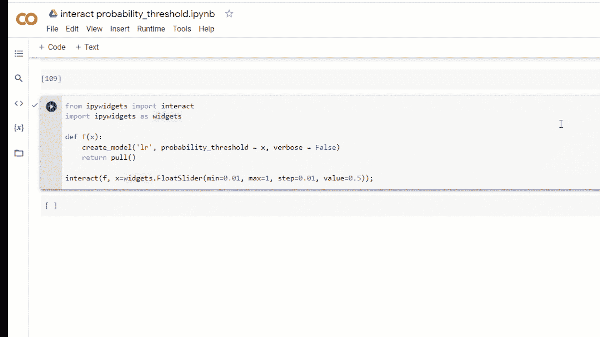
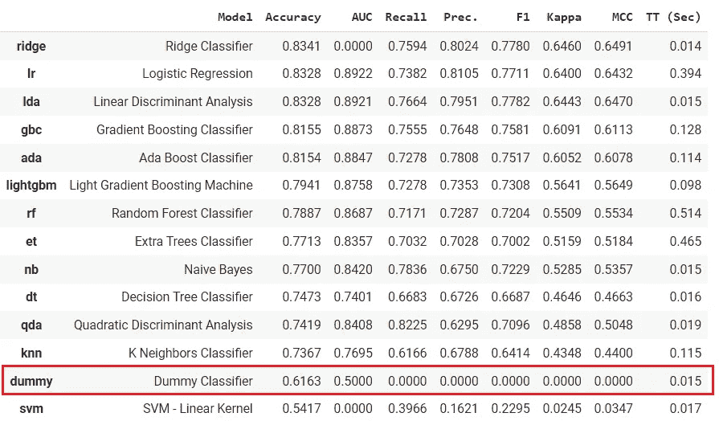
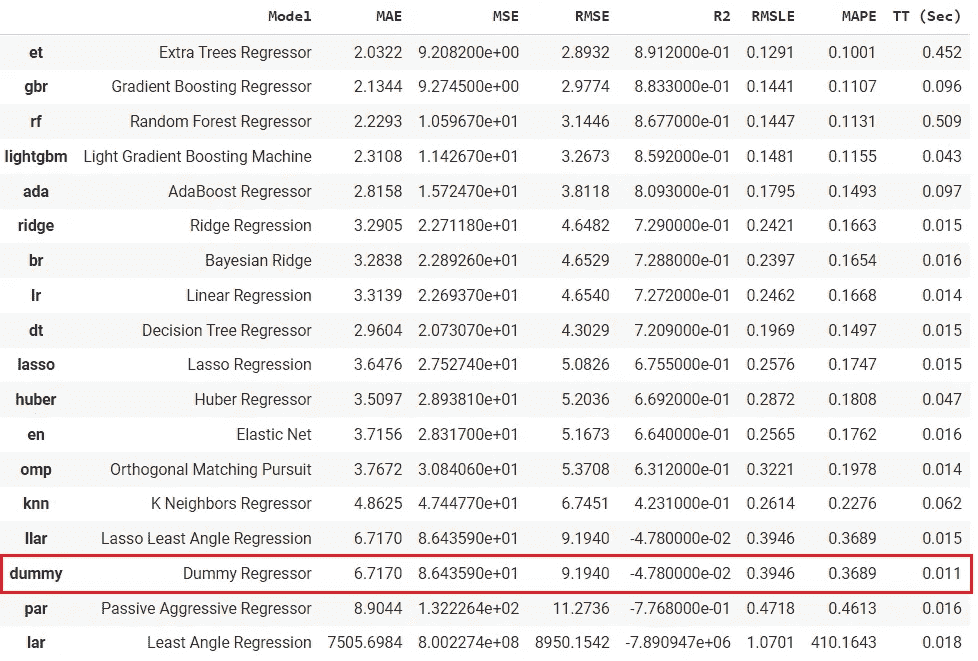
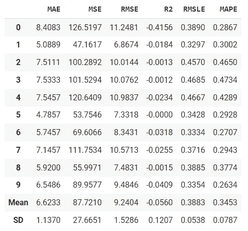
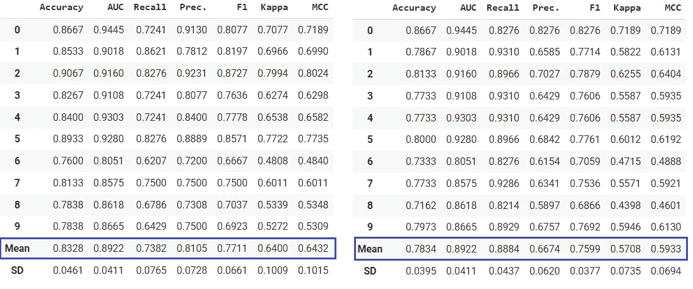
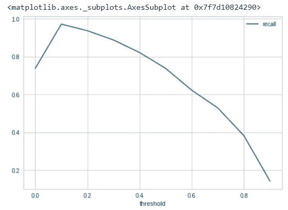
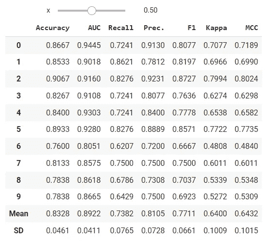

# PyCaret 2.3.5 来了！了解新内容

> 原文：<https://towardsdatascience.com/announcement-pycaret-2-3-5-is-here-learn-whats-new-7f0256c71797?source=collection_archive---------17----------------------->

## 关于 PyCaret 最新版本中添加的新功能



(图片由作者提供)PyCaret 2.3.5 中的新特性

# 🚀介绍

PyCaret 是一个用 Python 编写的开源、低代码的机器学习库，可以自动化机器学习工作流。这是一个端到端的机器学习和模型管理工具，可以成倍地加快实验周期，提高您的工作效率。想了解更多关于 PyCaret 的信息，可以查看官方[网站](https://www.pycaret.org)或者 [GitHub](https://www.github.com/pycaret/pycaret) 。

本文展示了最近发布的 [PyCaret 2.3.5](https://github.com/pycaret/pycaret/releases/tag/2.3.5) 中添加的新功能的使用。

# 🤖新模型:DummyClassifier 和 DummyRegressor

在`pycaret.classification`和`pycaret.regression`模块的模型动物园中增加了 DummyClassifier 和 DummyRegressor。当您运行`compare_models`时，它将使用简单的规则训练一个虚拟模型(分类器或回归器),结果将显示在排行榜上以供比较。

```
**# load dataset** from pycaret.datasets import get_data
data = get_data('juice')**# init setup** from pycaret.classification import *
s = setup(data, target = 'Purchase', session_id = 123)**# model training & selection**
best = compare_models()
```



(图片由作者提供)compare _ models 函数的输出

```
**# load dataset** from pycaret.datasets import get_data
data = get_data('boston')**# init setup** from pycaret.regression import *
s = setup(data, target = 'medv', session_id = 123)**# model training & selection**
best = compare_models()
```



(图片由作者提供)compare _ models 函数的输出

您也可以在`create_model`功能中使用该模型。

```
**# train dummy regressor**
dummy = create_model('dummy', strategy = 'quantile', quantile = 0.5)
```



(图片由作者提供)create _ model 函数的输出

虚拟模型(分类器或回归器)是与其他(真实)回归器进行比较的简单基线。不要用它来解决实际问题。

# 📈自定义概率截止值

PyCaret 的`create_model` `compare_models` `ensemble_model` `blend_models`等所有训练函数中都引入了一个新参数`probability_threshold`。默认情况下，所有能够预测概率的分类器都使用 0.5 作为截止阈值。

这个新参数将允许用户传递一个介于 0 和 1 之间的浮点数来设置一个自定义的概率阈值。当使用`probability_threshold`时，底层函数返回的对象是模型对象的包装器，这意味着当您在`predict_model`函数中传递它时，它将尊重阈值，并将使用它们在传递的数据上生成硬标签。

```
**# load dataset** from pycaret.datasets import get_data
data = get_data('juice')**# init setup** from pycaret.classification import *
s = setup(data, target = 'Purchase', session_id = 123)**# model training**
lr = create_model('lr')
lr_30 = create_model('lr', probability_threshold = 0.3)
```



(图片由作者提供)左侧- LR 没有概率阈值，使用默认的 0.5 |右侧-LR，概率阈值= 0.3。

您可以编写这样一个简单的循环来优化概率截止值:

```
**# train 10 models at diff thresholds**recalls = []for i in np.arange(0,1,0.1):
   model = create_model('lr', probability_threshold = i, verbose=False)
   recalls.append(pull()['Recall']['Mean'])**# plot it**
import pandas as pd
df = pd.DataFrame()
df['threshold'], df['recall'] = np.arange(0,1,0.1), recalls
df.set_index('threshold').plot()
```



(图片由作者提供)不同概率下的回忆 _ 阈值(x 轴是阈值，y 轴是回忆)

您还可以简单地构建一个`ipywidgets`仪表板来测试不同模型的不同概率阈值。

```
from ipywidgets import interact
import ipywidgets as widgetsdef f(x):
   create_model('lr', probability_threshold = x, verbose = False)
   return pull()interact(f, x=widgets.FloatSlider(min = 0.01, max = 1.0, step = 0.01, value = 0.5));
```



(图片由作者提供)-当您更改滑块的值时，模型将重新训练，并且 CV 结果将实时更新。

本公告中显示的所有代码示例都在这个 [Google Colab 笔记本](https://colab.research.google.com/drive/1WMSHAYHiQ4OPt8oNHvKQeg0oBAq0evDI?usp=sharing)中。

# 重要链接

⭐ [教程](https://github.com/pycaret/pycaret/tree/master/tutorials)py caret 新？查看我们的官方笔记本！
📋[社区创建的示例笔记本](https://github.com/pycaret/pycaret/tree/master/examples)。
📙[博客](https://github.com/pycaret/pycaret/tree/master/resources)投稿人的教程和文章。
📚[文档](https://pycaret.readthedocs.io/en/latest/index.html)py caret 的详细 API 文档
📺[视频教程](https://www.youtube.com/channel/UCxA1YTYJ9BEeo50lxyI_B3g)我们的视频教程来自各种赛事。
📢[讨论](https://github.com/pycaret/pycaret/discussions)有疑问？与社区和贡献者互动。
🛠️ [变更日志](https://github.com/pycaret/pycaret/blob/master/CHANGELOG.md)变更和版本历史。
🌳[路线图](https://github.com/pycaret/pycaret/issues/1756) PyCaret 的软件和社区开发计划。

# 作者:

我写的是关于 PyCaret 及其在现实世界中的用例，如果你想自动得到通知，你可以在 [Medium](https://medium.com/@moez-62905) 、 [LinkedIn](https://www.linkedin.com/in/profile-moez/) 和 [Twitter](https://twitter.com/moezpycaretorg1) 上关注我。