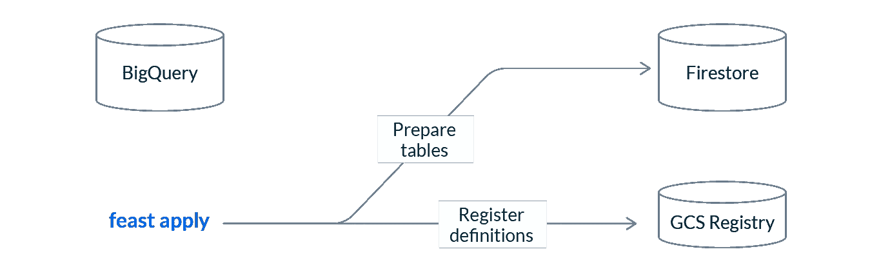
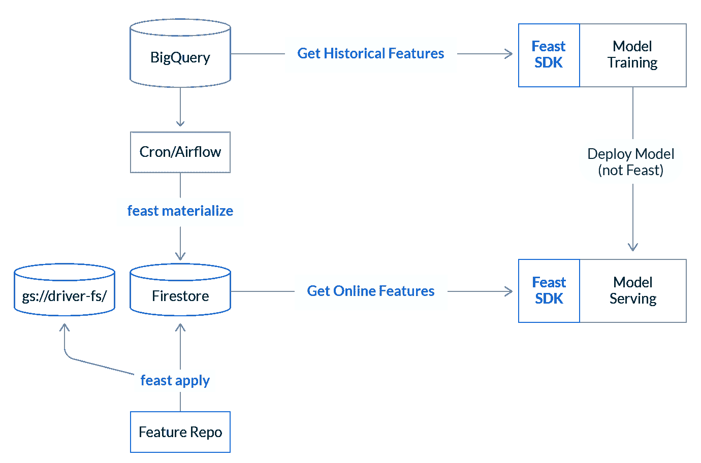

# 宣布盛宴 0.10

> 原文：<https://towardsdatascience.com/announcing-feast-0-10-feast-1d635762896b?source=collection_archive---------26----------------------->

## 我们如何显著简化了管理功能商店的流程。


由 [Unsplash](https://unsplash.com/s/photos/machine-learning?utm_source=unsplash&utm_medium=referral&utm_content=creditCopyText) 上的 [Pietro Jeng](https://unsplash.com/@pietrozj?utm_source=unsplash&utm_medium=referral&utm_content=creditCopyText) 拍摄

# 更简单的功能存储

今天，我们宣布盛宴 0.10，这是我们实现轻量级功能商店愿景的一个重要里程碑。

Feast 是一个开源的特性商店，可以帮助你在产品中提供特性。它通过从批处理数据构建训练数据集来防止要素泄漏，自动执行在线要素存储中加载和提供要素的过程，并确保生产中的模型具有一致的要素数据视图。

有了 Feast 0.10，我们极大地简化了管理功能商店的过程。这一新版本允许您:

*   从您的笔记本电脑运行一个最小的本地功能存储
*   在 30 秒内将生产就绪的功能存储部署到云环境中
*   在没有 Kubernetes、Spark 或自我管理基础设施的情况下运营功能商店

我们认为 Feast 0.10 是生产特性的最简单和最快的方式。让我们开始吧！

# 特色商店面临的挑战

在我们之前的文章中，[一个盛宴的状态](https://blog.feast.dev/post/a-state-of-feast)，我们分享了构建一个所有 ML 团队都可以访问的特色商店的愿景。从那以后，我们一直在努力实现这一愿景，为 AWS、Azure 和本地部署提供支持。

在过去的几个月里，我们看到人们对盛宴的兴趣激增。ML 团队越来越多地承担构建生产 ML 系统的任务，许多人正在寻找开源工具来帮助他们以结构化的方式操作他们的特征数据。然而，这些团队中的许多人仍然负担不起运营自己的功能商店的费用:

> *“特色店是大基础设施！”*

传统观点认为，特色商店应该作为平台来建设和运营。许多人有这种想法并不奇怪。功能存储需要访问计算层、离线和在线数据库，并需要与生产系统直接交互。

这种以基础设施为中心的方法意味着运营自己的功能库是一项艰巨的任务。许多团队根本没有资源来部署和管理特性库。取而代之的是，ML 团队被迫拼凑他们自己的定制脚本，或者在等待工程支持的时候推迟他们的项目。

# 走向更简单的功能存储

我们对 Feast 的愿景是提供一个特性库，单个数据科学家可以为单个 ML 项目部署该特性库，但也可以扩展到大型平台团队使用。

在 Feast 0.10 中，我们已经将所有基础设施设为可选。这意味着没有火花，没有 Kubernetes，没有 API，除非你需要它们。如果您刚刚起步，我们不会要求您部署和管理平台。

此外，我们将软件的核心整合到一个 Python 框架中。该框架允许团队定义特性，并基于这些定义向本地或云环境声明性地提供特性存储。如果您刚刚开始使用特性存储，您只需要管理一个 Git 存储库并运行 Feast CLI 或 SDK，仅此而已。

Feast 0.10 引入了一流的本地模式:不是通过 Docker 容器安装，而是通过 pip。它允许用户完全从笔记本开始一个最小的特性库，允许针对样本数据进行快速开发，并针对他们在生产中使用的相同 ML 框架进行测试。

最后，我们还开始增加对托管服务的一流支持。Feast 0.10 提供了对 GCP 的原生支持，更多的提供者还在路上。运行 Feast at scale 的平台团队可以获得两全其美的优势:通过利用无服务器技术，功能商店可以扩展到生产工作负载，如果需要，可以灵活地将整个系统部署到 Kubernetes。

# 新体验

如今，机器学习团队越来越多地承担构建模型以在线预测的任务。这些团队还坐拥 BigQuery、Snowflake 和 Redshift 等仓库中的大量特征数据。将这些功能用于模型训练是很自然的，但是很难以低延迟在线提供这些功能。


Feast 使您可以轻松地将要素数据用于生产。在本例中，我们将向您展示如何根据 BigQuery 数据训练模型，然后使用 Firestore 在生产中以低延迟提供相同的功能。

# 1.创建特征库

安装 Feast 现在就像:

```
pip install feast
```

我们将基于 GCP 模板搭建一个特征库:

```
feast init driver_features -t gcp
```

特征库由一个***feature _ store . YAML***和一组特征定义组成。

```
driver_features/
└── feature_store.yaml
└── driver_features.py
```

***feature _ store . YAML***文件包含设置功能存储所需的基础设施配置。字段用于唯一标识功能存储，是功能定义的真实来源，而指定了我们的功能存储将运行的环境。

```
project: driver_features
registry: gs://driver-fs/
provider: gcp
```

特征库还包含基于 Python 的特征定义，如***driver _ features . py***。该文件包含一个实体和一个特征视图。它们共同描述了 BigQuery 中可用于模型训练或服务的一系列特性。

```
driver = Entity(
    name="driver_id",
    join_key="driver_id",
    value_type=ValueType.INT64,
)driver_hourly_stats_fv = FeatureView(
    name="driver_hourly_stats",
    entities=["driver_id"],
    ttl=timedelta(weeks=1),
    features=[
        Feature(name="conv_rate", dtype=ValueType.FLOAT),
        Feature(name="acc_rate", dtype=ValueType.FLOAT),
        Feature(name="avg_daily_trips", dtype=ValueType.INT64),
    ],
    input=BigQuerySource(
        table_ref="feast-oss.demo_data.driver_hourly_stats",
        event_timestamp_column="datetime",
        created_timestamp_column="created",
    ),
)
```

# 2.设置功能存储

接下来，我们运行 ***应用*** 在 GCP 建立我们的特色商店。

```
feast apply
```

运行 Feast apply 将向 GCS 特性注册中心注册我们的特性定义，并为读写特性准备我们的基础设施。Apply 可以幂等运行，并且意味着当特性定义改变时从 CI 执行。



此时，我们还没有移动任何数据。我们只在对象存储注册表(GCS)中存储了我们的特性定义元数据，而 Feast 已经配置了我们的基础设施(在本例中是 Firestore)。

# 3.构建训练数据集

Feast 能够从我们现有的特征数据中构建训练数据集，包括 BigQuery 中上游表中的静态数据。既然我们已经向 Feast 注册了我们的特征定义，我们就能够构建一个训练数据集了。

```
# Connect to the feature registry
fs = FeatureStore(
   RepoConfig(
       registry="gs://driver-fs/",
       project="driver_features"
   )
)# Load our driver events table.  This dataframe will be enriched with features from BigQuery
driver_events = pd.read_csv("driver_events.csv")# Build a training dataset from features in BigQuery
training_df = fs.get_historical_features(
   feature_refs=[
       "driver_hourly_stats:conv_rate",
       "driver_hourly_stats:acc_rate"
   ],
   entity_df=driver_events
).to_df()# Train a model, and ship it into production
model = ml.fit(training_data)
```

上面的代码片段将以正确的时间点方式将用户提供的数据帧 **driver_events** 加入到我们的 **driver_stats** BigQuery 表中。Feast 能够使用功能表的时间属性(事件时间戳)从任意数量的功能表或视图中重建特定时间点的功能视图。

# 4.将功能加载到在线商店

此时，我们已经训练好了我们的模型，并准备好为它服务。但是，我们的在线功能商店不包含任何数据。为了将特征加载到特征库中，我们从命令行运行 ***物化-增量***

```
# Load all features from source up to yesterday’s date
feast materialize-incremental 2021-04-14
```

Feast 提供了将离线商店的特性加载到在线商店的具体化命令。默认的 GCP 提供程序从 BigQuery 导出特性，并使用内存中的进程将它们直接写入 Firestore。大规模运行的团队可能希望通过使用不同的提供商配置来利用基于云的摄取。

# 5.低延迟读取功能

既然我们的在线商店已经填充了最新的要素数据，我们的 ML 模型服务就有可能读取在线要素进行预测。

```
# Connect to the feature store
fs = feast.FeatureStore(
  RepoConfig(registry="gs://driver-fs/", project="driver_features")
)# Query Firestore for online feature values
online_features = fs.get_online_features(
   feature_refs=[
       "driver_hourly_stats:conv_rate",
       "driver_hourly_stats:acc_rate"
   ],
   entity_rows=[{"driver_id": 1001}, {"driver_id": 1002}],
).to_dict()# Make a prediction
model.predict(online_features)
```

# 6.好了

此时，您可以安排一个盛宴物化作业，并设置我们的 CI 管道来随着特性定义的变化更新我们的基础设施。您的生产系统应该如下所示:



# 下一步是什么

我们对 Feast 的愿景是构建一个简单而可扩展的特性库。在 0.10 中，我们提供了本地工作流、基础架构可插拔性，并消除了所有基础架构开销。但是我们才刚刚开始这个旅程，还有很多工作要做。

在接下来的几个月里，我们将致力于让尽可能多的团队可以使用 Feast。这意味着增加对更多数据源、流和云提供商的支持，也意味着与我们的用户密切合作，解锁新的运营 ML 用例及集成。

Feast 是一个社区驱动的项目，这意味着可扩展性始终是我们关注的重点。我们希望让您添加新数据存储、计算层或为新堆栈带来盛宴变得超级简单。我们已经看到团队在预发布期间开始向 0.10 的社区提供者发展，我们欢迎社区在这方面的贡献。

接下来的几个月将是盛宴项目的关键时期。请继续关注更多新闻，我们希望您今天就开始使用 Feast 0.10！

# 开始

*   ✨:如果你是盛宴的新手，试试我们的[快速入门](https://docs.feast.dev/quickstart)，或者通过我们的[文档](https://docs.feast.dev)了解更多关于盛宴的知识。
*   👋加入我们的 [Slack](https://slack.feast.dev/) 打个招呼吧！Slack 是你与 Feast 维护者取得联系的最佳论坛，我们喜欢听到试用 0.10 Feast 的团队的反馈。
*   📢注册参加[apply()](https://www.applyconf.com/)—ML 数据工程会议，在这里我们将[演示 0.10](https://www.applyconf.com/agenda/rethinking-feature-stores/) 并讨论[AWS](https://www.applyconf.com/agenda/bringing-feast-0-10-to-aws/)的未来发展。
*   🔥对于希望继续使用 Spark 运行 Kubernetes 盛宴的团队，请查看我们的安装指南和舵图。

🛠️想着为盛宴做贡献？在 GitHub 上查看我们的[代码！](https://github.com/feast-dev/feast)

*原载于 2021 年 4 月 15 日*[*https://feast . dev*](https://feast.dev/blog/feast-0-10-announcement/)*。*