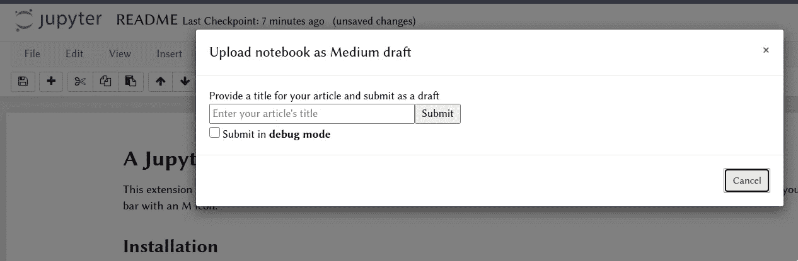
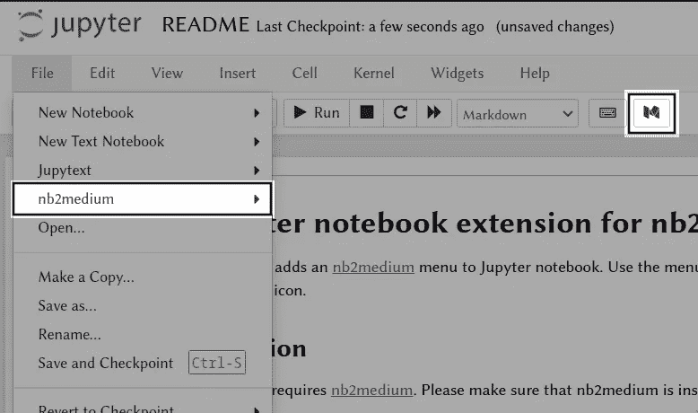
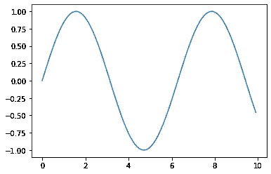
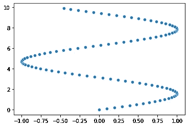

# 宣布 nb2 媒体

> 原文：<https://towardsdatascience.com/announcing-nb2medium-d123e2a8d52c?source=collection_archive---------36----------------------->

## 从 Jupyter 笔记本更快地发布

在撰写 Medium 博客时，数据科学家和开发人员经常发现自己在复制和粘贴代码块，将图像和表格导入 Medium 编辑器。这可能是一个相当乏味的过程，最重要的是它阻碍了真正的目标:写作。

在这篇文章中，我将展示`nb2medium`，这是我在过去几周的业余时间开发的一个包**，它可以让用户直接从 Jupyter 笔记本上传中等大小的草稿**。在这里，我将带您了解`nb2medium`附带的功能。



## TLDR

> nb2medium 代表了一个简单但足够的框架，可以将 Jupyter 笔记本上传到 medium。

`nb2medium`最突出的特点是:

*   使用`nbdev`编写，因此易于维护
*   Medium API 的简单 pythonic 实现
*   利用`nbconvert`和定制的预处理程序将笔记本转换成减价文件
*   支持上传带有简单单元格内标签的块作为 GitHub gists
*   支持**隐藏单元**源、单元输出或单元
*   附带 **Jupyter 扩展**和 **CLI** 以便于使用

[文档](https://luischaves.xyz/nb2medium/)、 [GitHub 回购](https://github.com/lucharo/nb2medium)、[示例笔记本](https://github.com/lucharo/nb2medium/tree/master/samples)

## 文章概述

我将讲述如何安装和设置`nb2medium`，然后我将介绍它的功能。

## **安装**

`pip install nb2medium`

默认情况下应该启用该扩展，但如果没有启用，请通过运行以下命令手动启用它:

```
jupyter notebook install nb2medium --py
jupyter notebook enable nb2medium --py
```

如果您想只为当前用户激活扩展，请在这些命令中添加`--user`。
如果您只想在当前虚拟环境中激活扩展，请在这些命令中添加`--sys-prefix`。

## 设置

您将需要一个媒体集成令牌，以便能够将您的文章上传到媒体。如果你想上传一些代码块作为 gists，你也需要一个 GitHub 令牌。这两个标记应该都可以作为环境变量使用，因此我们建议您将这两行代码添加到您的 shell 配置文件中(`~/.bashrc`或`~/.zshrc`是最常见的):

```
export MEDIUM_TOKEN=<your-medium-token>
export GITHUB_TOKEN=<your-github-token>
```

**从** [**您的媒体设置页面**](https://medium.com/me/settings) **获取媒体集成令牌通过跟随** [**GitHub 的文档**](https://docs.github.com/en/github/authenticating-to-github/creating-a-personal-access-token) 获取 GitHub 令牌

# 如何使用

您可以选择使用`nb2medium`作为命令行工具，直接从 python 或者使用 Jupyter 笔记本扩展按钮或菜单。

> *注意:* `nb2medium`上传 Jupyter 笔记本，笔记本在渲染前不会被执行。

## Jupyter 笔记本上的

您可以选择使用文件菜单下的`nb2medium`或顶部工具栏上的按钮:



## 从 CLI

从 shell (bash，zsh，sh):

```
nb2medium "My article" path/to/notebook.ipynb
```

使用`nb2medium --help`查看所有不同的选项

## 来自 python

# 图像、代码单元格和表格

## 形象

图像通常来自本地文件、在线网站或者是绘图的结果。`nb2medium`能处理这三种情况。如果图像对应于减价单元格中的本地文件(例如``)

本地图像被自动检测，然后被上传到媒体端点，并且到图像的路径被替换为新生成的图像 URL。如果图像是绘图的结果，例如:



图像的结果被上传到介质端点(不写入内存),相应的图被图的 URL 替换。

如果图片已经在网上，没有什么改变，因为媒体可以在加载文章时直接从互联网上访问它

## 将单元格编码为 GitHub gists

默认情况下，代码单元格在呈现时没有语法突出显示或任何花哨的东西，如:

```
import pandas as pd
pd.DataFrame({'a': [1,2,3], 'b': [2,4,6]})
```

但是，如果 GitHub 令牌可用，并且用户在单元格中包含以下标头:

```
# %gist gistname: pandas.py
import pandas as pd
pd.DataFrame({'a': [1,2,3], 'b': [2,4,6]})
```

代码块将作为私有 gist 上传到用户的 GitHub(默认情况下——可以更改为公共的),相应的代码单元将由 gist URL 替换。

> 您在本文中看到的 gists 就是使用该功能上传的

`#%gist`标签接受以下“参数”:

*   `gistname:`带有文件扩展名的脚本名称(对于正确的语法高亮显示至关重要，例如 script.py)
*   `description:`[可选]描述要点的字符串(不需要引号)
*   `public:`【可选-默认为假】gist 是否应该公开
*   `upload:`【可选-默认来源】是否将单元的来源、输出或两者作为 gists 上传(例如`upload: both`、`upload: source`)

## 隐藏单元格

隐藏单元格的源代码(即代码)、单元格的输出(计算代码的结果)或整个单元格通常很方便。为此，用户可以在相关单元格的开头放置以下标题。

*   要隐藏单元格的来源:

*   要隐藏单元格的输出:

*   要完全隐藏单元格(源和输出):

*注意:*所有标签(`%hide-*`和`%gist`)都不是按照组合的想法设计的，因此这种用法尚未经过测试。一般来说，不需要这种行为。

*注 2:* 在本文中很难显示隐藏标签的一些功能，因为我需要显示`nb2medium`语法。我只想说`#%hide`标签如你所料的那样工作。

## 桌子

Medium 对 HTML 和 Markdown 表都没有很好的支持。我首选的现有表选项还是 gists。如果一个单元格输出一个 pandas 数据帧，并且您使用`#%gist`选项并将`upload:`标志的值设置为`both`或`output`，`nb2medium`将检测您的表格，并将其作为 CSV 文件上传到您的 GitHub gist repo。

示例标题:`#%gist gistname: pandas.py upload: both`

示例输出(下面 2 个 gists):

## 证明文件

这些文档可以在 https://lucharo.github.io/nb2medium[的](https://lucharo.github.io/nb2medium)获得，并从`nbdev`笔记本上自动呈现，因此它们总是与包源代码保持同步。

## 贡献和结论

如果您发现了一个 bug 或者想到了一个增强功能，请随时提出问题或者提交请求。如果您想为像这样的开源项目做贡献，请特别关注标签/标记`help needed`的问题。**我打算积极维护这个包，让它成为 Jupyter 用户上传文章的主流方式。**

这篇文章确实是在 Jupyter 笔记本上写的，并作为草稿上传到 Medium。我根据自己的需要和偏好制作了这个包，我总是喜欢谨慎发布，这就是为什么我只提供了将笔记本作为草稿提交的选项，而不是直接发布。