# 📢宣布 PyCaret 的新时间序列模块

> 原文：<https://towardsdatascience.com/announcing-pycarets-new-time-series-module-b6e724d4636c?source=collection_archive---------2----------------------->

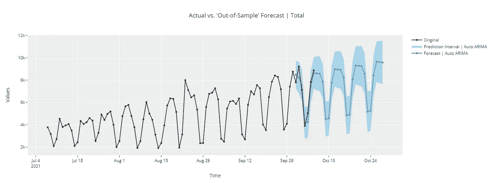

(图片由作者提供)PyCaret 的新时间序列模块

# 🚪**简介**

PyCaret 是一个用 Python 编写的开源、低代码的机器学习库，可以自动化机器学习工作流。这是一个端到端的机器学习和模型管理工具，可以成倍地加快实验周期，提高您的工作效率。

与其他开源机器学习库相比，PyCaret 是一个替代的低代码库，可以用来用几行代码替换数百行代码。这使得实验快速有效。PyCaret 本质上是几个机器学习库和框架的 Python 包装器，比如 scikit-learn、XGBoost、LightGBM、CatBoost、spaCy、Optuna、Hyperopt、Ray 等等。

PyCaret 的设计和简单性受到了公民数据科学家这一新兴角色的启发，这是 Gartner 首先使用的术语。公民数据科学家是超级用户，他们可以执行简单和中等复杂的分析任务，这些任务在以前需要更多的技术专业知识。

# ⏰ **PyCaret 时序模块**

PyCaret 新的时间序列模块现已推出测试版。保持 PyCaret 的简单性，它与现有的 API 一致，并附带了许多功能。统计测试、模型训练和选择(30 多种算法)、模型分析、自动化超参数调整、实验记录、云部署等等。所有这些只需要几行代码(就像 pycaret 的其他模块一样)。如果你想试一试，看看官方的[快速入门](https://nbviewer.org/github/pycaret/pycaret/blob/time_series_beta/time_series_101.ipynb)笔记本。

您可以使用 pip 来安装这个库。如果您在同一个环境中安装了 PyCaret，由于依赖冲突，您必须为`pycaret-ts-alpha`创建一个单独的环境。`pycaret-ts-alpha`将在下一个主要版本中与主要的 pycaret 包合并

```
pip install pycaret-ts-alpha
```

# ➡️工作流程示例

PyCaret 的时序模块中的工作流程真的很简单。它从`setup`函数开始，在这里您定义预测范围`fh`和数量`folds`。您也可以将`fold_strategy`定义为`expanding`或`sliding`。

设置完成后，著名的`compare_models`函数训练并评估了从 ARIMA 到 XGboost (TBATS、FBProphet、ETS 等等)的 30+算法。

`plot_model`功能可在训练前或训练后使用。在训练前使用时，它使用 plotly 接口收集了大量的时序 EDA 图。当与模型一起使用时，`plot_model`处理模型残差，并可用于访问模型拟合。

最后，`predict_model`用于生成预测。

# 📊加载数据

```
import pandas as pd
from pycaret.datasets import get_data
data = get_data('pycaret_downloads')
data['Date'] = pd.to_datetime(data['Date'])
data = data.groupby('Date').sum()
data = data.asfreq('D')
data.head()
```

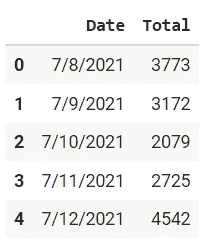

(图片由作者提供)

```
# plot the data
data.plot()
```

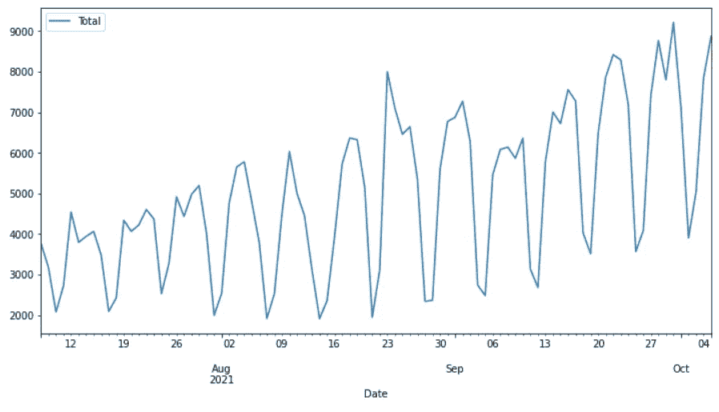

(图片由作者提供)pycaret_downloads 的时间序列图

这个时间序列是每天从 pip 下载 PyCaret 库的次数。

# ⚙️初始化设置

```
**# with functional API** from pycaret.time_series import *
setup(data, fh = 7, fold = 3, session_id = 123)**# with new object-oriented API** from pycaret.internal.pycaret_experiment import TimeSeriesExperiment
exp = TimeSeriesExperiment()
exp.setup(data, fh = 7, fold = 3, session_id = 123)
```

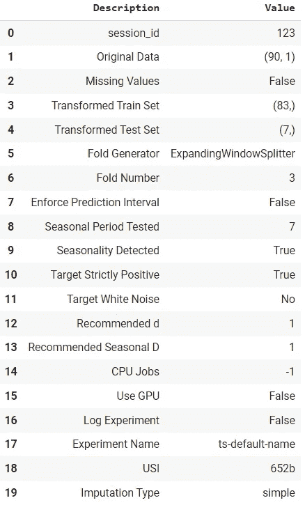

(图片由作者提供)设置功能的输出

# 📐统计测试

```
check_stats()
```

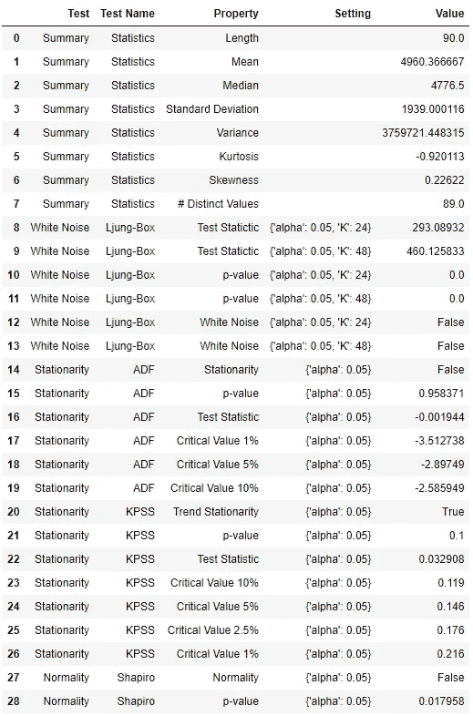

(图片由作者提供)check_stats 函数的输出

# 📈探索性数据分析

```
**# functional API**
plot_model(plot = 'ts')**# object-oriented API** exp.plot_model(plot = 'ts')
```

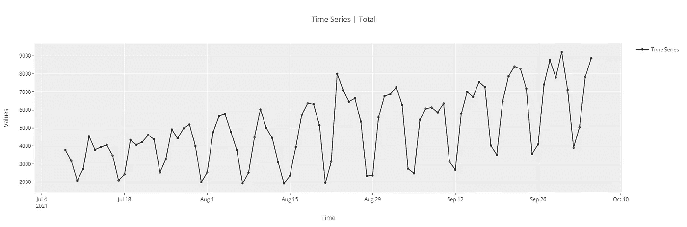

(图片由作者提供)

```
**# cross-validation plot** plot_model(plot = 'cv')
```

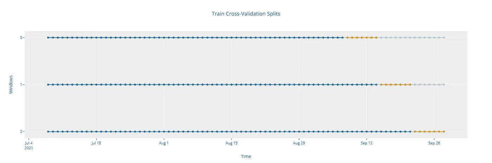

(图片由作者提供)

```
**# ACF plot** plot_model(plot = 'acf')
```

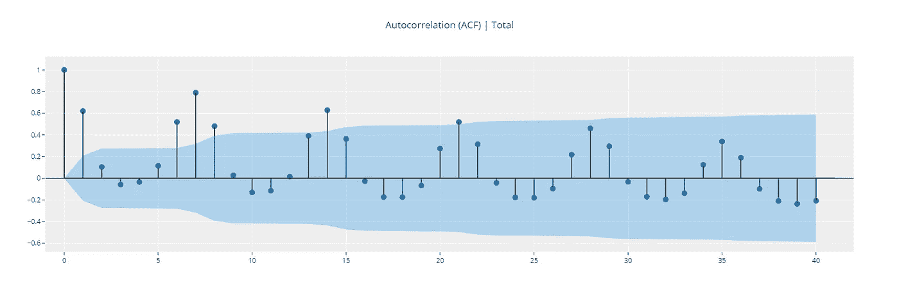

```
**# Diagnostics plot** plot_model(plot = 'diagnostics')
```


```
**# Decomposition plot**
plot_model(plot = 'decomp_stl')
```

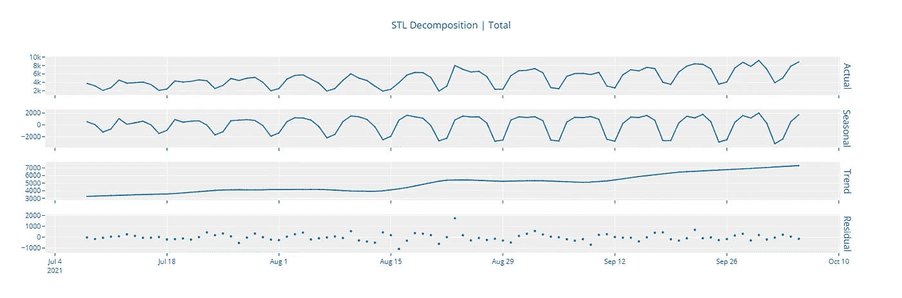

# ✈️模特培训和选拔

```
**# functional API** best = compare_models()**# object-oriented API** best = exp.compare_models()
```

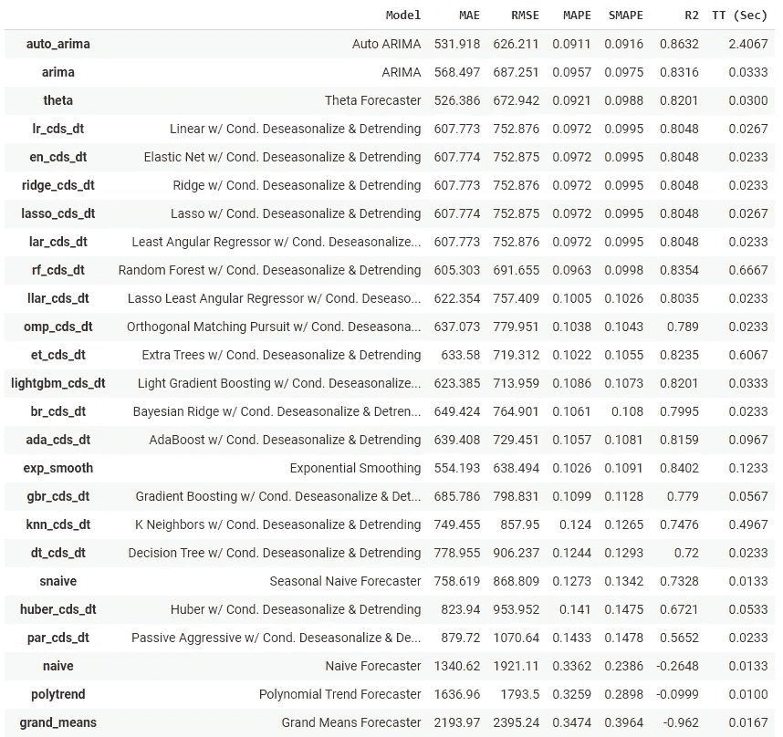

(图片由作者提供)compare_models 函数的输出

`create_model`在时序模块中，其工作方式与在其他模块中一样。

```
**# create fbprophet model** prophet = create_model('prophet')
print(prophet)
```


(图片由作者提供)create_model 函数的输出

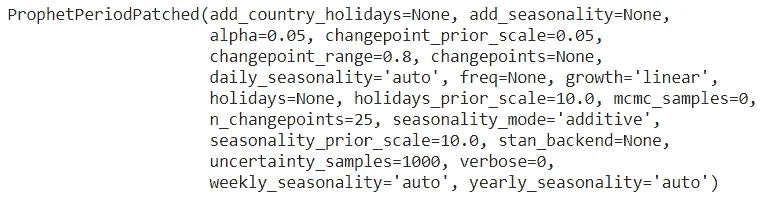

(作者提供的图片)打印功能的输出

`tune_model`也没什么不同。

```
tuned_prophet = tune_model(prophet)
print(tuned_prophet)
```

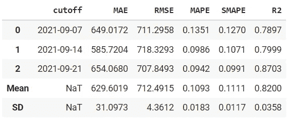

(图片由作者提供)tune_model 函数的输出

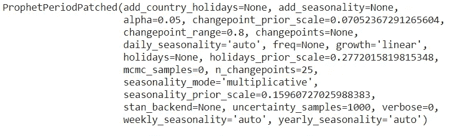

(作者提供的图片)打印功能的输出

```
plot_model(best, plot = 'forecast')
```

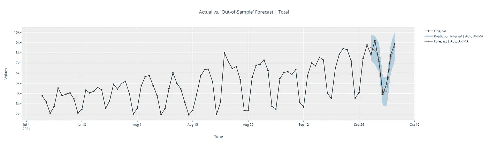

(图片由作者提供)

```
**# forecast in unknown future** plot_model(best, plot = 'forecast', data_kwargs = {'fh' : 30})
```

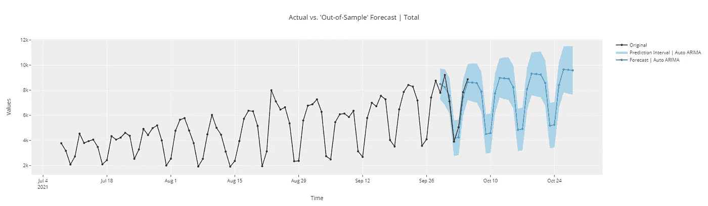

(图片由作者提供)

```
# in-sample plot
plot_model(best, plot = 'insample')
```

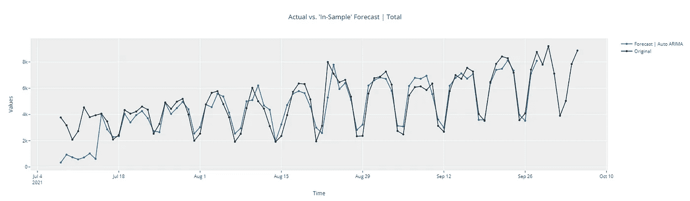

```
# residuals plot
plot_model(best, plot = 'residuals')
```

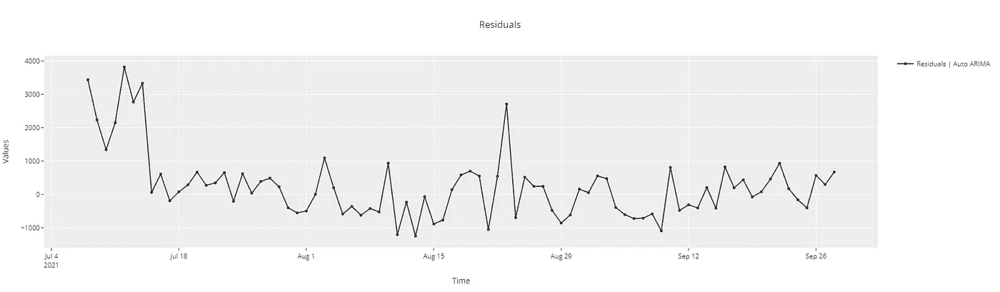

```
# diagnostics plot
plot_model(best, plot = 'diagnostics')
```

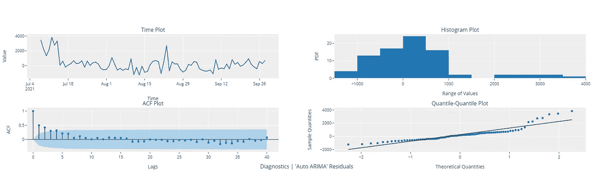

# 🚀部署

```
**# finalize model** final_best = finalize_model(best)**# generate predictions** predict_model(final_best, fh = 90)
```

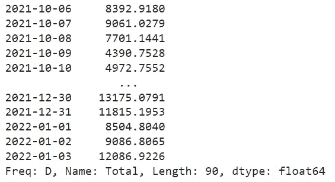

(图片由作者提供)

```
**# save the model** save_model(final_best, 'my_best_model')
```

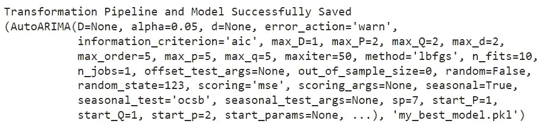

(图片由作者提供)

该模块仍处于测试阶段。我们每天都在增加新的功能，并且每周发布 pip。请确保创建一个单独的 python 环境，以避免与主 pycaret 发生依赖冲突。这个模块的最终版本将在下一个主要版本中与主要的 pycaret 合并。

📚[时间序列文档](https://pycaret.readthedocs.io/en/time_series/api/time_series.html)
❓ [时间序列常见问题](https://github.com/pycaret/pycaret/discussions/categories/faqs?discussions_q=category%3AFAQs+label%3Atime_series)
🚀[特性和路线图](https://github.com/pycaret/pycaret/issues/1648)

**开发者:**
[尼希尔·古普塔](https://www.linkedin.com/in/guptanick/)(主角)[安东尼·鲍姆](https://www.linkedin.com/in/ACoAAC6B1zoB5huoVojMy654afrzR4tUEWKlbL4) [萨提亚·帕特奈克](https://www.linkedin.com/in/ACoAACLyZ04Bd3JjLtD7TdtO9Hh3eYcKoYt8JRU) [米盖尔·特雷霍·马鲁夫](https://www.linkedin.com/in/ACoAACuHB6gBQDxxiipWjh6pDMbgp71l1MXS4NI) [克里希南·S·G](https://www.linkedin.com/in/ACoAAC3uy_oBo7BhZYL9uTUZ2fcOLAmyPjZJy4w)

使用 Python 中的这个轻量级工作流自动化库，您可以实现的目标是无限的。如果你觉得这很有用，请不要忘记给我们 GitHub 库上的⭐️。

想了解更多关于 PyCaret 的信息，请在 LinkedIn 和 Youtube 上关注我们。

加入我们的休闲频道。邀请链接[此处](https://join.slack.com/t/pycaret/shared_invite/zt-p7aaexnl-EqdTfZ9U~mF0CwNcltffHg)。

# 重要链接

⭐ [教程](https://github.com/pycaret/pycaret/tree/master/tutorials)py caret 新手？查看我们的官方笔记本！
📋[社区创建的示例笔记本](https://github.com/pycaret/pycaret/tree/master/examples)。
📙[博客](https://github.com/pycaret/pycaret/tree/master/resources)投稿人的教程和文章。
📚[文档](https://pycaret.readthedocs.io/en/latest/index.html)py caret 的详细 API 文档
📺[视频教程](https://www.youtube.com/channel/UCxA1YTYJ9BEeo50lxyI_B3g)我们的视频教程来自各种赛事。
📢[讨论](https://github.com/pycaret/pycaret/discussions)有问题吗？与社区和贡献者互动。
🛠️ [变更日志](https://github.com/pycaret/pycaret/blob/master/CHANGELOG.md)变更和版本历史。
🌳[路线图](https://github.com/pycaret/pycaret/issues/1756) PyCaret 的软件和社区开发计划。

# 作者:

我写的是 PyCaret 及其在现实世界中的用例，如果你想自动得到通知，你可以在 [Medium](https://medium.com/@moez-62905) 、 [LinkedIn](https://www.linkedin.com/in/profile-moez/) 和 [Twitter](https://twitter.com/moezpycaretorg1) 上关注我。