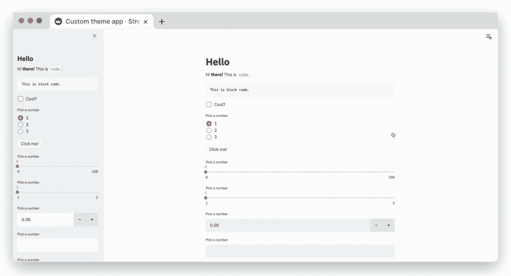
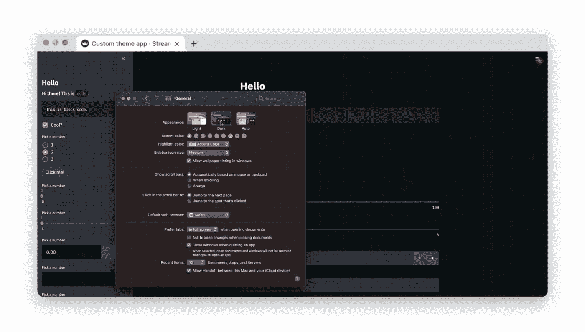
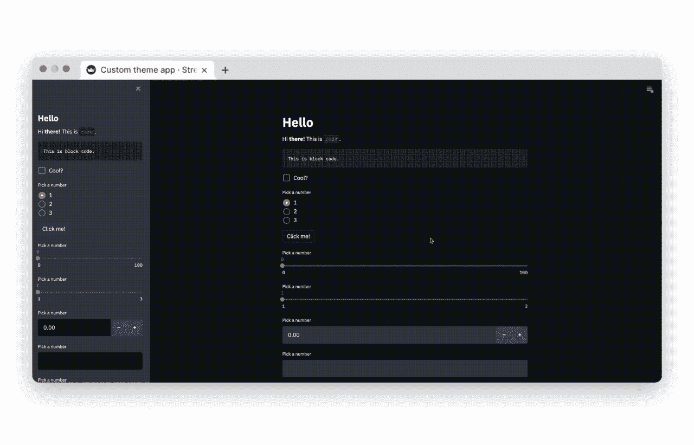
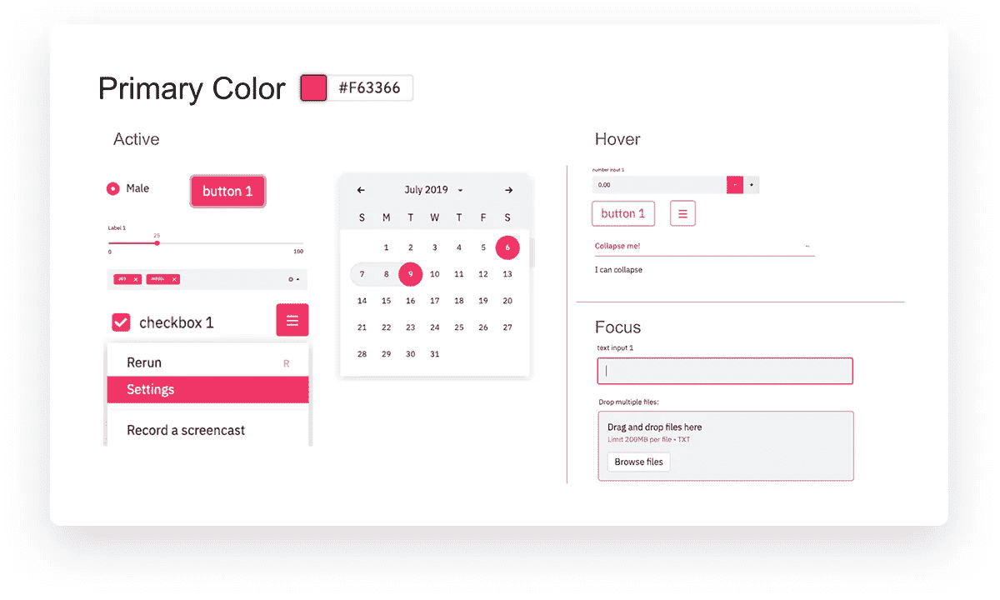
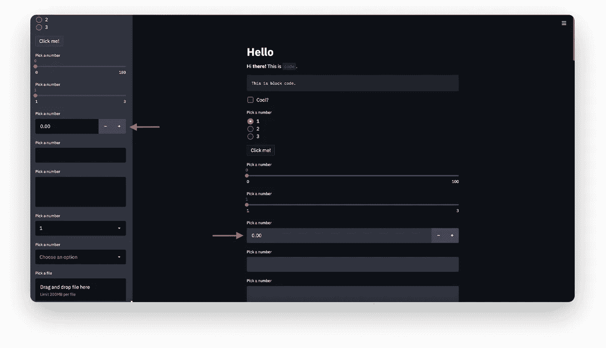
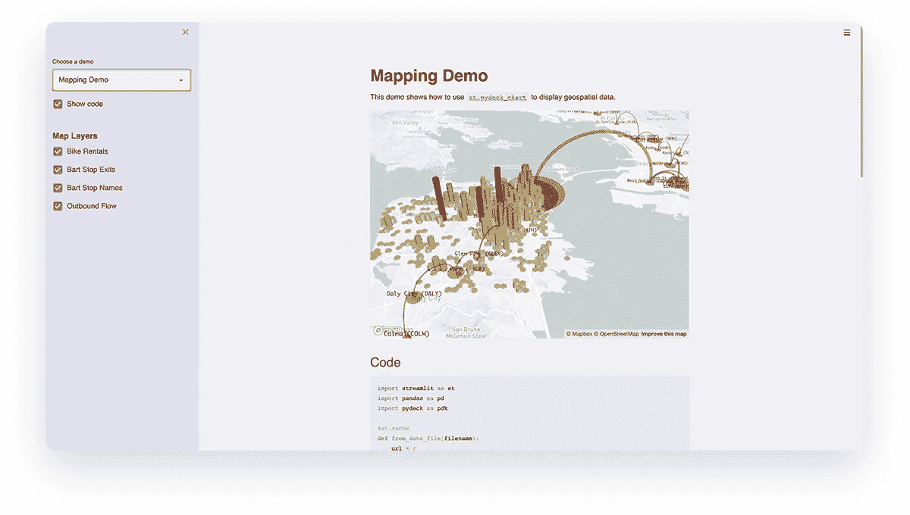
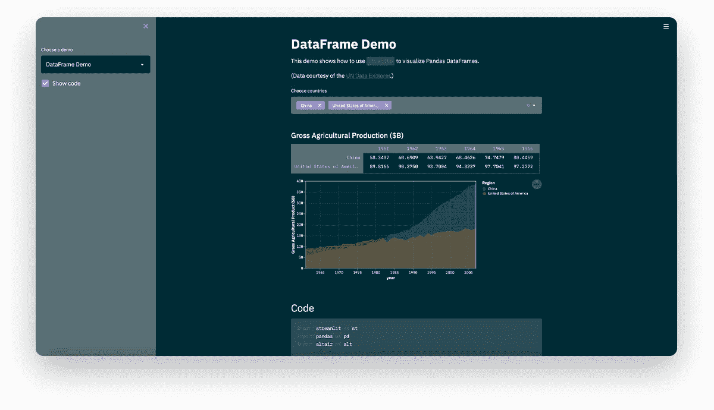

# 宣布 Streamlit 应用的主题化！🎨

> 原文：<https://towardsdatascience.com/announcing-theming-for-streamlit-apps-834ff831ac17?source=collection_archive---------31----------------------->

## 尝试新的黑暗模式和自定义主题功能



我们喜欢认为 Streamlit 应用程序开箱后就很漂亮(希望你也是！)，但直到今天，改变外观和感觉来反映你的个人风格或公司的视觉品牌还不容易。Streamlit Theming 现在允许您轻松地更改应用程序中的配色方案和字体，而无需接触任何 HTML 或 CSS。

此外，为了便于访问和用户友好，我们还让应用程序查看者能够在亮暗主题之间切换。

[如果你想直接进入，看看这个示例应用](https://share.streamlit.io/streamlit/theming-showcase-blue/main)！

# 引入黑暗模式！

在我们进入自定义主题之前，我们先来谈谈黑暗模式。

根据大众需求，我们现在为应用程序查看者提供定制他们想要如何体验您的应用程序的能力。这对于在黑暗环境中使用应用程序的人，或者具有辅助功能需求、希望覆盖应用程序自定义主题的人非常有用。

要在各种主题之间切换，请进入右上角的菜单并选择设置。你会看到一个重新设计的设置对话框，让应用程序用户在不同的主题选项之间进行选择:

*   **灯光模式**:这是你已经知道并喜爱的 Streamlit 主题
*   黑暗模式:这是 Streamlit 新的黑暗主题。你也会喜欢这个的！
*   **使用系统设置** : Streamlit 会自动拾取你的操作系统主题(亮或暗)，并随你的 OS 改变颜色(注意:可能不适用于某些浏览器和 Linux 发行版)。
*   **自定义主题**(仅在 app 作者提供时可见):使用 app 作者提供的主题。如果提供，这是默认设置。否则，“使用系统设置”是默认设置。



# 创建自定义主题

主题通过 [Streamlit 的配置系统](https://docs.streamlit.io/en/stable/streamlit_configuration.html#set-configuration-options)设置。你可以直接在那里设置主题，或者你可以使用我们新奇的主题编辑器界面来构建一个主题，然后把它复制到你的配置中。

# 使用主题编辑器创建主题

应用程序开发人员只需进入菜单→设置→编辑活动主题，即可创建自定义主题。



**注**:主题编辑器菜单仅在`local`开发中可用。如果您已经使用 Streamlit 共享部署了您的应用,“编辑活动主题”按钮将不再显示在“设置”菜单中。

# 直接使用`config.toml`创建主题

自定义主题也可以在配置文件中定义:`./.streamlit/config.toml`

在`[theme]`部分，可以定义颜色变量来创建自定义主题

```
[theme]

# Primary accent for interactive elements
primaryColor = '#7792E3'

# Background color for the main content area
backgroundColor = '#273346'

# Background color for sidebar and most interactive widgets
secondaryBackgroundColor = '#B9F1C0'

# Color used for almost all text
textColor = '#FFFFFF'

# Font family for all text in the app, except code blocks
# Accepted values (serif | sans serif | monospace) 
# Default: "sans serif"
font = "sans serif"
```

(**注**:一次只能设置一个自定义主题)

# 来自配置文件的实时更新

您知道当您更改其源代码时，您的 Streamlit 应用程序是如何实时更新的吗？我们现在也这样做，当你更新应用的配置文件！这样，直接在配置文件中编辑主题将使你的应用程序立即显示新的主题。

# 每种颜色设置的作用

Streamlit 的主题系统遵循一种将颜色和字体应用于应用程序的全球方法。颜色样式有语义名称和一种简单的颜色规范方法。

*   **原色**:交互元素的强调色，如`st.radio`，按钮边框等。默认情况下，这是粉红色的。
*   **背景颜色**:这是你的应用程序主体的背景颜色。
*   **文字颜色:**漂亮不言自明！这是应用程序的文本颜色。
*   **次要背景色:**用作`st.sidebar`和几个小工具的背景。



背景色和第二背景色在某种程度上是“互补的”,因为它们用于放置在基本元素“上面”的元素，以促进一致性和可及的对比度。这意味着`st.number_input`小部件在主体中定义时将使用`Secondary background color`作为背景色，但在侧边栏中定义时使用`Background color`。下图说明了这一点:



# 主题和自定义组件

如果你是一个**组件作者**，我们可以让你很容易地阅读你的 JS 和 CSS 代码中的主题颜色。要使用这项新功能，请安装或更新最新版本的`streamlit-component-lib`。

```
npm install streamlit-component-lib
```

一旦这个包被更新，一个组件的背景和文本颜色将自动改变以匹配活动主题的颜色。附加的主题属性以两种等效的方式向组件公开:主题对象或主题样式。

# 作为一个反应道具

通过`theme`道具传递给组件的对象具有以下形状:

```
{
    "primaryColor": "someColor1"
    "backgroundColor": "someColor3",
    "secondaryBackgroundColor": "someColor4",
    "textColor": "someColor5",
    "font": "someFont",
}
```

# 作为 CSS 变量

```
--primary-color
--background-color
--secondary-background-color
--text-color
--font
```

如果你不熟悉 [CSS 变量](https://developer.mozilla.org/en-US/docs/Web/CSS/Using_CSS_custom_properties)，TLDR 版本是你可以这样使用它们:

```
.mySelector {
  color: var(--text-color);
}
```

向组件公开主题属性的两种方法包含相同的信息，因此使用哪一种取决于个人偏好。让定制组件与主题一起工作的例子可以在[这里](https://github.com/streamlit/component-template/blob/bc6e70905beb8f9a178fc811603cc65b637bc38d/template/my_component/frontend/src/MyComponent.tsx#L33)找到。

# 找到你最喜欢的新主题

这是我们的贴图演示，有一个受“[宁静光](https://onecrayon.com/products/quiet-light/)”启发的主题:



```
[theme]

primaryColor="#6eb52f"
backgroundColor="#f0f0f5"
secondaryBackgroundColor="#e0e0ef"
textColor="#262730"
font="sans serif"
```

以下是一个受“[日晒](https://en.wikipedia.org/wiki/Solarized_(color_scheme)#Gallery)”启发的主题示例:



```
[theme]

primaryColor="#d33682"
backgroundColor="#002b36"
secondaryBackgroundColor="#586e75"
textColor="#fafafa"
font="sans serif"
```

# 尝试主题化，让我们知道你的想法！

要尝试主题化，只需像往常一样升级到 Streamlit 的最新版本:

```
$ pip install streamlit --upgrade
```

我们迫不及待地想看到这个社区将要构建的又酷又神奇的主题。如果你创建了一个很酷的自定义主题，我们很乐意看到它，所以当你在 [Twitter](https://twitter.com/streamlit) 、 [LinkedIn](https://www.linkedin.com/company/streamlit/) 或我们的[论坛](https://discuss.streamlit.io)上分享时，请标记`@streamlit`。

# 资源

*   [文档](https://docs.streamlit.io/en/stable/main_concepts.html#themes)
*   [Github](https://github.com/streamlit/)
*   [变更日志](https://docs.streamlit.io/en/0.79.0/changelog.html)
*   [论坛](https://discuss.streamlit.io/)
*   [样本 app](https://share.streamlit.io/streamlit/theming-showcase-blue/main)