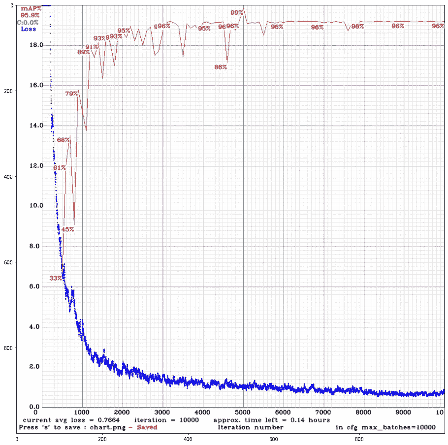
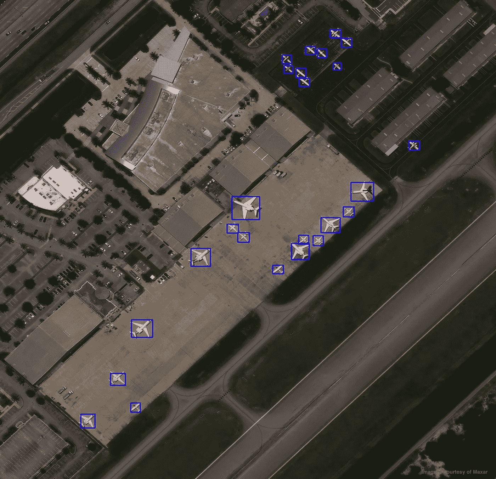

# 宣布 YOLTv4:改进的卫星图像目标探测

> 原文：<https://towardsdatascience.com/announcing-yoltv4-improved-satellite-imagery-object-detection-f5091e913fad?source=collection_archive---------10----------------------->


## 将高级目标探测扩展到任意大的卫星图像

*前言:虽然* [*CosmiQ 作品*](http://7sux*GCLNtH%25N3mF) *(及其相关博客:*[*The DownLinQ*](https://medium.com/the-downlinq)*)不幸被关闭，但在地理空间分析领域仍有许多工作要做。因此，这篇博客详细描述了 IQT 在业余时间独立完成的*<https://www.iqt.org>**工作。**

*在之前的一些博客[如 [1](https://medium.com/the-downlinq/you-only-look-twice-multi-scale-object-detection-in-satellite-imagery-with-convolutional-neural-38dad1cf7571) 、 [2](https://medium.com/the-downlinq/car-localization-and-counting-with-overhead-imagery-an-interactive-exploration-9d5a029a596b) 、 [3](https://medium.com/the-downlinq/simrdwn-adapting-multiple-object-detection-frameworks-for-satellite-imagery-applications-991dbf3d022b) ]和学术论文[如 [4](https://arxiv.org/abs/1805.09512) 、 [5](https://arxiv.org/abs/1809.09978) 、 [6](https://arxiv.org/abs/1812.04098) ]中，我们已经展示了采用 [YOLO](https://pjreddie.com/darknet/yolo/) 探测卫星图像中的物体的惊人功效。回想一下，YOLO 是一个领先的深度学习对象检测框架，旨在检测图像中的对象。YOLO 最大限度地利用了几千像素大小的图像，这对于处理超过 1 亿像素的大规模卫星图像来说太小了。因此，我们构建了 [YOLT](https://github.com/avanetten/yolt) (并用 [SIMRDWN](https://github.com/avanetten/simrdwn) 扩展了 YOLT)来优化这个任意大尺寸卫星图像的目标检测框架。*

*我们现在很高兴地宣布，一个更快、性能更好的改进版本 [YOLTv4](http://www.apple.com) 已经发布。代码在 github.com/avanetten/yoltv4 的[开源。在下面的小节中，我们将详细介绍这个新的存储库，并提供示例结果。](https://github.com/avanetten/yoltv4)*

***1。简介***

*YOLTv4 旨在快速检测航空或卫星图像中任意大图像的对象，这些图像远远超过深度学习对象检测框架通常摄取的约 600×600 像素大小。这个库建立在 AlexeyAB 的 [YOLOv4](https://github.com/AlexeyAB/darknet) 实现的令人印象深刻的工作之上，与 YOLOv3(在 SIMRDWN 中实现)相比，它提高了速度和检测性能。我们用 YOLOv4 代替 YOLOv5，因为 YOLOv4 得到了 YOLO 原创者的认可，而 YOLOv5 没有；此外，YOLOv4 似乎具有优越的性能。*

*因此，YOLTv4 将令人印象深刻的 YOLOv4 主干与 SIMRDWN 的预处理和后处理脚本结合起来，创建了一个改进的、轻量级的替代 SIMRDWN。回想一下，SIMRDWN 允许用户从众多主干中进行选择(例如，YOLO、固态硬盘、fast-RCNN 等。).虽然这种灵活性非常有用，但它确实扩大了代码库；此外，多项研究[ [5](https://arxiv.org/abs/1809.09978) ， [6](https://arxiv.org/abs/1812.04098) ]表明，YOLO 骨干网在卫星图像目标检测方面优于其他方法。因此，在 YOLTv4 中，我们选择构建一个更简单的代码库，并且只关注 YOLOv4 的主干。*

*下面，我们提供了如何使用开源[稀有面](https://registry.opendata.aws/rareplanes/)数据集的例子。*

## ***2。运行 YOLTv4***

*在本节中，我们将演示如何使用稀疏飞机数据集来训练和测试 YOLTv4，以定位飞机。*

***2.1。安装***

*YOLTv4 构建为在支持 GPU 的机器上的 docker 容器中执行。docker 命令使用 CUDA 9.2、python 3.6 和 conda 创建 Ubuntu 16.04 映像。*

1.  *克隆这个库(例如克隆到 */yoltv4/* )。*
2.  *将模型重量下载到 *yoltv4/darknet/weights(如见:*[https://github . com/AlexeyAB/dark net/releases/download/dark net _ yolo _ v3 _ optimal/yolov 4 . conv . 137](https://github.com/AlexeyAB/darknet/releases/download/darknet_yolo_v3_optimal/yolov4.conv.137))。*
3.  *安装 [nvidia-docker](https://github.com/NVIDIA/nvidia-docker) 。*
4.  *构建 docker 文件。`nvidia-docker build -t yoltv4_image /yoltv4/docker`*
5.  *旋转对接容器(选项见[对接文件](https://docs.docker.com/engine/reference/commandline/run/))。`nvidia-docker run -it -v /yoltv4:/yoltv4 -ti — ipc=host — name yoltv4_gpu0 yoltv4_image`*
6.  *编译 Darknet C 程序。先在*/yoltv 4/darknet/Makefile*中设置 GPU=1 CUDNN=1，CUDNN_HALF=1，OPENCV=1，然后:
    `cd /yoltv4/darknet
    make`*

***2.2。列车***

***A .准备数据***

1.  *制作 YOLO 图像和标签(详见*yoltv 4/notebooks/prep _ data . ipynb*)。*
2.  *创建一个列出训练图像的 txt 文件。*
3.  *创建文件 obj.names 文件，每个所需的对象名称各占一行。*
4.  *在包含必要文件的目录 *yoltv4/darknet/data* 中创建文件 obj.data。例如*/yoltv 4/darknet/data/rare planes _ train . data:* classes = 30
    train =/local _ data/cosm IQ/wdata/rare planes/train/txt
    valid =/local _ data/cosm IQ/wdata/rare planes/train/txt/valid . txt
    names =/yoltv 4/darknet/data/rare planes . name
    backup = backup*
5.  *准备配置文件。
    参见此处的说明，或者调整*/yoltv 4/darknet/CFG/yoltv 4 _ rare planes . CFG*。*

***B .执行培训***

1.  *执行。
    `cd /yoltv4/darknet
    time ./darknet detector train data/rareplanes_train.data cfg/yoltv4_rareplanes.cfg weights/yolov4.conv.137 -dont_show -mjpeg_port 8090 -map`*
2.  *审查进度(见下图 1):*

**

*图一。YOLTv4 训练进度(保存为*/yolt v4/darknet/chart _ yolt v4 _ rare planes . png*)*

***2.3。测试***

***A .准备数据***

1.  *制作切片图像(详见*yoltv 4/notebooks/prep _ data . ipynb*)。*
2.  *创建一个列出训练图像的 txt 文件。*
3.  *在包含必要文件的目录 *yoltv4/darknet/data* 中创建文件 obj.data。例如*/yoltv 4/darknet/data/rare planes _ test . data:*
    classes = 30
    train =
    valid =/local _ data/cosm IQ/wdata/rare planes/test/txt/test . txt
    names =/yoltv 4/darknet/data/rare planes . name
    backup = backup/*

***B .执行测试***

1.  *执行(在特斯拉 P100 上以每秒 80 帧以上的速度进行):
    `cd /yoltv4/darknet`*
2.  *`time ./darknet detector valid data/rareplanes_test.data cfg/yoltv4_rareplanes.cfg backup/ yoltv4_rareplanes_best.weights`*
3.  *后处理检测，将图像拼接在一起，并制作绘图:*

```
*time python /yoltv4/yoltv4/post_process.py \
 — pred_dir=/yoltv4/darknet/results/rareplanes_preds_v0/orig_txt/ \
 — raw_im_dir=/local_data/cosmiq/wdata/rareplanes/test/images/ \
 — sliced_im_dir= /local_data/cosmiq/wdata/rareplanes/test/yoltv4/images_slice/ \
 — out_dir= /yoltv4/darknet/results/rareplanes_preds_v0 \
 — detection_thresh=0.25 \
 — slice_size=416 \
 — n_plots=8*
```

## ***3。输出***

*输出将类似于下图。*

******

*图二。从开源的[稀有飞机](https://registry.opendata.aws/rareplanes/)数据集中检测到飞机。*

## ***4。结论***

*YOLTv4 是高性能和相当迅速的。在单个特斯拉 P100 GPU 上，即使在最高分辨率的 30 厘米卫星图像上，推理也能以每秒约 2 平方公里的速度进行。以这种速度，一个简单的 4-gpu 集群可以近乎实时地处理整个 [WorldView-3](http://www.apple.com) 收集。所以，请随意旋转[代码](https://github.com/CosmiQ/yoltv4)来寻找[汽车](https://medium.com/the-downlinq/car-localization-and-counting-with-overhead-imagery-an-interactive-exploration-9d5a029a596b)、[船只](https://medium.com/the-downlinq/yolt-arxiv-paper-and-code-release-8b30d40d095b)、[基础设施项目](https://medium.com/the-downlinq/you-only-look-twice-multi-scale-object-detection-in-satellite-imagery-with-convolutional-neural-34f72f659588)、[飞机](https://medium.com/the-downlinq/simrdwn-adapting-multiple-object-detection-frameworks-for-satellite-imagery-applications-991dbf3d022b)、[建筑](https://medium.com/the-downlinq/building-extraction-with-yolt2-and-spacenet-data-a926f9ffac4f)，或者任何你感兴趣的东西。*