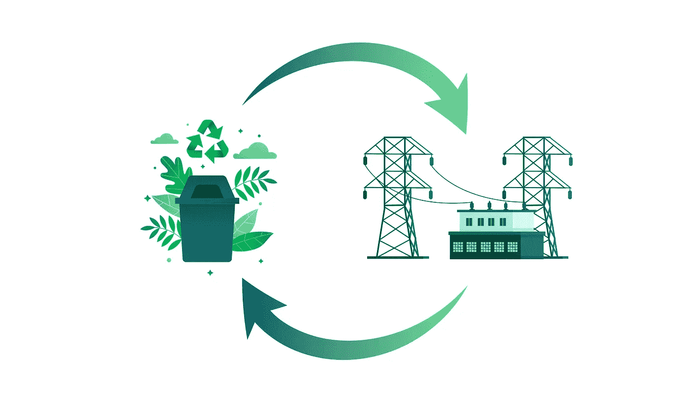

# 新加坡节约的再生能源——一个数据分析项目

> 原文：<https://towardsdatascience.com/annual-recycled-energy-saved-in-singapore-2d6bad49bfb2?source=collection_archive---------14----------------------->

## 了解新加坡每年通过回收塑料、纸张、玻璃、黑色金属和有色金属节约了多少能源。

图片由作者|元素由[宏向量](https://www.freepik.com/macrovector)、 [Freepik](https://www.freepik.com/freepik)

# 介绍

由于政府担心不断增加的垃圾处理量，英格波尔成为了一个零垃圾国家的新里程碑。按照目前的速度，到 2035 年，三宝垃圾填埋场将会耗尽空间，这对新加坡人来说是一个令人担忧的情况。更糟糕的是，新加坡用于建设新焚烧厂或垃圾填埋场的土地有限。政府希望通过分享联合回收努力每年节省的总能量来激励公民。

<https://www.nea.gov.sg/our-services/waste-management>  

> 我们将使用**回收统计数据**来计算从 2003 年到 2020 年每年节约的能源，基于五种废物类型:塑料、纸张、玻璃、黑色金属和有色金属。

# 密码

## 加载数据集

我们将使用 [Plotly](https://plotly.com/) 进行可视化，使用 [Pandas](https://pandas.pydata.org/) 进行数据分析。我们的数据集分为两个时间线，从 2003 年到 2017 年和 2018 年到 2020 年。2020 年的数据是通过 NEA 网站手动添加的。您可以在 [Greentumble](https://greentumble.com/how-does-recycling-save-energy/) 上找到每种材料类型的额外能量数据。

## 2018 年至 2020 年的废物数据

经过初步探索，我们发现两个数据集中的列名不同，因此我们将对 2018 年至 2020 年的数据集进行重命名，并将千吨值转换为公吨值。

让我们将回收率添加到我们的数据框架中，因为我们将使用它进行进一步的分析。

## 节能数据集

我们可以看到*节能数据集*的表格格式不正确。让我们把它转换成可读的格式。

1.  移项
2.  删除前两列和第一行
3.  重置索引
4.  重命名列

我们可以看到，我们有三栏，*材料*、*节能*和*原油节能*。

## 2003 年至 2017 年的废物数据

我们将限制我们的列，以匹配 2018 年至 2020 年数据集的列，以便它们可以很容易地连接。

## 数据分析

我们将堆叠两个数据集，因为它们有相似的列。最终数据集包含 2003 年至 2020 年的样本。

让我们看一下每年产生的废物总量和回收的废物总量。

到 2017 年，垃圾收集量迅速增加，此后，由于政府干预，我们可以看到垃圾收集量的下降。由于新冠肺炎疫情的影响，去年 NEA 的垃圾收集量急剧下降。

通过分析数据集中的分类废物类型，我们可以清楚地看到同一类别有不同的名称。我们来做一些文字处理，尽量做出和*cleaned _ energy _ saved . CSV*中提到的素材类似的类别。

通过使用简单的字符串替换，我们已经规范化了我们的类别，这样我们就可以在 *waste_type* 上合并我们的数据。

为了检查我们是否成功地规范化了类别，让我们合并关于 *waste_type* 和 *material 的两个数据集。*

我们需要通过删除“Kwh”和“kWh”将节省的能源从字符串转换为整数。

正如我们所看到的，节省的能量被成功地转换成一个整数，这样我们就可以用它来计算每年节省的总能量。

我们需要通过将`total_waste_recycled_tonne`和`energy_saved`相乘来创建新的特征`total_energy_saved`。

## 形象化

让我们计算每种废物的平均回收量。黑色金属和有色金属的总体回收率较高，塑料的回收率最低。

我们必须使用箱线图来检查最终数据中的异常值和模式。我们发现在 2018 年有一个异常，为了找出它，我们必须检查我们的数据集。

经过查看 2018 年回收的*废物总量，我们发现**黑色金属**产生的废物总量为 126900 吨，而*回收的废物总量*为 126000 吨。正如我们所知，黑色金属的平均回收率为 90%以上，但它显示的是 10%，这很奇怪，所以我回到了网站上的原始数据，并发现了错误。我们可以在 [PDF](https://www.nea.gov.sg/docs/default-source/our-services/waste-management/waste-recycling-statistics-2016-to-2019.pdf) 中看到，整个零都不见了。*

让我们更新该值并再次检查盒图，正如我们所看到的，它现在看起来很完美。这个故事的寓意是，总是回去检查数据是否有错误。

总节能量*的箱线图*到处都是，因为一些材料每公吨产生更高的能量千瓦时。

我们更多地与数据互动，并在多级散点图中寻找模式。

正如我们所见，由于政府采取措施控制废物的产生，在过去几年中，从纸张和塑料中节省的总能量已经显著减少。

## 每年节约的能源

现在是时候计算从 2003 年到 2020 年每年节省的能源了，基于五种废物类型，塑料，纸张，玻璃，黑色金属和有色金属。

*   每年分组依据
*   总结和提取节省的总能量
*   将其转换成熊猫数据帧
*   将`total_energy_saved`从浮点数转换为整数

**我们现在将通过**使年度节能量可读

*   将 kWh 转换为 GWh
*   四舍五入到小数点后两位。
*   添加 GWh 后缀
*   显示过去五年的数据

# 最后的想法

我们已经清理了数据，并确保它可以与其他数据集合并。我们还学习了如何检测数据集中的异常并创建新功能。这个项目很简单，但是它教会了我们很多关于数据清理和数据可视化的东西。由于 Covid 19，垃圾收集量已经停止，因此 2020 年节省的回收能源相对较少。政府的举措也影响了整体垃圾产量，因为人们正在从塑料转向更环保的材料。与其他废物类型相比，纸张和有色金属材料产生的能量最高，我们看到这两种材料的能量都在减少。

> 这篇文章是初学者友好的，详细解释了数据清理和可视化。我还在下面分享了我的项目代码，这样你就可以克隆并开始与项目文件交互。

# 代码可从以下网址获得:

## 深度笔记

<https://deepnote.com/project/Singapore-Recycled-Energy-Xh_wbptwTn2l-I1GQ-O1Vw/%2FAnnual-Recycled-Energy-Saved-in-Singapore%2FREADME.md>  

## 开源代码库

<https://github.com/kingabzpro/Annual-Recycled-Energy-Saved-in-Singapore>  

**卡格尔**

<https://www.kaggle.com/kingabzpro/singapore-recycling-and-waste-management>  

# 学习资源

**DataCamp 课程** : [使用 Python 的数据分析师](https://www.datacamp.com/tracks/data-analyst-with-python)

<https://www.goodreads.com/book/show/23594979-data-analytics-made-accessible>  <https://github.com/WillKoehrsen/Data-Analysis/tree/master/medium> 