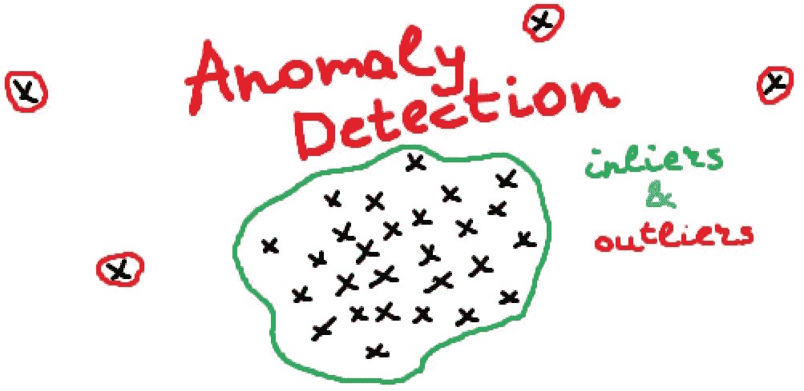
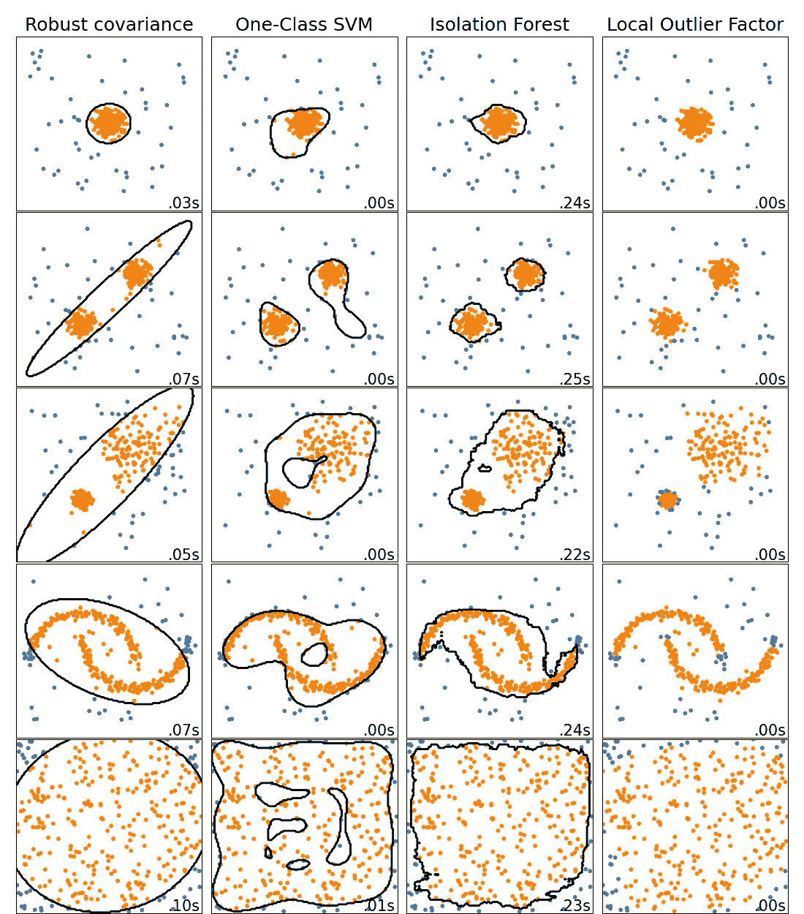
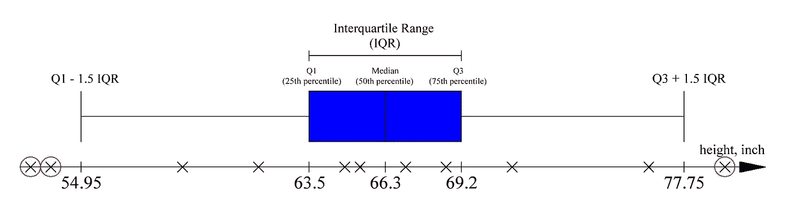
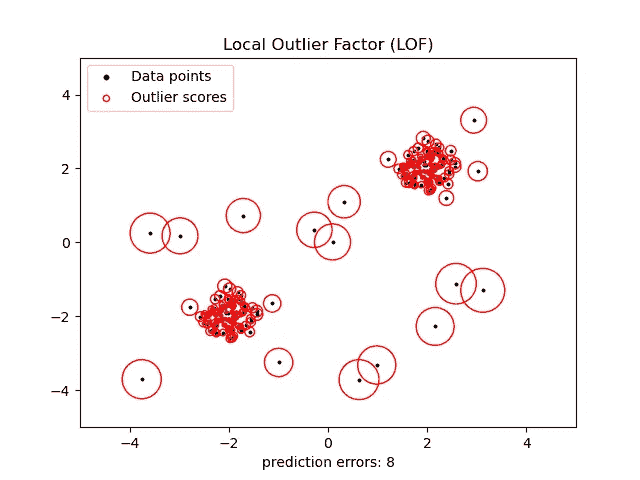
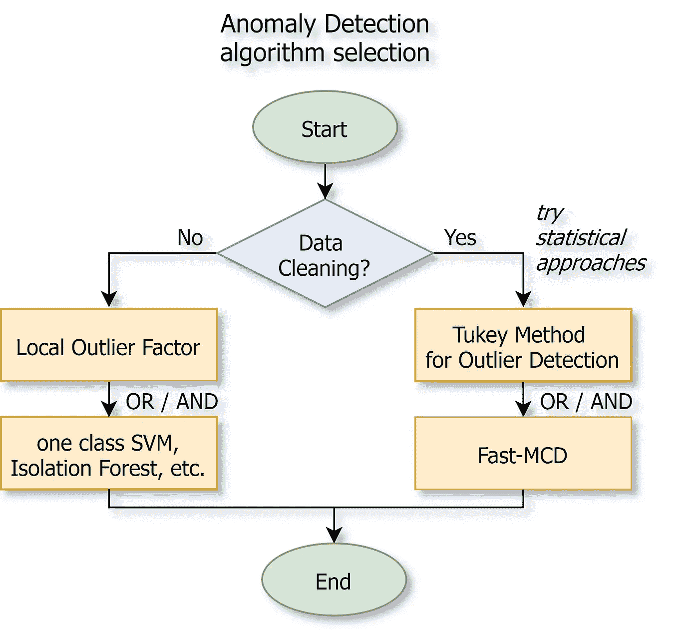

# 异常检测备忘单

> 原文：<https://towardsdatascience.com/anomaly-detection-cheat-sheet-5502fc4f6bea?source=collection_archive---------24----------------------->

## 在 6 分钟内你应该知道的异常检测

异常检测。作者图片

在本文中，您将找到一份完整的异常检测备忘单。在六分钟内，你将能够知道它是什么，并刷新主要算法的记忆。

异常检测(也称为**异常值检测**)是检测异常实例的任务，这些异常实例与正常情况非常不同。这些实例被称为*异常*(或*异常值)*，而正常实例被称为*内联者*。

Scikit Learn 的异常检测算法。[图像来源](https://scikit-learn.org/stable/auto_examples/miscellaneous/plot_anomaly_comparison.html)

异常检测在各种各样的应用中是有用的，最重要的是:

*   *数据清理* —在训练另一个模型之前从数据集中移除离群值
*   直接*异常检测* *任务:*欺诈检测，检测制造中的缺陷产品等。

您可能已经注意到，使用异常检测算法也可以解决*不平衡分类*的一些问题。但是你需要理解其中的区别——这是两种完全不同的方法。

在**分类的情况下，我们希望了解什么样的异常(正面例子)看起来像**，以便在未来检测类似的实例。在**异常检测的情况下，未来的异常可能看起来与我们之前见过的任何例子都完全不同**。因为我们的数据集是未标记的，我们只能怀疑正常的数据点看起来如何，并将任何其他实例视为异常。

例如，垃圾邮件检测任务可以被认为是分类任务(当我们有足够的垃圾邮件来了解垃圾邮件应该是什么样子时)，也可以被认为是异常检测任务(当我们必须了解正常电子邮件看起来是什么样子并将任何其他电子邮件视为垃圾邮件时)。

一个密切相关的任务是**新颖性检测，**但在这种情况下，算法被假定为在干净的数据集上训练(没有离群值)。当需要识别一个新实例是否是离群点时，它被广泛用于在线学习。

另一个相关的任务是**密度估计**。这是估计数据集生成的过程的*概率密度函数*的任务。基于*密度*概念(*高斯混合模型*或 *DBSCAN* )的聚类算法通常可以解决这个问题，并且还可以帮助进行异常检测和数据分析。

# 统计方法

检测异常值最简单的方法是尝试很久以前开发的统计方法。其中最受欢迎的一种被称为异常值检测的 **Tukey 方法**(或**四分位数间距(IQR)** )。

它的本质是计算百分位数和四分位数之间的范围。位于*Q1-1.5 * IQR*之前和 *Q3 + 1.5*IQR* 之后的数据点被视为异常值。下面你可以看到使用[人身高数据集](https://www.kaggle.com/mustafaali96/weight-height)的例子来说明这种方法。低于 54.95 英寸(139 厘米)和高于 77.75 英寸(197 厘米)的身高被视为异常值。

以身高为例的 Tukey 异常值检测方法。作者图片

这种方法和其他统计方法(*用于检测异常值的 z-score 方法*等)。)通常用于数据清理。

# 聚类和降维算法

另一种简单、直观且通常有效的异常检测方法是使用一些聚类算法解决*密度估计*任务，如*高斯混合模型*和 *DBSCAN* 。然后，位于具有较低密度水平的区域中的任何实例都可以被认为是异常，我们只需要设置一些密度阈值。

此外，可以使用任何具有`inverse_transform()`方法的降维算法。这是因为异常的*重建误差*总是比正常情况下的大得多。

# 隔离森林和 SVM

一些监督学习算法也可以用于异常检测，最流行的两个是*隔离森林*和 *SVM* 。这些算法更适合于新奇检测，但通常也适用于异常检测。

**隔离森林**算法构建了一个*随机森林*，其中每棵决策树都是随机生长的。每走一步，这片森林就会隔离越来越多的点，直到所有的点都被隔离。由于异常的位置远离通常的数据点，它们通常比正常情况下被隔离的步骤少。该算法对于高维数据表现良好，但是需要比 SVM 更大的数据集。

**SVM** (在我们的例子中是*一级 SVM* )也被广泛用于异常检测。感谢*内核技巧*内核化的 SVM 可以构建一个有效的“极限超平面”，它将正常点与离群点分开。像任何 SVM 修正一样，它可以很好地处理高维或稀疏数据，但只适用于中小型数据集。

# 局部异常因素

局部异常因子( *LOF* )算法基于异常位于低密度区域的假设。然而，它不是仅仅设置一个密度阈值(就像我们对 *DBSCAN* 所做的那样)，而是将某个点的密度与其最近邻居的密度进行比较。如果这个点的密度比它的邻居低得多(这意味着它离他们很远)，它就被认为是一个异常点。

该算法既可以用于异常检测，也可以用于异常检测。由于它的计算简单且质量好，所以经常被使用。

通过 Scikit 学习局部异常值因子。[图像来源](https://scikit-learn.org/stable/auto_examples/neighbors/plot_lof_outlier_detection.html)

# 最小协方差行列式

最小协方差行列式( *MCD* 或其变形 *Fast-MCD* )对于异常值检测非常有用，特别是对于数据清理。它假设内点是从单个高斯分布生成的，而离群点不是从这个分布生成的。由于许多数据具有正态分布(或者可以简化为正态分布)，因此该算法通常表现良好。它是在`EllipticEnvelope` *sklearn* 类中实现的。

# 如何选择一种异常检测算法？

如果您需要清理数据集，您应该首先尝试经典的统计方法，如用于异常值检测的 **Tukey 方法**。然后用 **Fast-MCD** ，如果你知道你的数据分布是高斯的。

如果你做异常检测不是为了数据清洗，首先尝试简单快速的**局部离群因子。**如果效果不好(或者出于某种原因需要分离超平面)——根据你的任务和数据集尝试其他算法:

*   **稀疏高维数据的一类 SVM** 或密集高维数据的**隔离林**
*   **高斯混合模型**如果你可以假设数据是由几个高斯分布混合生成的
*   诸如此类。

异常检测算法选择。作者图片

本文是以下内容的一部分:

</unsupervised-learning-algorithms-cheat-sheet-d391a39de44a>  

您可能还对以下内容感兴趣:

</supervised-learning-algorithms-cheat-sheet-40009e7f29f5>  

# 感谢您的阅读！

*   我希望这些材料对你有用。在 Medium 上关注我可以获得更多类似的文章。
*   如果您有任何问题或意见，我将很高兴得到任何反馈。在评论中问我，或者通过 [LinkedIn](https://www.linkedin.com/in/andimid/) 或 [Twitter](https://twitter.com/dimid_ml) 联系我。
*   为了支持我作为一名作家，并获得数以千计的其他媒体文章，使用[我的推荐链接](https://medium.com/@andimid/membership)获得媒体会员资格(不收取额外费用)。