# 异常检测——如何区分性能好坏

> 原文：<https://towardsdatascience.com/anomaly-detection-how-to-tell-good-performance-from-bad-b57116d71a10?source=collection_archive---------4----------------------->

## [行业笔记](https://towardsdatascience.com/tagged/notes-from-industry)

## 通常很难评估性能和量化工具对业务的潜在影响。

照片由[阮当黄虎](https://unsplash.com/@nguyendhn?utm_source=unsplash&utm_medium=referral&utm_content=creditCopyText)在 [Unsplash](https://unsplash.com/s/photos/quiz-score?utm_source=unsplash&utm_medium=referral&utm_content=creditCopyText) 上拍摄

# 摘要

*   除了准确性之外，**假阳性**和**假阴性率**是评估绩效的合理、直观的方法
*   **并非所有的异常检测器都是相同的:**异常检测器之间的性能分数可能会有很大的不同，这些异常检测器针对业务指标对相同的真实时间序列数据进行操作
*   在我们的测试数据中， **Avora 的异常检测器实现了比脸书 Kats 更好的性能，具有明显更低的假阳性&阴性率，**但相当的准确性
*   **通过超参数调整，甚至可以实现更低的假阳性/假阴性率**，而不会降低精确度

# 介绍

世界各地的每家企业都有越来越多的数据可用于分析绩效和做出数据驱动的决策。然而，相当多的公司发现他们自己有太多的数据，不可能被人跟踪和分析。因此，人工智能驱动的商业智能工具，特别是异常检测，在商业成功中发挥着越来越重要的作用。

商业智能并不缺少产品和解决方案，但是通常很难评估性能和量化工具对业务的潜在影响。难以评估的原因包括:

1.  缺乏与嘈杂的真实业务绩效数据相关的绩效比较数据集
2.  绩效是用复杂的科学指标来描述的，这些指标不容易转化到商业世界中。

在 [Avora](https://avora.com/) 中，我们使用基于业务数据的真实生活时间序列创建了一个评估管道，以根据著名的[脸书·卡茨异常检测器](https://github.com/facebookresearch/Kats)对 Avora 的性能进行基准测试，该检测器与流行的[脸书先知包](https://facebook.github.io/prophet/)紧密相关。

# 直观地衡量和解释绩效

除了准确性，评估异常检测解决方案时最常用的指标是 **F1** 、**精度**和**召回**。人们可以按以下方式考虑这些指标:

*   **回忆**用于回答以下问题:*真正的异常被识别的比例是多少？*计算如下:

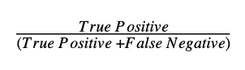

*   **精度**回答问题:*识别出的异常有多大比例是真异常？*

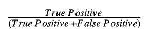

*   **F1 得分**使用调和平均值，通过结合召回率和精确度来确定异常检测模型的整体性能

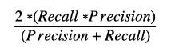

例如:

您正在将销售指标作为 KPI 之一进行跟踪。您会收到一个通知，告知您已经识别出 **10 个异常**。您检查图表并确认**10 个日期中只有 6 个确实是异常**。然而，您也注意到还有其他 9 个日期的销售指标表现异常，您会认为它们是异常。因此，现在您有 6 个正确识别的异常(真阳性)，4 个错误识别的异常(假阳性)和 9 个遗漏的异常(假阴性)。

在这种情况下，度量值将是:

*   回忆:6 / (6 + 9) = 0.4
*   精度:6 / (6 + 4) = 0.6
*   F1 得分:2 * (0.4 * 0.6) / (0.4 + 0.6) = 0.48

## 假阳性和假阴性率

在决定异常检测系统时，关注指标很重要:误报率和漏报率。

假阳性率帮助您了解平均有多少次，您的检测器会发出“狼来了”的警报，并标记实际上不是真正异常的数据点。

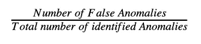

在上例中，**假阳性率为 0.4 或 40%** —系统识别出 10 个异常，其中只有 6 个是真异常。这意味着 40%检测到的异常事实上根本不是异常。

> 选择假阳性率最低的系统。如果假阳性率太高，用户将关闭系统，因为它更令人分心而不是有用。

假阴性率显示平均有多少异常被检测机遗漏。

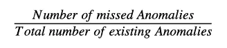

在示例中**的假阴性率是 9/15 = 0.6 或 60%** 。该系统确定了 6 个真正的异常，但遗漏了 9 个。这意味着系统遗漏了数据中 60%的异常。

> 选择假阴性率最低的系统。如果假阴性率太高，你将会错过许多关键的异常，最终你会对系统失去信任。

# 方法学

为了进行性能比较，我们创建了一个旨在提供客观、公正评估的系统。

1.  来自真实生活例子的时间序列数据被收集和匿名化。
2.  在性能评估之前，异常被手动标记——这被存储为基于分析师评估的**地面真实数据集**,独立于任一算法的结果。
3.  **地面真实数据集**被一条管道使用，该管道仅在 Avora 和 KATS 异常检测算法完成标记后执行评估。

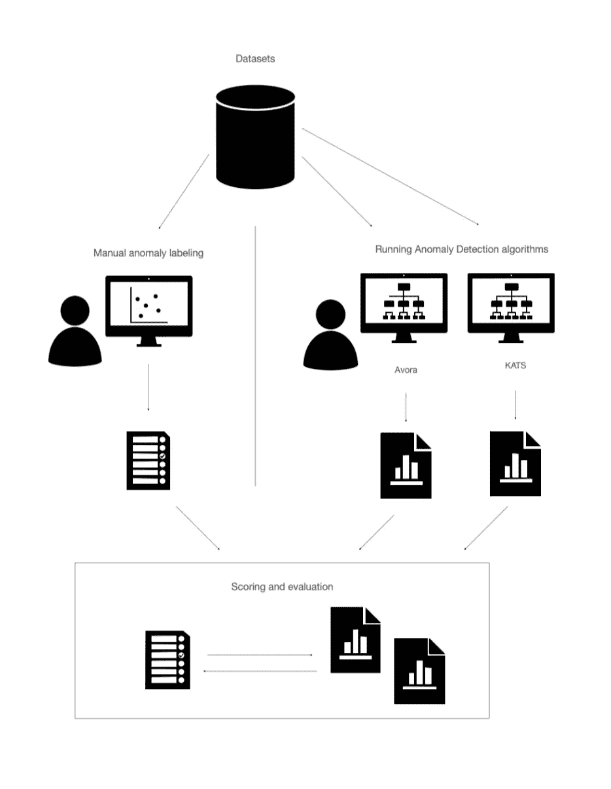

绩效评估设置和阶段

# 结果和分析

下面你可以看到 Avora 和 Kats 在 19 个匿名数据集上的结果，跨越多个商业领域。这些结果代表了算法在生产环境中的表现。

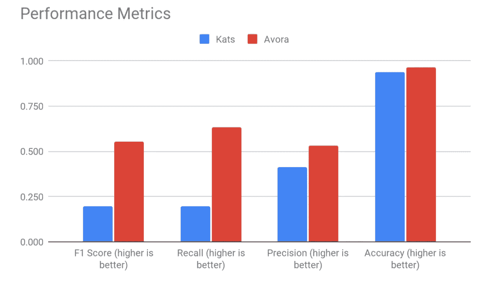

Kats 和 Avora 算法的关键指标结果

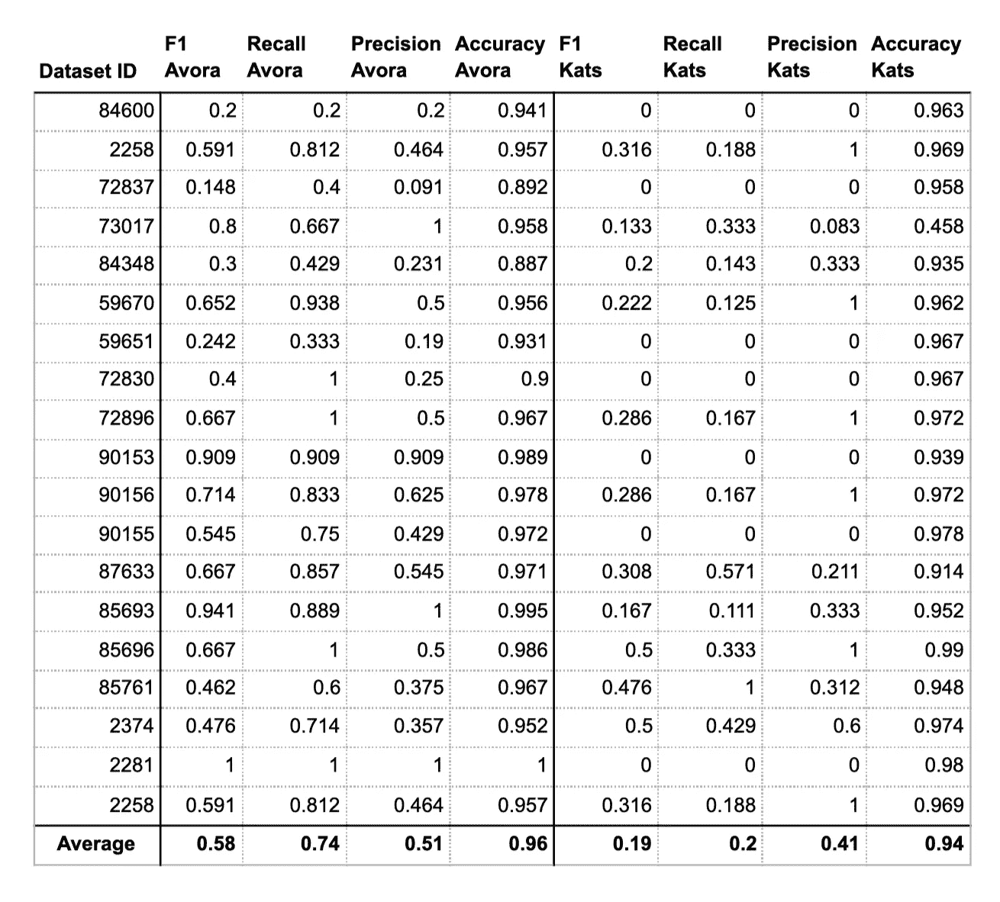

所用每个数据集的 Kats 和 Avora 性能指标

取所有数据集的平均值，Avora 的异常检测算法在每个指标(准确度、精确度、召回率、F1)上都比脸书·KATS 获得了更高的分数。同样值得一提的是，对于 KATS，精确度和召回率有更大比例的极端得分(0 或 1)，这取决于数据集。

虽然令人鼓舞，但这些测量突出了需要改进的地方，特别是在精度方面(Avora 算法的平均值为 0.51)。

通过检查假阳性和假阴性率，我们看到 KATS 没有检测到这些数据集集合中大约 80%的异常(如地面实况中所标记的),这可能会导致用户质疑在现实生活的业务数据上部署当前形式的 Kats 算法的有效性。

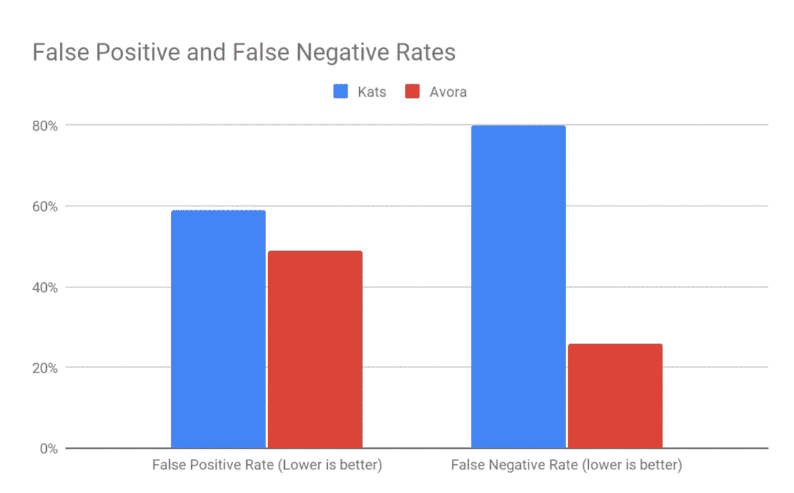

Kats 和 Avora 的假阳性和假阴性率

# 时间序列和异常比较

我们将更详细地介绍两个数据集的结果:数据集 ID 85693 和数据集 ID 2258。与 Avora 不同，脸书·KATS 的输出不提供检测包络，仅将特定数据点标记为异常。

## 在线销售-数据集 ID 2258

下图显示了数据集 ID 2258 的手动标注、阿维拉异常检测标注和脸书 KATS 异常检测标注的输出。在这种情况下，提供地面实况的分析师确定了 2019-20 年的高峰和 2020 年夏季的显著下降。

**Avora 的**算法已经成功地将峰值和夏季下降识别为异常。除此之外，它在 2019 年深秋出现了较小的下降，以及其他较小的峰值和下降。一些人可能会认为，算法标记的那些额外异常中的一些(例如，2019 年 11 月)可以被视为地面真相中的异常。

**脸书·KATS**算法只成功地发现了峰值，没有将任何长期的下降识别为异常——这是一个问题，因为销售或收入的突然下降对任何企业来说都是非常重要的。

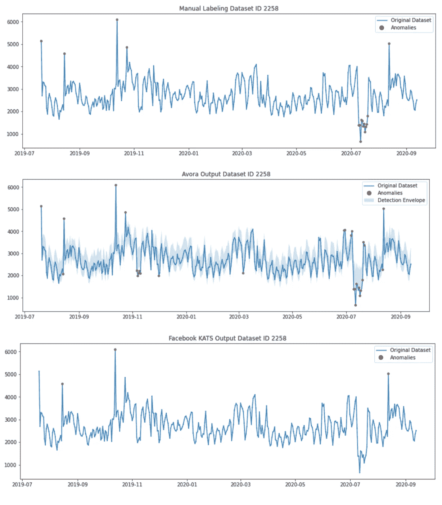

数据集 ID 2258 的手动标注、Avora 输出和 Kats 输出

## API 网关错误-数据集 ID 85693

事实上，分析师将 2021 年 4 月的一次飙升和 2020 年 11 月/12 月的两次短期下跌称为异常。Avora 异常检测公司设法找到了所有的异常区域。

另一方面，Kats 只设法捡起了尖峰本身，并在 2021 年 4 月尖峰之前引入了许多假阳性——我们解释说 KATS 对较小幅度的变化不太敏感，这可能对用户仍然有用。

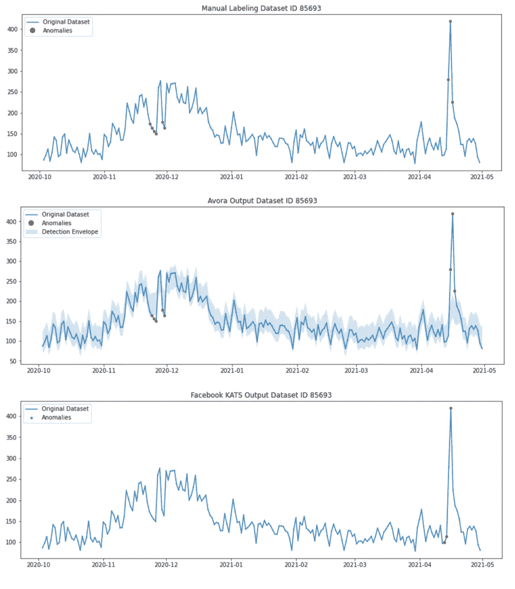

数据集 ID 85693 的手动标注、Avora 输出和 Kats 输出

# 进一步研究—降低假阳性/假阴性率

这种比较是使用每种算法的默认参数进行的——不可能找到允许 Kats 改变异常检测灵敏度的参数。

Avora 的异常检测系统允许用户修改输入参数以改善结果，这是用户应该采取的自然步骤。通过搜索参数空间，我们观察到，如果输入参数针对单个数据集进行优化，结果可以得到显著改善。

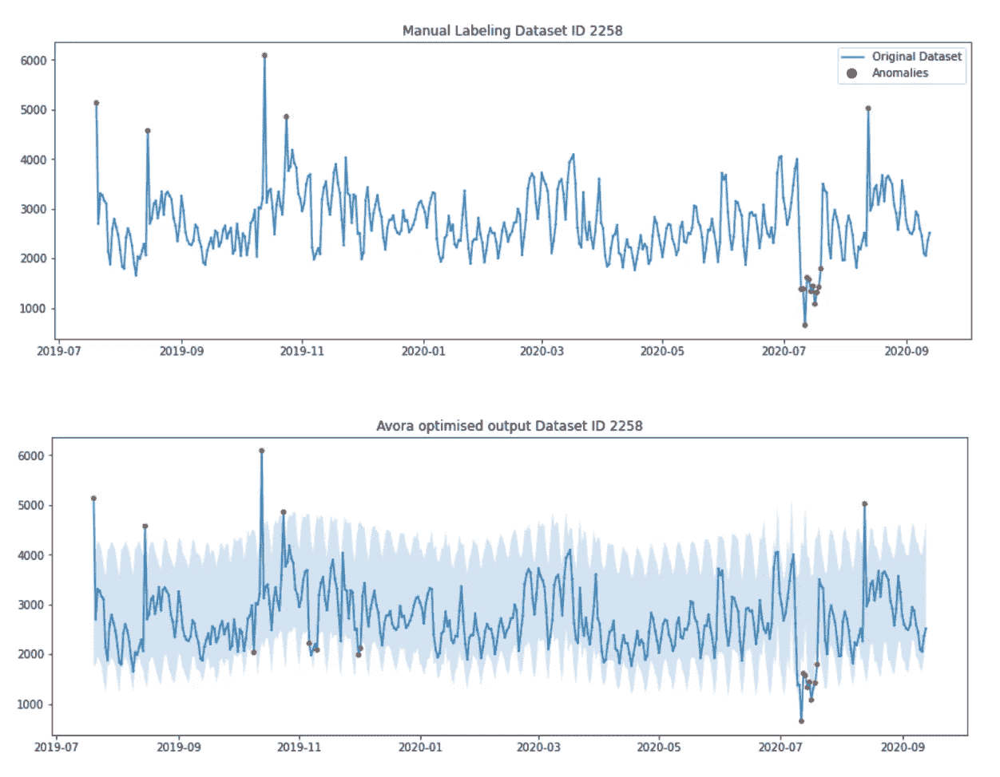

数据集 ID2258 的手动标记和优化的 Avora 算法输出

例如，优化数据集 ID 2258(在线销售)的参数显著改善了所有指标的结果— **误报率几乎减半**:

*   **精度**:默认— 0.464，优化— 0.722 *(越高越好)*
*   **回忆**:默认— 0.812，优化— 0.813 *(越高越好)*
*   **F1 得分**:默认— 0.591，优化— 0.764 *(越高越好)*
*   **精度**:默认— 0.979，优化— 0.981 *(越高越好)*
*   **假阳性率**:默认— 0.536，优化— 0.278 (27.8%) *(越低越好)*
*   **假阴性率**:默认— 0.188，优化— 0.187 (18.7%) *(越低越好)*

Avora 异常检测方法的灵活性允许每个数据集根据每个用户所需的灵敏度进行定制，使用超参数优化，确保较低的假阳性和假阴性率。

# 摘要

*   除了准确性之外，假阳性和假阴性率是评估性能的良好、直观的方法。
*   **并非所有的异常检测器都是相同的:**不同的异常检测器之间的得分可能会有很大的不同，这些异常检测器对测量业务绩效的相同的真实时间序列数据进行操作。
*   在我们的测试数据集合中，Avora 的异常检测提供了比脸书 Kats 更好的性能，同时具有更低的误报率和漏报率。
*   通过超参数调整，可以显著改善假阳性和假阴性率，而不会降低准确性。